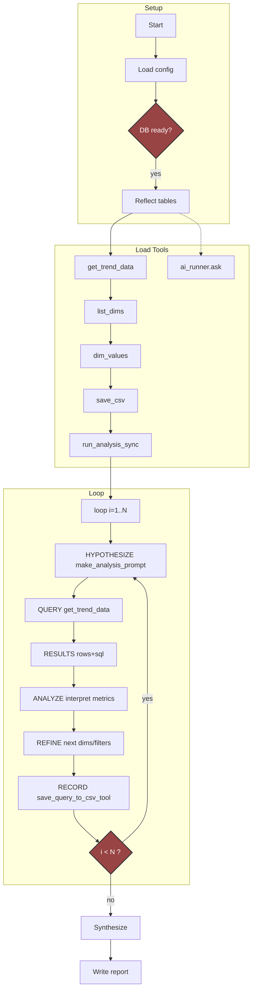

# Trend Decomposition Agent

## First-Time Setup

### Installation

First clone and setup aca_health repo, and then:

```bash
# 1. Clone and setup
git clone <repository-url>
cd trend-analyzer

# 2. Configure environment
cp .env.example .env

# 3. Install uv and dependencies
curl -LsSf https://astral.sh/uv/install.sh | sh
uv sync

# 4. Run
uv run python -m trend_analyzer
```

## Top-down flowchart

The project workflow is illustrated by the following flowchart.



    Note: The app does not auto-create tables. If missing, run the SQL in `database/*.sql` to create `agg_trend_descriptor` and `agg_trend_normalizer` before analysis.
    Phases legend: HYPOTHESIZE = form next analytical question; QUERY = fetch grouped data; RESULTS = raw rows + compiled SQL; ANALYZE = interpret PMPM/mix shifts; REFINE = choose new dimensions or filters; RECORD = persist snapshot (CSV) for provenance; loop continues while i < N.