# Trend Decomposition Agent

## First-Time Setup

### Prerequisites
- Python >= 3.13
- [uv](https://github.com/astral-sh/uv) package manager (recommended) or pip
- PostgreSQL database with prebuilt `agg_trend_descriptor` and `agg_trend_normalizer` tables

### Installation

1. **Clone the repository**
   ```bash
   git clone <repository-url>
   cd trend-analyzer
   ```

2. **Create and activate a virtual environment with uv**
   ```bash
   # Install uv if not already installed
   curl -LsSf https://astral.sh/uv/install.sh | sh
   
   # Create virtual environment and install dependencies
   uv sync
   ```

3. **Configure environment variables**
   ```bash
   # Copy the example env file
   cp .env.example .env
   
   # Edit .env with your credentials
   # Required:
   #   - OPENAI_API_KEY (for AI features)
   #   - DB_USERNAME, DB_PASSWORD (database credentials)
   # Optional:
   #   - DB_HOST, DB_PORT, DB_NAME (override config/infrastructure.yml)
   ```

4. **Set up configuration files**
   
   Ensure the following config files exist in `config/`:
   - `infrastructure.yml` - Database and output settings
   - `analysis.yml` - Analysis operation flags
   - `dimensions.yml` - Dimension and metric definitions

5. **Prepare database tables**
   
   The application requires two prebuilt PostgreSQL tables:
   - `agg_trend_descriptor` - Main trend data with all dimension columns
   - `agg_trend_normalizer` - Normalization data for trend calculations
   
   See `database/agg_trend_descriptor.sql` and `database/agg_trend_normalizer.sql` for table definitions.

6. **Run script**
   ```bash
   # Run a quick test (requires database connection and tables)
   uv run python -m trend_analyzer
   ```

## Top-down flowchart

The project workflow is illustrated by the following flowchart.

```mermaid
graph TD
    subgraph "Phase 1: Setup and Data Prep"
        direction LR
        A[Start] --> B{Initialize<br>Notebook};
        B --> C[Install Dependencies<br>& Authenticate];
        C --> D[Define YAML<br>Configuration];
        D -- "Defines dimensions,<br>metrics, tables" --> E{Generate SQL};
        E --> F["Execute BigQuery SQL to<br>Generate Analysis Tables"];
    F --> G["(Now upstream) Descriptor & Norm Tables Ready"];
    end

    subgraph "Phase 2: Agent & Tool Definition"
        direction LR
        H{Define<br>AI Agent} --> I["Set Agent's System<br>Prompt & Analysis Plan"];
        I --> J[Define Data<br>Access Functions];
        J -- Wraps --> K{Create<br>Agent Tools};
        K --> L[Data Analysis<br>Tools];
        K --> M[Reporting<br>Tools];
    end

    subgraph "Phase 3: Iterative Analysis Loop"
        direction LR
        N{Start Analysis<br>Loop} --> O{"Agent: Formulate<br>Hypothesis (PLAN)"};
        O --> P{"Agent: Select<br>Tool(s)"};
        P --> Q["Execute Tool Call<br>e.g., get_trend_data(...)"];
        Q --> R{Get Results<br>from BigQuery};
        R --> S{"Agent: Interpret<br>Results (REFLECT)"};
        S --> T{Update Report};
        T --> U[Append to<br>Google Doc];
        U --> V{More<br>Iterations?};
        V -- Yes --> O;
    end

    subgraph "Phase 4: Finalization"
        direction LR
        W{Synthesize<br>Findings} --> X["Generate Final<br>Summary &<br>Recommendations"];
        X --> Y["Write Final Report<br>to Google Doc"];
        Y --> Z[End];
    end

    G --> H;
    M --> N;
    L --> N;
    V -- No --> W;


    style B fill:#944,stroke:#333,stroke-width:2px
    style H fill:#944,stroke:#333,stroke-width:2px
    style N fill:#944,stroke:#333,stroke-width:2px
    style W fill:#944,stroke:#333,stroke-width:2px
```

