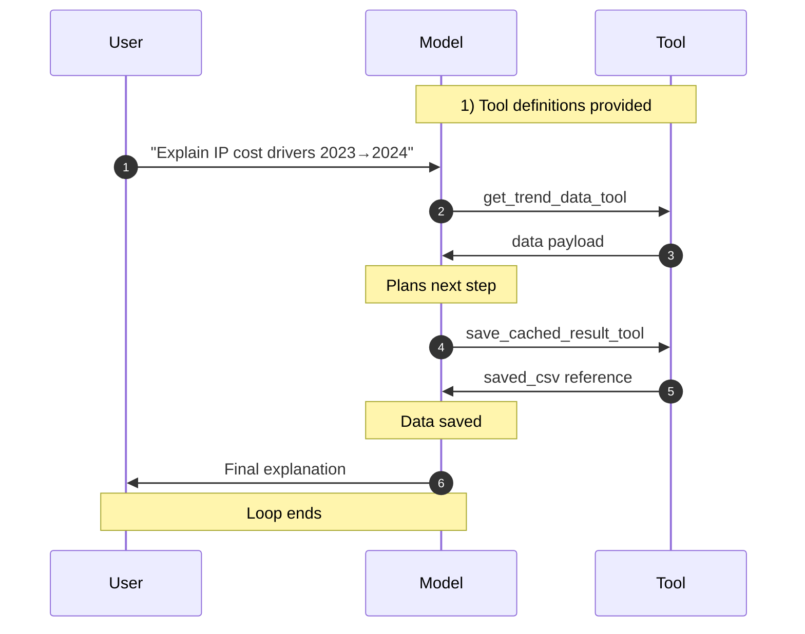
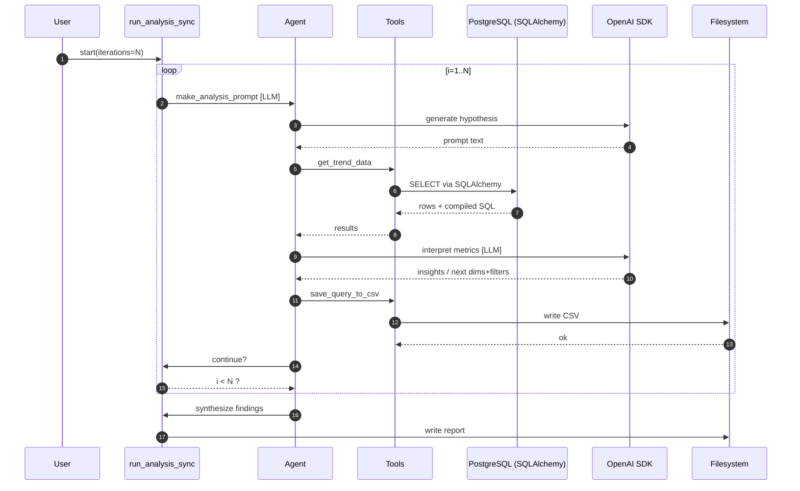
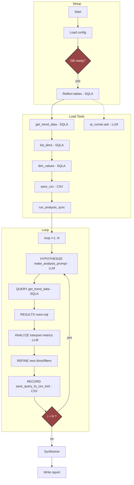

# Trend Decomposition Agent

## About

This project is an AI-assisted healthcare claims trend analyzer that decomposes period-over-period PMPM changes into concrete drivers and opportunities. It reflects two prebuilt PostgreSQL cubes (descriptor and normalizer) via SQLAlchemy, then runs an iterative agent loop to hypothesize, query, interpret, refine, and record findings. Outputs include a structured markdown report and optional CSV snapshots of key drill-downs for reproducibility.

While the AI is limited to working with constrained tools to provide guardrails, all intermediate and final output should be validated.

## TODO: Increase personal confidence in agent

Objective: achieve results that are reliable, traceable, auditable, and easy to review.

1. Signal injection: Add a synthetic PMPM spike (e.g., Georgia + ICD [A98.4](https://www.google.com/search?q=A98.4) (Ebola)) to confirm the agent flags it, explains cause (mix vs unit cost), and suggests action.

2. Provenance: For every iteration save a JSON manifest (iteration, prompt, filters, group_by, SQL, row count, sample hash).
3. Simple stats: Attach % change, z‑score, and a volume flag to each driver. Mark low-volume findings as tentative.

4. Coverage: Track which dimensions/values were queried to reduce redundant analyses and improve coverage. Highlight high‑spend segments not touched. Track what seed data is inserted, when, and update analyses upon ETL.

5. Reviewer notes: Persist human feedback; feed back next run to avoid repeating retired drivers.

## First-Time Setup

### Installation

First clone and setup [aca_health repo](https://github.com/garthmortensen/aca_health), and then:

```bash
# 1. Clone and setup
git clone <repository-url>
cd trend-analyzer

# 2. Configure environment
cp .env.example .env

# 3. Install uv and dependencies
curl -LsSf https://astral.sh/uv/install.sh | sh
uv sync

# 4. Run
uv run python -m trend_analyzer
```

## Illustrations

### Sequence diagram: detail low




### Sequence diagram: detail high



### Top-down flowchart

The project workflow is illustrated by the following flowchart.



The code uses iterations 1-(n-3) for data exploration, and with the final 3 iterations, synthesizes and finalizes.

```mermaid
gantt
    title Analysis Iteration Phases
    dateFormat X
    axisFormat %s
    section Iteration 1
    EXPLORATION Phase : 1, 2
    section Iteration 2
    EXPLORATION Phase : 2, 3
    section Iteration 3
    EXPLORATION Phase : 3, 4
    section Iteration 4
    EXPLORATION Phase : 4, 5
    section Iteration 5
    EXPLORATION Phase : 5, 6
    section Iteration 6
    EXPLORATION Phase : 6, 7
    section Iteration 7
    PRE_FINAL Phase : 7, 8
    section Iteration 8
    SYNTHESIS Phase : 8, 9
    section Iteration 9
    FINAL Phase : 9, 10
    section Iteration 10
    FINAL Phase : 10, 11
```

