# Trend Decomposition Agent

Quick start (no CLI)

1. Set environment variables (or create a .env file):
    - OPENAI_API_KEY
    - DB_USERNAME, DB_PASSWORD (use your read-only role)
    - optionally DB_HOST, DB_PORT, DB_NAME
2. Run the example:
    - uv run python examples/question.py

Notes
- .env files are automatically loaded if python-dotenv is installed.
- No CLI required; examples/question.py imports a minimal `ask()` function.

TODO: uv add openai pyyaml
Tools: list_dimensions, get_dimension_values, run_sql_safe(select-only).
Prompt template that forces structured JSON output: {table, columns, filters, group_by, order_by, limit}.
Validator that checks the model’s JSON against the allowlist and clamps limit.

This repository contains a Google Colab or Jupyter notebook that shows how to use a large language model (LLM) to analyze period‑over‑period trends in your own data. In the included example, we want to know: how did health insurance claims change from one period (early 2023) to another period (early 2024), and what were the underlying drivers? We need two data cubes as input: one data cube contains the "descriptor" data (claims, with all imaginable drivers loaded into columns), the other data cube contains the "normalizer" data (membership, with all imaginable membership segments loaded into columns).

For example, claims could be up 20% year-over-year, but membership overall is up 10%, so the per-member-per-month (PMPM) claims trend is only 10%. Or, FL claims last year could have run at $100 PMPM, and TX claims at $50 PMPM. None of that changed, but the membership mix went from 50%/50% FL/TX to 60%/40% FL/TX, which means that simply due to that mix shift, total claims PMPM went from $75 to $80 PMPM.

The notebook defines an LLM-based agent that will repeatedly query and combine these two data cubes to create an attribution or decomposition of the trend you point it at.

## What is in the notebook

The notebook lets you:

1. (Formerly: build tables) Upstream ETL now materializes required descriptor/norm tables; local build step removed.
2. Define a system prompt and analysis plan for a conversational agent.
3. Expose data‑access functions (SQL queries, dimension lookups, chart creation) as tools the agent can call.
4. Let the agent iteratively drill into the data, write findings to a Google Doc and generate charts.

## Running the notebook

1. Open the notebook in Colab or Jupyter and install the required Python packages when prompted.
2. Provide your Google Cloud project IDs and authentication credentials so the BigQuery queries run correctly.
3. Modify `dimensions.yml` or the YAML cell in the notebook to point to your own claim and membership tables and to customize dimensions or metrics.
4. Execute the cells to launch the agent (table build now handled upstream). The agent will produce a step‑by‑step analysis of the 2023→2024 trend and write a summary to a Google Doc.

## Using this approach for your data

- Adapt the YAML configuration to describe the dimensions, metrics and tables in your data warehouse.
- Customize the analysis plan in the notebook to specify the question you want the LLM to answer. The default plan walks through a pyramid‑style drill‑down.
- Add or remove tool wrappers to expose whatever data queries or visualization functions are useful for your analysis.
- Run the notebook and monitor the agent as it iteratively queries your data and records findings.

**Important:** This is a proof of concept and may produce inaccurate or incomplete interpretations. Always review the generated analysis before relying on it.

## Usage Notes & Caveats
* Input your bigqquery project IDs for permissions/running queries and storage of output tables
* Bring your own data (modify the YAML file and SQL generation fuctions)
* This is a POC and still has bugs to work out, use with caution
* The bot's analysis can be incorrect, and it often makes non-useful recommendations / interpretations of data

## Top-down flowchart

The project workflow is illustrated by the following flowchart.

```mermaid
graph TD
    subgraph "Phase 1: Setup and Data Prep"
        direction LR
        A[Start] --> B{Initialize<br>Notebook};
        B --> C[Install Dependencies<br>& Authenticate];
        C --> D[Define YAML<br>Configuration];
        D -- "Defines dimensions,<br>metrics, tables" --> E{Generate SQL};
        E --> F["Execute BigQuery SQL to<br>Generate Analysis Tables"];
    F --> G["(Now upstream) Descriptor & Norm Tables Ready"];
    end

    subgraph "Phase 2: Agent & Tool Definition"
        direction LR
        H{Define<br>AI Agent} --> I["Set Agent's System<br>Prompt & Analysis Plan"];
        I --> J[Define Data<br>Access Functions];
        J -- Wraps --> K{Create<br>Agent Tools};
        K --> L[Data Analysis<br>Tools];
        K --> M[Reporting<br>Tools];
    end

    subgraph "Phase 3: Iterative Analysis Loop"
        direction LR
        N{Start Analysis<br>Loop} --> O{"Agent: Formulate<br>Hypothesis (PLAN)"};
        O --> P{"Agent: Select<br>Tool(s)"};
        P --> Q["Execute Tool Call<br>e.g., get_trend_data(...)"];
        Q --> R{Get Results<br>from BigQuery};
        R --> S{"Agent: Interpret<br>Results (REFLECT)"};
        S --> T{Update Report};
        T --> U[Append to<br>Google Doc];
        U --> V{More<br>Iterations?};
        V -- Yes --> O;
    end

    subgraph "Phase 4: Finalization"
        direction LR
        W{Synthesize<br>Findings} --> X["Generate Final<br>Summary &<br>Recommendations"];
        X --> Y["Write Final Report<br>to Google Doc"];
        Y --> Z[End];
    end

    G --> H;
    M --> N;
    L --> N;
    V -- No --> W;


    style B fill:#944,stroke:#333,stroke-width:2px
    style H fill:#944,stroke:#333,stroke-width:2px
    style N fill:#944,stroke:#333,stroke-width:2px
    style W fill:#944,stroke:#333,stroke-width:2px
```

