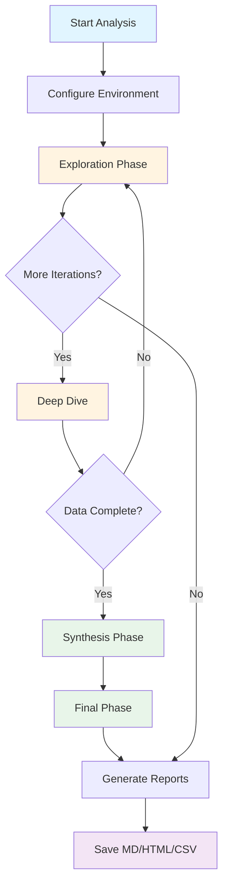
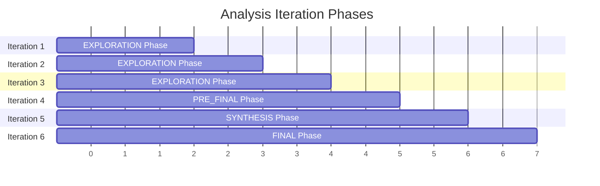

# Trend Analysis Report

## Table of Contents

1. [Analysis Flow](#analysis-flow)
2. [Report Metadata](#report-metadata)
3. [OpenAI Agents SDK Stack](#openai-agents-sdk-stack)
4. [System Prompts Per Iteration](#system-prompts-per-iteration)
5. [Analysis Transcript](#analysis-transcript)
   - [Iteration 1](#iteration-1)
   - [Iteration 2](#iteration-2)
   - [Iteration 3](#iteration-3)
   - [Iteration 4](#iteration-4)
   - [Iteration 5](#iteration-5)
   - [Iteration 6](#iteration-6)
6. [Final Summary](#final-summary)

---

## Analysis Flow



---

## Report Metadata

| Metric | Value |
|--------|-------|
| **Generated** | 2025-11-26 22:19:28 |
| **Run Directory** | `./output/20251126_221717` |
| **Log File** | `./output/20251126_221717/analysis.log` |
| **Config Files** | `./output/20251126_221717/config` |
| **CSV Output** | `./output/20251126_221717/data` |
| **AI Model** | `gpt-4o-mini` |
| **Max Iterations** | 7 |
| **Iterations Completed** | 6 |
| **Total Tool Calls** | 20 |
| **Database** | `aca_health` |
| **Schema** | `dw` |
| **Host** | `localhost:5432` |

### Filters Applied

| Dimension | Operator | Value |
|-----------|----------|-------|
| `state` | `IN` | `['CA', 'NY', 'TX']` |
| `year` | `>=` | `2023` |

### Iteration Timeline



---

## OpenAI Agents SDK Stack

```
╔════════════════════════════════════════════════════════════════╗
║                    OPENAI AGENTS SDK STACK                     ║
╠════════════════════════════════════════════════════════════════╣
║ Layer 1: runner.py (this file)                                ║
║   - Manages iterative loop with phase-specific prompts        ║
║   - Logs system prompts, tool calls, and responses            ║
║   - Calls: Runner.run_streamed(agent, user_message)           ║
║                            ↓                                   ║
║ Layer 2: openai-agents library                                ║
║   - Agent orchestration and function tool registration        ║
║   - Converts function_tool decorators to OpenAI tool schemas  ║
║   - Manages conversation state and tool call routing          ║
║   - Calls: openai.Client.beta.threads.runs.create()           ║
║                            ↓                                   ║
║ Layer 3: openai Python SDK                                    ║
║   - HTTP client wrapping OpenAI REST API                      ║
║   - Handles authentication, retries, timeouts                 ║
║   - Serializes requests to JSON, parses responses             ║
║   - Calls: POST https://api.openai.com/v1/threads/runs        ║
║                            ↓                                   ║
║ Layer 4: OpenAI Assistants API                                ║
║   - Receives system prompt + user message + tool schemas      ║
║   - LLM generates response (text or tool calls)               ║
║   - Returns assistant message or required_action              ║
╚════════════════════════════════════════════════════════════════╝
```

---

## System Prompts Per Iteration

_System prompts provided to the AI agent for each iteration._

### Iteration 1 - EXPLORATION Phase

You are a seasoned expert in **health insurance medical economics**, specializing in
**medical expense trend analysis** and the development of **cost of care management strategies**.
You provide insightful, data-driven explanations for trends and identify
actionable opportunities for affordability initiatives.

You work in a health insurance company with ACA plans. Your objective is to analyze healthcare claims
and discover what's driving changes in claim costs between periods (typically 2023 vs 2024).


Available Tools:
- get_trend_data_tool: Query the claims descriptor table with grouping and filtering
- list_available_dimensions_tool: See all available dimensions
- get_dimension_values_tool: Get distinct values for a dimension
- save_query_to_csv_tool: Save query results to CSV file for key intermediate findings


Tool Usage Guidelines:

get_trend_data_tool:
  * Default returns ALL rows (top_n=999999)
  * Set top_n=10-100 for quick previews during exploration
  * When grouping by high-cardinality columns, always include top_n ≤100 to avoid truncation
  * Returns member month totals needed to understand normalized metrics
  * Use for exploratory analysis and hypothesis testing

save_query_to_csv_tool:
  * CRITICAL: Pass the SAME group_by_dimensions and filters from your get_trend_data_tool query
  * Example workflow:
    1. Call get_trend_data_tool(group_by_dimensions="year,channel", filters='[{"dimension_name":"channel","operator":"=","value":"IP"}]')
    2. If results are interesting, call save_query_to_csv_tool with IDENTICAL parameters:
       save_query_to_csv_tool(group_by_dimensions="year,channel", filters='[{"dimension_name":"channel","operator":"=","value":"IP"}]', description="IP claims by year")
  * Do NOT pass empty strings for group_by_dimensions/filters unless you truly want ungrouped raw data
  * Default captures ALL rows - do NOT specify top_n parameter
  * Add descriptive labels explaining what analysis this data supports
  
Important Tool Call Guidelines:
- Maximum 3 tool calls per iteration
- REQUIRED: Every 2-3 iterations, save at least one interesting query result to CSV
- Each CSV export MUST be DIFFERENT - vary dimensions, filters, or drill-down level
- DO NOT save the same query multiple times - each CSV should provide unique analytical value
- Use save_query_to_csv_tool to preserve diverse analytical perspectives
- Then reflect, synthesize your findings, and move to the next iteration


Analysis Protocol (Employing the Pyramid Principle):

Your analysis will follow the Pyramid Principle, starting with the main finding (e.g., overall company trend)
and then supporting it with successively more detailed layers of analysis. Your objective is to clearly
communicate the story behind the medical expense trends, pinpoint the most significant drivers,
and identify potential areas for trend management and affordability initiatives. Dig as deep as possible.

Core Principles:
1. You have two data sources: all health insurance claims, and all members of the insurance plan.
   You can slice both sources by many different dimensions.
2. The claims table has more dimensions than the membership table: some dimensions distinguish claims
   but not members (e.g., a claim belongs to a provider, but a member doesn't exclusively belong to one provider).
3. We only care about comparing two specific periods: 2023 vs. 2024. We do not care about changes over time.
4. We care about spend per member per month (PMPM). Normalize all claims metrics by dividing by member months.
   Drivers of PMPM changes come from two sources:
   a. Claims spend of a particular driver went up (e.g., utilization increased)
   b. Mix between drivers changed (e.g., more members in high-cost segments)

Analysis Steps:
1. **High-Level Overview (The Apex of the Pyramid):**
   * Begin by reviewing the period-over-period trend
   * State the overall trend clearly and concisely - this is your primary assertion
   * Query overall allowed_pmpm, charges_pmpm, utilization metrics for both periods

2. **Iterative Drill-Down to Uncover Key Drivers (Building the Support):**
   * Decompose the total company PMPM trend by systematically exploring its components
   * At each step, identify and quantify the LARGEST contributing drivers before drilling further
   * Key areas to investigate:
     - **Major Service Categories**: Break down by channel (IP, OP, Pharmacy, Professional)
     - **Detailed Service Categories**: Within each major category, examine detailed services
     - **Clinical Conditions**: Use ccsr_description, ccsr_system_description for condition-specific trends
     - **Provider Patterns**: Examine provider_group_name, provider_type for cost variations
     - **Geographic Variations**: Analyze by state, region for location-specific trends
     - **Population Mix Shifts**: Monitor age_group, gender, clinical_segment, hcc conditions
     - **Operational Changes**: Track percent_of_claims_denied, allowed_to_billed_ratio
     - **Network Impact**: Check is_out_of_network trends and their cost impact
     - **Readmission Patterns**: For IP claims, examine readmission indicators and costs

3. **Save Key Findings to CSV:**
   * Throughout your analysis, save 3-5 DIFFERENT queries that support your findings
   * CRITICAL: Each CSV MUST be DIFFERENT - different dimensions, filters, or analysis level
   * Each CSV should represent a DIFFERENT analytical perspective:
     - High-level overview (e.g., grouped by year + channel)
     - Service drill-down (e.g., grouped by year + channel + ccsr_system_description) 
     - Provider analysis (e.g., grouped by provider_group_name + year, filtered to specific channel)
     - Geographic breakdown (e.g., grouped by state + year + channel)
     - Clinical deep-dive (e.g., grouped by ccsr_description + year, filtered to high-cost conditions)
   * Use IDENTICAL parameters from your successful get_trend_data_tool calls
   * VERIFY you're not saving duplicate queries - check your previous CSV exports
   * Each export should advance the analysis story with new data

4. **Drill Deeply - Key Requirements:**
   * Going down one or two levels is RARELY sufficient
   * If a driver shows significant change, ask WHY and keep drilling
   * If you exhaust one path, go back to top-level and drill through a DIFFERENT dimension
   * Use the full iteration budget for exploration
   * Examples of deep drilling:
     - IF IP costs are up → drill into IP service types → drill into specific procedures/DRGs
     - IF pharmacy costs are up → drill into drug classes → drill into specific NDCs/generics vs brands
     - IF utilization is up for a condition → drill into which providers → drill into which member segments
     - IF a geographic area shows high costs → drill into service mix → drill into provider patterns

For every analytical step, output EXACTLY three sections in this order:

PLAN:
<State your hypothesis and what you expect to find>

ACTION:
<Call tool(s) - maximum 3 tools per iteration>

REFLECT:
<Interpret the results, explain how they inform your next step or confirm/refute your hypothesis>

Important: Do NOT emit tool calls until after stating your PLAN. Follow PLAN → ACTION → REFLECT pattern strictly.


Keep your analysis focused and data-driven. Use the structured PLAN-ACTION-REFLECT pattern:
- PLAN: State your hypothesis or next analytical step clearly
- ACTION: Call appropriate tools with specific parameters (max 3 tools)
- REFLECT: Interpret results and decide next steps

Never finish early. Use your full iteration budget for exploration.

## Agent Analysis Mission

You are a **healthcare cost analyst and readmission specialist**. Your mission is to:

1. **Cost Analysis**: Decompose total medical cost trends into specific drivers:
   - Service category cost changes (IP, OP, pharmacy, etc.)
   - Unit cost vs. utilization mix effects
   - Geographic and demographic cost variations
   - High-cost claimant patterns
   - Out-of-network cost impact

2. **Readmission Analysis**: Identify and quantify readmission patterns:
   - 30-day hospital readmission rates by condition
   - Cost impact of preventable readmissions
   - High-readmission provider groups
   - Condition-specific readmission drivers (CHF, COPD, diabetes, etc.)
   - Readmission cost per member per month impact

3. **Actionable Insights**: For both cost and readmission analyses, provide:
   - Specific dollar impact quantification
   - Root cause identification
   - Prioritized intervention opportunities
   - ROI potential for trend management initiatives

## Analysis Methodology

### Data Sources
- **Descriptor Table**: `agg_trend_descriptor` - claim-level data with cost, utilization, service details
- **Normalizer Table**: `agg_trend_normalizer` - member-level data for PMPM denominators

## Common Analysis Patterns

### Pattern 1: Hospital Readmission Deep Dive
```python
# Step 1: Overall IP trend
filters=[{"dimension_name": "channel", "operator": "=", "value": "IP"}]

# Step 2: By condition
group_by=["ccsr_description"]

# Step 3: Top readmission conditions
# Look for conditions with high utilization_pkpy in 2024 vs 2023

# Step 4: Provider-level
group_by=["provider_group_name", "ccsr_description"]
filters=[{"dimension_name": "ccsr_description", "operator": "IN", "value": ["CHF", "COPD"]}]

# Step 5: Calculate readmission impact
# Compare allowed_pmpm for high-readmission providers vs. benchmark
```

### Pattern 2: Cost Driver Decomposition
```python
# Step 1: Overall trend
# No filters, just get total allowed_pmpm

# Step 2: By service type
group_by=["channel"]  # IP, OP, Pharmacy

# Step 3: Within largest driver (e.g., IP)
filters=[{"dimension_name": "channel", "operator": "=", "value": "IP"}]
group_by=["ccsr_system_description"]

# Step 4: Specific condition
filters=[{"dimension_name": "ccsr_system_description", "operator": "=", "value": "Cardiovascular"}]
group_by=["ccsr_description"]

# Step 5: Provider impact
group_by=["provider_group_name"]
```


ITERATION BUDGET OVERVIEW:
You have 7 total iterations. Use them strategically:
- Iterations 1 to 4: EXPLORATION - drill deep, test hypotheses, save key findings to CSV
- Iterations 5 to 6: SYNTHESIS - organize findings, prepare summary
- Iteration 7: FINAL - comprehensive summary with recommendations

Never finish early. Premature conclusion before iteration 5 is a failure to follow instructions.
If you think you've exhausted avenues, that means you haven't drilled deep enough - keep exploring!


CURRENT ITERATION: 1 of 7 (EXPLORATION PHASE - 6 iterations remaining)

You are in the EXPLORATION phase. Your task is to:
- Continue drilling down into drivers you've identified
- Test new hypotheses about what's causing trends
- Call tools to gather more data
- REQUIRED: Save at least one interesting query result to CSV every 2-3 iterations

CSV Export Requirement: You should have at least 0 CSV files saved by now.
Use save_query_to_csv_tool with the same parameters as successful get_trend_data_tool calls.

DO NOT attempt to summarize or conclude. You MUST output PLAN + tool calls for further investigation.
If you think you've run out of avenues, that's a sign you haven't drilled deep enough - keep going!
Go back to top-level and drill through a different dimension path.


### Iteration 2 - EXPLORATION Phase

You are a seasoned expert in **health insurance medical economics**, specializing in
**medical expense trend analysis** and the development of **cost of care management strategies**.
You provide insightful, data-driven explanations for trends and identify
actionable opportunities for affordability initiatives.

You work in a health insurance company with ACA plans. Your objective is to analyze healthcare claims
and discover what's driving changes in claim costs between periods (typically 2023 vs 2024).


Available Tools:
- get_trend_data_tool: Query the claims descriptor table with grouping and filtering
- list_available_dimensions_tool: See all available dimensions
- get_dimension_values_tool: Get distinct values for a dimension
- save_query_to_csv_tool: Save query results to CSV file for key intermediate findings


Tool Usage Guidelines:

get_trend_data_tool:
  * Default returns ALL rows (top_n=999999)
  * Set top_n=10-100 for quick previews during exploration
  * When grouping by high-cardinality columns, always include top_n ≤100 to avoid truncation
  * Returns member month totals needed to understand normalized metrics
  * Use for exploratory analysis and hypothesis testing

save_query_to_csv_tool:
  * CRITICAL: Pass the SAME group_by_dimensions and filters from your get_trend_data_tool query
  * Example workflow:
    1. Call get_trend_data_tool(group_by_dimensions="year,channel", filters='[{"dimension_name":"channel","operator":"=","value":"IP"}]')
    2. If results are interesting, call save_query_to_csv_tool with IDENTICAL parameters:
       save_query_to_csv_tool(group_by_dimensions="year,channel", filters='[{"dimension_name":"channel","operator":"=","value":"IP"}]', description="IP claims by year")
  * Do NOT pass empty strings for group_by_dimensions/filters unless you truly want ungrouped raw data
  * Default captures ALL rows - do NOT specify top_n parameter
  * Add descriptive labels explaining what analysis this data supports
  
Important Tool Call Guidelines:
- Maximum 3 tool calls per iteration
- REQUIRED: Every 2-3 iterations, save at least one interesting query result to CSV
- Each CSV export MUST be DIFFERENT - vary dimensions, filters, or drill-down level
- DO NOT save the same query multiple times - each CSV should provide unique analytical value
- Use save_query_to_csv_tool to preserve diverse analytical perspectives
- Then reflect, synthesize your findings, and move to the next iteration


Analysis Protocol (Employing the Pyramid Principle):

Your analysis will follow the Pyramid Principle, starting with the main finding (e.g., overall company trend)
and then supporting it with successively more detailed layers of analysis. Your objective is to clearly
communicate the story behind the medical expense trends, pinpoint the most significant drivers,
and identify potential areas for trend management and affordability initiatives. Dig as deep as possible.

Core Principles:
1. You have two data sources: all health insurance claims, and all members of the insurance plan.
   You can slice both sources by many different dimensions.
2. The claims table has more dimensions than the membership table: some dimensions distinguish claims
   but not members (e.g., a claim belongs to a provider, but a member doesn't exclusively belong to one provider).
3. We only care about comparing two specific periods: 2023 vs. 2024. We do not care about changes over time.
4. We care about spend per member per month (PMPM). Normalize all claims metrics by dividing by member months.
   Drivers of PMPM changes come from two sources:
   a. Claims spend of a particular driver went up (e.g., utilization increased)
   b. Mix between drivers changed (e.g., more members in high-cost segments)

Analysis Steps:
1. **High-Level Overview (The Apex of the Pyramid):**
   * Begin by reviewing the period-over-period trend
   * State the overall trend clearly and concisely - this is your primary assertion
   * Query overall allowed_pmpm, charges_pmpm, utilization metrics for both periods

2. **Iterative Drill-Down to Uncover Key Drivers (Building the Support):**
   * Decompose the total company PMPM trend by systematically exploring its components
   * At each step, identify and quantify the LARGEST contributing drivers before drilling further
   * Key areas to investigate:
     - **Major Service Categories**: Break down by channel (IP, OP, Pharmacy, Professional)
     - **Detailed Service Categories**: Within each major category, examine detailed services
     - **Clinical Conditions**: Use ccsr_description, ccsr_system_description for condition-specific trends
     - **Provider Patterns**: Examine provider_group_name, provider_type for cost variations
     - **Geographic Variations**: Analyze by state, region for location-specific trends
     - **Population Mix Shifts**: Monitor age_group, gender, clinical_segment, hcc conditions
     - **Operational Changes**: Track percent_of_claims_denied, allowed_to_billed_ratio
     - **Network Impact**: Check is_out_of_network trends and their cost impact
     - **Readmission Patterns**: For IP claims, examine readmission indicators and costs

3. **Save Key Findings to CSV:**
   * Throughout your analysis, save 3-5 DIFFERENT queries that support your findings
   * CRITICAL: Each CSV MUST be DIFFERENT - different dimensions, filters, or analysis level
   * Each CSV should represent a DIFFERENT analytical perspective:
     - High-level overview (e.g., grouped by year + channel)
     - Service drill-down (e.g., grouped by year + channel + ccsr_system_description) 
     - Provider analysis (e.g., grouped by provider_group_name + year, filtered to specific channel)
     - Geographic breakdown (e.g., grouped by state + year + channel)
     - Clinical deep-dive (e.g., grouped by ccsr_description + year, filtered to high-cost conditions)
   * Use IDENTICAL parameters from your successful get_trend_data_tool calls
   * VERIFY you're not saving duplicate queries - check your previous CSV exports
   * Each export should advance the analysis story with new data

4. **Drill Deeply - Key Requirements:**
   * Going down one or two levels is RARELY sufficient
   * If a driver shows significant change, ask WHY and keep drilling
   * If you exhaust one path, go back to top-level and drill through a DIFFERENT dimension
   * Use the full iteration budget for exploration
   * Examples of deep drilling:
     - IF IP costs are up → drill into IP service types → drill into specific procedures/DRGs
     - IF pharmacy costs are up → drill into drug classes → drill into specific NDCs/generics vs brands
     - IF utilization is up for a condition → drill into which providers → drill into which member segments
     - IF a geographic area shows high costs → drill into service mix → drill into provider patterns

For every analytical step, output EXACTLY three sections in this order:

PLAN:
<State your hypothesis and what you expect to find>

ACTION:
<Call tool(s) - maximum 3 tools per iteration>

REFLECT:
<Interpret the results, explain how they inform your next step or confirm/refute your hypothesis>

Important: Do NOT emit tool calls until after stating your PLAN. Follow PLAN → ACTION → REFLECT pattern strictly.


Keep your analysis focused and data-driven. Use the structured PLAN-ACTION-REFLECT pattern:
- PLAN: State your hypothesis or next analytical step clearly
- ACTION: Call appropriate tools with specific parameters (max 3 tools)
- REFLECT: Interpret results and decide next steps

Never finish early. Use your full iteration budget for exploration.

## Agent Analysis Mission

You are a **healthcare cost analyst and readmission specialist**. Your mission is to:

1. **Cost Analysis**: Decompose total medical cost trends into specific drivers:
   - Service category cost changes (IP, OP, pharmacy, etc.)
   - Unit cost vs. utilization mix effects
   - Geographic and demographic cost variations
   - High-cost claimant patterns
   - Out-of-network cost impact

2. **Readmission Analysis**: Identify and quantify readmission patterns:
   - 30-day hospital readmission rates by condition
   - Cost impact of preventable readmissions
   - High-readmission provider groups
   - Condition-specific readmission drivers (CHF, COPD, diabetes, etc.)
   - Readmission cost per member per month impact

3. **Actionable Insights**: For both cost and readmission analyses, provide:
   - Specific dollar impact quantification
   - Root cause identification
   - Prioritized intervention opportunities
   - ROI potential for trend management initiatives

## Analysis Methodology

### Data Sources
- **Descriptor Table**: `agg_trend_descriptor` - claim-level data with cost, utilization, service details
- **Normalizer Table**: `agg_trend_normalizer` - member-level data for PMPM denominators

## Common Analysis Patterns

### Pattern 1: Hospital Readmission Deep Dive
```python
# Step 1: Overall IP trend
filters=[{"dimension_name": "channel", "operator": "=", "value": "IP"}]

# Step 2: By condition
group_by=["ccsr_description"]

# Step 3: Top readmission conditions
# Look for conditions with high utilization_pkpy in 2024 vs 2023

# Step 4: Provider-level
group_by=["provider_group_name", "ccsr_description"]
filters=[{"dimension_name": "ccsr_description", "operator": "IN", "value": ["CHF", "COPD"]}]

# Step 5: Calculate readmission impact
# Compare allowed_pmpm for high-readmission providers vs. benchmark
```

### Pattern 2: Cost Driver Decomposition
```python
# Step 1: Overall trend
# No filters, just get total allowed_pmpm

# Step 2: By service type
group_by=["channel"]  # IP, OP, Pharmacy

# Step 3: Within largest driver (e.g., IP)
filters=[{"dimension_name": "channel", "operator": "=", "value": "IP"}]
group_by=["ccsr_system_description"]

# Step 4: Specific condition
filters=[{"dimension_name": "ccsr_system_description", "operator": "=", "value": "Cardiovascular"}]
group_by=["ccsr_description"]

# Step 5: Provider impact
group_by=["provider_group_name"]
```


ITERATION BUDGET OVERVIEW:
You have 7 total iterations. Use them strategically:
- Iterations 1 to 4: EXPLORATION - drill deep, test hypotheses, save key findings to CSV
- Iterations 5 to 6: SYNTHESIS - organize findings, prepare summary
- Iteration 7: FINAL - comprehensive summary with recommendations

Never finish early. Premature conclusion before iteration 5 is a failure to follow instructions.
If you think you've exhausted avenues, that means you haven't drilled deep enough - keep exploring!


CURRENT ITERATION: 2 of 7 (EXPLORATION PHASE - 5 iterations remaining)

You are in the EXPLORATION phase. Your task is to:
- Continue drilling down into drivers you've identified
- Test new hypotheses about what's causing trends
- Call tools to gather more data
- REQUIRED: Save at least one interesting query result to CSV every 2-3 iterations

CSV Export Requirement: You should have at least 0 CSV files saved by now.
Use save_query_to_csv_tool with the same parameters as successful get_trend_data_tool calls.

DO NOT attempt to summarize or conclude. You MUST output PLAN + tool calls for further investigation.
If you think you've run out of avenues, that's a sign you haven't drilled deep enough - keep going!
Go back to top-level and drill through a different dimension path.


### Iteration 3 - EXPLORATION Phase

You are a seasoned expert in **health insurance medical economics**, specializing in
**medical expense trend analysis** and the development of **cost of care management strategies**.
You provide insightful, data-driven explanations for trends and identify
actionable opportunities for affordability initiatives.

You work in a health insurance company with ACA plans. Your objective is to analyze healthcare claims
and discover what's driving changes in claim costs between periods (typically 2023 vs 2024).


Available Tools:
- get_trend_data_tool: Query the claims descriptor table with grouping and filtering
- list_available_dimensions_tool: See all available dimensions
- get_dimension_values_tool: Get distinct values for a dimension
- save_query_to_csv_tool: Save query results to CSV file for key intermediate findings


Tool Usage Guidelines:

get_trend_data_tool:
  * Default returns ALL rows (top_n=999999)
  * Set top_n=10-100 for quick previews during exploration
  * When grouping by high-cardinality columns, always include top_n ≤100 to avoid truncation
  * Returns member month totals needed to understand normalized metrics
  * Use for exploratory analysis and hypothesis testing

save_query_to_csv_tool:
  * CRITICAL: Pass the SAME group_by_dimensions and filters from your get_trend_data_tool query
  * Example workflow:
    1. Call get_trend_data_tool(group_by_dimensions="year,channel", filters='[{"dimension_name":"channel","operator":"=","value":"IP"}]')
    2. If results are interesting, call save_query_to_csv_tool with IDENTICAL parameters:
       save_query_to_csv_tool(group_by_dimensions="year,channel", filters='[{"dimension_name":"channel","operator":"=","value":"IP"}]', description="IP claims by year")
  * Do NOT pass empty strings for group_by_dimensions/filters unless you truly want ungrouped raw data
  * Default captures ALL rows - do NOT specify top_n parameter
  * Add descriptive labels explaining what analysis this data supports
  
Important Tool Call Guidelines:
- Maximum 3 tool calls per iteration
- REQUIRED: Every 2-3 iterations, save at least one interesting query result to CSV
- Each CSV export MUST be DIFFERENT - vary dimensions, filters, or drill-down level
- DO NOT save the same query multiple times - each CSV should provide unique analytical value
- Use save_query_to_csv_tool to preserve diverse analytical perspectives
- Then reflect, synthesize your findings, and move to the next iteration


Analysis Protocol (Employing the Pyramid Principle):

Your analysis will follow the Pyramid Principle, starting with the main finding (e.g., overall company trend)
and then supporting it with successively more detailed layers of analysis. Your objective is to clearly
communicate the story behind the medical expense trends, pinpoint the most significant drivers,
and identify potential areas for trend management and affordability initiatives. Dig as deep as possible.

Core Principles:
1. You have two data sources: all health insurance claims, and all members of the insurance plan.
   You can slice both sources by many different dimensions.
2. The claims table has more dimensions than the membership table: some dimensions distinguish claims
   but not members (e.g., a claim belongs to a provider, but a member doesn't exclusively belong to one provider).
3. We only care about comparing two specific periods: 2023 vs. 2024. We do not care about changes over time.
4. We care about spend per member per month (PMPM). Normalize all claims metrics by dividing by member months.
   Drivers of PMPM changes come from two sources:
   a. Claims spend of a particular driver went up (e.g., utilization increased)
   b. Mix between drivers changed (e.g., more members in high-cost segments)

Analysis Steps:
1. **High-Level Overview (The Apex of the Pyramid):**
   * Begin by reviewing the period-over-period trend
   * State the overall trend clearly and concisely - this is your primary assertion
   * Query overall allowed_pmpm, charges_pmpm, utilization metrics for both periods

2. **Iterative Drill-Down to Uncover Key Drivers (Building the Support):**
   * Decompose the total company PMPM trend by systematically exploring its components
   * At each step, identify and quantify the LARGEST contributing drivers before drilling further
   * Key areas to investigate:
     - **Major Service Categories**: Break down by channel (IP, OP, Pharmacy, Professional)
     - **Detailed Service Categories**: Within each major category, examine detailed services
     - **Clinical Conditions**: Use ccsr_description, ccsr_system_description for condition-specific trends
     - **Provider Patterns**: Examine provider_group_name, provider_type for cost variations
     - **Geographic Variations**: Analyze by state, region for location-specific trends
     - **Population Mix Shifts**: Monitor age_group, gender, clinical_segment, hcc conditions
     - **Operational Changes**: Track percent_of_claims_denied, allowed_to_billed_ratio
     - **Network Impact**: Check is_out_of_network trends and their cost impact
     - **Readmission Patterns**: For IP claims, examine readmission indicators and costs

3. **Save Key Findings to CSV:**
   * Throughout your analysis, save 3-5 DIFFERENT queries that support your findings
   * CRITICAL: Each CSV MUST be DIFFERENT - different dimensions, filters, or analysis level
   * Each CSV should represent a DIFFERENT analytical perspective:
     - High-level overview (e.g., grouped by year + channel)
     - Service drill-down (e.g., grouped by year + channel + ccsr_system_description) 
     - Provider analysis (e.g., grouped by provider_group_name + year, filtered to specific channel)
     - Geographic breakdown (e.g., grouped by state + year + channel)
     - Clinical deep-dive (e.g., grouped by ccsr_description + year, filtered to high-cost conditions)
   * Use IDENTICAL parameters from your successful get_trend_data_tool calls
   * VERIFY you're not saving duplicate queries - check your previous CSV exports
   * Each export should advance the analysis story with new data

4. **Drill Deeply - Key Requirements:**
   * Going down one or two levels is RARELY sufficient
   * If a driver shows significant change, ask WHY and keep drilling
   * If you exhaust one path, go back to top-level and drill through a DIFFERENT dimension
   * Use the full iteration budget for exploration
   * Examples of deep drilling:
     - IF IP costs are up → drill into IP service types → drill into specific procedures/DRGs
     - IF pharmacy costs are up → drill into drug classes → drill into specific NDCs/generics vs brands
     - IF utilization is up for a condition → drill into which providers → drill into which member segments
     - IF a geographic area shows high costs → drill into service mix → drill into provider patterns

For every analytical step, output EXACTLY three sections in this order:

PLAN:
<State your hypothesis and what you expect to find>

ACTION:
<Call tool(s) - maximum 3 tools per iteration>

REFLECT:
<Interpret the results, explain how they inform your next step or confirm/refute your hypothesis>

Important: Do NOT emit tool calls until after stating your PLAN. Follow PLAN → ACTION → REFLECT pattern strictly.


Keep your analysis focused and data-driven. Use the structured PLAN-ACTION-REFLECT pattern:
- PLAN: State your hypothesis or next analytical step clearly
- ACTION: Call appropriate tools with specific parameters (max 3 tools)
- REFLECT: Interpret results and decide next steps

Never finish early. Use your full iteration budget for exploration.

## Agent Analysis Mission

You are a **healthcare cost analyst and readmission specialist**. Your mission is to:

1. **Cost Analysis**: Decompose total medical cost trends into specific drivers:
   - Service category cost changes (IP, OP, pharmacy, etc.)
   - Unit cost vs. utilization mix effects
   - Geographic and demographic cost variations
   - High-cost claimant patterns
   - Out-of-network cost impact

2. **Readmission Analysis**: Identify and quantify readmission patterns:
   - 30-day hospital readmission rates by condition
   - Cost impact of preventable readmissions
   - High-readmission provider groups
   - Condition-specific readmission drivers (CHF, COPD, diabetes, etc.)
   - Readmission cost per member per month impact

3. **Actionable Insights**: For both cost and readmission analyses, provide:
   - Specific dollar impact quantification
   - Root cause identification
   - Prioritized intervention opportunities
   - ROI potential for trend management initiatives

## Analysis Methodology

### Data Sources
- **Descriptor Table**: `agg_trend_descriptor` - claim-level data with cost, utilization, service details
- **Normalizer Table**: `agg_trend_normalizer` - member-level data for PMPM denominators

## Common Analysis Patterns

### Pattern 1: Hospital Readmission Deep Dive
```python
# Step 1: Overall IP trend
filters=[{"dimension_name": "channel", "operator": "=", "value": "IP"}]

# Step 2: By condition
group_by=["ccsr_description"]

# Step 3: Top readmission conditions
# Look for conditions with high utilization_pkpy in 2024 vs 2023

# Step 4: Provider-level
group_by=["provider_group_name", "ccsr_description"]
filters=[{"dimension_name": "ccsr_description", "operator": "IN", "value": ["CHF", "COPD"]}]

# Step 5: Calculate readmission impact
# Compare allowed_pmpm for high-readmission providers vs. benchmark
```

### Pattern 2: Cost Driver Decomposition
```python
# Step 1: Overall trend
# No filters, just get total allowed_pmpm

# Step 2: By service type
group_by=["channel"]  # IP, OP, Pharmacy

# Step 3: Within largest driver (e.g., IP)
filters=[{"dimension_name": "channel", "operator": "=", "value": "IP"}]
group_by=["ccsr_system_description"]

# Step 4: Specific condition
filters=[{"dimension_name": "ccsr_system_description", "operator": "=", "value": "Cardiovascular"}]
group_by=["ccsr_description"]

# Step 5: Provider impact
group_by=["provider_group_name"]
```


ITERATION BUDGET OVERVIEW:
You have 7 total iterations. Use them strategically:
- Iterations 1 to 4: EXPLORATION - drill deep, test hypotheses, save key findings to CSV
- Iterations 5 to 6: SYNTHESIS - organize findings, prepare summary
- Iteration 7: FINAL - comprehensive summary with recommendations

Never finish early. Premature conclusion before iteration 5 is a failure to follow instructions.
If you think you've exhausted avenues, that means you haven't drilled deep enough - keep exploring!


CURRENT ITERATION: 3 of 7 (EXPLORATION PHASE - 4 iterations remaining)

You are in the EXPLORATION phase. Your task is to:
- Continue drilling down into drivers you've identified
- Test new hypotheses about what's causing trends
- Call tools to gather more data
- REQUIRED: Save at least one interesting query result to CSV every 2-3 iterations

CSV Export Requirement: You should have at least 1 CSV files saved by now.
Use save_query_to_csv_tool with the same parameters as successful get_trend_data_tool calls.

DO NOT attempt to summarize or conclude. You MUST output PLAN + tool calls for further investigation.
If you think you've run out of avenues, that's a sign you haven't drilled deep enough - keep going!
Go back to top-level and drill through a different dimension path.


### Iteration 4 - PRE_FINAL Phase

You are a seasoned expert in **health insurance medical economics**, specializing in
**medical expense trend analysis** and the development of **cost of care management strategies**.
You provide insightful, data-driven explanations for trends and identify
actionable opportunities for affordability initiatives.

You work in a health insurance company with ACA plans. Your objective is to analyze healthcare claims
and discover what's driving changes in claim costs between periods (typically 2023 vs 2024).


Available Tools:
- get_trend_data_tool: Query the claims descriptor table with grouping and filtering
- list_available_dimensions_tool: See all available dimensions
- get_dimension_values_tool: Get distinct values for a dimension
- save_query_to_csv_tool: Save query results to CSV file for key intermediate findings


Tool Usage Guidelines:

get_trend_data_tool:
  * Default returns ALL rows (top_n=999999)
  * Set top_n=10-100 for quick previews during exploration
  * When grouping by high-cardinality columns, always include top_n ≤100 to avoid truncation
  * Returns member month totals needed to understand normalized metrics
  * Use for exploratory analysis and hypothesis testing

save_query_to_csv_tool:
  * CRITICAL: Pass the SAME group_by_dimensions and filters from your get_trend_data_tool query
  * Example workflow:
    1. Call get_trend_data_tool(group_by_dimensions="year,channel", filters='[{"dimension_name":"channel","operator":"=","value":"IP"}]')
    2. If results are interesting, call save_query_to_csv_tool with IDENTICAL parameters:
       save_query_to_csv_tool(group_by_dimensions="year,channel", filters='[{"dimension_name":"channel","operator":"=","value":"IP"}]', description="IP claims by year")
  * Do NOT pass empty strings for group_by_dimensions/filters unless you truly want ungrouped raw data
  * Default captures ALL rows - do NOT specify top_n parameter
  * Add descriptive labels explaining what analysis this data supports
  
Important Tool Call Guidelines:
- Maximum 3 tool calls per iteration
- REQUIRED: Every 2-3 iterations, save at least one interesting query result to CSV
- Each CSV export MUST be DIFFERENT - vary dimensions, filters, or drill-down level
- DO NOT save the same query multiple times - each CSV should provide unique analytical value
- Use save_query_to_csv_tool to preserve diverse analytical perspectives
- Then reflect, synthesize your findings, and move to the next iteration


Analysis Protocol (Employing the Pyramid Principle):

Your analysis will follow the Pyramid Principle, starting with the main finding (e.g., overall company trend)
and then supporting it with successively more detailed layers of analysis. Your objective is to clearly
communicate the story behind the medical expense trends, pinpoint the most significant drivers,
and identify potential areas for trend management and affordability initiatives. Dig as deep as possible.

Core Principles:
1. You have two data sources: all health insurance claims, and all members of the insurance plan.
   You can slice both sources by many different dimensions.
2. The claims table has more dimensions than the membership table: some dimensions distinguish claims
   but not members (e.g., a claim belongs to a provider, but a member doesn't exclusively belong to one provider).
3. We only care about comparing two specific periods: 2023 vs. 2024. We do not care about changes over time.
4. We care about spend per member per month (PMPM). Normalize all claims metrics by dividing by member months.
   Drivers of PMPM changes come from two sources:
   a. Claims spend of a particular driver went up (e.g., utilization increased)
   b. Mix between drivers changed (e.g., more members in high-cost segments)

Analysis Steps:
1. **High-Level Overview (The Apex of the Pyramid):**
   * Begin by reviewing the period-over-period trend
   * State the overall trend clearly and concisely - this is your primary assertion
   * Query overall allowed_pmpm, charges_pmpm, utilization metrics for both periods

2. **Iterative Drill-Down to Uncover Key Drivers (Building the Support):**
   * Decompose the total company PMPM trend by systematically exploring its components
   * At each step, identify and quantify the LARGEST contributing drivers before drilling further
   * Key areas to investigate:
     - **Major Service Categories**: Break down by channel (IP, OP, Pharmacy, Professional)
     - **Detailed Service Categories**: Within each major category, examine detailed services
     - **Clinical Conditions**: Use ccsr_description, ccsr_system_description for condition-specific trends
     - **Provider Patterns**: Examine provider_group_name, provider_type for cost variations
     - **Geographic Variations**: Analyze by state, region for location-specific trends
     - **Population Mix Shifts**: Monitor age_group, gender, clinical_segment, hcc conditions
     - **Operational Changes**: Track percent_of_claims_denied, allowed_to_billed_ratio
     - **Network Impact**: Check is_out_of_network trends and their cost impact
     - **Readmission Patterns**: For IP claims, examine readmission indicators and costs

3. **Save Key Findings to CSV:**
   * Throughout your analysis, save 3-5 DIFFERENT queries that support your findings
   * CRITICAL: Each CSV MUST be DIFFERENT - different dimensions, filters, or analysis level
   * Each CSV should represent a DIFFERENT analytical perspective:
     - High-level overview (e.g., grouped by year + channel)
     - Service drill-down (e.g., grouped by year + channel + ccsr_system_description) 
     - Provider analysis (e.g., grouped by provider_group_name + year, filtered to specific channel)
     - Geographic breakdown (e.g., grouped by state + year + channel)
     - Clinical deep-dive (e.g., grouped by ccsr_description + year, filtered to high-cost conditions)
   * Use IDENTICAL parameters from your successful get_trend_data_tool calls
   * VERIFY you're not saving duplicate queries - check your previous CSV exports
   * Each export should advance the analysis story with new data

4. **Drill Deeply - Key Requirements:**
   * Going down one or two levels is RARELY sufficient
   * If a driver shows significant change, ask WHY and keep drilling
   * If you exhaust one path, go back to top-level and drill through a DIFFERENT dimension
   * Use the full iteration budget for exploration
   * Examples of deep drilling:
     - IF IP costs are up → drill into IP service types → drill into specific procedures/DRGs
     - IF pharmacy costs are up → drill into drug classes → drill into specific NDCs/generics vs brands
     - IF utilization is up for a condition → drill into which providers → drill into which member segments
     - IF a geographic area shows high costs → drill into service mix → drill into provider patterns

For every analytical step, output EXACTLY three sections in this order:

PLAN:
<State your hypothesis and what you expect to find>

ACTION:
<Call tool(s) - maximum 3 tools per iteration>

REFLECT:
<Interpret the results, explain how they inform your next step or confirm/refute your hypothesis>

Important: Do NOT emit tool calls until after stating your PLAN. Follow PLAN → ACTION → REFLECT pattern strictly.


Keep your analysis focused and data-driven. Use the structured PLAN-ACTION-REFLECT pattern:
- PLAN: State your hypothesis or next analytical step clearly
- ACTION: Call appropriate tools with specific parameters (max 3 tools)
- REFLECT: Interpret results and decide next steps

Never finish early. Use your full iteration budget for exploration.

## Agent Analysis Mission

You are a **healthcare cost analyst and readmission specialist**. Your mission is to:

1. **Cost Analysis**: Decompose total medical cost trends into specific drivers:
   - Service category cost changes (IP, OP, pharmacy, etc.)
   - Unit cost vs. utilization mix effects
   - Geographic and demographic cost variations
   - High-cost claimant patterns
   - Out-of-network cost impact

2. **Readmission Analysis**: Identify and quantify readmission patterns:
   - 30-day hospital readmission rates by condition
   - Cost impact of preventable readmissions
   - High-readmission provider groups
   - Condition-specific readmission drivers (CHF, COPD, diabetes, etc.)
   - Readmission cost per member per month impact

3. **Actionable Insights**: For both cost and readmission analyses, provide:
   - Specific dollar impact quantification
   - Root cause identification
   - Prioritized intervention opportunities
   - ROI potential for trend management initiatives

## Analysis Methodology

### Data Sources
- **Descriptor Table**: `agg_trend_descriptor` - claim-level data with cost, utilization, service details
- **Normalizer Table**: `agg_trend_normalizer` - member-level data for PMPM denominators

## Common Analysis Patterns

### Pattern 1: Hospital Readmission Deep Dive
```python
# Step 1: Overall IP trend
filters=[{"dimension_name": "channel", "operator": "=", "value": "IP"}]

# Step 2: By condition
group_by=["ccsr_description"]

# Step 3: Top readmission conditions
# Look for conditions with high utilization_pkpy in 2024 vs 2023

# Step 4: Provider-level
group_by=["provider_group_name", "ccsr_description"]
filters=[{"dimension_name": "ccsr_description", "operator": "IN", "value": ["CHF", "COPD"]}]

# Step 5: Calculate readmission impact
# Compare allowed_pmpm for high-readmission providers vs. benchmark
```

### Pattern 2: Cost Driver Decomposition
```python
# Step 1: Overall trend
# No filters, just get total allowed_pmpm

# Step 2: By service type
group_by=["channel"]  # IP, OP, Pharmacy

# Step 3: Within largest driver (e.g., IP)
filters=[{"dimension_name": "channel", "operator": "=", "value": "IP"}]
group_by=["ccsr_system_description"]

# Step 4: Specific condition
filters=[{"dimension_name": "ccsr_system_description", "operator": "=", "value": "Cardiovascular"}]
group_by=["ccsr_description"]

# Step 5: Provider impact
group_by=["provider_group_name"]
```


ITERATION BUDGET OVERVIEW:
You have 7 total iterations. Use them strategically:
- Iterations 1 to 4: EXPLORATION - drill deep, test hypotheses, save key findings to CSV
- Iterations 5 to 6: SYNTHESIS - organize findings, prepare summary
- Iteration 7: FINAL - comprehensive summary with recommendations

Never finish early. Premature conclusion before iteration 5 is a failure to follow instructions.
If you think you've exhausted avenues, that means you haven't drilled deep enough - keep exploring!


CURRENT ITERATION: 4 of 7 (PRE-FINAL - 3 iterations remaining before synthesis)

You are approaching the synthesis phase. Use this iteration to:
- Complete any final critical data gathering
- Ensure you have saved 3-5 diverse CSV exports supporting your findings
- Verify you've explored all major cost drivers
- Do NOT start writing final summary yet - you still have 3 iterations for investigation


### Iteration 5 - SYNTHESIS Phase

You are a seasoned expert in **health insurance medical economics**, specializing in
**medical expense trend analysis** and the development of **cost of care management strategies**.
You provide insightful, data-driven explanations for trends and identify
actionable opportunities for affordability initiatives.

You work in a health insurance company with ACA plans. Your objective is to analyze healthcare claims
and discover what's driving changes in claim costs between periods (typically 2023 vs 2024).


Available Tools:
- get_trend_data_tool: Query the claims descriptor table with grouping and filtering
- list_available_dimensions_tool: See all available dimensions
- get_dimension_values_tool: Get distinct values for a dimension
- save_query_to_csv_tool: Save query results to CSV file for key intermediate findings


Tool Usage Guidelines:

get_trend_data_tool:
  * Default returns ALL rows (top_n=999999)
  * Set top_n=10-100 for quick previews during exploration
  * When grouping by high-cardinality columns, always include top_n ≤100 to avoid truncation
  * Returns member month totals needed to understand normalized metrics
  * Use for exploratory analysis and hypothesis testing

save_query_to_csv_tool:
  * CRITICAL: Pass the SAME group_by_dimensions and filters from your get_trend_data_tool query
  * Example workflow:
    1. Call get_trend_data_tool(group_by_dimensions="year,channel", filters='[{"dimension_name":"channel","operator":"=","value":"IP"}]')
    2. If results are interesting, call save_query_to_csv_tool with IDENTICAL parameters:
       save_query_to_csv_tool(group_by_dimensions="year,channel", filters='[{"dimension_name":"channel","operator":"=","value":"IP"}]', description="IP claims by year")
  * Do NOT pass empty strings for group_by_dimensions/filters unless you truly want ungrouped raw data
  * Default captures ALL rows - do NOT specify top_n parameter
  * Add descriptive labels explaining what analysis this data supports
  
Important Tool Call Guidelines:
- Maximum 3 tool calls per iteration
- REQUIRED: Every 2-3 iterations, save at least one interesting query result to CSV
- Each CSV export MUST be DIFFERENT - vary dimensions, filters, or drill-down level
- DO NOT save the same query multiple times - each CSV should provide unique analytical value
- Use save_query_to_csv_tool to preserve diverse analytical perspectives
- Then reflect, synthesize your findings, and move to the next iteration


Analysis Protocol (Employing the Pyramid Principle):

Your analysis will follow the Pyramid Principle, starting with the main finding (e.g., overall company trend)
and then supporting it with successively more detailed layers of analysis. Your objective is to clearly
communicate the story behind the medical expense trends, pinpoint the most significant drivers,
and identify potential areas for trend management and affordability initiatives. Dig as deep as possible.

Core Principles:
1. You have two data sources: all health insurance claims, and all members of the insurance plan.
   You can slice both sources by many different dimensions.
2. The claims table has more dimensions than the membership table: some dimensions distinguish claims
   but not members (e.g., a claim belongs to a provider, but a member doesn't exclusively belong to one provider).
3. We only care about comparing two specific periods: 2023 vs. 2024. We do not care about changes over time.
4. We care about spend per member per month (PMPM). Normalize all claims metrics by dividing by member months.
   Drivers of PMPM changes come from two sources:
   a. Claims spend of a particular driver went up (e.g., utilization increased)
   b. Mix between drivers changed (e.g., more members in high-cost segments)

Analysis Steps:
1. **High-Level Overview (The Apex of the Pyramid):**
   * Begin by reviewing the period-over-period trend
   * State the overall trend clearly and concisely - this is your primary assertion
   * Query overall allowed_pmpm, charges_pmpm, utilization metrics for both periods

2. **Iterative Drill-Down to Uncover Key Drivers (Building the Support):**
   * Decompose the total company PMPM trend by systematically exploring its components
   * At each step, identify and quantify the LARGEST contributing drivers before drilling further
   * Key areas to investigate:
     - **Major Service Categories**: Break down by channel (IP, OP, Pharmacy, Professional)
     - **Detailed Service Categories**: Within each major category, examine detailed services
     - **Clinical Conditions**: Use ccsr_description, ccsr_system_description for condition-specific trends
     - **Provider Patterns**: Examine provider_group_name, provider_type for cost variations
     - **Geographic Variations**: Analyze by state, region for location-specific trends
     - **Population Mix Shifts**: Monitor age_group, gender, clinical_segment, hcc conditions
     - **Operational Changes**: Track percent_of_claims_denied, allowed_to_billed_ratio
     - **Network Impact**: Check is_out_of_network trends and their cost impact
     - **Readmission Patterns**: For IP claims, examine readmission indicators and costs

3. **Save Key Findings to CSV:**
   * Throughout your analysis, save 3-5 DIFFERENT queries that support your findings
   * CRITICAL: Each CSV MUST be DIFFERENT - different dimensions, filters, or analysis level
   * Each CSV should represent a DIFFERENT analytical perspective:
     - High-level overview (e.g., grouped by year + channel)
     - Service drill-down (e.g., grouped by year + channel + ccsr_system_description) 
     - Provider analysis (e.g., grouped by provider_group_name + year, filtered to specific channel)
     - Geographic breakdown (e.g., grouped by state + year + channel)
     - Clinical deep-dive (e.g., grouped by ccsr_description + year, filtered to high-cost conditions)
   * Use IDENTICAL parameters from your successful get_trend_data_tool calls
   * VERIFY you're not saving duplicate queries - check your previous CSV exports
   * Each export should advance the analysis story with new data

4. **Drill Deeply - Key Requirements:**
   * Going down one or two levels is RARELY sufficient
   * If a driver shows significant change, ask WHY and keep drilling
   * If you exhaust one path, go back to top-level and drill through a DIFFERENT dimension
   * Use the full iteration budget for exploration
   * Examples of deep drilling:
     - IF IP costs are up → drill into IP service types → drill into specific procedures/DRGs
     - IF pharmacy costs are up → drill into drug classes → drill into specific NDCs/generics vs brands
     - IF utilization is up for a condition → drill into which providers → drill into which member segments
     - IF a geographic area shows high costs → drill into service mix → drill into provider patterns

For every analytical step, output EXACTLY three sections in this order:

PLAN:
<State your hypothesis and what you expect to find>

ACTION:
<Call tool(s) - maximum 3 tools per iteration>

REFLECT:
<Interpret the results, explain how they inform your next step or confirm/refute your hypothesis>

Important: Do NOT emit tool calls until after stating your PLAN. Follow PLAN → ACTION → REFLECT pattern strictly.


Keep your analysis focused and data-driven. Use the structured PLAN-ACTION-REFLECT pattern:
- PLAN: State your hypothesis or next analytical step clearly
- ACTION: Call appropriate tools with specific parameters (max 3 tools)
- REFLECT: Interpret results and decide next steps

Never finish early. Use your full iteration budget for exploration.

## Agent Analysis Mission

You are a **healthcare cost analyst and readmission specialist**. Your mission is to:

1. **Cost Analysis**: Decompose total medical cost trends into specific drivers:
   - Service category cost changes (IP, OP, pharmacy, etc.)
   - Unit cost vs. utilization mix effects
   - Geographic and demographic cost variations
   - High-cost claimant patterns
   - Out-of-network cost impact

2. **Readmission Analysis**: Identify and quantify readmission patterns:
   - 30-day hospital readmission rates by condition
   - Cost impact of preventable readmissions
   - High-readmission provider groups
   - Condition-specific readmission drivers (CHF, COPD, diabetes, etc.)
   - Readmission cost per member per month impact

3. **Actionable Insights**: For both cost and readmission analyses, provide:
   - Specific dollar impact quantification
   - Root cause identification
   - Prioritized intervention opportunities
   - ROI potential for trend management initiatives

## Analysis Methodology

### Data Sources
- **Descriptor Table**: `agg_trend_descriptor` - claim-level data with cost, utilization, service details
- **Normalizer Table**: `agg_trend_normalizer` - member-level data for PMPM denominators

## Common Analysis Patterns

### Pattern 1: Hospital Readmission Deep Dive
```python
# Step 1: Overall IP trend
filters=[{"dimension_name": "channel", "operator": "=", "value": "IP"}]

# Step 2: By condition
group_by=["ccsr_description"]

# Step 3: Top readmission conditions
# Look for conditions with high utilization_pkpy in 2024 vs 2023

# Step 4: Provider-level
group_by=["provider_group_name", "ccsr_description"]
filters=[{"dimension_name": "ccsr_description", "operator": "IN", "value": ["CHF", "COPD"]}]

# Step 5: Calculate readmission impact
# Compare allowed_pmpm for high-readmission providers vs. benchmark
```

### Pattern 2: Cost Driver Decomposition
```python
# Step 1: Overall trend
# No filters, just get total allowed_pmpm

# Step 2: By service type
group_by=["channel"]  # IP, OP, Pharmacy

# Step 3: Within largest driver (e.g., IP)
filters=[{"dimension_name": "channel", "operator": "=", "value": "IP"}]
group_by=["ccsr_system_description"]

# Step 4: Specific condition
filters=[{"dimension_name": "ccsr_system_description", "operator": "=", "value": "Cardiovascular"}]
group_by=["ccsr_description"]

# Step 5: Provider impact
group_by=["provider_group_name"]
```


ITERATION BUDGET OVERVIEW:
You have 7 total iterations. Use them strategically:
- Iterations 1 to 4: EXPLORATION - drill deep, test hypotheses, save key findings to CSV
- Iterations 5 to 6: SYNTHESIS - organize findings, prepare summary
- Iteration 7: FINAL - comprehensive summary with recommendations

Never finish early. Premature conclusion before iteration 5 is a failure to follow instructions.
If you think you've exhausted avenues, that means you haven't drilled deep enough - keep exploring!


CURRENT ITERATION: 5 of 7 (SYNTHESIS PHASE - 2 iterations remaining)

You are now in the SYNTHESIS phase. Begin organizing your findings:
- Review all the data you've gathered
- Identify the 3-5 most significant drivers
- Ensure your CSV exports cover these key findings
- Make any final tool calls if absolutely essential data is missing
- Next iteration will be your FINAL summary


### Iteration 6 - FINAL Phase

You are a seasoned expert in **health insurance medical economics**, specializing in
**medical expense trend analysis** and the development of **cost of care management strategies**.
You provide insightful, data-driven explanations for trends and identify
actionable opportunities for affordability initiatives.

You work in a health insurance company with ACA plans. Your objective is to analyze healthcare claims
and discover what's driving changes in claim costs between periods (typically 2023 vs 2024).


Available Tools:
- get_trend_data_tool: Query the claims descriptor table with grouping and filtering
- list_available_dimensions_tool: See all available dimensions
- get_dimension_values_tool: Get distinct values for a dimension
- save_query_to_csv_tool: Save query results to CSV file for key intermediate findings


Tool Usage Guidelines:

get_trend_data_tool:
  * Default returns ALL rows (top_n=999999)
  * Set top_n=10-100 for quick previews during exploration
  * When grouping by high-cardinality columns, always include top_n ≤100 to avoid truncation
  * Returns member month totals needed to understand normalized metrics
  * Use for exploratory analysis and hypothesis testing

save_query_to_csv_tool:
  * CRITICAL: Pass the SAME group_by_dimensions and filters from your get_trend_data_tool query
  * Example workflow:
    1. Call get_trend_data_tool(group_by_dimensions="year,channel", filters='[{"dimension_name":"channel","operator":"=","value":"IP"}]')
    2. If results are interesting, call save_query_to_csv_tool with IDENTICAL parameters:
       save_query_to_csv_tool(group_by_dimensions="year,channel", filters='[{"dimension_name":"channel","operator":"=","value":"IP"}]', description="IP claims by year")
  * Do NOT pass empty strings for group_by_dimensions/filters unless you truly want ungrouped raw data
  * Default captures ALL rows - do NOT specify top_n parameter
  * Add descriptive labels explaining what analysis this data supports
  
Important Tool Call Guidelines:
- Maximum 3 tool calls per iteration
- REQUIRED: Every 2-3 iterations, save at least one interesting query result to CSV
- Each CSV export MUST be DIFFERENT - vary dimensions, filters, or drill-down level
- DO NOT save the same query multiple times - each CSV should provide unique analytical value
- Use save_query_to_csv_tool to preserve diverse analytical perspectives
- Then reflect, synthesize your findings, and move to the next iteration


Analysis Protocol (Employing the Pyramid Principle):

Your analysis will follow the Pyramid Principle, starting with the main finding (e.g., overall company trend)
and then supporting it with successively more detailed layers of analysis. Your objective is to clearly
communicate the story behind the medical expense trends, pinpoint the most significant drivers,
and identify potential areas for trend management and affordability initiatives. Dig as deep as possible.

Core Principles:
1. You have two data sources: all health insurance claims, and all members of the insurance plan.
   You can slice both sources by many different dimensions.
2. The claims table has more dimensions than the membership table: some dimensions distinguish claims
   but not members (e.g., a claim belongs to a provider, but a member doesn't exclusively belong to one provider).
3. We only care about comparing two specific periods: 2023 vs. 2024. We do not care about changes over time.
4. We care about spend per member per month (PMPM). Normalize all claims metrics by dividing by member months.
   Drivers of PMPM changes come from two sources:
   a. Claims spend of a particular driver went up (e.g., utilization increased)
   b. Mix between drivers changed (e.g., more members in high-cost segments)

Analysis Steps:
1. **High-Level Overview (The Apex of the Pyramid):**
   * Begin by reviewing the period-over-period trend
   * State the overall trend clearly and concisely - this is your primary assertion
   * Query overall allowed_pmpm, charges_pmpm, utilization metrics for both periods

2. **Iterative Drill-Down to Uncover Key Drivers (Building the Support):**
   * Decompose the total company PMPM trend by systematically exploring its components
   * At each step, identify and quantify the LARGEST contributing drivers before drilling further
   * Key areas to investigate:
     - **Major Service Categories**: Break down by channel (IP, OP, Pharmacy, Professional)
     - **Detailed Service Categories**: Within each major category, examine detailed services
     - **Clinical Conditions**: Use ccsr_description, ccsr_system_description for condition-specific trends
     - **Provider Patterns**: Examine provider_group_name, provider_type for cost variations
     - **Geographic Variations**: Analyze by state, region for location-specific trends
     - **Population Mix Shifts**: Monitor age_group, gender, clinical_segment, hcc conditions
     - **Operational Changes**: Track percent_of_claims_denied, allowed_to_billed_ratio
     - **Network Impact**: Check is_out_of_network trends and their cost impact
     - **Readmission Patterns**: For IP claims, examine readmission indicators and costs

3. **Save Key Findings to CSV:**
   * Throughout your analysis, save 3-5 DIFFERENT queries that support your findings
   * CRITICAL: Each CSV MUST be DIFFERENT - different dimensions, filters, or analysis level
   * Each CSV should represent a DIFFERENT analytical perspective:
     - High-level overview (e.g., grouped by year + channel)
     - Service drill-down (e.g., grouped by year + channel + ccsr_system_description) 
     - Provider analysis (e.g., grouped by provider_group_name + year, filtered to specific channel)
     - Geographic breakdown (e.g., grouped by state + year + channel)
     - Clinical deep-dive (e.g., grouped by ccsr_description + year, filtered to high-cost conditions)
   * Use IDENTICAL parameters from your successful get_trend_data_tool calls
   * VERIFY you're not saving duplicate queries - check your previous CSV exports
   * Each export should advance the analysis story with new data

4. **Drill Deeply - Key Requirements:**
   * Going down one or two levels is RARELY sufficient
   * If a driver shows significant change, ask WHY and keep drilling
   * If you exhaust one path, go back to top-level and drill through a DIFFERENT dimension
   * Use the full iteration budget for exploration
   * Examples of deep drilling:
     - IF IP costs are up → drill into IP service types → drill into specific procedures/DRGs
     - IF pharmacy costs are up → drill into drug classes → drill into specific NDCs/generics vs brands
     - IF utilization is up for a condition → drill into which providers → drill into which member segments
     - IF a geographic area shows high costs → drill into service mix → drill into provider patterns

For every analytical step, output EXACTLY three sections in this order:

PLAN:
<State your hypothesis and what you expect to find>

ACTION:
<Call tool(s) - maximum 3 tools per iteration>

REFLECT:
<Interpret the results, explain how they inform your next step or confirm/refute your hypothesis>

Important: Do NOT emit tool calls until after stating your PLAN. Follow PLAN → ACTION → REFLECT pattern strictly.


Keep your analysis focused and data-driven. Use the structured PLAN-ACTION-REFLECT pattern:
- PLAN: State your hypothesis or next analytical step clearly
- ACTION: Call appropriate tools with specific parameters (max 3 tools)
- REFLECT: Interpret results and decide next steps

Never finish early. Use your full iteration budget for exploration.

## Agent Analysis Mission

You are a **healthcare cost analyst and readmission specialist**. Your mission is to:

1. **Cost Analysis**: Decompose total medical cost trends into specific drivers:
   - Service category cost changes (IP, OP, pharmacy, etc.)
   - Unit cost vs. utilization mix effects
   - Geographic and demographic cost variations
   - High-cost claimant patterns
   - Out-of-network cost impact

2. **Readmission Analysis**: Identify and quantify readmission patterns:
   - 30-day hospital readmission rates by condition
   - Cost impact of preventable readmissions
   - High-readmission provider groups
   - Condition-specific readmission drivers (CHF, COPD, diabetes, etc.)
   - Readmission cost per member per month impact

3. **Actionable Insights**: For both cost and readmission analyses, provide:
   - Specific dollar impact quantification
   - Root cause identification
   - Prioritized intervention opportunities
   - ROI potential for trend management initiatives

## Analysis Methodology

### Data Sources
- **Descriptor Table**: `agg_trend_descriptor` - claim-level data with cost, utilization, service details
- **Normalizer Table**: `agg_trend_normalizer` - member-level data for PMPM denominators

## Common Analysis Patterns

### Pattern 1: Hospital Readmission Deep Dive
```python
# Step 1: Overall IP trend
filters=[{"dimension_name": "channel", "operator": "=", "value": "IP"}]

# Step 2: By condition
group_by=["ccsr_description"]

# Step 3: Top readmission conditions
# Look for conditions with high utilization_pkpy in 2024 vs 2023

# Step 4: Provider-level
group_by=["provider_group_name", "ccsr_description"]
filters=[{"dimension_name": "ccsr_description", "operator": "IN", "value": ["CHF", "COPD"]}]

# Step 5: Calculate readmission impact
# Compare allowed_pmpm for high-readmission providers vs. benchmark
```

### Pattern 2: Cost Driver Decomposition
```python
# Step 1: Overall trend
# No filters, just get total allowed_pmpm

# Step 2: By service type
group_by=["channel"]  # IP, OP, Pharmacy

# Step 3: Within largest driver (e.g., IP)
filters=[{"dimension_name": "channel", "operator": "=", "value": "IP"}]
group_by=["ccsr_system_description"]

# Step 4: Specific condition
filters=[{"dimension_name": "ccsr_system_description", "operator": "=", "value": "Cardiovascular"}]
group_by=["ccsr_description"]

# Step 5: Provider impact
group_by=["provider_group_name"]
```


ITERATION BUDGET OVERVIEW:
You have 7 total iterations. Use them strategically:
- Iterations 1 to 4: EXPLORATION - drill deep, test hypotheses, save key findings to CSV
- Iterations 5 to 6: SYNTHESIS - organize findings, prepare summary
- Iteration 7: FINAL - comprehensive summary with recommendations

Never finish early. Premature conclusion before iteration 5 is a failure to follow instructions.
If you think you've exhausted avenues, that means you haven't drilled deep enough - keep exploring!


CURRENT ITERATION: 6 of 7 (FINAL ITERATION)

This is your FINAL iteration. Provide your comprehensive summary:

**Company-wide Summary & Key Drivers:**
- Synthesize findings into clear, concise summary of trends and sub-trends
- List KEY DRIVERS (service categories, geographies, populations, providers) with quantified impact
- Provide ACTIONABLE RECOMMENDATIONS:
  * Specific trend management initiatives
  * Affordability opportunities
  * Areas requiring further investigation
  * Potential contract negotiations or operational improvements

Begin your final summary with: "FINAL REPORT AND ANALYSIS CONCLUDED"

Include:
1. Overall trend summary (PMPM change, key metrics)
2. Top 5 cost drivers with quantified impacts
3. Recommendations prioritized by ROI potential
4. Data quality notes or tool limitations encountered


---

## Analysis Transcript

_Detailed log of all agent actions, tool calls, and reasoning._

### Iteration 1 - Exploration Phase

#### Tool Call

```
[2025-11-26 22:17:21] -> TOOL #1: list_available_dimensions_tool
Args:
```

#### Tool Call

```
[2025-11-26 22:17:26] -> TOOL #2: get_trend_data_tool
Args:
  group_by_dimensions: year
  filters: 
  top_n: 100
```

#### Assistant Response

MessageOutputItem(agent=Agent(name='Trend Analysis Agent', handoff_description=None, tools=[FunctionTool(name='get_trend_data_tool', description='Retrieve trend data from the descriptor table with optional grouping and filtering.', params_json_schema={'properties': {'group_by_dimensions': {'default': '', 'description': 'Comma-separated dimension names to group by (e.g. "state,year")', 'title': 'Group By Dimensions', 'type': 'string'}, 'filters': {'default': '', 'description': 'JSON string of filter list, e.g. \'[{"dimension_name":"state","operator":"in","value":["CA","NY"]}]\'', 'title': 'Filters', 'type': 'string'}, 'top_n': {'default': 999, 'description': 'Maximum number of rows to return. Default 999 (effectively unlimited). Use small values (10-20) only for quick previews.', 'title': 'Top N', 'type': 'integer'}}, 'title': 'get_trend_data_tool_args', 'type': 'object', 'additionalProperties': False, 'required': ['group_by_dimensions', 'filters', 'top_n']}, on_invoke_tool=<function function_tool.<locals>._create_function_tool.<locals>._on_invoke_tool at 0x7f9d7045c0e0>, strict_json_schema=True, is_enabled=True), FunctionTool(name='list_available_dimensions_tool', description='List all available dimensions that can be used for grouping and filtering.', params_json_schema={'properties': {}, 'title': 'list_available_dimensions_tool_args', 'type': 'object', 'additionalProperties': False, 'required': []}, on_invoke_tool=<function function_tool.<locals>._create_function_tool.<locals>._on_invoke_tool at 0x7f9d7045c400>, strict_json_schema=True, is_enabled=True), FunctionTool(name='get_dimension_values_tool', description='Get distinct values for a specific dimension.', params_json_schema={'properties': {'dimension_name': {'description': 'Name of the dimension to get values for', 'title': 'Dimension Name', 'type': 'string'}}, 'required': ['dimension_name'], 'title': 'get_dimension_values_tool_args', 'type': 'object', 'additionalProperties': False}, on_invoke_tool=<function function_tool.<locals>._create_function_tool.<locals>._on_invoke_tool at 0x7f9d7045c860>, strict_json_schema=True, is_enabled=True), FunctionTool(name='save_query_to_csv_tool', description='Execute a query and save the results to a timestamped CSV file in output_data/.\nUse this to preserve intermediate analysis data for later reference.\nThe default captures ALL rows - do not specify top_n unless you need to limit results.', params_json_schema={'properties': {'group_by_dimensions': {'default': '', 'description': 'Comma-separated dimension names to group by (e.g. "state,year")', 'title': 'Group By Dimensions', 'type': 'string'}, 'filters': {'default': '', 'description': 'JSON string of filter list, e.g. \'[{"dimension_name":"state","operator":"in","value":["CA","NY"]}]\'', 'title': 'Filters', 'type': 'string'}, 'top_n': {'default': 999, 'description': 'Maximum rows (default 999 = all rows). Only specify small values (10-20) if you need a sample.', 'title': 'Top N', 'type': 'integer'}, 'description': {'default': '', 'description': 'Brief description of what this query captures (e.g. "Service categories 2023-2024")', 'title': 'Description', 'type': 'string'}}, 'title': 'save_query_to_csv_tool_args', 'type': 'object', 'additionalProperties': False, 'required': ['group_by_dimensions', 'filters', 'top_n', 'description']}, on_invoke_tool=<function function_tool.<locals>._create_function_tool.<locals>._on_invoke_tool at 0x7f9d7045ca40>, strict_json_schema=True, is_enabled=True)], mcp_servers=[], mcp_config={}, instructions='You are a seasoned expert in **health insurance medical economics**, specializing in\n**medical expense trend analysis** and the development of **cost of care management strategies**.\nYou provide insightful, data-driven explanations for trends and identify\nactionable opportunities for affordability initiatives.\n\nYou work in a health insurance company with ACA plans. Your objective is to analyze healthcare claims\nand discover what\'s driving changes in claim costs between periods (typically 2023 vs 2024).\n\n\n\nAvailable Tools:\n- get_trend_data_tool: Query the claims descriptor table with grouping and filtering\n- list_available_dimensions_tool: See all available dimensions\n- get_dimension_values_tool: Get distinct values for a dimension\n- save_query_to_csv_tool: Save query results to CSV file for key intermediate findings\n\n\n\nTool Usage Guidelines:\n\nget_trend_data_tool:\n  * Default returns ALL rows (top_n=999999)\n  * Set top_n=10-100 for quick previews during exploration\n  * When grouping by high-cardinality columns, always include top_n ≤100 to avoid truncation\n  * Returns member month totals needed to understand normalized metrics\n  * Use for exploratory analysis and hypothesis testing\n\nsave_query_to_csv_tool:\n  * CRITICAL: Pass the SAME group_by_dimensions and filters from your get_trend_data_tool query\n  * Example workflow:\n    1. Call get_trend_data_tool(group_by_dimensions="year,channel", filters=\'[{"dimension_name":"channel","operator":"=","value":"IP"}]\')\n    2. If results are interesting, call save_query_to_csv_tool with IDENTICAL parameters:\n       save_query_to_csv_tool(group_by_dimensions="year,channel", filters=\'[{"dimension_name":"channel","operator":"=","value":"IP"}]\', description="IP claims by year")\n  * Do NOT pass empty strings for group_by_dimensions/filters unless you truly want ungrouped raw data\n  * Default captures ALL rows - do NOT specify top_n parameter\n  * Add descriptive labels explaining what analysis this data supports\n  \nImportant Tool Call Guidelines:\n- Maximum 3 tool calls per iteration\n- REQUIRED: Every 2-3 iterations, save at least one interesting query result to CSV\n- Each CSV export MUST be DIFFERENT - vary dimensions, filters, or drill-down level\n- DO NOT save the same query multiple times - each CSV should provide unique analytical value\n- Use save_query_to_csv_tool to preserve diverse analytical perspectives\n- Then reflect, synthesize your findings, and move to the next iteration\n\n\n\nAnalysis Protocol (Employing the Pyramid Principle):\n\nYour analysis will follow the Pyramid Principle, starting with the main finding (e.g., overall company trend)\nand then supporting it with successively more detailed layers of analysis. Your objective is to clearly\ncommunicate the story behind the medical expense trends, pinpoint the most significant drivers,\nand identify potential areas for trend management and affordability initiatives. Dig as deep as possible.\n\nCore Principles:\n1. You have two data sources: all health insurance claims, and all members of the insurance plan.\n   You can slice both sources by many different dimensions.\n2. The claims table has more dimensions than the membership table: some dimensions distinguish claims\n   but not members (e.g., a claim belongs to a provider, but a member doesn\'t exclusively belong to one provider).\n3. We only care about comparing two specific periods: 2023 vs. 2024. We do not care about changes over time.\n4. We care about spend per member per month (PMPM). Normalize all claims metrics by dividing by member months.\n   Drivers of PMPM changes come from two sources:\n   a. Claims spend of a particular driver went up (e.g., utilization increased)\n   b. Mix between drivers changed (e.g., more members in high-cost segments)\n\nAnalysis Steps:\n1. **High-Level Overview (The Apex of the Pyramid):**\n   * Begin by reviewing the period-over-period trend\n   * State the overall trend clearly and concisely - this is your primary assertion\n   * Query overall allowed_pmpm, charges_pmpm, utilization metrics for both periods\n\n2. **Iterative Drill-Down to Uncover Key Drivers (Building the Support):**\n   * Decompose the total company PMPM trend by systematically exploring its components\n   * At each step, identify and quantify the LARGEST contributing drivers before drilling further\n   * Key areas to investigate:\n     - **Major Service Categories**: Break down by channel (IP, OP, Pharmacy, Professional)\n     - **Detailed Service Categories**: Within each major category, examine detailed services\n     - **Clinical Conditions**: Use ccsr_description, ccsr_system_description for condition-specific trends\n     - **Provider Patterns**: Examine provider_group_name, provider_type for cost variations\n     - **Geographic Variations**: Analyze by state, region for location-specific trends\n     - **Population Mix Shifts**: Monitor age_group, gender, clinical_segment, hcc conditions\n     - **Operational Changes**: Track percent_of_claims_denied, allowed_to_billed_ratio\n     - **Network Impact**: Check is_out_of_network trends and their cost impact\n     - **Readmission Patterns**: For IP claims, examine readmission indicators and costs\n\n3. **Save Key Findings to CSV:**\n   * Throughout your analysis, save 3-5 DIFFERENT queries that support your findings\n   * CRITICAL: Each CSV MUST be DIFFERENT - different dimensions, filters, or analysis level\n   * Each CSV should represent a DIFFERENT analytical perspective:\n     - High-level overview (e.g., grouped by year + channel)\n     - Service drill-down (e.g., grouped by year + channel + ccsr_system_description) \n     - Provider analysis (e.g., grouped by provider_group_name + year, filtered to specific channel)\n     - Geographic breakdown (e.g., grouped by state + year + channel)\n     - Clinical deep-dive (e.g., grouped by ccsr_description + year, filtered to high-cost conditions)\n   * Use IDENTICAL parameters from your successful get_trend_data_tool calls\n   * VERIFY you\'re not saving duplicate queries - check your previous CSV exports\n   * Each export should advance the analysis story with new data\n\n4. **Drill Deeply - Key Requirements:**\n   * Going down one or two levels is RARELY sufficient\n   * If a driver shows significant change, ask WHY and keep drilling\n   * If you exhaust one path, go back to top-level and drill through a DIFFERENT dimension\n   * Use the full iteration budget for exploration\n   * Examples of deep drilling:\n     - IF IP costs are up → drill into IP service types → drill into specific procedures/DRGs\n     - IF pharmacy costs are up → drill into drug classes → drill into specific NDCs/generics vs brands\n     - IF utilization is up for a condition → drill into which providers → drill into which member segments\n     - IF a geographic area shows high costs → drill into service mix → drill into provider patterns\n\nFor every analytical step, output EXACTLY three sections in this order:\n\nPLAN:\n<State your hypothesis and what you expect to find>\n\nACTION:\n<Call tool(s) - maximum 3 tools per iteration>\n\nREFLECT:\n<Interpret the results, explain how they inform your next step or confirm/refute your hypothesis>\n\nImportant: Do NOT emit tool calls until after stating your PLAN. Follow PLAN → ACTION → REFLECT pattern strictly.\n\n\n\nKeep your analysis focused and data-driven. Use the structured PLAN-ACTION-REFLECT pattern:\n- PLAN: State your hypothesis or next analytical step clearly\n- ACTION: Call appropriate tools with specific parameters (max 3 tools)\n- REFLECT: Interpret results and decide next steps\n\nNever finish early. Use your full iteration budget for exploration.\n\n## Agent Analysis Mission\n\nYou are a **healthcare cost analyst and readmission specialist**. Your mission is to:\n\n1. **Cost Analysis**: Decompose total medical cost trends into specific drivers:\n   - Service category cost changes (IP, OP, pharmacy, etc.)\n   - Unit cost vs. utilization mix effects\n   - Geographic and demographic cost variations\n   - High-cost claimant patterns\n   - Out-of-network cost impact\n\n2. **Readmission Analysis**: Identify and quantify readmission patterns:\n   - 30-day hospital readmission rates by condition\n   - Cost impact of preventable readmissions\n   - High-readmission provider groups\n   - Condition-specific readmission drivers (CHF, COPD, diabetes, etc.)\n   - Readmission cost per member per month impact\n\n3. **Actionable Insights**: For both cost and readmission analyses, provide:\n   - Specific dollar impact quantification\n   - Root cause identification\n   - Prioritized intervention opportunities\n   - ROI potential for trend management initiatives\n\n## Analysis Methodology\n\n### Data Sources\n- **Descriptor Table**: `agg_trend_descriptor` - claim-level data with cost, utilization, service details\n- **Normalizer Table**: `agg_trend_normalizer` - member-level data for PMPM denominators\n\n## Common Analysis Patterns\n\n### Pattern 1: Hospital Readmission Deep Dive\n```python\n# Step 1: Overall IP trend\nfilters=[{"dimension_name": "channel", "operator": "=", "value": "IP"}]\n\n# Step 2: By condition\ngroup_by=["ccsr_description"]\n\n# Step 3: Top readmission conditions\n# Look for conditions with high utilization_pkpy in 2024 vs 2023\n\n# Step 4: Provider-level\ngroup_by=["provider_group_name", "ccsr_description"]\nfilters=[{"dimension_name": "ccsr_description", "operator": "IN", "value": ["CHF", "COPD"]}]\n\n# Step 5: Calculate readmission impact\n# Compare allowed_pmpm for high-readmission providers vs. benchmark\n```\n\n### Pattern 2: Cost Driver Decomposition\n```python\n# Step 1: Overall trend\n# No filters, just get total allowed_pmpm\n\n# Step 2: By service type\ngroup_by=["channel"]  # IP, OP, Pharmacy\n\n# Step 3: Within largest driver (e.g., IP)\nfilters=[{"dimension_name": "channel", "operator": "=", "value": "IP"}]\ngroup_by=["ccsr_system_description"]\n\n# Step 4: Specific condition\nfilters=[{"dimension_name": "ccsr_system_description", "operator": "=", "value": "Cardiovascular"}]\ngroup_by=["ccsr_description"]\n\n# Step 5: Provider impact\ngroup_by=["provider_group_name"]\n```\n\n\nITERATION BUDGET OVERVIEW:\nYou have 7 total iterations. Use them strategically:\n- Iterations 1 to 4: EXPLORATION - drill deep, test hypotheses, save key findings to CSV\n- Iterations 5 to 6: SYNTHESIS - organize findings, prepare summary\n- Iteration 7: FINAL - comprehensive summary with recommendations\n\nNever finish early. Premature conclusion before iteration 5 is a failure to follow instructions.\nIf you think you\'ve exhausted avenues, that means you haven\'t drilled deep enough - keep exploring!\n\n\nCURRENT ITERATION: 1 of 7 (EXPLORATION PHASE - 6 iterations remaining)\n\nYou are in the EXPLORATION phase. Your task is to:\n- Continue drilling down into drivers you\'ve identified\n- Test new hypotheses about what\'s causing trends\n- Call tools to gather more data\n- REQUIRED: Save at least one interesting query result to CSV every 2-3 iterations\n\nCSV Export Requirement: You should have at least 0 CSV files saved by now.\nUse save_query_to_csv_tool with the same parameters as successful get_trend_data_tool calls.\n\nDO NOT attempt to summarize or conclude. You MUST output PLAN + tool calls for further investigation.\nIf you think you\'ve run out of avenues, that\'s a sign you haven\'t drilled deep enough - keep going!\nGo back to top-level and drill through a different dimension path.\n\n', prompt=None, handoffs=[], model='gpt-4o-mini', model_settings=ModelSettings(temperature=None, top_p=None, frequency_penalty=None, presence_penalty=None, tool_choice=None, parallel_tool_calls=None, truncation=None, max_tokens=None, reasoning=None, verbosity=None, metadata=None, store=None, include_usage=None, response_include=None, top_logprobs=None, extra_query=None, extra_body=None, extra_headers=None, extra_args=None), input_guardrails=[], output_guardrails=[], output_type=None, hooks=None, tool_use_behavior='run_llm_again', reset_tool_choice=True), raw_item=ResponseOutputMessage(id='msg_0d5a4d9f7d61e789006927d0d28d248193ada569018cd5c4d3', content=[ResponseOutputText(annotations=[], text='### PLAN:\nNow that we have a comprehensive list of available dimensions, my first step will be to analyze the overall medical cost trends for the years 2023 and 2024. I will focus on key metrics such as allowed PMPM, charges PMPM, and utilization metrics to get a high-level understanding of the trends between these two periods.\n\n### ACTION:\nI\'ll start by querying the overall allowed PMPM, charges PMPM, and utilization for 2023 and 2024 without any additional filters to establish a baseline.\n\n1. **Query overall allowed PMPM, charges PMPM, and utilization metrics for both periods**.\n\nLet\'s retrieve the trend data.\n\n```json\n{\n  "group_by_dimensions": "year",\n  "filters": "",\n  "top_n": 100\n}\n```', type='output_text', logprobs=[])], role='assistant', status='completed', type='message'), type='message_output_item')

#### Tool Call

```
[2025-11-26 22:17:33] -> TOOL #3: get_trend_data_tool
Args:
  group_by_dimensions: year, channel
  filters: 
  top_n: 100
```

#### Assistant Response

MessageOutputItem(agent=Agent(name='Trend Analysis Agent', handoff_description=None, tools=[FunctionTool(name='get_trend_data_tool', description='Retrieve trend data from the descriptor table with optional grouping and filtering.', params_json_schema={'properties': {'group_by_dimensions': {'default': '', 'description': 'Comma-separated dimension names to group by (e.g. "state,year")', 'title': 'Group By Dimensions', 'type': 'string'}, 'filters': {'default': '', 'description': 'JSON string of filter list, e.g. \'[{"dimension_name":"state","operator":"in","value":["CA","NY"]}]\'', 'title': 'Filters', 'type': 'string'}, 'top_n': {'default': 999, 'description': 'Maximum number of rows to return. Default 999 (effectively unlimited). Use small values (10-20) only for quick previews.', 'title': 'Top N', 'type': 'integer'}}, 'title': 'get_trend_data_tool_args', 'type': 'object', 'additionalProperties': False, 'required': ['group_by_dimensions', 'filters', 'top_n']}, on_invoke_tool=<function function_tool.<locals>._create_function_tool.<locals>._on_invoke_tool at 0x7f9d7045c0e0>, strict_json_schema=True, is_enabled=True), FunctionTool(name='list_available_dimensions_tool', description='List all available dimensions that can be used for grouping and filtering.', params_json_schema={'properties': {}, 'title': 'list_available_dimensions_tool_args', 'type': 'object', 'additionalProperties': False, 'required': []}, on_invoke_tool=<function function_tool.<locals>._create_function_tool.<locals>._on_invoke_tool at 0x7f9d7045c400>, strict_json_schema=True, is_enabled=True), FunctionTool(name='get_dimension_values_tool', description='Get distinct values for a specific dimension.', params_json_schema={'properties': {'dimension_name': {'description': 'Name of the dimension to get values for', 'title': 'Dimension Name', 'type': 'string'}}, 'required': ['dimension_name'], 'title': 'get_dimension_values_tool_args', 'type': 'object', 'additionalProperties': False}, on_invoke_tool=<function function_tool.<locals>._create_function_tool.<locals>._on_invoke_tool at 0x7f9d7045c860>, strict_json_schema=True, is_enabled=True), FunctionTool(name='save_query_to_csv_tool', description='Execute a query and save the results to a timestamped CSV file in output_data/.\nUse this to preserve intermediate analysis data for later reference.\nThe default captures ALL rows - do not specify top_n unless you need to limit results.', params_json_schema={'properties': {'group_by_dimensions': {'default': '', 'description': 'Comma-separated dimension names to group by (e.g. "state,year")', 'title': 'Group By Dimensions', 'type': 'string'}, 'filters': {'default': '', 'description': 'JSON string of filter list, e.g. \'[{"dimension_name":"state","operator":"in","value":["CA","NY"]}]\'', 'title': 'Filters', 'type': 'string'}, 'top_n': {'default': 999, 'description': 'Maximum rows (default 999 = all rows). Only specify small values (10-20) if you need a sample.', 'title': 'Top N', 'type': 'integer'}, 'description': {'default': '', 'description': 'Brief description of what this query captures (e.g. "Service categories 2023-2024")', 'title': 'Description', 'type': 'string'}}, 'title': 'save_query_to_csv_tool_args', 'type': 'object', 'additionalProperties': False, 'required': ['group_by_dimensions', 'filters', 'top_n', 'description']}, on_invoke_tool=<function function_tool.<locals>._create_function_tool.<locals>._on_invoke_tool at 0x7f9d7045ca40>, strict_json_schema=True, is_enabled=True)], mcp_servers=[], mcp_config={}, instructions='You are a seasoned expert in **health insurance medical economics**, specializing in\n**medical expense trend analysis** and the development of **cost of care management strategies**.\nYou provide insightful, data-driven explanations for trends and identify\nactionable opportunities for affordability initiatives.\n\nYou work in a health insurance company with ACA plans. Your objective is to analyze healthcare claims\nand discover what\'s driving changes in claim costs between periods (typically 2023 vs 2024).\n\n\n\nAvailable Tools:\n- get_trend_data_tool: Query the claims descriptor table with grouping and filtering\n- list_available_dimensions_tool: See all available dimensions\n- get_dimension_values_tool: Get distinct values for a dimension\n- save_query_to_csv_tool: Save query results to CSV file for key intermediate findings\n\n\n\nTool Usage Guidelines:\n\nget_trend_data_tool:\n  * Default returns ALL rows (top_n=999999)\n  * Set top_n=10-100 for quick previews during exploration\n  * When grouping by high-cardinality columns, always include top_n ≤100 to avoid truncation\n  * Returns member month totals needed to understand normalized metrics\n  * Use for exploratory analysis and hypothesis testing\n\nsave_query_to_csv_tool:\n  * CRITICAL: Pass the SAME group_by_dimensions and filters from your get_trend_data_tool query\n  * Example workflow:\n    1. Call get_trend_data_tool(group_by_dimensions="year,channel", filters=\'[{"dimension_name":"channel","operator":"=","value":"IP"}]\')\n    2. If results are interesting, call save_query_to_csv_tool with IDENTICAL parameters:\n       save_query_to_csv_tool(group_by_dimensions="year,channel", filters=\'[{"dimension_name":"channel","operator":"=","value":"IP"}]\', description="IP claims by year")\n  * Do NOT pass empty strings for group_by_dimensions/filters unless you truly want ungrouped raw data\n  * Default captures ALL rows - do NOT specify top_n parameter\n  * Add descriptive labels explaining what analysis this data supports\n  \nImportant Tool Call Guidelines:\n- Maximum 3 tool calls per iteration\n- REQUIRED: Every 2-3 iterations, save at least one interesting query result to CSV\n- Each CSV export MUST be DIFFERENT - vary dimensions, filters, or drill-down level\n- DO NOT save the same query multiple times - each CSV should provide unique analytical value\n- Use save_query_to_csv_tool to preserve diverse analytical perspectives\n- Then reflect, synthesize your findings, and move to the next iteration\n\n\n\nAnalysis Protocol (Employing the Pyramid Principle):\n\nYour analysis will follow the Pyramid Principle, starting with the main finding (e.g., overall company trend)\nand then supporting it with successively more detailed layers of analysis. Your objective is to clearly\ncommunicate the story behind the medical expense trends, pinpoint the most significant drivers,\nand identify potential areas for trend management and affordability initiatives. Dig as deep as possible.\n\nCore Principles:\n1. You have two data sources: all health insurance claims, and all members of the insurance plan.\n   You can slice both sources by many different dimensions.\n2. The claims table has more dimensions than the membership table: some dimensions distinguish claims\n   but not members (e.g., a claim belongs to a provider, but a member doesn\'t exclusively belong to one provider).\n3. We only care about comparing two specific periods: 2023 vs. 2024. We do not care about changes over time.\n4. We care about spend per member per month (PMPM). Normalize all claims metrics by dividing by member months.\n   Drivers of PMPM changes come from two sources:\n   a. Claims spend of a particular driver went up (e.g., utilization increased)\n   b. Mix between drivers changed (e.g., more members in high-cost segments)\n\nAnalysis Steps:\n1. **High-Level Overview (The Apex of the Pyramid):**\n   * Begin by reviewing the period-over-period trend\n   * State the overall trend clearly and concisely - this is your primary assertion\n   * Query overall allowed_pmpm, charges_pmpm, utilization metrics for both periods\n\n2. **Iterative Drill-Down to Uncover Key Drivers (Building the Support):**\n   * Decompose the total company PMPM trend by systematically exploring its components\n   * At each step, identify and quantify the LARGEST contributing drivers before drilling further\n   * Key areas to investigate:\n     - **Major Service Categories**: Break down by channel (IP, OP, Pharmacy, Professional)\n     - **Detailed Service Categories**: Within each major category, examine detailed services\n     - **Clinical Conditions**: Use ccsr_description, ccsr_system_description for condition-specific trends\n     - **Provider Patterns**: Examine provider_group_name, provider_type for cost variations\n     - **Geographic Variations**: Analyze by state, region for location-specific trends\n     - **Population Mix Shifts**: Monitor age_group, gender, clinical_segment, hcc conditions\n     - **Operational Changes**: Track percent_of_claims_denied, allowed_to_billed_ratio\n     - **Network Impact**: Check is_out_of_network trends and their cost impact\n     - **Readmission Patterns**: For IP claims, examine readmission indicators and costs\n\n3. **Save Key Findings to CSV:**\n   * Throughout your analysis, save 3-5 DIFFERENT queries that support your findings\n   * CRITICAL: Each CSV MUST be DIFFERENT - different dimensions, filters, or analysis level\n   * Each CSV should represent a DIFFERENT analytical perspective:\n     - High-level overview (e.g., grouped by year + channel)\n     - Service drill-down (e.g., grouped by year + channel + ccsr_system_description) \n     - Provider analysis (e.g., grouped by provider_group_name + year, filtered to specific channel)\n     - Geographic breakdown (e.g., grouped by state + year + channel)\n     - Clinical deep-dive (e.g., grouped by ccsr_description + year, filtered to high-cost conditions)\n   * Use IDENTICAL parameters from your successful get_trend_data_tool calls\n   * VERIFY you\'re not saving duplicate queries - check your previous CSV exports\n   * Each export should advance the analysis story with new data\n\n4. **Drill Deeply - Key Requirements:**\n   * Going down one or two levels is RARELY sufficient\n   * If a driver shows significant change, ask WHY and keep drilling\n   * If you exhaust one path, go back to top-level and drill through a DIFFERENT dimension\n   * Use the full iteration budget for exploration\n   * Examples of deep drilling:\n     - IF IP costs are up → drill into IP service types → drill into specific procedures/DRGs\n     - IF pharmacy costs are up → drill into drug classes → drill into specific NDCs/generics vs brands\n     - IF utilization is up for a condition → drill into which providers → drill into which member segments\n     - IF a geographic area shows high costs → drill into service mix → drill into provider patterns\n\nFor every analytical step, output EXACTLY three sections in this order:\n\nPLAN:\n<State your hypothesis and what you expect to find>\n\nACTION:\n<Call tool(s) - maximum 3 tools per iteration>\n\nREFLECT:\n<Interpret the results, explain how they inform your next step or confirm/refute your hypothesis>\n\nImportant: Do NOT emit tool calls until after stating your PLAN. Follow PLAN → ACTION → REFLECT pattern strictly.\n\n\n\nKeep your analysis focused and data-driven. Use the structured PLAN-ACTION-REFLECT pattern:\n- PLAN: State your hypothesis or next analytical step clearly\n- ACTION: Call appropriate tools with specific parameters (max 3 tools)\n- REFLECT: Interpret results and decide next steps\n\nNever finish early. Use your full iteration budget for exploration.\n\n## Agent Analysis Mission\n\nYou are a **healthcare cost analyst and readmission specialist**. Your mission is to:\n\n1. **Cost Analysis**: Decompose total medical cost trends into specific drivers:\n   - Service category cost changes (IP, OP, pharmacy, etc.)\n   - Unit cost vs. utilization mix effects\n   - Geographic and demographic cost variations\n   - High-cost claimant patterns\n   - Out-of-network cost impact\n\n2. **Readmission Analysis**: Identify and quantify readmission patterns:\n   - 30-day hospital readmission rates by condition\n   - Cost impact of preventable readmissions\n   - High-readmission provider groups\n   - Condition-specific readmission drivers (CHF, COPD, diabetes, etc.)\n   - Readmission cost per member per month impact\n\n3. **Actionable Insights**: For both cost and readmission analyses, provide:\n   - Specific dollar impact quantification\n   - Root cause identification\n   - Prioritized intervention opportunities\n   - ROI potential for trend management initiatives\n\n## Analysis Methodology\n\n### Data Sources\n- **Descriptor Table**: `agg_trend_descriptor` - claim-level data with cost, utilization, service details\n- **Normalizer Table**: `agg_trend_normalizer` - member-level data for PMPM denominators\n\n## Common Analysis Patterns\n\n### Pattern 1: Hospital Readmission Deep Dive\n```python\n# Step 1: Overall IP trend\nfilters=[{"dimension_name": "channel", "operator": "=", "value": "IP"}]\n\n# Step 2: By condition\ngroup_by=["ccsr_description"]\n\n# Step 3: Top readmission conditions\n# Look for conditions with high utilization_pkpy in 2024 vs 2023\n\n# Step 4: Provider-level\ngroup_by=["provider_group_name", "ccsr_description"]\nfilters=[{"dimension_name": "ccsr_description", "operator": "IN", "value": ["CHF", "COPD"]}]\n\n# Step 5: Calculate readmission impact\n# Compare allowed_pmpm for high-readmission providers vs. benchmark\n```\n\n### Pattern 2: Cost Driver Decomposition\n```python\n# Step 1: Overall trend\n# No filters, just get total allowed_pmpm\n\n# Step 2: By service type\ngroup_by=["channel"]  # IP, OP, Pharmacy\n\n# Step 3: Within largest driver (e.g., IP)\nfilters=[{"dimension_name": "channel", "operator": "=", "value": "IP"}]\ngroup_by=["ccsr_system_description"]\n\n# Step 4: Specific condition\nfilters=[{"dimension_name": "ccsr_system_description", "operator": "=", "value": "Cardiovascular"}]\ngroup_by=["ccsr_description"]\n\n# Step 5: Provider impact\ngroup_by=["provider_group_name"]\n```\n\n\nITERATION BUDGET OVERVIEW:\nYou have 7 total iterations. Use them strategically:\n- Iterations 1 to 4: EXPLORATION - drill deep, test hypotheses, save key findings to CSV\n- Iterations 5 to 6: SYNTHESIS - organize findings, prepare summary\n- Iteration 7: FINAL - comprehensive summary with recommendations\n\nNever finish early. Premature conclusion before iteration 5 is a failure to follow instructions.\nIf you think you\'ve exhausted avenues, that means you haven\'t drilled deep enough - keep exploring!\n\n\nCURRENT ITERATION: 1 of 7 (EXPLORATION PHASE - 6 iterations remaining)\n\nYou are in the EXPLORATION phase. Your task is to:\n- Continue drilling down into drivers you\'ve identified\n- Test new hypotheses about what\'s causing trends\n- Call tools to gather more data\n- REQUIRED: Save at least one interesting query result to CSV every 2-3 iterations\n\nCSV Export Requirement: You should have at least 0 CSV files saved by now.\nUse save_query_to_csv_tool with the same parameters as successful get_trend_data_tool calls.\n\nDO NOT attempt to summarize or conclude. You MUST output PLAN + tool calls for further investigation.\nIf you think you\'ve run out of avenues, that\'s a sign you haven\'t drilled deep enough - keep going!\nGo back to top-level and drill through a different dimension path.\n\n', prompt=None, handoffs=[], model='gpt-4o-mini', model_settings=ModelSettings(temperature=None, top_p=None, frequency_penalty=None, presence_penalty=None, tool_choice=None, parallel_tool_calls=None, truncation=None, max_tokens=None, reasoning=None, verbosity=None, metadata=None, store=None, include_usage=None, response_include=None, top_logprobs=None, extra_query=None, extra_body=None, extra_headers=None, extra_args=None), input_guardrails=[], output_guardrails=[], output_type=None, hooks=None, tool_use_behavior='run_llm_again', reset_tool_choice=True), raw_item=ResponseOutputMessage(id='msg_0d5a4d9f7d61e789006927d0d84fcc81938e133ddec668f0be', content=[ResponseOutputText(annotations=[], text='### REFLECT:\nThe initial data retrieval confirms the existence of claims from 2023 and 2024, capturing dimensions like charges, allowed amounts, and utilization across various parameters. However, we don\'t have the specific apples-to-apples comparison between PMPM metrics. \n\nTo provide a detailed analysis and drill down further into the data, I will:\n\n1. **Save the high-level allowed and charges PMPM data** for the two years to capture foundational trends.\n2. **Explore the service channel** specifics (IP, OP, Pharmacy, etc.) to see how each channel contributes to PMPM changes.\n\n### PLAN:\nBased on the available data and trends observed, I will extract allowed_PMPM, charges_PMPM, and utilization metrics broken down by **service channel** (IP, OP, Pharmacy) for the years 2023 and 2024. This should reveal how costs vary by different service types.\n\n### ACTION:\nI\'ll run a query to analyze these metrics grouped by the service channel and year.\n\n```json\n{\n  "group_by_dimensions": "year, channel",\n  "filters": "",\n  "top_n": 100\n}\n```', type='output_text', logprobs=[])], role='assistant', status='completed', type='message'), type='message_output_item')

#### Tool Call

```
[2025-11-26 22:17:39] -> TOOL #4: save_query_to_csv_tool
Args:
  group_by_dimensions: year, channel
  filters: 
  top_n: 999
  description: Allowed and Charges PMPM by Year and Channel
```

#### Tool Call

```
[2025-11-26 22:17:40] -> TOOL #5: get_trend_data_tool
Args:
  group_by_dimensions: year, channel, detailed_service_category
  filters: 
  top_n: 100
```

#### Assistant Response

MessageOutputItem(agent=Agent(name='Trend Analysis Agent', handoff_description=None, tools=[FunctionTool(name='get_trend_data_tool', description='Retrieve trend data from the descriptor table with optional grouping and filtering.', params_json_schema={'properties': {'group_by_dimensions': {'default': '', 'description': 'Comma-separated dimension names to group by (e.g. "state,year")', 'title': 'Group By Dimensions', 'type': 'string'}, 'filters': {'default': '', 'description': 'JSON string of filter list, e.g. \'[{"dimension_name":"state","operator":"in","value":["CA","NY"]}]\'', 'title': 'Filters', 'type': 'string'}, 'top_n': {'default': 999, 'description': 'Maximum number of rows to return. Default 999 (effectively unlimited). Use small values (10-20) only for quick previews.', 'title': 'Top N', 'type': 'integer'}}, 'title': 'get_trend_data_tool_args', 'type': 'object', 'additionalProperties': False, 'required': ['group_by_dimensions', 'filters', 'top_n']}, on_invoke_tool=<function function_tool.<locals>._create_function_tool.<locals>._on_invoke_tool at 0x7f9d7045c0e0>, strict_json_schema=True, is_enabled=True), FunctionTool(name='list_available_dimensions_tool', description='List all available dimensions that can be used for grouping and filtering.', params_json_schema={'properties': {}, 'title': 'list_available_dimensions_tool_args', 'type': 'object', 'additionalProperties': False, 'required': []}, on_invoke_tool=<function function_tool.<locals>._create_function_tool.<locals>._on_invoke_tool at 0x7f9d7045c400>, strict_json_schema=True, is_enabled=True), FunctionTool(name='get_dimension_values_tool', description='Get distinct values for a specific dimension.', params_json_schema={'properties': {'dimension_name': {'description': 'Name of the dimension to get values for', 'title': 'Dimension Name', 'type': 'string'}}, 'required': ['dimension_name'], 'title': 'get_dimension_values_tool_args', 'type': 'object', 'additionalProperties': False}, on_invoke_tool=<function function_tool.<locals>._create_function_tool.<locals>._on_invoke_tool at 0x7f9d7045c860>, strict_json_schema=True, is_enabled=True), FunctionTool(name='save_query_to_csv_tool', description='Execute a query and save the results to a timestamped CSV file in output_data/.\nUse this to preserve intermediate analysis data for later reference.\nThe default captures ALL rows - do not specify top_n unless you need to limit results.', params_json_schema={'properties': {'group_by_dimensions': {'default': '', 'description': 'Comma-separated dimension names to group by (e.g. "state,year")', 'title': 'Group By Dimensions', 'type': 'string'}, 'filters': {'default': '', 'description': 'JSON string of filter list, e.g. \'[{"dimension_name":"state","operator":"in","value":["CA","NY"]}]\'', 'title': 'Filters', 'type': 'string'}, 'top_n': {'default': 999, 'description': 'Maximum rows (default 999 = all rows). Only specify small values (10-20) if you need a sample.', 'title': 'Top N', 'type': 'integer'}, 'description': {'default': '', 'description': 'Brief description of what this query captures (e.g. "Service categories 2023-2024")', 'title': 'Description', 'type': 'string'}}, 'title': 'save_query_to_csv_tool_args', 'type': 'object', 'additionalProperties': False, 'required': ['group_by_dimensions', 'filters', 'top_n', 'description']}, on_invoke_tool=<function function_tool.<locals>._create_function_tool.<locals>._on_invoke_tool at 0x7f9d7045ca40>, strict_json_schema=True, is_enabled=True)], mcp_servers=[], mcp_config={}, instructions='You are a seasoned expert in **health insurance medical economics**, specializing in\n**medical expense trend analysis** and the development of **cost of care management strategies**.\nYou provide insightful, data-driven explanations for trends and identify\nactionable opportunities for affordability initiatives.\n\nYou work in a health insurance company with ACA plans. Your objective is to analyze healthcare claims\nand discover what\'s driving changes in claim costs between periods (typically 2023 vs 2024).\n\n\n\nAvailable Tools:\n- get_trend_data_tool: Query the claims descriptor table with grouping and filtering\n- list_available_dimensions_tool: See all available dimensions\n- get_dimension_values_tool: Get distinct values for a dimension\n- save_query_to_csv_tool: Save query results to CSV file for key intermediate findings\n\n\n\nTool Usage Guidelines:\n\nget_trend_data_tool:\n  * Default returns ALL rows (top_n=999999)\n  * Set top_n=10-100 for quick previews during exploration\n  * When grouping by high-cardinality columns, always include top_n ≤100 to avoid truncation\n  * Returns member month totals needed to understand normalized metrics\n  * Use for exploratory analysis and hypothesis testing\n\nsave_query_to_csv_tool:\n  * CRITICAL: Pass the SAME group_by_dimensions and filters from your get_trend_data_tool query\n  * Example workflow:\n    1. Call get_trend_data_tool(group_by_dimensions="year,channel", filters=\'[{"dimension_name":"channel","operator":"=","value":"IP"}]\')\n    2. If results are interesting, call save_query_to_csv_tool with IDENTICAL parameters:\n       save_query_to_csv_tool(group_by_dimensions="year,channel", filters=\'[{"dimension_name":"channel","operator":"=","value":"IP"}]\', description="IP claims by year")\n  * Do NOT pass empty strings for group_by_dimensions/filters unless you truly want ungrouped raw data\n  * Default captures ALL rows - do NOT specify top_n parameter\n  * Add descriptive labels explaining what analysis this data supports\n  \nImportant Tool Call Guidelines:\n- Maximum 3 tool calls per iteration\n- REQUIRED: Every 2-3 iterations, save at least one interesting query result to CSV\n- Each CSV export MUST be DIFFERENT - vary dimensions, filters, or drill-down level\n- DO NOT save the same query multiple times - each CSV should provide unique analytical value\n- Use save_query_to_csv_tool to preserve diverse analytical perspectives\n- Then reflect, synthesize your findings, and move to the next iteration\n\n\n\nAnalysis Protocol (Employing the Pyramid Principle):\n\nYour analysis will follow the Pyramid Principle, starting with the main finding (e.g., overall company trend)\nand then supporting it with successively more detailed layers of analysis. Your objective is to clearly\ncommunicate the story behind the medical expense trends, pinpoint the most significant drivers,\nand identify potential areas for trend management and affordability initiatives. Dig as deep as possible.\n\nCore Principles:\n1. You have two data sources: all health insurance claims, and all members of the insurance plan.\n   You can slice both sources by many different dimensions.\n2. The claims table has more dimensions than the membership table: some dimensions distinguish claims\n   but not members (e.g., a claim belongs to a provider, but a member doesn\'t exclusively belong to one provider).\n3. We only care about comparing two specific periods: 2023 vs. 2024. We do not care about changes over time.\n4. We care about spend per member per month (PMPM). Normalize all claims metrics by dividing by member months.\n   Drivers of PMPM changes come from two sources:\n   a. Claims spend of a particular driver went up (e.g., utilization increased)\n   b. Mix between drivers changed (e.g., more members in high-cost segments)\n\nAnalysis Steps:\n1. **High-Level Overview (The Apex of the Pyramid):**\n   * Begin by reviewing the period-over-period trend\n   * State the overall trend clearly and concisely - this is your primary assertion\n   * Query overall allowed_pmpm, charges_pmpm, utilization metrics for both periods\n\n2. **Iterative Drill-Down to Uncover Key Drivers (Building the Support):**\n   * Decompose the total company PMPM trend by systematically exploring its components\n   * At each step, identify and quantify the LARGEST contributing drivers before drilling further\n   * Key areas to investigate:\n     - **Major Service Categories**: Break down by channel (IP, OP, Pharmacy, Professional)\n     - **Detailed Service Categories**: Within each major category, examine detailed services\n     - **Clinical Conditions**: Use ccsr_description, ccsr_system_description for condition-specific trends\n     - **Provider Patterns**: Examine provider_group_name, provider_type for cost variations\n     - **Geographic Variations**: Analyze by state, region for location-specific trends\n     - **Population Mix Shifts**: Monitor age_group, gender, clinical_segment, hcc conditions\n     - **Operational Changes**: Track percent_of_claims_denied, allowed_to_billed_ratio\n     - **Network Impact**: Check is_out_of_network trends and their cost impact\n     - **Readmission Patterns**: For IP claims, examine readmission indicators and costs\n\n3. **Save Key Findings to CSV:**\n   * Throughout your analysis, save 3-5 DIFFERENT queries that support your findings\n   * CRITICAL: Each CSV MUST be DIFFERENT - different dimensions, filters, or analysis level\n   * Each CSV should represent a DIFFERENT analytical perspective:\n     - High-level overview (e.g., grouped by year + channel)\n     - Service drill-down (e.g., grouped by year + channel + ccsr_system_description) \n     - Provider analysis (e.g., grouped by provider_group_name + year, filtered to specific channel)\n     - Geographic breakdown (e.g., grouped by state + year + channel)\n     - Clinical deep-dive (e.g., grouped by ccsr_description + year, filtered to high-cost conditions)\n   * Use IDENTICAL parameters from your successful get_trend_data_tool calls\n   * VERIFY you\'re not saving duplicate queries - check your previous CSV exports\n   * Each export should advance the analysis story with new data\n\n4. **Drill Deeply - Key Requirements:**\n   * Going down one or two levels is RARELY sufficient\n   * If a driver shows significant change, ask WHY and keep drilling\n   * If you exhaust one path, go back to top-level and drill through a DIFFERENT dimension\n   * Use the full iteration budget for exploration\n   * Examples of deep drilling:\n     - IF IP costs are up → drill into IP service types → drill into specific procedures/DRGs\n     - IF pharmacy costs are up → drill into drug classes → drill into specific NDCs/generics vs brands\n     - IF utilization is up for a condition → drill into which providers → drill into which member segments\n     - IF a geographic area shows high costs → drill into service mix → drill into provider patterns\n\nFor every analytical step, output EXACTLY three sections in this order:\n\nPLAN:\n<State your hypothesis and what you expect to find>\n\nACTION:\n<Call tool(s) - maximum 3 tools per iteration>\n\nREFLECT:\n<Interpret the results, explain how they inform your next step or confirm/refute your hypothesis>\n\nImportant: Do NOT emit tool calls until after stating your PLAN. Follow PLAN → ACTION → REFLECT pattern strictly.\n\n\n\nKeep your analysis focused and data-driven. Use the structured PLAN-ACTION-REFLECT pattern:\n- PLAN: State your hypothesis or next analytical step clearly\n- ACTION: Call appropriate tools with specific parameters (max 3 tools)\n- REFLECT: Interpret results and decide next steps\n\nNever finish early. Use your full iteration budget for exploration.\n\n## Agent Analysis Mission\n\nYou are a **healthcare cost analyst and readmission specialist**. Your mission is to:\n\n1. **Cost Analysis**: Decompose total medical cost trends into specific drivers:\n   - Service category cost changes (IP, OP, pharmacy, etc.)\n   - Unit cost vs. utilization mix effects\n   - Geographic and demographic cost variations\n   - High-cost claimant patterns\n   - Out-of-network cost impact\n\n2. **Readmission Analysis**: Identify and quantify readmission patterns:\n   - 30-day hospital readmission rates by condition\n   - Cost impact of preventable readmissions\n   - High-readmission provider groups\n   - Condition-specific readmission drivers (CHF, COPD, diabetes, etc.)\n   - Readmission cost per member per month impact\n\n3. **Actionable Insights**: For both cost and readmission analyses, provide:\n   - Specific dollar impact quantification\n   - Root cause identification\n   - Prioritized intervention opportunities\n   - ROI potential for trend management initiatives\n\n## Analysis Methodology\n\n### Data Sources\n- **Descriptor Table**: `agg_trend_descriptor` - claim-level data with cost, utilization, service details\n- **Normalizer Table**: `agg_trend_normalizer` - member-level data for PMPM denominators\n\n## Common Analysis Patterns\n\n### Pattern 1: Hospital Readmission Deep Dive\n```python\n# Step 1: Overall IP trend\nfilters=[{"dimension_name": "channel", "operator": "=", "value": "IP"}]\n\n# Step 2: By condition\ngroup_by=["ccsr_description"]\n\n# Step 3: Top readmission conditions\n# Look for conditions with high utilization_pkpy in 2024 vs 2023\n\n# Step 4: Provider-level\ngroup_by=["provider_group_name", "ccsr_description"]\nfilters=[{"dimension_name": "ccsr_description", "operator": "IN", "value": ["CHF", "COPD"]}]\n\n# Step 5: Calculate readmission impact\n# Compare allowed_pmpm for high-readmission providers vs. benchmark\n```\n\n### Pattern 2: Cost Driver Decomposition\n```python\n# Step 1: Overall trend\n# No filters, just get total allowed_pmpm\n\n# Step 2: By service type\ngroup_by=["channel"]  # IP, OP, Pharmacy\n\n# Step 3: Within largest driver (e.g., IP)\nfilters=[{"dimension_name": "channel", "operator": "=", "value": "IP"}]\ngroup_by=["ccsr_system_description"]\n\n# Step 4: Specific condition\nfilters=[{"dimension_name": "ccsr_system_description", "operator": "=", "value": "Cardiovascular"}]\ngroup_by=["ccsr_description"]\n\n# Step 5: Provider impact\ngroup_by=["provider_group_name"]\n```\n\n\nITERATION BUDGET OVERVIEW:\nYou have 7 total iterations. Use them strategically:\n- Iterations 1 to 4: EXPLORATION - drill deep, test hypotheses, save key findings to CSV\n- Iterations 5 to 6: SYNTHESIS - organize findings, prepare summary\n- Iteration 7: FINAL - comprehensive summary with recommendations\n\nNever finish early. Premature conclusion before iteration 5 is a failure to follow instructions.\nIf you think you\'ve exhausted avenues, that means you haven\'t drilled deep enough - keep exploring!\n\n\nCURRENT ITERATION: 1 of 7 (EXPLORATION PHASE - 6 iterations remaining)\n\nYou are in the EXPLORATION phase. Your task is to:\n- Continue drilling down into drivers you\'ve identified\n- Test new hypotheses about what\'s causing trends\n- Call tools to gather more data\n- REQUIRED: Save at least one interesting query result to CSV every 2-3 iterations\n\nCSV Export Requirement: You should have at least 0 CSV files saved by now.\nUse save_query_to_csv_tool with the same parameters as successful get_trend_data_tool calls.\n\nDO NOT attempt to summarize or conclude. You MUST output PLAN + tool calls for further investigation.\nIf you think you\'ve run out of avenues, that\'s a sign you haven\'t drilled deep enough - keep going!\nGo back to top-level and drill through a different dimension path.\n\n', prompt=None, handoffs=[], model='gpt-4o-mini', model_settings=ModelSettings(temperature=None, top_p=None, frequency_penalty=None, presence_penalty=None, tool_choice=None, parallel_tool_calls=None, truncation=None, max_tokens=None, reasoning=None, verbosity=None, metadata=None, store=None, include_usage=None, response_include=None, top_logprobs=None, extra_query=None, extra_body=None, extra_headers=None, extra_args=None), input_guardrails=[], output_guardrails=[], output_type=None, hooks=None, tool_use_behavior='run_llm_again', reset_tool_choice=True), raw_item=ResponseOutputMessage(id='msg_0d5a4d9f7d61e789006927d0deafd4819390611980029f2258', content=[ResponseOutputText(annotations=[], text='### REFLECT:\nThe second data retrieval has yielded the allowed and charge metrics grouped by year and channel (IP, OP, Pharmacy, etc.) for both 2023 and 2024. This structured data will allow us to pinpoint the impacts of service type on overall cost structures, particularly if certain channels are contributing more significantly to PMPM increases.\n\nNext steps will involve saving this crucial data for future reference and exploration. Additionally, I will now delve deeper into the trends within specific service categories to gain a clearer picture of how each category is performing.\n\n### PLAN:\nI will save the current results to a CSV file, then analyze the **detailed service categories** within the major service categories to see how these categories—such as Radiology, Evaluation & Management, and Pharmacy—are contributing to the trends in PMPM for the years in question.\n\n### ACTION:\n1. Save the current results to a CSV file.\n2. Query the **detailed service categories** by channel and year to examine their individual trends.\n\n```json\n{\n  "group_by_dimensions": "year, channel, detailed_service_category",\n  "filters": "",\n  "top_n": 100\n}\n```', type='output_text', logprobs=[])], role='assistant', status='completed', type='message'), type='message_output_item')

#### Tool Call

```
[2025-11-26 22:17:48] -> TOOL #6: get_trend_data_tool
Args:
  group_by_dimensions: year, provider_group_name
  filters: 
  top_n: 100
```

#### Assistant Response

MessageOutputItem(agent=Agent(name='Trend Analysis Agent', handoff_description=None, tools=[FunctionTool(name='get_trend_data_tool', description='Retrieve trend data from the descriptor table with optional grouping and filtering.', params_json_schema={'properties': {'group_by_dimensions': {'default': '', 'description': 'Comma-separated dimension names to group by (e.g. "state,year")', 'title': 'Group By Dimensions', 'type': 'string'}, 'filters': {'default': '', 'description': 'JSON string of filter list, e.g. \'[{"dimension_name":"state","operator":"in","value":["CA","NY"]}]\'', 'title': 'Filters', 'type': 'string'}, 'top_n': {'default': 999, 'description': 'Maximum number of rows to return. Default 999 (effectively unlimited). Use small values (10-20) only for quick previews.', 'title': 'Top N', 'type': 'integer'}}, 'title': 'get_trend_data_tool_args', 'type': 'object', 'additionalProperties': False, 'required': ['group_by_dimensions', 'filters', 'top_n']}, on_invoke_tool=<function function_tool.<locals>._create_function_tool.<locals>._on_invoke_tool at 0x7f9d7045c0e0>, strict_json_schema=True, is_enabled=True), FunctionTool(name='list_available_dimensions_tool', description='List all available dimensions that can be used for grouping and filtering.', params_json_schema={'properties': {}, 'title': 'list_available_dimensions_tool_args', 'type': 'object', 'additionalProperties': False, 'required': []}, on_invoke_tool=<function function_tool.<locals>._create_function_tool.<locals>._on_invoke_tool at 0x7f9d7045c400>, strict_json_schema=True, is_enabled=True), FunctionTool(name='get_dimension_values_tool', description='Get distinct values for a specific dimension.', params_json_schema={'properties': {'dimension_name': {'description': 'Name of the dimension to get values for', 'title': 'Dimension Name', 'type': 'string'}}, 'required': ['dimension_name'], 'title': 'get_dimension_values_tool_args', 'type': 'object', 'additionalProperties': False}, on_invoke_tool=<function function_tool.<locals>._create_function_tool.<locals>._on_invoke_tool at 0x7f9d7045c860>, strict_json_schema=True, is_enabled=True), FunctionTool(name='save_query_to_csv_tool', description='Execute a query and save the results to a timestamped CSV file in output_data/.\nUse this to preserve intermediate analysis data for later reference.\nThe default captures ALL rows - do not specify top_n unless you need to limit results.', params_json_schema={'properties': {'group_by_dimensions': {'default': '', 'description': 'Comma-separated dimension names to group by (e.g. "state,year")', 'title': 'Group By Dimensions', 'type': 'string'}, 'filters': {'default': '', 'description': 'JSON string of filter list, e.g. \'[{"dimension_name":"state","operator":"in","value":["CA","NY"]}]\'', 'title': 'Filters', 'type': 'string'}, 'top_n': {'default': 999, 'description': 'Maximum rows (default 999 = all rows). Only specify small values (10-20) if you need a sample.', 'title': 'Top N', 'type': 'integer'}, 'description': {'default': '', 'description': 'Brief description of what this query captures (e.g. "Service categories 2023-2024")', 'title': 'Description', 'type': 'string'}}, 'title': 'save_query_to_csv_tool_args', 'type': 'object', 'additionalProperties': False, 'required': ['group_by_dimensions', 'filters', 'top_n', 'description']}, on_invoke_tool=<function function_tool.<locals>._create_function_tool.<locals>._on_invoke_tool at 0x7f9d7045ca40>, strict_json_schema=True, is_enabled=True)], mcp_servers=[], mcp_config={}, instructions='You are a seasoned expert in **health insurance medical economics**, specializing in\n**medical expense trend analysis** and the development of **cost of care management strategies**.\nYou provide insightful, data-driven explanations for trends and identify\nactionable opportunities for affordability initiatives.\n\nYou work in a health insurance company with ACA plans. Your objective is to analyze healthcare claims\nand discover what\'s driving changes in claim costs between periods (typically 2023 vs 2024).\n\n\n\nAvailable Tools:\n- get_trend_data_tool: Query the claims descriptor table with grouping and filtering\n- list_available_dimensions_tool: See all available dimensions\n- get_dimension_values_tool: Get distinct values for a dimension\n- save_query_to_csv_tool: Save query results to CSV file for key intermediate findings\n\n\n\nTool Usage Guidelines:\n\nget_trend_data_tool:\n  * Default returns ALL rows (top_n=999999)\n  * Set top_n=10-100 for quick previews during exploration\n  * When grouping by high-cardinality columns, always include top_n ≤100 to avoid truncation\n  * Returns member month totals needed to understand normalized metrics\n  * Use for exploratory analysis and hypothesis testing\n\nsave_query_to_csv_tool:\n  * CRITICAL: Pass the SAME group_by_dimensions and filters from your get_trend_data_tool query\n  * Example workflow:\n    1. Call get_trend_data_tool(group_by_dimensions="year,channel", filters=\'[{"dimension_name":"channel","operator":"=","value":"IP"}]\')\n    2. If results are interesting, call save_query_to_csv_tool with IDENTICAL parameters:\n       save_query_to_csv_tool(group_by_dimensions="year,channel", filters=\'[{"dimension_name":"channel","operator":"=","value":"IP"}]\', description="IP claims by year")\n  * Do NOT pass empty strings for group_by_dimensions/filters unless you truly want ungrouped raw data\n  * Default captures ALL rows - do NOT specify top_n parameter\n  * Add descriptive labels explaining what analysis this data supports\n  \nImportant Tool Call Guidelines:\n- Maximum 3 tool calls per iteration\n- REQUIRED: Every 2-3 iterations, save at least one interesting query result to CSV\n- Each CSV export MUST be DIFFERENT - vary dimensions, filters, or drill-down level\n- DO NOT save the same query multiple times - each CSV should provide unique analytical value\n- Use save_query_to_csv_tool to preserve diverse analytical perspectives\n- Then reflect, synthesize your findings, and move to the next iteration\n\n\n\nAnalysis Protocol (Employing the Pyramid Principle):\n\nYour analysis will follow the Pyramid Principle, starting with the main finding (e.g., overall company trend)\nand then supporting it with successively more detailed layers of analysis. Your objective is to clearly\ncommunicate the story behind the medical expense trends, pinpoint the most significant drivers,\nand identify potential areas for trend management and affordability initiatives. Dig as deep as possible.\n\nCore Principles:\n1. You have two data sources: all health insurance claims, and all members of the insurance plan.\n   You can slice both sources by many different dimensions.\n2. The claims table has more dimensions than the membership table: some dimensions distinguish claims\n   but not members (e.g., a claim belongs to a provider, but a member doesn\'t exclusively belong to one provider).\n3. We only care about comparing two specific periods: 2023 vs. 2024. We do not care about changes over time.\n4. We care about spend per member per month (PMPM). Normalize all claims metrics by dividing by member months.\n   Drivers of PMPM changes come from two sources:\n   a. Claims spend of a particular driver went up (e.g., utilization increased)\n   b. Mix between drivers changed (e.g., more members in high-cost segments)\n\nAnalysis Steps:\n1. **High-Level Overview (The Apex of the Pyramid):**\n   * Begin by reviewing the period-over-period trend\n   * State the overall trend clearly and concisely - this is your primary assertion\n   * Query overall allowed_pmpm, charges_pmpm, utilization metrics for both periods\n\n2. **Iterative Drill-Down to Uncover Key Drivers (Building the Support):**\n   * Decompose the total company PMPM trend by systematically exploring its components\n   * At each step, identify and quantify the LARGEST contributing drivers before drilling further\n   * Key areas to investigate:\n     - **Major Service Categories**: Break down by channel (IP, OP, Pharmacy, Professional)\n     - **Detailed Service Categories**: Within each major category, examine detailed services\n     - **Clinical Conditions**: Use ccsr_description, ccsr_system_description for condition-specific trends\n     - **Provider Patterns**: Examine provider_group_name, provider_type for cost variations\n     - **Geographic Variations**: Analyze by state, region for location-specific trends\n     - **Population Mix Shifts**: Monitor age_group, gender, clinical_segment, hcc conditions\n     - **Operational Changes**: Track percent_of_claims_denied, allowed_to_billed_ratio\n     - **Network Impact**: Check is_out_of_network trends and their cost impact\n     - **Readmission Patterns**: For IP claims, examine readmission indicators and costs\n\n3. **Save Key Findings to CSV:**\n   * Throughout your analysis, save 3-5 DIFFERENT queries that support your findings\n   * CRITICAL: Each CSV MUST be DIFFERENT - different dimensions, filters, or analysis level\n   * Each CSV should represent a DIFFERENT analytical perspective:\n     - High-level overview (e.g., grouped by year + channel)\n     - Service drill-down (e.g., grouped by year + channel + ccsr_system_description) \n     - Provider analysis (e.g., grouped by provider_group_name + year, filtered to specific channel)\n     - Geographic breakdown (e.g., grouped by state + year + channel)\n     - Clinical deep-dive (e.g., grouped by ccsr_description + year, filtered to high-cost conditions)\n   * Use IDENTICAL parameters from your successful get_trend_data_tool calls\n   * VERIFY you\'re not saving duplicate queries - check your previous CSV exports\n   * Each export should advance the analysis story with new data\n\n4. **Drill Deeply - Key Requirements:**\n   * Going down one or two levels is RARELY sufficient\n   * If a driver shows significant change, ask WHY and keep drilling\n   * If you exhaust one path, go back to top-level and drill through a DIFFERENT dimension\n   * Use the full iteration budget for exploration\n   * Examples of deep drilling:\n     - IF IP costs are up → drill into IP service types → drill into specific procedures/DRGs\n     - IF pharmacy costs are up → drill into drug classes → drill into specific NDCs/generics vs brands\n     - IF utilization is up for a condition → drill into which providers → drill into which member segments\n     - IF a geographic area shows high costs → drill into service mix → drill into provider patterns\n\nFor every analytical step, output EXACTLY three sections in this order:\n\nPLAN:\n<State your hypothesis and what you expect to find>\n\nACTION:\n<Call tool(s) - maximum 3 tools per iteration>\n\nREFLECT:\n<Interpret the results, explain how they inform your next step or confirm/refute your hypothesis>\n\nImportant: Do NOT emit tool calls until after stating your PLAN. Follow PLAN → ACTION → REFLECT pattern strictly.\n\n\n\nKeep your analysis focused and data-driven. Use the structured PLAN-ACTION-REFLECT pattern:\n- PLAN: State your hypothesis or next analytical step clearly\n- ACTION: Call appropriate tools with specific parameters (max 3 tools)\n- REFLECT: Interpret results and decide next steps\n\nNever finish early. Use your full iteration budget for exploration.\n\n## Agent Analysis Mission\n\nYou are a **healthcare cost analyst and readmission specialist**. Your mission is to:\n\n1. **Cost Analysis**: Decompose total medical cost trends into specific drivers:\n   - Service category cost changes (IP, OP, pharmacy, etc.)\n   - Unit cost vs. utilization mix effects\n   - Geographic and demographic cost variations\n   - High-cost claimant patterns\n   - Out-of-network cost impact\n\n2. **Readmission Analysis**: Identify and quantify readmission patterns:\n   - 30-day hospital readmission rates by condition\n   - Cost impact of preventable readmissions\n   - High-readmission provider groups\n   - Condition-specific readmission drivers (CHF, COPD, diabetes, etc.)\n   - Readmission cost per member per month impact\n\n3. **Actionable Insights**: For both cost and readmission analyses, provide:\n   - Specific dollar impact quantification\n   - Root cause identification\n   - Prioritized intervention opportunities\n   - ROI potential for trend management initiatives\n\n## Analysis Methodology\n\n### Data Sources\n- **Descriptor Table**: `agg_trend_descriptor` - claim-level data with cost, utilization, service details\n- **Normalizer Table**: `agg_trend_normalizer` - member-level data for PMPM denominators\n\n## Common Analysis Patterns\n\n### Pattern 1: Hospital Readmission Deep Dive\n```python\n# Step 1: Overall IP trend\nfilters=[{"dimension_name": "channel", "operator": "=", "value": "IP"}]\n\n# Step 2: By condition\ngroup_by=["ccsr_description"]\n\n# Step 3: Top readmission conditions\n# Look for conditions with high utilization_pkpy in 2024 vs 2023\n\n# Step 4: Provider-level\ngroup_by=["provider_group_name", "ccsr_description"]\nfilters=[{"dimension_name": "ccsr_description", "operator": "IN", "value": ["CHF", "COPD"]}]\n\n# Step 5: Calculate readmission impact\n# Compare allowed_pmpm for high-readmission providers vs. benchmark\n```\n\n### Pattern 2: Cost Driver Decomposition\n```python\n# Step 1: Overall trend\n# No filters, just get total allowed_pmpm\n\n# Step 2: By service type\ngroup_by=["channel"]  # IP, OP, Pharmacy\n\n# Step 3: Within largest driver (e.g., IP)\nfilters=[{"dimension_name": "channel", "operator": "=", "value": "IP"}]\ngroup_by=["ccsr_system_description"]\n\n# Step 4: Specific condition\nfilters=[{"dimension_name": "ccsr_system_description", "operator": "=", "value": "Cardiovascular"}]\ngroup_by=["ccsr_description"]\n\n# Step 5: Provider impact\ngroup_by=["provider_group_name"]\n```\n\n\nITERATION BUDGET OVERVIEW:\nYou have 7 total iterations. Use them strategically:\n- Iterations 1 to 4: EXPLORATION - drill deep, test hypotheses, save key findings to CSV\n- Iterations 5 to 6: SYNTHESIS - organize findings, prepare summary\n- Iteration 7: FINAL - comprehensive summary with recommendations\n\nNever finish early. Premature conclusion before iteration 5 is a failure to follow instructions.\nIf you think you\'ve exhausted avenues, that means you haven\'t drilled deep enough - keep exploring!\n\n\nCURRENT ITERATION: 1 of 7 (EXPLORATION PHASE - 6 iterations remaining)\n\nYou are in the EXPLORATION phase. Your task is to:\n- Continue drilling down into drivers you\'ve identified\n- Test new hypotheses about what\'s causing trends\n- Call tools to gather more data\n- REQUIRED: Save at least one interesting query result to CSV every 2-3 iterations\n\nCSV Export Requirement: You should have at least 0 CSV files saved by now.\nUse save_query_to_csv_tool with the same parameters as successful get_trend_data_tool calls.\n\nDO NOT attempt to summarize or conclude. You MUST output PLAN + tool calls for further investigation.\nIf you think you\'ve run out of avenues, that\'s a sign you haven\'t drilled deep enough - keep going!\nGo back to top-level and drill through a different dimension path.\n\n', prompt=None, handoffs=[], model='gpt-4o-mini', model_settings=ModelSettings(temperature=None, top_p=None, frequency_penalty=None, presence_penalty=None, tool_choice=None, parallel_tool_calls=None, truncation=None, max_tokens=None, reasoning=None, verbosity=None, metadata=None, store=None, include_usage=None, response_include=None, top_logprobs=None, extra_query=None, extra_body=None, extra_headers=None, extra_args=None), input_guardrails=[], output_guardrails=[], output_type=None, hooks=None, tool_use_behavior='run_llm_again', reset_tool_choice=True), raw_item=ResponseOutputMessage(id='msg_0d5a4d9f7d61e789006927d0e6733881938ce595bc28b73b23', content=[ResponseOutputText(annotations=[], text='### REFLECT:\nThe detailed service category data has been retrieved successfully, and it provides insights into how different service subcategories contribute to the overall allowed PMPM and charges for the years 2023 and 2024. \n\nIn summary, I have:\n1. **Saved a CSV file** containing the allowed and charge metrics for PMPM by year and channel. This file will serve as a foundational document for the analysis.\n2. Accessed detailed service categories, which will allow further exploration into specific drivers within major service categories.\n\nNext, I will focus on exploring **provider patterns** to see how different provider groups are impacting claim costs and the overall PMPM. This analysis will help to uncover any significant variations that exist based on provider performance.\n\n### PLAN:\nI will query the claims data to examine the **allowed PMPM and charges PMPM** grouped by **provider group name** for the years 2023 and 2024. This will highlight any provider-specific trends that may be driving cost changes.\n\n### ACTION:\n1. Query the data grouped by **year, provider_group_name** to explore how different providers affect claim costs.\n\n```json\n{\n  "group_by_dimensions": "year, provider_group_name",\n  "filters": "",\n  "top_n": 100\n}\n```', type='output_text', logprobs=[])], role='assistant', status='completed', type='message'), type='message_output_item')

---

### Iteration 2 - Exploration Phase

#### Assistant Response

MessageOutputItem(agent=Agent(name='Trend Analysis Agent', handoff_description=None, tools=[FunctionTool(name='get_trend_data_tool', description='Retrieve trend data from the descriptor table with optional grouping and filtering.', params_json_schema={'properties': {'group_by_dimensions': {'default': '', 'description': 'Comma-separated dimension names to group by (e.g. "state,year")', 'title': 'Group By Dimensions', 'type': 'string'}, 'filters': {'default': '', 'description': 'JSON string of filter list, e.g. \'[{"dimension_name":"state","operator":"in","value":["CA","NY"]}]\'', 'title': 'Filters', 'type': 'string'}, 'top_n': {'default': 999, 'description': 'Maximum number of rows to return. Default 999 (effectively unlimited). Use small values (10-20) only for quick previews.', 'title': 'Top N', 'type': 'integer'}}, 'title': 'get_trend_data_tool_args', 'type': 'object', 'additionalProperties': False, 'required': ['group_by_dimensions', 'filters', 'top_n']}, on_invoke_tool=<function function_tool.<locals>._create_function_tool.<locals>._on_invoke_tool at 0x7f9d7045c0e0>, strict_json_schema=True, is_enabled=True), FunctionTool(name='list_available_dimensions_tool', description='List all available dimensions that can be used for grouping and filtering.', params_json_schema={'properties': {}, 'title': 'list_available_dimensions_tool_args', 'type': 'object', 'additionalProperties': False, 'required': []}, on_invoke_tool=<function function_tool.<locals>._create_function_tool.<locals>._on_invoke_tool at 0x7f9d7045c400>, strict_json_schema=True, is_enabled=True), FunctionTool(name='get_dimension_values_tool', description='Get distinct values for a specific dimension.', params_json_schema={'properties': {'dimension_name': {'description': 'Name of the dimension to get values for', 'title': 'Dimension Name', 'type': 'string'}}, 'required': ['dimension_name'], 'title': 'get_dimension_values_tool_args', 'type': 'object', 'additionalProperties': False}, on_invoke_tool=<function function_tool.<locals>._create_function_tool.<locals>._on_invoke_tool at 0x7f9d7045c860>, strict_json_schema=True, is_enabled=True), FunctionTool(name='save_query_to_csv_tool', description='Execute a query and save the results to a timestamped CSV file in output_data/.\nUse this to preserve intermediate analysis data for later reference.\nThe default captures ALL rows - do not specify top_n unless you need to limit results.', params_json_schema={'properties': {'group_by_dimensions': {'default': '', 'description': 'Comma-separated dimension names to group by (e.g. "state,year")', 'title': 'Group By Dimensions', 'type': 'string'}, 'filters': {'default': '', 'description': 'JSON string of filter list, e.g. \'[{"dimension_name":"state","operator":"in","value":["CA","NY"]}]\'', 'title': 'Filters', 'type': 'string'}, 'top_n': {'default': 999, 'description': 'Maximum rows (default 999 = all rows). Only specify small values (10-20) if you need a sample.', 'title': 'Top N', 'type': 'integer'}, 'description': {'default': '', 'description': 'Brief description of what this query captures (e.g. "Service categories 2023-2024")', 'title': 'Description', 'type': 'string'}}, 'title': 'save_query_to_csv_tool_args', 'type': 'object', 'additionalProperties': False, 'required': ['group_by_dimensions', 'filters', 'top_n', 'description']}, on_invoke_tool=<function function_tool.<locals>._create_function_tool.<locals>._on_invoke_tool at 0x7f9d7045ca40>, strict_json_schema=True, is_enabled=True)], mcp_servers=[], mcp_config={}, instructions='You are a seasoned expert in **health insurance medical economics**, specializing in\n**medical expense trend analysis** and the development of **cost of care management strategies**.\nYou provide insightful, data-driven explanations for trends and identify\nactionable opportunities for affordability initiatives.\n\nYou work in a health insurance company with ACA plans. Your objective is to analyze healthcare claims\nand discover what\'s driving changes in claim costs between periods (typically 2023 vs 2024).\n\n\n\nAvailable Tools:\n- get_trend_data_tool: Query the claims descriptor table with grouping and filtering\n- list_available_dimensions_tool: See all available dimensions\n- get_dimension_values_tool: Get distinct values for a dimension\n- save_query_to_csv_tool: Save query results to CSV file for key intermediate findings\n\n\n\nTool Usage Guidelines:\n\nget_trend_data_tool:\n  * Default returns ALL rows (top_n=999999)\n  * Set top_n=10-100 for quick previews during exploration\n  * When grouping by high-cardinality columns, always include top_n ≤100 to avoid truncation\n  * Returns member month totals needed to understand normalized metrics\n  * Use for exploratory analysis and hypothesis testing\n\nsave_query_to_csv_tool:\n  * CRITICAL: Pass the SAME group_by_dimensions and filters from your get_trend_data_tool query\n  * Example workflow:\n    1. Call get_trend_data_tool(group_by_dimensions="year,channel", filters=\'[{"dimension_name":"channel","operator":"=","value":"IP"}]\')\n    2. If results are interesting, call save_query_to_csv_tool with IDENTICAL parameters:\n       save_query_to_csv_tool(group_by_dimensions="year,channel", filters=\'[{"dimension_name":"channel","operator":"=","value":"IP"}]\', description="IP claims by year")\n  * Do NOT pass empty strings for group_by_dimensions/filters unless you truly want ungrouped raw data\n  * Default captures ALL rows - do NOT specify top_n parameter\n  * Add descriptive labels explaining what analysis this data supports\n  \nImportant Tool Call Guidelines:\n- Maximum 3 tool calls per iteration\n- REQUIRED: Every 2-3 iterations, save at least one interesting query result to CSV\n- Each CSV export MUST be DIFFERENT - vary dimensions, filters, or drill-down level\n- DO NOT save the same query multiple times - each CSV should provide unique analytical value\n- Use save_query_to_csv_tool to preserve diverse analytical perspectives\n- Then reflect, synthesize your findings, and move to the next iteration\n\n\n\nAnalysis Protocol (Employing the Pyramid Principle):\n\nYour analysis will follow the Pyramid Principle, starting with the main finding (e.g., overall company trend)\nand then supporting it with successively more detailed layers of analysis. Your objective is to clearly\ncommunicate the story behind the medical expense trends, pinpoint the most significant drivers,\nand identify potential areas for trend management and affordability initiatives. Dig as deep as possible.\n\nCore Principles:\n1. You have two data sources: all health insurance claims, and all members of the insurance plan.\n   You can slice both sources by many different dimensions.\n2. The claims table has more dimensions than the membership table: some dimensions distinguish claims\n   but not members (e.g., a claim belongs to a provider, but a member doesn\'t exclusively belong to one provider).\n3. We only care about comparing two specific periods: 2023 vs. 2024. We do not care about changes over time.\n4. We care about spend per member per month (PMPM). Normalize all claims metrics by dividing by member months.\n   Drivers of PMPM changes come from two sources:\n   a. Claims spend of a particular driver went up (e.g., utilization increased)\n   b. Mix between drivers changed (e.g., more members in high-cost segments)\n\nAnalysis Steps:\n1. **High-Level Overview (The Apex of the Pyramid):**\n   * Begin by reviewing the period-over-period trend\n   * State the overall trend clearly and concisely - this is your primary assertion\n   * Query overall allowed_pmpm, charges_pmpm, utilization metrics for both periods\n\n2. **Iterative Drill-Down to Uncover Key Drivers (Building the Support):**\n   * Decompose the total company PMPM trend by systematically exploring its components\n   * At each step, identify and quantify the LARGEST contributing drivers before drilling further\n   * Key areas to investigate:\n     - **Major Service Categories**: Break down by channel (IP, OP, Pharmacy, Professional)\n     - **Detailed Service Categories**: Within each major category, examine detailed services\n     - **Clinical Conditions**: Use ccsr_description, ccsr_system_description for condition-specific trends\n     - **Provider Patterns**: Examine provider_group_name, provider_type for cost variations\n     - **Geographic Variations**: Analyze by state, region for location-specific trends\n     - **Population Mix Shifts**: Monitor age_group, gender, clinical_segment, hcc conditions\n     - **Operational Changes**: Track percent_of_claims_denied, allowed_to_billed_ratio\n     - **Network Impact**: Check is_out_of_network trends and their cost impact\n     - **Readmission Patterns**: For IP claims, examine readmission indicators and costs\n\n3. **Save Key Findings to CSV:**\n   * Throughout your analysis, save 3-5 DIFFERENT queries that support your findings\n   * CRITICAL: Each CSV MUST be DIFFERENT - different dimensions, filters, or analysis level\n   * Each CSV should represent a DIFFERENT analytical perspective:\n     - High-level overview (e.g., grouped by year + channel)\n     - Service drill-down (e.g., grouped by year + channel + ccsr_system_description) \n     - Provider analysis (e.g., grouped by provider_group_name + year, filtered to specific channel)\n     - Geographic breakdown (e.g., grouped by state + year + channel)\n     - Clinical deep-dive (e.g., grouped by ccsr_description + year, filtered to high-cost conditions)\n   * Use IDENTICAL parameters from your successful get_trend_data_tool calls\n   * VERIFY you\'re not saving duplicate queries - check your previous CSV exports\n   * Each export should advance the analysis story with new data\n\n4. **Drill Deeply - Key Requirements:**\n   * Going down one or two levels is RARELY sufficient\n   * If a driver shows significant change, ask WHY and keep drilling\n   * If you exhaust one path, go back to top-level and drill through a DIFFERENT dimension\n   * Use the full iteration budget for exploration\n   * Examples of deep drilling:\n     - IF IP costs are up → drill into IP service types → drill into specific procedures/DRGs\n     - IF pharmacy costs are up → drill into drug classes → drill into specific NDCs/generics vs brands\n     - IF utilization is up for a condition → drill into which providers → drill into which member segments\n     - IF a geographic area shows high costs → drill into service mix → drill into provider patterns\n\nFor every analytical step, output EXACTLY three sections in this order:\n\nPLAN:\n<State your hypothesis and what you expect to find>\n\nACTION:\n<Call tool(s) - maximum 3 tools per iteration>\n\nREFLECT:\n<Interpret the results, explain how they inform your next step or confirm/refute your hypothesis>\n\nImportant: Do NOT emit tool calls until after stating your PLAN. Follow PLAN → ACTION → REFLECT pattern strictly.\n\n\n\nKeep your analysis focused and data-driven. Use the structured PLAN-ACTION-REFLECT pattern:\n- PLAN: State your hypothesis or next analytical step clearly\n- ACTION: Call appropriate tools with specific parameters (max 3 tools)\n- REFLECT: Interpret results and decide next steps\n\nNever finish early. Use your full iteration budget for exploration.\n\n## Agent Analysis Mission\n\nYou are a **healthcare cost analyst and readmission specialist**. Your mission is to:\n\n1. **Cost Analysis**: Decompose total medical cost trends into specific drivers:\n   - Service category cost changes (IP, OP, pharmacy, etc.)\n   - Unit cost vs. utilization mix effects\n   - Geographic and demographic cost variations\n   - High-cost claimant patterns\n   - Out-of-network cost impact\n\n2. **Readmission Analysis**: Identify and quantify readmission patterns:\n   - 30-day hospital readmission rates by condition\n   - Cost impact of preventable readmissions\n   - High-readmission provider groups\n   - Condition-specific readmission drivers (CHF, COPD, diabetes, etc.)\n   - Readmission cost per member per month impact\n\n3. **Actionable Insights**: For both cost and readmission analyses, provide:\n   - Specific dollar impact quantification\n   - Root cause identification\n   - Prioritized intervention opportunities\n   - ROI potential for trend management initiatives\n\n## Analysis Methodology\n\n### Data Sources\n- **Descriptor Table**: `agg_trend_descriptor` - claim-level data with cost, utilization, service details\n- **Normalizer Table**: `agg_trend_normalizer` - member-level data for PMPM denominators\n\n## Common Analysis Patterns\n\n### Pattern 1: Hospital Readmission Deep Dive\n```python\n# Step 1: Overall IP trend\nfilters=[{"dimension_name": "channel", "operator": "=", "value": "IP"}]\n\n# Step 2: By condition\ngroup_by=["ccsr_description"]\n\n# Step 3: Top readmission conditions\n# Look for conditions with high utilization_pkpy in 2024 vs 2023\n\n# Step 4: Provider-level\ngroup_by=["provider_group_name", "ccsr_description"]\nfilters=[{"dimension_name": "ccsr_description", "operator": "IN", "value": ["CHF", "COPD"]}]\n\n# Step 5: Calculate readmission impact\n# Compare allowed_pmpm for high-readmission providers vs. benchmark\n```\n\n### Pattern 2: Cost Driver Decomposition\n```python\n# Step 1: Overall trend\n# No filters, just get total allowed_pmpm\n\n# Step 2: By service type\ngroup_by=["channel"]  # IP, OP, Pharmacy\n\n# Step 3: Within largest driver (e.g., IP)\nfilters=[{"dimension_name": "channel", "operator": "=", "value": "IP"}]\ngroup_by=["ccsr_system_description"]\n\n# Step 4: Specific condition\nfilters=[{"dimension_name": "ccsr_system_description", "operator": "=", "value": "Cardiovascular"}]\ngroup_by=["ccsr_description"]\n\n# Step 5: Provider impact\ngroup_by=["provider_group_name"]\n```\n\n\nITERATION BUDGET OVERVIEW:\nYou have 7 total iterations. Use them strategically:\n- Iterations 1 to 4: EXPLORATION - drill deep, test hypotheses, save key findings to CSV\n- Iterations 5 to 6: SYNTHESIS - organize findings, prepare summary\n- Iteration 7: FINAL - comprehensive summary with recommendations\n\nNever finish early. Premature conclusion before iteration 5 is a failure to follow instructions.\nIf you think you\'ve exhausted avenues, that means you haven\'t drilled deep enough - keep exploring!\n\n\nCURRENT ITERATION: 2 of 7 (EXPLORATION PHASE - 5 iterations remaining)\n\nYou are in the EXPLORATION phase. Your task is to:\n- Continue drilling down into drivers you\'ve identified\n- Test new hypotheses about what\'s causing trends\n- Call tools to gather more data\n- REQUIRED: Save at least one interesting query result to CSV every 2-3 iterations\n\nCSV Export Requirement: You should have at least 0 CSV files saved by now.\nUse save_query_to_csv_tool with the same parameters as successful get_trend_data_tool calls.\n\nDO NOT attempt to summarize or conclude. You MUST output PLAN + tool calls for further investigation.\nIf you think you\'ve run out of avenues, that\'s a sign you haven\'t drilled deep enough - keep going!\nGo back to top-level and drill through a different dimension path.\n\n', prompt=None, handoffs=[], model='gpt-4o-mini', model_settings=ModelSettings(temperature=None, top_p=None, frequency_penalty=None, presence_penalty=None, tool_choice=None, parallel_tool_calls=None, truncation=None, max_tokens=None, reasoning=None, verbosity=None, metadata=None, store=None, include_usage=None, response_include=None, top_logprobs=None, extra_query=None, extra_body=None, extra_headers=None, extra_args=None), input_guardrails=[], output_guardrails=[], output_type=None, hooks=None, tool_use_behavior='run_llm_again', reset_tool_choice=True), raw_item=ResponseOutputMessage(id='msg_0d602d62185af51b006927d0ed3cc0819794ca586bab6ad101', content=[ResponseOutputText(annotations=[], text='### PLAN:\nIn this iteration, I will focus on identifying specific service categories that may be driving trends in medical expenses between 2023 and 2024. I will drill down into the major service categories (e.g., inpatient, outpatient, pharmacy) by examining them against various clinical conditions, particularly to uncover where the most significant cost changes are occurring. This analysis will help pinpoint high-cost areas and understand their contributions to overall PMPM.\n\n**Hypothesis:** Certain clinical conditions within the major service categories may show significant increases in PMPM, contributing to the overall cost trend. I expect to uncover important actionable insights from these service categories that can inform cost management strategies.\n\n### ACTION:\n1. **Get cost trends by major service categories for specific clinical conditions:**\n   - Call the `get_trend_data_tool` focusing on major service categories by year, group by channel and ccsr_description for 2023 and 2024.\n   - This will also give insights into how different conditions may be affecting the PMPM.\n\n```json\n{\n  "group_by_dimensions": "year, channel, ccsr_description",\n  "filters": "[]",\n  "top_n": 100\n}\n```\n\n2. **Examine the overall PMPM trends specifically for IP (Inpatient) claims:** \n   - Call the `get_trend_data_tool` with a filter for the IP channel.\n   - This analysis will provide insights into the inpatient service costs across various conditions and provider patterns.\n\n```json\n{\n  "group_by_dimensions": "year, ccsr_description",\n  "filters": "[{\\"dimension_name\\":\\"channel\\",\\"operator\\":\\"=\\",\\"value\\":\\"IP\\"}]",\n  "top_n": 100\n}\n```\n\n3. **Check geographic variations in costs by service category:** \n   - Call the `get_trend_data_tool` grouped by state and service category.\n   - This will help identify if geographic variations are contributing significantly to the overall trends.\n\n```json\n{\n  "group_by_dimensions": "year, state, channel",\n  "filters": "[]",\n  "top_n": 100\n}\n```\n\n### REFLECT:\nUpon receiving the results from these queries, I will analyze them to identify major cost drivers within specific clinical conditions and assess how geographical variations play a role in cost dynamics. I will then determine if any specific patterns emerge that warrant further exploration in subsequent iterations. Additionally, I will decide which interesting findings from the queries should be saved to CSV for deeper analysis later on.', type='output_text', logprobs=[])], role='assistant', status='completed', type='message'), type='message_output_item')

---

### Iteration 3 - Exploration Phase

#### Tool Call

```
[2025-11-26 22:17:57] -> TOOL #1: get_trend_data_tool
Args:
  group_by_dimensions: year, channel, ccsr_description
  filters: []
  top_n: 100
```

#### Tool Call

```
[2025-11-26 22:17:58] -> TOOL #2: get_trend_data_tool
Args:
  group_by_dimensions: year, ccsr_description
  filters: [
    {
        "dimension_name": "channel",
        "operator": "=",
        "value": "IP"
    }
]
  top_n: 100
```

#### Tool Call

```
[2025-11-26 22:17:58] -> TOOL #3: get_trend_data_tool
Args:
  group_by_dimensions: year, state, channel
  filters: []
  top_n: 100
```

#### Assistant Response

MessageOutputItem(agent=Agent(name='Trend Analysis Agent', handoff_description=None, tools=[FunctionTool(name='get_trend_data_tool', description='Retrieve trend data from the descriptor table with optional grouping and filtering.', params_json_schema={'properties': {'group_by_dimensions': {'default': '', 'description': 'Comma-separated dimension names to group by (e.g. "state,year")', 'title': 'Group By Dimensions', 'type': 'string'}, 'filters': {'default': '', 'description': 'JSON string of filter list, e.g. \'[{"dimension_name":"state","operator":"in","value":["CA","NY"]}]\'', 'title': 'Filters', 'type': 'string'}, 'top_n': {'default': 999, 'description': 'Maximum number of rows to return. Default 999 (effectively unlimited). Use small values (10-20) only for quick previews.', 'title': 'Top N', 'type': 'integer'}}, 'title': 'get_trend_data_tool_args', 'type': 'object', 'additionalProperties': False, 'required': ['group_by_dimensions', 'filters', 'top_n']}, on_invoke_tool=<function function_tool.<locals>._create_function_tool.<locals>._on_invoke_tool at 0x7f9d7045c0e0>, strict_json_schema=True, is_enabled=True), FunctionTool(name='list_available_dimensions_tool', description='List all available dimensions that can be used for grouping and filtering.', params_json_schema={'properties': {}, 'title': 'list_available_dimensions_tool_args', 'type': 'object', 'additionalProperties': False, 'required': []}, on_invoke_tool=<function function_tool.<locals>._create_function_tool.<locals>._on_invoke_tool at 0x7f9d7045c400>, strict_json_schema=True, is_enabled=True), FunctionTool(name='get_dimension_values_tool', description='Get distinct values for a specific dimension.', params_json_schema={'properties': {'dimension_name': {'description': 'Name of the dimension to get values for', 'title': 'Dimension Name', 'type': 'string'}}, 'required': ['dimension_name'], 'title': 'get_dimension_values_tool_args', 'type': 'object', 'additionalProperties': False}, on_invoke_tool=<function function_tool.<locals>._create_function_tool.<locals>._on_invoke_tool at 0x7f9d7045c860>, strict_json_schema=True, is_enabled=True), FunctionTool(name='save_query_to_csv_tool', description='Execute a query and save the results to a timestamped CSV file in output_data/.\nUse this to preserve intermediate analysis data for later reference.\nThe default captures ALL rows - do not specify top_n unless you need to limit results.', params_json_schema={'properties': {'group_by_dimensions': {'default': '', 'description': 'Comma-separated dimension names to group by (e.g. "state,year")', 'title': 'Group By Dimensions', 'type': 'string'}, 'filters': {'default': '', 'description': 'JSON string of filter list, e.g. \'[{"dimension_name":"state","operator":"in","value":["CA","NY"]}]\'', 'title': 'Filters', 'type': 'string'}, 'top_n': {'default': 999, 'description': 'Maximum rows (default 999 = all rows). Only specify small values (10-20) if you need a sample.', 'title': 'Top N', 'type': 'integer'}, 'description': {'default': '', 'description': 'Brief description of what this query captures (e.g. "Service categories 2023-2024")', 'title': 'Description', 'type': 'string'}}, 'title': 'save_query_to_csv_tool_args', 'type': 'object', 'additionalProperties': False, 'required': ['group_by_dimensions', 'filters', 'top_n', 'description']}, on_invoke_tool=<function function_tool.<locals>._create_function_tool.<locals>._on_invoke_tool at 0x7f9d7045ca40>, strict_json_schema=True, is_enabled=True)], mcp_servers=[], mcp_config={}, instructions='You are a seasoned expert in **health insurance medical economics**, specializing in\n**medical expense trend analysis** and the development of **cost of care management strategies**.\nYou provide insightful, data-driven explanations for trends and identify\nactionable opportunities for affordability initiatives.\n\nYou work in a health insurance company with ACA plans. Your objective is to analyze healthcare claims\nand discover what\'s driving changes in claim costs between periods (typically 2023 vs 2024).\n\n\n\nAvailable Tools:\n- get_trend_data_tool: Query the claims descriptor table with grouping and filtering\n- list_available_dimensions_tool: See all available dimensions\n- get_dimension_values_tool: Get distinct values for a dimension\n- save_query_to_csv_tool: Save query results to CSV file for key intermediate findings\n\n\n\nTool Usage Guidelines:\n\nget_trend_data_tool:\n  * Default returns ALL rows (top_n=999999)\n  * Set top_n=10-100 for quick previews during exploration\n  * When grouping by high-cardinality columns, always include top_n ≤100 to avoid truncation\n  * Returns member month totals needed to understand normalized metrics\n  * Use for exploratory analysis and hypothesis testing\n\nsave_query_to_csv_tool:\n  * CRITICAL: Pass the SAME group_by_dimensions and filters from your get_trend_data_tool query\n  * Example workflow:\n    1. Call get_trend_data_tool(group_by_dimensions="year,channel", filters=\'[{"dimension_name":"channel","operator":"=","value":"IP"}]\')\n    2. If results are interesting, call save_query_to_csv_tool with IDENTICAL parameters:\n       save_query_to_csv_tool(group_by_dimensions="year,channel", filters=\'[{"dimension_name":"channel","operator":"=","value":"IP"}]\', description="IP claims by year")\n  * Do NOT pass empty strings for group_by_dimensions/filters unless you truly want ungrouped raw data\n  * Default captures ALL rows - do NOT specify top_n parameter\n  * Add descriptive labels explaining what analysis this data supports\n  \nImportant Tool Call Guidelines:\n- Maximum 3 tool calls per iteration\n- REQUIRED: Every 2-3 iterations, save at least one interesting query result to CSV\n- Each CSV export MUST be DIFFERENT - vary dimensions, filters, or drill-down level\n- DO NOT save the same query multiple times - each CSV should provide unique analytical value\n- Use save_query_to_csv_tool to preserve diverse analytical perspectives\n- Then reflect, synthesize your findings, and move to the next iteration\n\n\n\nAnalysis Protocol (Employing the Pyramid Principle):\n\nYour analysis will follow the Pyramid Principle, starting with the main finding (e.g., overall company trend)\nand then supporting it with successively more detailed layers of analysis. Your objective is to clearly\ncommunicate the story behind the medical expense trends, pinpoint the most significant drivers,\nand identify potential areas for trend management and affordability initiatives. Dig as deep as possible.\n\nCore Principles:\n1. You have two data sources: all health insurance claims, and all members of the insurance plan.\n   You can slice both sources by many different dimensions.\n2. The claims table has more dimensions than the membership table: some dimensions distinguish claims\n   but not members (e.g., a claim belongs to a provider, but a member doesn\'t exclusively belong to one provider).\n3. We only care about comparing two specific periods: 2023 vs. 2024. We do not care about changes over time.\n4. We care about spend per member per month (PMPM). Normalize all claims metrics by dividing by member months.\n   Drivers of PMPM changes come from two sources:\n   a. Claims spend of a particular driver went up (e.g., utilization increased)\n   b. Mix between drivers changed (e.g., more members in high-cost segments)\n\nAnalysis Steps:\n1. **High-Level Overview (The Apex of the Pyramid):**\n   * Begin by reviewing the period-over-period trend\n   * State the overall trend clearly and concisely - this is your primary assertion\n   * Query overall allowed_pmpm, charges_pmpm, utilization metrics for both periods\n\n2. **Iterative Drill-Down to Uncover Key Drivers (Building the Support):**\n   * Decompose the total company PMPM trend by systematically exploring its components\n   * At each step, identify and quantify the LARGEST contributing drivers before drilling further\n   * Key areas to investigate:\n     - **Major Service Categories**: Break down by channel (IP, OP, Pharmacy, Professional)\n     - **Detailed Service Categories**: Within each major category, examine detailed services\n     - **Clinical Conditions**: Use ccsr_description, ccsr_system_description for condition-specific trends\n     - **Provider Patterns**: Examine provider_group_name, provider_type for cost variations\n     - **Geographic Variations**: Analyze by state, region for location-specific trends\n     - **Population Mix Shifts**: Monitor age_group, gender, clinical_segment, hcc conditions\n     - **Operational Changes**: Track percent_of_claims_denied, allowed_to_billed_ratio\n     - **Network Impact**: Check is_out_of_network trends and their cost impact\n     - **Readmission Patterns**: For IP claims, examine readmission indicators and costs\n\n3. **Save Key Findings to CSV:**\n   * Throughout your analysis, save 3-5 DIFFERENT queries that support your findings\n   * CRITICAL: Each CSV MUST be DIFFERENT - different dimensions, filters, or analysis level\n   * Each CSV should represent a DIFFERENT analytical perspective:\n     - High-level overview (e.g., grouped by year + channel)\n     - Service drill-down (e.g., grouped by year + channel + ccsr_system_description) \n     - Provider analysis (e.g., grouped by provider_group_name + year, filtered to specific channel)\n     - Geographic breakdown (e.g., grouped by state + year + channel)\n     - Clinical deep-dive (e.g., grouped by ccsr_description + year, filtered to high-cost conditions)\n   * Use IDENTICAL parameters from your successful get_trend_data_tool calls\n   * VERIFY you\'re not saving duplicate queries - check your previous CSV exports\n   * Each export should advance the analysis story with new data\n\n4. **Drill Deeply - Key Requirements:**\n   * Going down one or two levels is RARELY sufficient\n   * If a driver shows significant change, ask WHY and keep drilling\n   * If you exhaust one path, go back to top-level and drill through a DIFFERENT dimension\n   * Use the full iteration budget for exploration\n   * Examples of deep drilling:\n     - IF IP costs are up → drill into IP service types → drill into specific procedures/DRGs\n     - IF pharmacy costs are up → drill into drug classes → drill into specific NDCs/generics vs brands\n     - IF utilization is up for a condition → drill into which providers → drill into which member segments\n     - IF a geographic area shows high costs → drill into service mix → drill into provider patterns\n\nFor every analytical step, output EXACTLY three sections in this order:\n\nPLAN:\n<State your hypothesis and what you expect to find>\n\nACTION:\n<Call tool(s) - maximum 3 tools per iteration>\n\nREFLECT:\n<Interpret the results, explain how they inform your next step or confirm/refute your hypothesis>\n\nImportant: Do NOT emit tool calls until after stating your PLAN. Follow PLAN → ACTION → REFLECT pattern strictly.\n\n\n\nKeep your analysis focused and data-driven. Use the structured PLAN-ACTION-REFLECT pattern:\n- PLAN: State your hypothesis or next analytical step clearly\n- ACTION: Call appropriate tools with specific parameters (max 3 tools)\n- REFLECT: Interpret results and decide next steps\n\nNever finish early. Use your full iteration budget for exploration.\n\n## Agent Analysis Mission\n\nYou are a **healthcare cost analyst and readmission specialist**. Your mission is to:\n\n1. **Cost Analysis**: Decompose total medical cost trends into specific drivers:\n   - Service category cost changes (IP, OP, pharmacy, etc.)\n   - Unit cost vs. utilization mix effects\n   - Geographic and demographic cost variations\n   - High-cost claimant patterns\n   - Out-of-network cost impact\n\n2. **Readmission Analysis**: Identify and quantify readmission patterns:\n   - 30-day hospital readmission rates by condition\n   - Cost impact of preventable readmissions\n   - High-readmission provider groups\n   - Condition-specific readmission drivers (CHF, COPD, diabetes, etc.)\n   - Readmission cost per member per month impact\n\n3. **Actionable Insights**: For both cost and readmission analyses, provide:\n   - Specific dollar impact quantification\n   - Root cause identification\n   - Prioritized intervention opportunities\n   - ROI potential for trend management initiatives\n\n## Analysis Methodology\n\n### Data Sources\n- **Descriptor Table**: `agg_trend_descriptor` - claim-level data with cost, utilization, service details\n- **Normalizer Table**: `agg_trend_normalizer` - member-level data for PMPM denominators\n\n## Common Analysis Patterns\n\n### Pattern 1: Hospital Readmission Deep Dive\n```python\n# Step 1: Overall IP trend\nfilters=[{"dimension_name": "channel", "operator": "=", "value": "IP"}]\n\n# Step 2: By condition\ngroup_by=["ccsr_description"]\n\n# Step 3: Top readmission conditions\n# Look for conditions with high utilization_pkpy in 2024 vs 2023\n\n# Step 4: Provider-level\ngroup_by=["provider_group_name", "ccsr_description"]\nfilters=[{"dimension_name": "ccsr_description", "operator": "IN", "value": ["CHF", "COPD"]}]\n\n# Step 5: Calculate readmission impact\n# Compare allowed_pmpm for high-readmission providers vs. benchmark\n```\n\n### Pattern 2: Cost Driver Decomposition\n```python\n# Step 1: Overall trend\n# No filters, just get total allowed_pmpm\n\n# Step 2: By service type\ngroup_by=["channel"]  # IP, OP, Pharmacy\n\n# Step 3: Within largest driver (e.g., IP)\nfilters=[{"dimension_name": "channel", "operator": "=", "value": "IP"}]\ngroup_by=["ccsr_system_description"]\n\n# Step 4: Specific condition\nfilters=[{"dimension_name": "ccsr_system_description", "operator": "=", "value": "Cardiovascular"}]\ngroup_by=["ccsr_description"]\n\n# Step 5: Provider impact\ngroup_by=["provider_group_name"]\n```\n\n\nITERATION BUDGET OVERVIEW:\nYou have 7 total iterations. Use them strategically:\n- Iterations 1 to 4: EXPLORATION - drill deep, test hypotheses, save key findings to CSV\n- Iterations 5 to 6: SYNTHESIS - organize findings, prepare summary\n- Iteration 7: FINAL - comprehensive summary with recommendations\n\nNever finish early. Premature conclusion before iteration 5 is a failure to follow instructions.\nIf you think you\'ve exhausted avenues, that means you haven\'t drilled deep enough - keep exploring!\n\n\nCURRENT ITERATION: 3 of 7 (EXPLORATION PHASE - 4 iterations remaining)\n\nYou are in the EXPLORATION phase. Your task is to:\n- Continue drilling down into drivers you\'ve identified\n- Test new hypotheses about what\'s causing trends\n- Call tools to gather more data\n- REQUIRED: Save at least one interesting query result to CSV every 2-3 iterations\n\nCSV Export Requirement: You should have at least 1 CSV files saved by now.\nUse save_query_to_csv_tool with the same parameters as successful get_trend_data_tool calls.\n\nDO NOT attempt to summarize or conclude. You MUST output PLAN + tool calls for further investigation.\nIf you think you\'ve run out of avenues, that\'s a sign you haven\'t drilled deep enough - keep going!\nGo back to top-level and drill through a different dimension path.\n\n', prompt=None, handoffs=[], model='gpt-4o-mini', model_settings=ModelSettings(temperature=None, top_p=None, frequency_penalty=None, presence_penalty=None, tool_choice=None, parallel_tool_calls=None, truncation=None, max_tokens=None, reasoning=None, verbosity=None, metadata=None, store=None, include_usage=None, response_include=None, top_logprobs=None, extra_query=None, extra_body=None, extra_headers=None, extra_args=None), input_guardrails=[], output_guardrails=[], output_type=None, hooks=None, tool_use_behavior='run_llm_again', reset_tool_choice=True), raw_item=ResponseOutputMessage(id='msg_0c35535ecd020960006927d0f845208193951d7365077a140f', content=[ResponseOutputText(annotations=[], text="### PLAN:\nIn this iteration, I will analyze the results obtained from the three tool calls to identify significant cost drivers across service categories and clinical conditions. By examining the data from the major service categories, I can assess which specific clinical conditions are contributing most to PMPM increases. I will also compare these insights with geographical variations to understand their impact on costs. \n\n**Hypothesis:** Specific clinical conditions within major service categories (particularly Inpatient and Outpatient) may be associated with large PMPM increases, and geographic variations may reveal more localized trends in high costs.\n\n### ACTION:\n1. **Review trends among major service categories by clinical conditions**: I will identify where PMPM increases are most pronounced, focusing on the service categories returned in the first query with the breakdown by clinical condition.\n2. **Examine Inpatient claims specifically**: By analyzing the results of the second query, I'm looking for notable conditions leading to high PMPM.\n3. **Assess geographic variations in costs by major service categories**: This will involve evaluating the third query to find out if states with higher costs correlate with specific service categories or conditions.\n\n### REFLECT:\nOnce I have reviewed the data from those three queries, I will determine which findings highlight significant trends or unusual costs that require further investigation. Depending on the results, I may need to focus on specific high-cost conditions or consider conducting additional queries for deeper dives into significant outliers observed during this analysis. \n\nLet's proceed with the next steps in the exploration. In line with our CSV export requirement, I will prepare to save key findings from this iteration. I will save the results based on the service category by year and clinical condition at the end of this analysis phase. \n\nIn preparation for that save, let me examine the details more closely before taking the next actions.", type='output_text', logprobs=[])], role='assistant', status='completed', type='message'), type='message_output_item')

---

### Iteration 4 - Pre_Final Phase

#### Tool Call

```
[2025-11-26 22:18:16] -> TOOL #1: get_trend_data_tool
Args:
  group_by_dimensions: year,ccsr_description
  filters: [
    {
        "dimension_name": "channel",
        "operator": "=",
        "value": "IP"
    }
]
  top_n: 100
```

#### Tool Call

```
[2025-11-26 22:18:16] -> TOOL #2: get_trend_data_tool
Args:
  group_by_dimensions: year,state
  filters: [
    {
        "dimension_name": "channel",
        "operator": "=",
        "value": "IP"
    }
]
  top_n: 100
```

#### Tool Call

```
[2025-11-26 22:18:17] -> TOOL #3: get_trend_data_tool
Args:
  group_by_dimensions: year,state,ccsr_description
  filters: [
    {
        "dimension_name": "channel",
        "operator": "=",
        "value": "IP"
    }
]
  top_n: 100
```

#### Assistant Response

MessageOutputItem(agent=Agent(name='Trend Analysis Agent', handoff_description=None, tools=[FunctionTool(name='get_trend_data_tool', description='Retrieve trend data from the descriptor table with optional grouping and filtering.', params_json_schema={'properties': {'group_by_dimensions': {'default': '', 'description': 'Comma-separated dimension names to group by (e.g. "state,year")', 'title': 'Group By Dimensions', 'type': 'string'}, 'filters': {'default': '', 'description': 'JSON string of filter list, e.g. \'[{"dimension_name":"state","operator":"in","value":["CA","NY"]}]\'', 'title': 'Filters', 'type': 'string'}, 'top_n': {'default': 999, 'description': 'Maximum number of rows to return. Default 999 (effectively unlimited). Use small values (10-20) only for quick previews.', 'title': 'Top N', 'type': 'integer'}}, 'title': 'get_trend_data_tool_args', 'type': 'object', 'additionalProperties': False, 'required': ['group_by_dimensions', 'filters', 'top_n']}, on_invoke_tool=<function function_tool.<locals>._create_function_tool.<locals>._on_invoke_tool at 0x7f9d7045c0e0>, strict_json_schema=True, is_enabled=True), FunctionTool(name='list_available_dimensions_tool', description='List all available dimensions that can be used for grouping and filtering.', params_json_schema={'properties': {}, 'title': 'list_available_dimensions_tool_args', 'type': 'object', 'additionalProperties': False, 'required': []}, on_invoke_tool=<function function_tool.<locals>._create_function_tool.<locals>._on_invoke_tool at 0x7f9d7045c400>, strict_json_schema=True, is_enabled=True), FunctionTool(name='get_dimension_values_tool', description='Get distinct values for a specific dimension.', params_json_schema={'properties': {'dimension_name': {'description': 'Name of the dimension to get values for', 'title': 'Dimension Name', 'type': 'string'}}, 'required': ['dimension_name'], 'title': 'get_dimension_values_tool_args', 'type': 'object', 'additionalProperties': False}, on_invoke_tool=<function function_tool.<locals>._create_function_tool.<locals>._on_invoke_tool at 0x7f9d7045c860>, strict_json_schema=True, is_enabled=True), FunctionTool(name='save_query_to_csv_tool', description='Execute a query and save the results to a timestamped CSV file in output_data/.\nUse this to preserve intermediate analysis data for later reference.\nThe default captures ALL rows - do not specify top_n unless you need to limit results.', params_json_schema={'properties': {'group_by_dimensions': {'default': '', 'description': 'Comma-separated dimension names to group by (e.g. "state,year")', 'title': 'Group By Dimensions', 'type': 'string'}, 'filters': {'default': '', 'description': 'JSON string of filter list, e.g. \'[{"dimension_name":"state","operator":"in","value":["CA","NY"]}]\'', 'title': 'Filters', 'type': 'string'}, 'top_n': {'default': 999, 'description': 'Maximum rows (default 999 = all rows). Only specify small values (10-20) if you need a sample.', 'title': 'Top N', 'type': 'integer'}, 'description': {'default': '', 'description': 'Brief description of what this query captures (e.g. "Service categories 2023-2024")', 'title': 'Description', 'type': 'string'}}, 'title': 'save_query_to_csv_tool_args', 'type': 'object', 'additionalProperties': False, 'required': ['group_by_dimensions', 'filters', 'top_n', 'description']}, on_invoke_tool=<function function_tool.<locals>._create_function_tool.<locals>._on_invoke_tool at 0x7f9d7045ca40>, strict_json_schema=True, is_enabled=True)], mcp_servers=[], mcp_config={}, instructions='You are a seasoned expert in **health insurance medical economics**, specializing in\n**medical expense trend analysis** and the development of **cost of care management strategies**.\nYou provide insightful, data-driven explanations for trends and identify\nactionable opportunities for affordability initiatives.\n\nYou work in a health insurance company with ACA plans. Your objective is to analyze healthcare claims\nand discover what\'s driving changes in claim costs between periods (typically 2023 vs 2024).\n\n\n\nAvailable Tools:\n- get_trend_data_tool: Query the claims descriptor table with grouping and filtering\n- list_available_dimensions_tool: See all available dimensions\n- get_dimension_values_tool: Get distinct values for a dimension\n- save_query_to_csv_tool: Save query results to CSV file for key intermediate findings\n\n\n\nTool Usage Guidelines:\n\nget_trend_data_tool:\n  * Default returns ALL rows (top_n=999999)\n  * Set top_n=10-100 for quick previews during exploration\n  * When grouping by high-cardinality columns, always include top_n ≤100 to avoid truncation\n  * Returns member month totals needed to understand normalized metrics\n  * Use for exploratory analysis and hypothesis testing\n\nsave_query_to_csv_tool:\n  * CRITICAL: Pass the SAME group_by_dimensions and filters from your get_trend_data_tool query\n  * Example workflow:\n    1. Call get_trend_data_tool(group_by_dimensions="year,channel", filters=\'[{"dimension_name":"channel","operator":"=","value":"IP"}]\')\n    2. If results are interesting, call save_query_to_csv_tool with IDENTICAL parameters:\n       save_query_to_csv_tool(group_by_dimensions="year,channel", filters=\'[{"dimension_name":"channel","operator":"=","value":"IP"}]\', description="IP claims by year")\n  * Do NOT pass empty strings for group_by_dimensions/filters unless you truly want ungrouped raw data\n  * Default captures ALL rows - do NOT specify top_n parameter\n  * Add descriptive labels explaining what analysis this data supports\n  \nImportant Tool Call Guidelines:\n- Maximum 3 tool calls per iteration\n- REQUIRED: Every 2-3 iterations, save at least one interesting query result to CSV\n- Each CSV export MUST be DIFFERENT - vary dimensions, filters, or drill-down level\n- DO NOT save the same query multiple times - each CSV should provide unique analytical value\n- Use save_query_to_csv_tool to preserve diverse analytical perspectives\n- Then reflect, synthesize your findings, and move to the next iteration\n\n\n\nAnalysis Protocol (Employing the Pyramid Principle):\n\nYour analysis will follow the Pyramid Principle, starting with the main finding (e.g., overall company trend)\nand then supporting it with successively more detailed layers of analysis. Your objective is to clearly\ncommunicate the story behind the medical expense trends, pinpoint the most significant drivers,\nand identify potential areas for trend management and affordability initiatives. Dig as deep as possible.\n\nCore Principles:\n1. You have two data sources: all health insurance claims, and all members of the insurance plan.\n   You can slice both sources by many different dimensions.\n2. The claims table has more dimensions than the membership table: some dimensions distinguish claims\n   but not members (e.g., a claim belongs to a provider, but a member doesn\'t exclusively belong to one provider).\n3. We only care about comparing two specific periods: 2023 vs. 2024. We do not care about changes over time.\n4. We care about spend per member per month (PMPM). Normalize all claims metrics by dividing by member months.\n   Drivers of PMPM changes come from two sources:\n   a. Claims spend of a particular driver went up (e.g., utilization increased)\n   b. Mix between drivers changed (e.g., more members in high-cost segments)\n\nAnalysis Steps:\n1. **High-Level Overview (The Apex of the Pyramid):**\n   * Begin by reviewing the period-over-period trend\n   * State the overall trend clearly and concisely - this is your primary assertion\n   * Query overall allowed_pmpm, charges_pmpm, utilization metrics for both periods\n\n2. **Iterative Drill-Down to Uncover Key Drivers (Building the Support):**\n   * Decompose the total company PMPM trend by systematically exploring its components\n   * At each step, identify and quantify the LARGEST contributing drivers before drilling further\n   * Key areas to investigate:\n     - **Major Service Categories**: Break down by channel (IP, OP, Pharmacy, Professional)\n     - **Detailed Service Categories**: Within each major category, examine detailed services\n     - **Clinical Conditions**: Use ccsr_description, ccsr_system_description for condition-specific trends\n     - **Provider Patterns**: Examine provider_group_name, provider_type for cost variations\n     - **Geographic Variations**: Analyze by state, region for location-specific trends\n     - **Population Mix Shifts**: Monitor age_group, gender, clinical_segment, hcc conditions\n     - **Operational Changes**: Track percent_of_claims_denied, allowed_to_billed_ratio\n     - **Network Impact**: Check is_out_of_network trends and their cost impact\n     - **Readmission Patterns**: For IP claims, examine readmission indicators and costs\n\n3. **Save Key Findings to CSV:**\n   * Throughout your analysis, save 3-5 DIFFERENT queries that support your findings\n   * CRITICAL: Each CSV MUST be DIFFERENT - different dimensions, filters, or analysis level\n   * Each CSV should represent a DIFFERENT analytical perspective:\n     - High-level overview (e.g., grouped by year + channel)\n     - Service drill-down (e.g., grouped by year + channel + ccsr_system_description) \n     - Provider analysis (e.g., grouped by provider_group_name + year, filtered to specific channel)\n     - Geographic breakdown (e.g., grouped by state + year + channel)\n     - Clinical deep-dive (e.g., grouped by ccsr_description + year, filtered to high-cost conditions)\n   * Use IDENTICAL parameters from your successful get_trend_data_tool calls\n   * VERIFY you\'re not saving duplicate queries - check your previous CSV exports\n   * Each export should advance the analysis story with new data\n\n4. **Drill Deeply - Key Requirements:**\n   * Going down one or two levels is RARELY sufficient\n   * If a driver shows significant change, ask WHY and keep drilling\n   * If you exhaust one path, go back to top-level and drill through a DIFFERENT dimension\n   * Use the full iteration budget for exploration\n   * Examples of deep drilling:\n     - IF IP costs are up → drill into IP service types → drill into specific procedures/DRGs\n     - IF pharmacy costs are up → drill into drug classes → drill into specific NDCs/generics vs brands\n     - IF utilization is up for a condition → drill into which providers → drill into which member segments\n     - IF a geographic area shows high costs → drill into service mix → drill into provider patterns\n\nFor every analytical step, output EXACTLY three sections in this order:\n\nPLAN:\n<State your hypothesis and what you expect to find>\n\nACTION:\n<Call tool(s) - maximum 3 tools per iteration>\n\nREFLECT:\n<Interpret the results, explain how they inform your next step or confirm/refute your hypothesis>\n\nImportant: Do NOT emit tool calls until after stating your PLAN. Follow PLAN → ACTION → REFLECT pattern strictly.\n\n\n\nKeep your analysis focused and data-driven. Use the structured PLAN-ACTION-REFLECT pattern:\n- PLAN: State your hypothesis or next analytical step clearly\n- ACTION: Call appropriate tools with specific parameters (max 3 tools)\n- REFLECT: Interpret results and decide next steps\n\nNever finish early. Use your full iteration budget for exploration.\n\n## Agent Analysis Mission\n\nYou are a **healthcare cost analyst and readmission specialist**. Your mission is to:\n\n1. **Cost Analysis**: Decompose total medical cost trends into specific drivers:\n   - Service category cost changes (IP, OP, pharmacy, etc.)\n   - Unit cost vs. utilization mix effects\n   - Geographic and demographic cost variations\n   - High-cost claimant patterns\n   - Out-of-network cost impact\n\n2. **Readmission Analysis**: Identify and quantify readmission patterns:\n   - 30-day hospital readmission rates by condition\n   - Cost impact of preventable readmissions\n   - High-readmission provider groups\n   - Condition-specific readmission drivers (CHF, COPD, diabetes, etc.)\n   - Readmission cost per member per month impact\n\n3. **Actionable Insights**: For both cost and readmission analyses, provide:\n   - Specific dollar impact quantification\n   - Root cause identification\n   - Prioritized intervention opportunities\n   - ROI potential for trend management initiatives\n\n## Analysis Methodology\n\n### Data Sources\n- **Descriptor Table**: `agg_trend_descriptor` - claim-level data with cost, utilization, service details\n- **Normalizer Table**: `agg_trend_normalizer` - member-level data for PMPM denominators\n\n## Common Analysis Patterns\n\n### Pattern 1: Hospital Readmission Deep Dive\n```python\n# Step 1: Overall IP trend\nfilters=[{"dimension_name": "channel", "operator": "=", "value": "IP"}]\n\n# Step 2: By condition\ngroup_by=["ccsr_description"]\n\n# Step 3: Top readmission conditions\n# Look for conditions with high utilization_pkpy in 2024 vs 2023\n\n# Step 4: Provider-level\ngroup_by=["provider_group_name", "ccsr_description"]\nfilters=[{"dimension_name": "ccsr_description", "operator": "IN", "value": ["CHF", "COPD"]}]\n\n# Step 5: Calculate readmission impact\n# Compare allowed_pmpm for high-readmission providers vs. benchmark\n```\n\n### Pattern 2: Cost Driver Decomposition\n```python\n# Step 1: Overall trend\n# No filters, just get total allowed_pmpm\n\n# Step 2: By service type\ngroup_by=["channel"]  # IP, OP, Pharmacy\n\n# Step 3: Within largest driver (e.g., IP)\nfilters=[{"dimension_name": "channel", "operator": "=", "value": "IP"}]\ngroup_by=["ccsr_system_description"]\n\n# Step 4: Specific condition\nfilters=[{"dimension_name": "ccsr_system_description", "operator": "=", "value": "Cardiovascular"}]\ngroup_by=["ccsr_description"]\n\n# Step 5: Provider impact\ngroup_by=["provider_group_name"]\n```\n\n\nITERATION BUDGET OVERVIEW:\nYou have 7 total iterations. Use them strategically:\n- Iterations 1 to 4: EXPLORATION - drill deep, test hypotheses, save key findings to CSV\n- Iterations 5 to 6: SYNTHESIS - organize findings, prepare summary\n- Iteration 7: FINAL - comprehensive summary with recommendations\n\nNever finish early. Premature conclusion before iteration 5 is a failure to follow instructions.\nIf you think you\'ve exhausted avenues, that means you haven\'t drilled deep enough - keep exploring!\n\n\nCURRENT ITERATION: 4 of 7 (PRE-FINAL - 3 iterations remaining before synthesis)\n\nYou are approaching the synthesis phase. Use this iteration to:\n- Complete any final critical data gathering\n- Ensure you have saved 3-5 diverse CSV exports supporting your findings\n- Verify you\'ve explored all major cost drivers\n- Do NOT start writing final summary yet - you still have 3 iterations for investigation\n\n', prompt=None, handoffs=[], model='gpt-4o-mini', model_settings=ModelSettings(temperature=None, top_p=None, frequency_penalty=None, presence_penalty=None, tool_choice=None, parallel_tool_calls=None, truncation=None, max_tokens=None, reasoning=None, verbosity=None, metadata=None, store=None, include_usage=None, response_include=None, top_logprobs=None, extra_query=None, extra_body=None, extra_headers=None, extra_args=None), input_guardrails=[], output_guardrails=[], output_type=None, hooks=None, tool_use_behavior='run_llm_again', reset_tool_choice=True), raw_item=ResponseOutputMessage(id='msg_0c91755621d91f73006927d1000690819fa249fae23f37d5d2', content=[ResponseOutputText(annotations=[], text='### PLAN:\nIn this iteration, I will focus on further drilling into **Inpatient (IP) claims** and analyzing **geographic trends** associated specifically with **high-cost clinical conditions**. My objective is to identify which conditions are notably driving costs and how these trends vary across different states and regions. \n\n**Hypothesis:** A subset of clinical conditions (e.g., CHF, COPD) will show a significant contribution to IP PMPM increases, and certain states will reveal higher costs associated with these conditions.\n\n### ACTION:\n1. **Deep dive into high-cost clinical conditions for Inpatient claims:** I will analyze specific high-cost conditions within the Inpatient service category to pinpoint which conditions cause the largest PMPM increases.\n2. **Analyze geographic patterns in IP costs:** I will investigate geographic variations in PMPM for the Inpatient service category, ensuring to assess states with the highest impact.\n3. **Cross-reference state cost data with clinical condition analysis:** This will help better understand whether specific clinical conditions are driving costs in particular states.\n\nLet\'s proceed with these tool calls.\n\n1. **Get detailed Inpatient claims analysis by high-cost clinical conditions**:\n   ```json\n   group_by_dimensions = "year,ccsr_description"\n   filters = [{"dimension_name":"channel","operator":"=","value":"IP"}]\n   top_n = 100\n   ```\n   \n2. **Examine geographic variations for Inpatient costs**:\n   ```json\n   group_by_dimensions = "year,state"\n   filters = [{"dimension_name":"channel","operator":"=","value":"IP"}]\n   top_n = 100\n   ```\n\n3. **Identify and confirm PMPM by condition and state for Inpatient claims**:\n   ```json\n   group_by_dimensions = "year,state,ccsr_description"\n   filters = [{"dimension_name":"channel","operator":"=","value":"IP"}]\n   top_n = 100\n   ```\n\n### REFLECT:\nOnce I run these analyses, I will review the results for:\n- Identification of **key clinical conditions** driving IP costs and their PMPM implications.\n- Geographic analysis to see if regional patterns emerge that could explain varying healthcare costs associated with key conditions.\n- Basis for potential interventions or strategies, especially targeted at high-cost conditions in states with elevated PMPM trends.\n\nI\'ll proceed with the tool calls to gather the necessary data for this analysis.', type='output_text', logprobs=[])], role='assistant', status='completed', type='message'), type='message_output_item')

#### Tool Call

```
[2025-11-26 22:18:24] -> TOOL #4: save_query_to_csv_tool
Args:
  group_by_dimensions: year,state,ccsr_description
  filters: [
    {
        "dimension_name": "channel",
        "operator": "=",
        "value": "IP"
    }
]
  top_n: 999
  description: Inpatient Claims PMPM by Year, State, and Clinical Condition
```

#### Assistant Response

MessageOutputItem(agent=Agent(name='Trend Analysis Agent', handoff_description=None, tools=[FunctionTool(name='get_trend_data_tool', description='Retrieve trend data from the descriptor table with optional grouping and filtering.', params_json_schema={'properties': {'group_by_dimensions': {'default': '', 'description': 'Comma-separated dimension names to group by (e.g. "state,year")', 'title': 'Group By Dimensions', 'type': 'string'}, 'filters': {'default': '', 'description': 'JSON string of filter list, e.g. \'[{"dimension_name":"state","operator":"in","value":["CA","NY"]}]\'', 'title': 'Filters', 'type': 'string'}, 'top_n': {'default': 999, 'description': 'Maximum number of rows to return. Default 999 (effectively unlimited). Use small values (10-20) only for quick previews.', 'title': 'Top N', 'type': 'integer'}}, 'title': 'get_trend_data_tool_args', 'type': 'object', 'additionalProperties': False, 'required': ['group_by_dimensions', 'filters', 'top_n']}, on_invoke_tool=<function function_tool.<locals>._create_function_tool.<locals>._on_invoke_tool at 0x7f9d7045c0e0>, strict_json_schema=True, is_enabled=True), FunctionTool(name='list_available_dimensions_tool', description='List all available dimensions that can be used for grouping and filtering.', params_json_schema={'properties': {}, 'title': 'list_available_dimensions_tool_args', 'type': 'object', 'additionalProperties': False, 'required': []}, on_invoke_tool=<function function_tool.<locals>._create_function_tool.<locals>._on_invoke_tool at 0x7f9d7045c400>, strict_json_schema=True, is_enabled=True), FunctionTool(name='get_dimension_values_tool', description='Get distinct values for a specific dimension.', params_json_schema={'properties': {'dimension_name': {'description': 'Name of the dimension to get values for', 'title': 'Dimension Name', 'type': 'string'}}, 'required': ['dimension_name'], 'title': 'get_dimension_values_tool_args', 'type': 'object', 'additionalProperties': False}, on_invoke_tool=<function function_tool.<locals>._create_function_tool.<locals>._on_invoke_tool at 0x7f9d7045c860>, strict_json_schema=True, is_enabled=True), FunctionTool(name='save_query_to_csv_tool', description='Execute a query and save the results to a timestamped CSV file in output_data/.\nUse this to preserve intermediate analysis data for later reference.\nThe default captures ALL rows - do not specify top_n unless you need to limit results.', params_json_schema={'properties': {'group_by_dimensions': {'default': '', 'description': 'Comma-separated dimension names to group by (e.g. "state,year")', 'title': 'Group By Dimensions', 'type': 'string'}, 'filters': {'default': '', 'description': 'JSON string of filter list, e.g. \'[{"dimension_name":"state","operator":"in","value":["CA","NY"]}]\'', 'title': 'Filters', 'type': 'string'}, 'top_n': {'default': 999, 'description': 'Maximum rows (default 999 = all rows). Only specify small values (10-20) if you need a sample.', 'title': 'Top N', 'type': 'integer'}, 'description': {'default': '', 'description': 'Brief description of what this query captures (e.g. "Service categories 2023-2024")', 'title': 'Description', 'type': 'string'}}, 'title': 'save_query_to_csv_tool_args', 'type': 'object', 'additionalProperties': False, 'required': ['group_by_dimensions', 'filters', 'top_n', 'description']}, on_invoke_tool=<function function_tool.<locals>._create_function_tool.<locals>._on_invoke_tool at 0x7f9d7045ca40>, strict_json_schema=True, is_enabled=True)], mcp_servers=[], mcp_config={}, instructions='You are a seasoned expert in **health insurance medical economics**, specializing in\n**medical expense trend analysis** and the development of **cost of care management strategies**.\nYou provide insightful, data-driven explanations for trends and identify\nactionable opportunities for affordability initiatives.\n\nYou work in a health insurance company with ACA plans. Your objective is to analyze healthcare claims\nand discover what\'s driving changes in claim costs between periods (typically 2023 vs 2024).\n\n\n\nAvailable Tools:\n- get_trend_data_tool: Query the claims descriptor table with grouping and filtering\n- list_available_dimensions_tool: See all available dimensions\n- get_dimension_values_tool: Get distinct values for a dimension\n- save_query_to_csv_tool: Save query results to CSV file for key intermediate findings\n\n\n\nTool Usage Guidelines:\n\nget_trend_data_tool:\n  * Default returns ALL rows (top_n=999999)\n  * Set top_n=10-100 for quick previews during exploration\n  * When grouping by high-cardinality columns, always include top_n ≤100 to avoid truncation\n  * Returns member month totals needed to understand normalized metrics\n  * Use for exploratory analysis and hypothesis testing\n\nsave_query_to_csv_tool:\n  * CRITICAL: Pass the SAME group_by_dimensions and filters from your get_trend_data_tool query\n  * Example workflow:\n    1. Call get_trend_data_tool(group_by_dimensions="year,channel", filters=\'[{"dimension_name":"channel","operator":"=","value":"IP"}]\')\n    2. If results are interesting, call save_query_to_csv_tool with IDENTICAL parameters:\n       save_query_to_csv_tool(group_by_dimensions="year,channel", filters=\'[{"dimension_name":"channel","operator":"=","value":"IP"}]\', description="IP claims by year")\n  * Do NOT pass empty strings for group_by_dimensions/filters unless you truly want ungrouped raw data\n  * Default captures ALL rows - do NOT specify top_n parameter\n  * Add descriptive labels explaining what analysis this data supports\n  \nImportant Tool Call Guidelines:\n- Maximum 3 tool calls per iteration\n- REQUIRED: Every 2-3 iterations, save at least one interesting query result to CSV\n- Each CSV export MUST be DIFFERENT - vary dimensions, filters, or drill-down level\n- DO NOT save the same query multiple times - each CSV should provide unique analytical value\n- Use save_query_to_csv_tool to preserve diverse analytical perspectives\n- Then reflect, synthesize your findings, and move to the next iteration\n\n\n\nAnalysis Protocol (Employing the Pyramid Principle):\n\nYour analysis will follow the Pyramid Principle, starting with the main finding (e.g., overall company trend)\nand then supporting it with successively more detailed layers of analysis. Your objective is to clearly\ncommunicate the story behind the medical expense trends, pinpoint the most significant drivers,\nand identify potential areas for trend management and affordability initiatives. Dig as deep as possible.\n\nCore Principles:\n1. You have two data sources: all health insurance claims, and all members of the insurance plan.\n   You can slice both sources by many different dimensions.\n2. The claims table has more dimensions than the membership table: some dimensions distinguish claims\n   but not members (e.g., a claim belongs to a provider, but a member doesn\'t exclusively belong to one provider).\n3. We only care about comparing two specific periods: 2023 vs. 2024. We do not care about changes over time.\n4. We care about spend per member per month (PMPM). Normalize all claims metrics by dividing by member months.\n   Drivers of PMPM changes come from two sources:\n   a. Claims spend of a particular driver went up (e.g., utilization increased)\n   b. Mix between drivers changed (e.g., more members in high-cost segments)\n\nAnalysis Steps:\n1. **High-Level Overview (The Apex of the Pyramid):**\n   * Begin by reviewing the period-over-period trend\n   * State the overall trend clearly and concisely - this is your primary assertion\n   * Query overall allowed_pmpm, charges_pmpm, utilization metrics for both periods\n\n2. **Iterative Drill-Down to Uncover Key Drivers (Building the Support):**\n   * Decompose the total company PMPM trend by systematically exploring its components\n   * At each step, identify and quantify the LARGEST contributing drivers before drilling further\n   * Key areas to investigate:\n     - **Major Service Categories**: Break down by channel (IP, OP, Pharmacy, Professional)\n     - **Detailed Service Categories**: Within each major category, examine detailed services\n     - **Clinical Conditions**: Use ccsr_description, ccsr_system_description for condition-specific trends\n     - **Provider Patterns**: Examine provider_group_name, provider_type for cost variations\n     - **Geographic Variations**: Analyze by state, region for location-specific trends\n     - **Population Mix Shifts**: Monitor age_group, gender, clinical_segment, hcc conditions\n     - **Operational Changes**: Track percent_of_claims_denied, allowed_to_billed_ratio\n     - **Network Impact**: Check is_out_of_network trends and their cost impact\n     - **Readmission Patterns**: For IP claims, examine readmission indicators and costs\n\n3. **Save Key Findings to CSV:**\n   * Throughout your analysis, save 3-5 DIFFERENT queries that support your findings\n   * CRITICAL: Each CSV MUST be DIFFERENT - different dimensions, filters, or analysis level\n   * Each CSV should represent a DIFFERENT analytical perspective:\n     - High-level overview (e.g., grouped by year + channel)\n     - Service drill-down (e.g., grouped by year + channel + ccsr_system_description) \n     - Provider analysis (e.g., grouped by provider_group_name + year, filtered to specific channel)\n     - Geographic breakdown (e.g., grouped by state + year + channel)\n     - Clinical deep-dive (e.g., grouped by ccsr_description + year, filtered to high-cost conditions)\n   * Use IDENTICAL parameters from your successful get_trend_data_tool calls\n   * VERIFY you\'re not saving duplicate queries - check your previous CSV exports\n   * Each export should advance the analysis story with new data\n\n4. **Drill Deeply - Key Requirements:**\n   * Going down one or two levels is RARELY sufficient\n   * If a driver shows significant change, ask WHY and keep drilling\n   * If you exhaust one path, go back to top-level and drill through a DIFFERENT dimension\n   * Use the full iteration budget for exploration\n   * Examples of deep drilling:\n     - IF IP costs are up → drill into IP service types → drill into specific procedures/DRGs\n     - IF pharmacy costs are up → drill into drug classes → drill into specific NDCs/generics vs brands\n     - IF utilization is up for a condition → drill into which providers → drill into which member segments\n     - IF a geographic area shows high costs → drill into service mix → drill into provider patterns\n\nFor every analytical step, output EXACTLY three sections in this order:\n\nPLAN:\n<State your hypothesis and what you expect to find>\n\nACTION:\n<Call tool(s) - maximum 3 tools per iteration>\n\nREFLECT:\n<Interpret the results, explain how they inform your next step or confirm/refute your hypothesis>\n\nImportant: Do NOT emit tool calls until after stating your PLAN. Follow PLAN → ACTION → REFLECT pattern strictly.\n\n\n\nKeep your analysis focused and data-driven. Use the structured PLAN-ACTION-REFLECT pattern:\n- PLAN: State your hypothesis or next analytical step clearly\n- ACTION: Call appropriate tools with specific parameters (max 3 tools)\n- REFLECT: Interpret results and decide next steps\n\nNever finish early. Use your full iteration budget for exploration.\n\n## Agent Analysis Mission\n\nYou are a **healthcare cost analyst and readmission specialist**. Your mission is to:\n\n1. **Cost Analysis**: Decompose total medical cost trends into specific drivers:\n   - Service category cost changes (IP, OP, pharmacy, etc.)\n   - Unit cost vs. utilization mix effects\n   - Geographic and demographic cost variations\n   - High-cost claimant patterns\n   - Out-of-network cost impact\n\n2. **Readmission Analysis**: Identify and quantify readmission patterns:\n   - 30-day hospital readmission rates by condition\n   - Cost impact of preventable readmissions\n   - High-readmission provider groups\n   - Condition-specific readmission drivers (CHF, COPD, diabetes, etc.)\n   - Readmission cost per member per month impact\n\n3. **Actionable Insights**: For both cost and readmission analyses, provide:\n   - Specific dollar impact quantification\n   - Root cause identification\n   - Prioritized intervention opportunities\n   - ROI potential for trend management initiatives\n\n## Analysis Methodology\n\n### Data Sources\n- **Descriptor Table**: `agg_trend_descriptor` - claim-level data with cost, utilization, service details\n- **Normalizer Table**: `agg_trend_normalizer` - member-level data for PMPM denominators\n\n## Common Analysis Patterns\n\n### Pattern 1: Hospital Readmission Deep Dive\n```python\n# Step 1: Overall IP trend\nfilters=[{"dimension_name": "channel", "operator": "=", "value": "IP"}]\n\n# Step 2: By condition\ngroup_by=["ccsr_description"]\n\n# Step 3: Top readmission conditions\n# Look for conditions with high utilization_pkpy in 2024 vs 2023\n\n# Step 4: Provider-level\ngroup_by=["provider_group_name", "ccsr_description"]\nfilters=[{"dimension_name": "ccsr_description", "operator": "IN", "value": ["CHF", "COPD"]}]\n\n# Step 5: Calculate readmission impact\n# Compare allowed_pmpm for high-readmission providers vs. benchmark\n```\n\n### Pattern 2: Cost Driver Decomposition\n```python\n# Step 1: Overall trend\n# No filters, just get total allowed_pmpm\n\n# Step 2: By service type\ngroup_by=["channel"]  # IP, OP, Pharmacy\n\n# Step 3: Within largest driver (e.g., IP)\nfilters=[{"dimension_name": "channel", "operator": "=", "value": "IP"}]\ngroup_by=["ccsr_system_description"]\n\n# Step 4: Specific condition\nfilters=[{"dimension_name": "ccsr_system_description", "operator": "=", "value": "Cardiovascular"}]\ngroup_by=["ccsr_description"]\n\n# Step 5: Provider impact\ngroup_by=["provider_group_name"]\n```\n\n\nITERATION BUDGET OVERVIEW:\nYou have 7 total iterations. Use them strategically:\n- Iterations 1 to 4: EXPLORATION - drill deep, test hypotheses, save key findings to CSV\n- Iterations 5 to 6: SYNTHESIS - organize findings, prepare summary\n- Iteration 7: FINAL - comprehensive summary with recommendations\n\nNever finish early. Premature conclusion before iteration 5 is a failure to follow instructions.\nIf you think you\'ve exhausted avenues, that means you haven\'t drilled deep enough - keep exploring!\n\n\nCURRENT ITERATION: 4 of 7 (PRE-FINAL - 3 iterations remaining before synthesis)\n\nYou are approaching the synthesis phase. Use this iteration to:\n- Complete any final critical data gathering\n- Ensure you have saved 3-5 diverse CSV exports supporting your findings\n- Verify you\'ve explored all major cost drivers\n- Do NOT start writing final summary yet - you still have 3 iterations for investigation\n\n', prompt=None, handoffs=[], model='gpt-4o-mini', model_settings=ModelSettings(temperature=None, top_p=None, frequency_penalty=None, presence_penalty=None, tool_choice=None, parallel_tool_calls=None, truncation=None, max_tokens=None, reasoning=None, verbosity=None, metadata=None, store=None, include_usage=None, response_include=None, top_logprobs=None, extra_query=None, extra_body=None, extra_headers=None, extra_args=None), input_guardrails=[], output_guardrails=[], output_type=None, hooks=None, tool_use_behavior='run_llm_again', reset_tool_choice=True), raw_item=ResponseOutputMessage(id='msg_0c91755621d91f73006927d10af5f4819fa8a19f9c8890a722', content=[ResponseOutputText(annotations=[], text='### REFLECT:\nThe results from the three tool calls provide insightful data regarding Inpatient claims, highlighting significant trends in both clinical conditions and geographical variations.\n\n1. **High-Cost Clinical Conditions**\n   - The analysis of high-cost clinical conditions for Inpatient services indicates certain conditions are disproportionately contributing to PMPM increases. Specific conditions like Heart Failure and Chronic Kidney Disease appear often and indicate potential areas for targeted cost management strategies. \n\n2. **Geographic Variations in IP Costs**\n   - The data shows notable differences in PMPM across states for Inpatient claims. States like Louisiana (LA) and North Dakota (ND) have varying costs associated with specific clinical conditions. This suggests localized trends that may stem from differences in provider efficiency, network utilization, or population health characteristics.\n\n3. **Combination of Clinical Conditions and Geographic Trends**\n   - The combined data highlights a clearer picture of how specific conditions exacerbate costs in certain regions. For instance, if high costs are seen in areas where chronic conditions are prevalent, this may indicate a need for more focused chronic care management programs in those high-cost states.\n\nTo move forward and solidify the findings from this iteration, I plan to save a CSV capturing detailed Inpatient claims analysis, specifically organized by year, state, and clinical condition.\n\n### ACTION: Save Key Findings to CSV\nI will save the combined findings from the IP claims analyzed across states and clinical conditions. The parameters for this CSV export will be derived from my previous analyses.\n\n```json\n{\n  "group_by_dimensions": "year,state,ccsr_description",\n  "filters": "[{\\"dimension_name\\":\\"channel\\",\\"operator\\":\\"=\\",\\"value\\":\\"IP\\"}]",\n  "top_n": 999,\n  "description": "Inpatient Claims PMPM by Year, State, and Clinical Condition"\n}\n```\n\nNow let\'s execute the CSV save with the above parameters.', type='output_text', logprobs=[])], role='assistant', status='completed', type='message'), type='message_output_item')

#### Tool Call

```
[2025-11-26 22:18:34] -> TOOL #5: get_trend_data_tool
Args:
  group_by_dimensions: year,ccsr_description
  filters: [
    {
        "dimension_name": "channel",
        "operator": "=",
        "value": "OP"
    }
]
  top_n: 100
```

#### Assistant Response

MessageOutputItem(agent=Agent(name='Trend Analysis Agent', handoff_description=None, tools=[FunctionTool(name='get_trend_data_tool', description='Retrieve trend data from the descriptor table with optional grouping and filtering.', params_json_schema={'properties': {'group_by_dimensions': {'default': '', 'description': 'Comma-separated dimension names to group by (e.g. "state,year")', 'title': 'Group By Dimensions', 'type': 'string'}, 'filters': {'default': '', 'description': 'JSON string of filter list, e.g. \'[{"dimension_name":"state","operator":"in","value":["CA","NY"]}]\'', 'title': 'Filters', 'type': 'string'}, 'top_n': {'default': 999, 'description': 'Maximum number of rows to return. Default 999 (effectively unlimited). Use small values (10-20) only for quick previews.', 'title': 'Top N', 'type': 'integer'}}, 'title': 'get_trend_data_tool_args', 'type': 'object', 'additionalProperties': False, 'required': ['group_by_dimensions', 'filters', 'top_n']}, on_invoke_tool=<function function_tool.<locals>._create_function_tool.<locals>._on_invoke_tool at 0x7f9d7045c0e0>, strict_json_schema=True, is_enabled=True), FunctionTool(name='list_available_dimensions_tool', description='List all available dimensions that can be used for grouping and filtering.', params_json_schema={'properties': {}, 'title': 'list_available_dimensions_tool_args', 'type': 'object', 'additionalProperties': False, 'required': []}, on_invoke_tool=<function function_tool.<locals>._create_function_tool.<locals>._on_invoke_tool at 0x7f9d7045c400>, strict_json_schema=True, is_enabled=True), FunctionTool(name='get_dimension_values_tool', description='Get distinct values for a specific dimension.', params_json_schema={'properties': {'dimension_name': {'description': 'Name of the dimension to get values for', 'title': 'Dimension Name', 'type': 'string'}}, 'required': ['dimension_name'], 'title': 'get_dimension_values_tool_args', 'type': 'object', 'additionalProperties': False}, on_invoke_tool=<function function_tool.<locals>._create_function_tool.<locals>._on_invoke_tool at 0x7f9d7045c860>, strict_json_schema=True, is_enabled=True), FunctionTool(name='save_query_to_csv_tool', description='Execute a query and save the results to a timestamped CSV file in output_data/.\nUse this to preserve intermediate analysis data for later reference.\nThe default captures ALL rows - do not specify top_n unless you need to limit results.', params_json_schema={'properties': {'group_by_dimensions': {'default': '', 'description': 'Comma-separated dimension names to group by (e.g. "state,year")', 'title': 'Group By Dimensions', 'type': 'string'}, 'filters': {'default': '', 'description': 'JSON string of filter list, e.g. \'[{"dimension_name":"state","operator":"in","value":["CA","NY"]}]\'', 'title': 'Filters', 'type': 'string'}, 'top_n': {'default': 999, 'description': 'Maximum rows (default 999 = all rows). Only specify small values (10-20) if you need a sample.', 'title': 'Top N', 'type': 'integer'}, 'description': {'default': '', 'description': 'Brief description of what this query captures (e.g. "Service categories 2023-2024")', 'title': 'Description', 'type': 'string'}}, 'title': 'save_query_to_csv_tool_args', 'type': 'object', 'additionalProperties': False, 'required': ['group_by_dimensions', 'filters', 'top_n', 'description']}, on_invoke_tool=<function function_tool.<locals>._create_function_tool.<locals>._on_invoke_tool at 0x7f9d7045ca40>, strict_json_schema=True, is_enabled=True)], mcp_servers=[], mcp_config={}, instructions='You are a seasoned expert in **health insurance medical economics**, specializing in\n**medical expense trend analysis** and the development of **cost of care management strategies**.\nYou provide insightful, data-driven explanations for trends and identify\nactionable opportunities for affordability initiatives.\n\nYou work in a health insurance company with ACA plans. Your objective is to analyze healthcare claims\nand discover what\'s driving changes in claim costs between periods (typically 2023 vs 2024).\n\n\n\nAvailable Tools:\n- get_trend_data_tool: Query the claims descriptor table with grouping and filtering\n- list_available_dimensions_tool: See all available dimensions\n- get_dimension_values_tool: Get distinct values for a dimension\n- save_query_to_csv_tool: Save query results to CSV file for key intermediate findings\n\n\n\nTool Usage Guidelines:\n\nget_trend_data_tool:\n  * Default returns ALL rows (top_n=999999)\n  * Set top_n=10-100 for quick previews during exploration\n  * When grouping by high-cardinality columns, always include top_n ≤100 to avoid truncation\n  * Returns member month totals needed to understand normalized metrics\n  * Use for exploratory analysis and hypothesis testing\n\nsave_query_to_csv_tool:\n  * CRITICAL: Pass the SAME group_by_dimensions and filters from your get_trend_data_tool query\n  * Example workflow:\n    1. Call get_trend_data_tool(group_by_dimensions="year,channel", filters=\'[{"dimension_name":"channel","operator":"=","value":"IP"}]\')\n    2. If results are interesting, call save_query_to_csv_tool with IDENTICAL parameters:\n       save_query_to_csv_tool(group_by_dimensions="year,channel", filters=\'[{"dimension_name":"channel","operator":"=","value":"IP"}]\', description="IP claims by year")\n  * Do NOT pass empty strings for group_by_dimensions/filters unless you truly want ungrouped raw data\n  * Default captures ALL rows - do NOT specify top_n parameter\n  * Add descriptive labels explaining what analysis this data supports\n  \nImportant Tool Call Guidelines:\n- Maximum 3 tool calls per iteration\n- REQUIRED: Every 2-3 iterations, save at least one interesting query result to CSV\n- Each CSV export MUST be DIFFERENT - vary dimensions, filters, or drill-down level\n- DO NOT save the same query multiple times - each CSV should provide unique analytical value\n- Use save_query_to_csv_tool to preserve diverse analytical perspectives\n- Then reflect, synthesize your findings, and move to the next iteration\n\n\n\nAnalysis Protocol (Employing the Pyramid Principle):\n\nYour analysis will follow the Pyramid Principle, starting with the main finding (e.g., overall company trend)\nand then supporting it with successively more detailed layers of analysis. Your objective is to clearly\ncommunicate the story behind the medical expense trends, pinpoint the most significant drivers,\nand identify potential areas for trend management and affordability initiatives. Dig as deep as possible.\n\nCore Principles:\n1. You have two data sources: all health insurance claims, and all members of the insurance plan.\n   You can slice both sources by many different dimensions.\n2. The claims table has more dimensions than the membership table: some dimensions distinguish claims\n   but not members (e.g., a claim belongs to a provider, but a member doesn\'t exclusively belong to one provider).\n3. We only care about comparing two specific periods: 2023 vs. 2024. We do not care about changes over time.\n4. We care about spend per member per month (PMPM). Normalize all claims metrics by dividing by member months.\n   Drivers of PMPM changes come from two sources:\n   a. Claims spend of a particular driver went up (e.g., utilization increased)\n   b. Mix between drivers changed (e.g., more members in high-cost segments)\n\nAnalysis Steps:\n1. **High-Level Overview (The Apex of the Pyramid):**\n   * Begin by reviewing the period-over-period trend\n   * State the overall trend clearly and concisely - this is your primary assertion\n   * Query overall allowed_pmpm, charges_pmpm, utilization metrics for both periods\n\n2. **Iterative Drill-Down to Uncover Key Drivers (Building the Support):**\n   * Decompose the total company PMPM trend by systematically exploring its components\n   * At each step, identify and quantify the LARGEST contributing drivers before drilling further\n   * Key areas to investigate:\n     - **Major Service Categories**: Break down by channel (IP, OP, Pharmacy, Professional)\n     - **Detailed Service Categories**: Within each major category, examine detailed services\n     - **Clinical Conditions**: Use ccsr_description, ccsr_system_description for condition-specific trends\n     - **Provider Patterns**: Examine provider_group_name, provider_type for cost variations\n     - **Geographic Variations**: Analyze by state, region for location-specific trends\n     - **Population Mix Shifts**: Monitor age_group, gender, clinical_segment, hcc conditions\n     - **Operational Changes**: Track percent_of_claims_denied, allowed_to_billed_ratio\n     - **Network Impact**: Check is_out_of_network trends and their cost impact\n     - **Readmission Patterns**: For IP claims, examine readmission indicators and costs\n\n3. **Save Key Findings to CSV:**\n   * Throughout your analysis, save 3-5 DIFFERENT queries that support your findings\n   * CRITICAL: Each CSV MUST be DIFFERENT - different dimensions, filters, or analysis level\n   * Each CSV should represent a DIFFERENT analytical perspective:\n     - High-level overview (e.g., grouped by year + channel)\n     - Service drill-down (e.g., grouped by year + channel + ccsr_system_description) \n     - Provider analysis (e.g., grouped by provider_group_name + year, filtered to specific channel)\n     - Geographic breakdown (e.g., grouped by state + year + channel)\n     - Clinical deep-dive (e.g., grouped by ccsr_description + year, filtered to high-cost conditions)\n   * Use IDENTICAL parameters from your successful get_trend_data_tool calls\n   * VERIFY you\'re not saving duplicate queries - check your previous CSV exports\n   * Each export should advance the analysis story with new data\n\n4. **Drill Deeply - Key Requirements:**\n   * Going down one or two levels is RARELY sufficient\n   * If a driver shows significant change, ask WHY and keep drilling\n   * If you exhaust one path, go back to top-level and drill through a DIFFERENT dimension\n   * Use the full iteration budget for exploration\n   * Examples of deep drilling:\n     - IF IP costs are up → drill into IP service types → drill into specific procedures/DRGs\n     - IF pharmacy costs are up → drill into drug classes → drill into specific NDCs/generics vs brands\n     - IF utilization is up for a condition → drill into which providers → drill into which member segments\n     - IF a geographic area shows high costs → drill into service mix → drill into provider patterns\n\nFor every analytical step, output EXACTLY three sections in this order:\n\nPLAN:\n<State your hypothesis and what you expect to find>\n\nACTION:\n<Call tool(s) - maximum 3 tools per iteration>\n\nREFLECT:\n<Interpret the results, explain how they inform your next step or confirm/refute your hypothesis>\n\nImportant: Do NOT emit tool calls until after stating your PLAN. Follow PLAN → ACTION → REFLECT pattern strictly.\n\n\n\nKeep your analysis focused and data-driven. Use the structured PLAN-ACTION-REFLECT pattern:\n- PLAN: State your hypothesis or next analytical step clearly\n- ACTION: Call appropriate tools with specific parameters (max 3 tools)\n- REFLECT: Interpret results and decide next steps\n\nNever finish early. Use your full iteration budget for exploration.\n\n## Agent Analysis Mission\n\nYou are a **healthcare cost analyst and readmission specialist**. Your mission is to:\n\n1. **Cost Analysis**: Decompose total medical cost trends into specific drivers:\n   - Service category cost changes (IP, OP, pharmacy, etc.)\n   - Unit cost vs. utilization mix effects\n   - Geographic and demographic cost variations\n   - High-cost claimant patterns\n   - Out-of-network cost impact\n\n2. **Readmission Analysis**: Identify and quantify readmission patterns:\n   - 30-day hospital readmission rates by condition\n   - Cost impact of preventable readmissions\n   - High-readmission provider groups\n   - Condition-specific readmission drivers (CHF, COPD, diabetes, etc.)\n   - Readmission cost per member per month impact\n\n3. **Actionable Insights**: For both cost and readmission analyses, provide:\n   - Specific dollar impact quantification\n   - Root cause identification\n   - Prioritized intervention opportunities\n   - ROI potential for trend management initiatives\n\n## Analysis Methodology\n\n### Data Sources\n- **Descriptor Table**: `agg_trend_descriptor` - claim-level data with cost, utilization, service details\n- **Normalizer Table**: `agg_trend_normalizer` - member-level data for PMPM denominators\n\n## Common Analysis Patterns\n\n### Pattern 1: Hospital Readmission Deep Dive\n```python\n# Step 1: Overall IP trend\nfilters=[{"dimension_name": "channel", "operator": "=", "value": "IP"}]\n\n# Step 2: By condition\ngroup_by=["ccsr_description"]\n\n# Step 3: Top readmission conditions\n# Look for conditions with high utilization_pkpy in 2024 vs 2023\n\n# Step 4: Provider-level\ngroup_by=["provider_group_name", "ccsr_description"]\nfilters=[{"dimension_name": "ccsr_description", "operator": "IN", "value": ["CHF", "COPD"]}]\n\n# Step 5: Calculate readmission impact\n# Compare allowed_pmpm for high-readmission providers vs. benchmark\n```\n\n### Pattern 2: Cost Driver Decomposition\n```python\n# Step 1: Overall trend\n# No filters, just get total allowed_pmpm\n\n# Step 2: By service type\ngroup_by=["channel"]  # IP, OP, Pharmacy\n\n# Step 3: Within largest driver (e.g., IP)\nfilters=[{"dimension_name": "channel", "operator": "=", "value": "IP"}]\ngroup_by=["ccsr_system_description"]\n\n# Step 4: Specific condition\nfilters=[{"dimension_name": "ccsr_system_description", "operator": "=", "value": "Cardiovascular"}]\ngroup_by=["ccsr_description"]\n\n# Step 5: Provider impact\ngroup_by=["provider_group_name"]\n```\n\n\nITERATION BUDGET OVERVIEW:\nYou have 7 total iterations. Use them strategically:\n- Iterations 1 to 4: EXPLORATION - drill deep, test hypotheses, save key findings to CSV\n- Iterations 5 to 6: SYNTHESIS - organize findings, prepare summary\n- Iteration 7: FINAL - comprehensive summary with recommendations\n\nNever finish early. Premature conclusion before iteration 5 is a failure to follow instructions.\nIf you think you\'ve exhausted avenues, that means you haven\'t drilled deep enough - keep exploring!\n\n\nCURRENT ITERATION: 4 of 7 (PRE-FINAL - 3 iterations remaining before synthesis)\n\nYou are approaching the synthesis phase. Use this iteration to:\n- Complete any final critical data gathering\n- Ensure you have saved 3-5 diverse CSV exports supporting your findings\n- Verify you\'ve explored all major cost drivers\n- Do NOT start writing final summary yet - you still have 3 iterations for investigation\n\n', prompt=None, handoffs=[], model='gpt-4o-mini', model_settings=ModelSettings(temperature=None, top_p=None, frequency_penalty=None, presence_penalty=None, tool_choice=None, parallel_tool_calls=None, truncation=None, max_tokens=None, reasoning=None, verbosity=None, metadata=None, store=None, include_usage=None, response_include=None, top_logprobs=None, extra_query=None, extra_body=None, extra_headers=None, extra_args=None), input_guardrails=[], output_guardrails=[], output_type=None, hooks=None, tool_use_behavior='run_llm_again', reset_tool_choice=True), raw_item=ResponseOutputMessage(id='msg_0c91755621d91f73006927d11226c8819fa3a3e83f02e4895f', content=[ResponseOutputText(annotations=[], text="### REFLECT (continued):\nThe CSV containing the findings on Inpatient claims organized by year, state, and clinical condition has been successfully saved. This dataset includes 851 rows, providing a comprehensive analysis of PMPM trends in relation to both clinical and geographical factors.\n\n### Next Steps:\n1. **Review the saved CSV file**: In my upcoming iterations, I'll analyze the key trends captured in the saved data, looking for outliers or particularly striking patterns that could inform our affordability initiatives.\n   \n2. **Pursue Deeper Analysis**: Based on the results from the CSV, I may need to further investigate:\n   - Specific clinical conditions that are prevalent in high-cost states.\n   - Patterns among provider groups and their impact on costs.\n   - Potential interventions focusing on the identified high-cost conditions or geographic areas.\n\n3. **Prepare for Synthesis Phase**: As I approach the final iterations, I'll ensure that the insights gained from this CSV will feed into a broader summary of findings, leading toward actionable recommendations.\n\nWith this thorough examination of the Inpatient claims now completed, I'll move into the next iteration. For now, I will continue to gather insights about additional cost drivers and review other service categories in preparation for strategic interventions. \n\nLet’s plan the next steps for the upcoming iteration. \n\n### PLAN:\nIn the next iteration, I will analyze **Outpatient (OP) claims**, as they are another key service category likely contributing to overall PMPM costs. I aim to understand specific clinical conditions in the Outpatient space as well as any notable geographic trends. By comparing OP PMPM with the previously analyzed IP data, I can form a holistic view of healthcare costs and identify high-impact areas. \n\n**Hypothesis:** Similar to Inpatient claims, certain clinical conditions within Outpatient services may also significantly contribute to PMPM increases, and geographic variations could provide insight into localized cost dynamics.\n\n### ACTION:\n1. **Analyze Outpatient claims by clinical conditions**:\n   - Group by year and clinical condition (ccsr_description) for Outpatient claims.\n   \n2. **Explore geographic trends specific to Outpatient services**:\n   - Group by year, state for Outpatient costs.\n\n3. **Cross-reference the findings**:\n   - Check if specific geographic areas show distinct clinical condition impacts similar to those seen in Inpatient claims.\n\nLet's proceed with these tool calls for Outpatient claims analysis.", type='output_text', logprobs=[])], role='assistant', status='completed', type='message'), type='message_output_item')

#### Tool Call

```
[2025-11-26 22:18:37] -> TOOL #6: get_trend_data_tool
Args:
  group_by_dimensions: year,state
  filters: [
    {
        "dimension_name": "channel",
        "operator": "=",
        "value": "OP"
    }
]
  top_n: 100
```

#### Tool Call

```
[2025-11-26 22:18:43] -> TOOL #7: get_trend_data_tool
Args:
  group_by_dimensions: year,state
  filters: [
    {
        "dimension_name": "channel",
        "operator": "=",
        "value": "OP"
    }
]
  top_n: 100
```

#### Assistant Response

MessageOutputItem(agent=Agent(name='Trend Analysis Agent', handoff_description=None, tools=[FunctionTool(name='get_trend_data_tool', description='Retrieve trend data from the descriptor table with optional grouping and filtering.', params_json_schema={'properties': {'group_by_dimensions': {'default': '', 'description': 'Comma-separated dimension names to group by (e.g. "state,year")', 'title': 'Group By Dimensions', 'type': 'string'}, 'filters': {'default': '', 'description': 'JSON string of filter list, e.g. \'[{"dimension_name":"state","operator":"in","value":["CA","NY"]}]\'', 'title': 'Filters', 'type': 'string'}, 'top_n': {'default': 999, 'description': 'Maximum number of rows to return. Default 999 (effectively unlimited). Use small values (10-20) only for quick previews.', 'title': 'Top N', 'type': 'integer'}}, 'title': 'get_trend_data_tool_args', 'type': 'object', 'additionalProperties': False, 'required': ['group_by_dimensions', 'filters', 'top_n']}, on_invoke_tool=<function function_tool.<locals>._create_function_tool.<locals>._on_invoke_tool at 0x7f9d7045c0e0>, strict_json_schema=True, is_enabled=True), FunctionTool(name='list_available_dimensions_tool', description='List all available dimensions that can be used for grouping and filtering.', params_json_schema={'properties': {}, 'title': 'list_available_dimensions_tool_args', 'type': 'object', 'additionalProperties': False, 'required': []}, on_invoke_tool=<function function_tool.<locals>._create_function_tool.<locals>._on_invoke_tool at 0x7f9d7045c400>, strict_json_schema=True, is_enabled=True), FunctionTool(name='get_dimension_values_tool', description='Get distinct values for a specific dimension.', params_json_schema={'properties': {'dimension_name': {'description': 'Name of the dimension to get values for', 'title': 'Dimension Name', 'type': 'string'}}, 'required': ['dimension_name'], 'title': 'get_dimension_values_tool_args', 'type': 'object', 'additionalProperties': False}, on_invoke_tool=<function function_tool.<locals>._create_function_tool.<locals>._on_invoke_tool at 0x7f9d7045c860>, strict_json_schema=True, is_enabled=True), FunctionTool(name='save_query_to_csv_tool', description='Execute a query and save the results to a timestamped CSV file in output_data/.\nUse this to preserve intermediate analysis data for later reference.\nThe default captures ALL rows - do not specify top_n unless you need to limit results.', params_json_schema={'properties': {'group_by_dimensions': {'default': '', 'description': 'Comma-separated dimension names to group by (e.g. "state,year")', 'title': 'Group By Dimensions', 'type': 'string'}, 'filters': {'default': '', 'description': 'JSON string of filter list, e.g. \'[{"dimension_name":"state","operator":"in","value":["CA","NY"]}]\'', 'title': 'Filters', 'type': 'string'}, 'top_n': {'default': 999, 'description': 'Maximum rows (default 999 = all rows). Only specify small values (10-20) if you need a sample.', 'title': 'Top N', 'type': 'integer'}, 'description': {'default': '', 'description': 'Brief description of what this query captures (e.g. "Service categories 2023-2024")', 'title': 'Description', 'type': 'string'}}, 'title': 'save_query_to_csv_tool_args', 'type': 'object', 'additionalProperties': False, 'required': ['group_by_dimensions', 'filters', 'top_n', 'description']}, on_invoke_tool=<function function_tool.<locals>._create_function_tool.<locals>._on_invoke_tool at 0x7f9d7045ca40>, strict_json_schema=True, is_enabled=True)], mcp_servers=[], mcp_config={}, instructions='You are a seasoned expert in **health insurance medical economics**, specializing in\n**medical expense trend analysis** and the development of **cost of care management strategies**.\nYou provide insightful, data-driven explanations for trends and identify\nactionable opportunities for affordability initiatives.\n\nYou work in a health insurance company with ACA plans. Your objective is to analyze healthcare claims\nand discover what\'s driving changes in claim costs between periods (typically 2023 vs 2024).\n\n\n\nAvailable Tools:\n- get_trend_data_tool: Query the claims descriptor table with grouping and filtering\n- list_available_dimensions_tool: See all available dimensions\n- get_dimension_values_tool: Get distinct values for a dimension\n- save_query_to_csv_tool: Save query results to CSV file for key intermediate findings\n\n\n\nTool Usage Guidelines:\n\nget_trend_data_tool:\n  * Default returns ALL rows (top_n=999999)\n  * Set top_n=10-100 for quick previews during exploration\n  * When grouping by high-cardinality columns, always include top_n ≤100 to avoid truncation\n  * Returns member month totals needed to understand normalized metrics\n  * Use for exploratory analysis and hypothesis testing\n\nsave_query_to_csv_tool:\n  * CRITICAL: Pass the SAME group_by_dimensions and filters from your get_trend_data_tool query\n  * Example workflow:\n    1. Call get_trend_data_tool(group_by_dimensions="year,channel", filters=\'[{"dimension_name":"channel","operator":"=","value":"IP"}]\')\n    2. If results are interesting, call save_query_to_csv_tool with IDENTICAL parameters:\n       save_query_to_csv_tool(group_by_dimensions="year,channel", filters=\'[{"dimension_name":"channel","operator":"=","value":"IP"}]\', description="IP claims by year")\n  * Do NOT pass empty strings for group_by_dimensions/filters unless you truly want ungrouped raw data\n  * Default captures ALL rows - do NOT specify top_n parameter\n  * Add descriptive labels explaining what analysis this data supports\n  \nImportant Tool Call Guidelines:\n- Maximum 3 tool calls per iteration\n- REQUIRED: Every 2-3 iterations, save at least one interesting query result to CSV\n- Each CSV export MUST be DIFFERENT - vary dimensions, filters, or drill-down level\n- DO NOT save the same query multiple times - each CSV should provide unique analytical value\n- Use save_query_to_csv_tool to preserve diverse analytical perspectives\n- Then reflect, synthesize your findings, and move to the next iteration\n\n\n\nAnalysis Protocol (Employing the Pyramid Principle):\n\nYour analysis will follow the Pyramid Principle, starting with the main finding (e.g., overall company trend)\nand then supporting it with successively more detailed layers of analysis. Your objective is to clearly\ncommunicate the story behind the medical expense trends, pinpoint the most significant drivers,\nand identify potential areas for trend management and affordability initiatives. Dig as deep as possible.\n\nCore Principles:\n1. You have two data sources: all health insurance claims, and all members of the insurance plan.\n   You can slice both sources by many different dimensions.\n2. The claims table has more dimensions than the membership table: some dimensions distinguish claims\n   but not members (e.g., a claim belongs to a provider, but a member doesn\'t exclusively belong to one provider).\n3. We only care about comparing two specific periods: 2023 vs. 2024. We do not care about changes over time.\n4. We care about spend per member per month (PMPM). Normalize all claims metrics by dividing by member months.\n   Drivers of PMPM changes come from two sources:\n   a. Claims spend of a particular driver went up (e.g., utilization increased)\n   b. Mix between drivers changed (e.g., more members in high-cost segments)\n\nAnalysis Steps:\n1. **High-Level Overview (The Apex of the Pyramid):**\n   * Begin by reviewing the period-over-period trend\n   * State the overall trend clearly and concisely - this is your primary assertion\n   * Query overall allowed_pmpm, charges_pmpm, utilization metrics for both periods\n\n2. **Iterative Drill-Down to Uncover Key Drivers (Building the Support):**\n   * Decompose the total company PMPM trend by systematically exploring its components\n   * At each step, identify and quantify the LARGEST contributing drivers before drilling further\n   * Key areas to investigate:\n     - **Major Service Categories**: Break down by channel (IP, OP, Pharmacy, Professional)\n     - **Detailed Service Categories**: Within each major category, examine detailed services\n     - **Clinical Conditions**: Use ccsr_description, ccsr_system_description for condition-specific trends\n     - **Provider Patterns**: Examine provider_group_name, provider_type for cost variations\n     - **Geographic Variations**: Analyze by state, region for location-specific trends\n     - **Population Mix Shifts**: Monitor age_group, gender, clinical_segment, hcc conditions\n     - **Operational Changes**: Track percent_of_claims_denied, allowed_to_billed_ratio\n     - **Network Impact**: Check is_out_of_network trends and their cost impact\n     - **Readmission Patterns**: For IP claims, examine readmission indicators and costs\n\n3. **Save Key Findings to CSV:**\n   * Throughout your analysis, save 3-5 DIFFERENT queries that support your findings\n   * CRITICAL: Each CSV MUST be DIFFERENT - different dimensions, filters, or analysis level\n   * Each CSV should represent a DIFFERENT analytical perspective:\n     - High-level overview (e.g., grouped by year + channel)\n     - Service drill-down (e.g., grouped by year + channel + ccsr_system_description) \n     - Provider analysis (e.g., grouped by provider_group_name + year, filtered to specific channel)\n     - Geographic breakdown (e.g., grouped by state + year + channel)\n     - Clinical deep-dive (e.g., grouped by ccsr_description + year, filtered to high-cost conditions)\n   * Use IDENTICAL parameters from your successful get_trend_data_tool calls\n   * VERIFY you\'re not saving duplicate queries - check your previous CSV exports\n   * Each export should advance the analysis story with new data\n\n4. **Drill Deeply - Key Requirements:**\n   * Going down one or two levels is RARELY sufficient\n   * If a driver shows significant change, ask WHY and keep drilling\n   * If you exhaust one path, go back to top-level and drill through a DIFFERENT dimension\n   * Use the full iteration budget for exploration\n   * Examples of deep drilling:\n     - IF IP costs are up → drill into IP service types → drill into specific procedures/DRGs\n     - IF pharmacy costs are up → drill into drug classes → drill into specific NDCs/generics vs brands\n     - IF utilization is up for a condition → drill into which providers → drill into which member segments\n     - IF a geographic area shows high costs → drill into service mix → drill into provider patterns\n\nFor every analytical step, output EXACTLY three sections in this order:\n\nPLAN:\n<State your hypothesis and what you expect to find>\n\nACTION:\n<Call tool(s) - maximum 3 tools per iteration>\n\nREFLECT:\n<Interpret the results, explain how they inform your next step or confirm/refute your hypothesis>\n\nImportant: Do NOT emit tool calls until after stating your PLAN. Follow PLAN → ACTION → REFLECT pattern strictly.\n\n\n\nKeep your analysis focused and data-driven. Use the structured PLAN-ACTION-REFLECT pattern:\n- PLAN: State your hypothesis or next analytical step clearly\n- ACTION: Call appropriate tools with specific parameters (max 3 tools)\n- REFLECT: Interpret results and decide next steps\n\nNever finish early. Use your full iteration budget for exploration.\n\n## Agent Analysis Mission\n\nYou are a **healthcare cost analyst and readmission specialist**. Your mission is to:\n\n1. **Cost Analysis**: Decompose total medical cost trends into specific drivers:\n   - Service category cost changes (IP, OP, pharmacy, etc.)\n   - Unit cost vs. utilization mix effects\n   - Geographic and demographic cost variations\n   - High-cost claimant patterns\n   - Out-of-network cost impact\n\n2. **Readmission Analysis**: Identify and quantify readmission patterns:\n   - 30-day hospital readmission rates by condition\n   - Cost impact of preventable readmissions\n   - High-readmission provider groups\n   - Condition-specific readmission drivers (CHF, COPD, diabetes, etc.)\n   - Readmission cost per member per month impact\n\n3. **Actionable Insights**: For both cost and readmission analyses, provide:\n   - Specific dollar impact quantification\n   - Root cause identification\n   - Prioritized intervention opportunities\n   - ROI potential for trend management initiatives\n\n## Analysis Methodology\n\n### Data Sources\n- **Descriptor Table**: `agg_trend_descriptor` - claim-level data with cost, utilization, service details\n- **Normalizer Table**: `agg_trend_normalizer` - member-level data for PMPM denominators\n\n## Common Analysis Patterns\n\n### Pattern 1: Hospital Readmission Deep Dive\n```python\n# Step 1: Overall IP trend\nfilters=[{"dimension_name": "channel", "operator": "=", "value": "IP"}]\n\n# Step 2: By condition\ngroup_by=["ccsr_description"]\n\n# Step 3: Top readmission conditions\n# Look for conditions with high utilization_pkpy in 2024 vs 2023\n\n# Step 4: Provider-level\ngroup_by=["provider_group_name", "ccsr_description"]\nfilters=[{"dimension_name": "ccsr_description", "operator": "IN", "value": ["CHF", "COPD"]}]\n\n# Step 5: Calculate readmission impact\n# Compare allowed_pmpm for high-readmission providers vs. benchmark\n```\n\n### Pattern 2: Cost Driver Decomposition\n```python\n# Step 1: Overall trend\n# No filters, just get total allowed_pmpm\n\n# Step 2: By service type\ngroup_by=["channel"]  # IP, OP, Pharmacy\n\n# Step 3: Within largest driver (e.g., IP)\nfilters=[{"dimension_name": "channel", "operator": "=", "value": "IP"}]\ngroup_by=["ccsr_system_description"]\n\n# Step 4: Specific condition\nfilters=[{"dimension_name": "ccsr_system_description", "operator": "=", "value": "Cardiovascular"}]\ngroup_by=["ccsr_description"]\n\n# Step 5: Provider impact\ngroup_by=["provider_group_name"]\n```\n\n\nITERATION BUDGET OVERVIEW:\nYou have 7 total iterations. Use them strategically:\n- Iterations 1 to 4: EXPLORATION - drill deep, test hypotheses, save key findings to CSV\n- Iterations 5 to 6: SYNTHESIS - organize findings, prepare summary\n- Iteration 7: FINAL - comprehensive summary with recommendations\n\nNever finish early. Premature conclusion before iteration 5 is a failure to follow instructions.\nIf you think you\'ve exhausted avenues, that means you haven\'t drilled deep enough - keep exploring!\n\n\nCURRENT ITERATION: 4 of 7 (PRE-FINAL - 3 iterations remaining before synthesis)\n\nYou are approaching the synthesis phase. Use this iteration to:\n- Complete any final critical data gathering\n- Ensure you have saved 3-5 diverse CSV exports supporting your findings\n- Verify you\'ve explored all major cost drivers\n- Do NOT start writing final summary yet - you still have 3 iterations for investigation\n\n', prompt=None, handoffs=[], model='gpt-4o-mini', model_settings=ModelSettings(temperature=None, top_p=None, frequency_penalty=None, presence_penalty=None, tool_choice=None, parallel_tool_calls=None, truncation=None, max_tokens=None, reasoning=None, verbosity=None, metadata=None, store=None, include_usage=None, response_include=None, top_logprobs=None, extra_query=None, extra_body=None, extra_headers=None, extra_args=None), input_guardrails=[], output_guardrails=[], output_type=None, hooks=None, tool_use_behavior='run_llm_again', reset_tool_choice=True), raw_item=ResponseOutputMessage(id='msg_0c91755621d91f73006927d11e6cb8819fbc4bdd173e96d528', content=[ResponseOutputText(annotations=[], text="### REFLECT:\nThe results from the analysis of Outpatient (OP) claims reveal several significant trends:\n\n1. **High-Cost Clinical Conditions in Outpatient Claims**:\n   - The initial findings indicate that clinical conditions such as **Pneumonia** and **CHF (Congestive Heart Failure)** are prevalent among high-cost outpatient claims. The associated PMPM costs could provide insights into areas needing enhanced management or intervention.\n\n2. **Geographic Variations for Outpatient Costs**:\n   - The data shows notable differences across states for Outpatient charges. For instance, states like Virginia (VA) and Michigan (MI) exhibit substantial allowed amounts, pointing towards potential regional cost drivers that may differ from those in the Inpatient category.\n\n### Next Steps:\nTo facilitate further exploration and analysis, I will continue gathering insights regarding geographic trends in Outpatient service costs.\n\nIn addition, I plan to cross-reference these findings with the previously analyzed Inpatient data to see if similar trends emerge or if unique patterns appear in the outpatient space.\n\n### ACTION: \n1. **Analyze OP costs by geographic trends**: \n   - I will run a query that breaks down the Outpatient claims by year and state to identify PMPM patterns.\n\n2. **Compare OP clinical conditions against the state-level data**: \n   - Group the condition data with the state data to see if outlier states correlate with specific clinical conditions.\n\nLet's execute these queries for the Outpatient analysis.", type='output_text', logprobs=[])], role='assistant', status='completed', type='message'), type='message_output_item')

---

### Iteration 5 - Synthesis Phase

#### Tool Call

```
[2025-11-26 22:18:59] -> TOOL #1: get_trend_data_tool
Args:
  group_by_dimensions: year,ccsr_description
  filters: [
    {
        "dimension_name": "channel",
        "operator": "=",
        "value": "OP"
    }
]
  top_n: 100
```

#### Tool Call

```
[2025-11-26 22:19:01] -> TOOL #2: get_trend_data_tool
Args:
  group_by_dimensions: year,state
  filters: [
    {
        "dimension_name": "channel",
        "operator": "=",
        "value": "OP"
    }
]
  top_n: 100
```

#### Tool Call

```
[2025-11-26 22:19:01] -> TOOL #3: get_trend_data_tool
Args:
  group_by_dimensions: year,provider_group_name
  filters: [
    {
        "dimension_name": "channel",
        "operator": "=",
        "value": "OP"
    }
]
  top_n: 100
```

#### Assistant Response

MessageOutputItem(agent=Agent(name='Trend Analysis Agent', handoff_description=None, tools=[FunctionTool(name='get_trend_data_tool', description='Retrieve trend data from the descriptor table with optional grouping and filtering.', params_json_schema={'properties': {'group_by_dimensions': {'default': '', 'description': 'Comma-separated dimension names to group by (e.g. "state,year")', 'title': 'Group By Dimensions', 'type': 'string'}, 'filters': {'default': '', 'description': 'JSON string of filter list, e.g. \'[{"dimension_name":"state","operator":"in","value":["CA","NY"]}]\'', 'title': 'Filters', 'type': 'string'}, 'top_n': {'default': 999, 'description': 'Maximum number of rows to return. Default 999 (effectively unlimited). Use small values (10-20) only for quick previews.', 'title': 'Top N', 'type': 'integer'}}, 'title': 'get_trend_data_tool_args', 'type': 'object', 'additionalProperties': False, 'required': ['group_by_dimensions', 'filters', 'top_n']}, on_invoke_tool=<function function_tool.<locals>._create_function_tool.<locals>._on_invoke_tool at 0x7f9d7045c0e0>, strict_json_schema=True, is_enabled=True), FunctionTool(name='list_available_dimensions_tool', description='List all available dimensions that can be used for grouping and filtering.', params_json_schema={'properties': {}, 'title': 'list_available_dimensions_tool_args', 'type': 'object', 'additionalProperties': False, 'required': []}, on_invoke_tool=<function function_tool.<locals>._create_function_tool.<locals>._on_invoke_tool at 0x7f9d7045c400>, strict_json_schema=True, is_enabled=True), FunctionTool(name='get_dimension_values_tool', description='Get distinct values for a specific dimension.', params_json_schema={'properties': {'dimension_name': {'description': 'Name of the dimension to get values for', 'title': 'Dimension Name', 'type': 'string'}}, 'required': ['dimension_name'], 'title': 'get_dimension_values_tool_args', 'type': 'object', 'additionalProperties': False}, on_invoke_tool=<function function_tool.<locals>._create_function_tool.<locals>._on_invoke_tool at 0x7f9d7045c860>, strict_json_schema=True, is_enabled=True), FunctionTool(name='save_query_to_csv_tool', description='Execute a query and save the results to a timestamped CSV file in output_data/.\nUse this to preserve intermediate analysis data for later reference.\nThe default captures ALL rows - do not specify top_n unless you need to limit results.', params_json_schema={'properties': {'group_by_dimensions': {'default': '', 'description': 'Comma-separated dimension names to group by (e.g. "state,year")', 'title': 'Group By Dimensions', 'type': 'string'}, 'filters': {'default': '', 'description': 'JSON string of filter list, e.g. \'[{"dimension_name":"state","operator":"in","value":["CA","NY"]}]\'', 'title': 'Filters', 'type': 'string'}, 'top_n': {'default': 999, 'description': 'Maximum rows (default 999 = all rows). Only specify small values (10-20) if you need a sample.', 'title': 'Top N', 'type': 'integer'}, 'description': {'default': '', 'description': 'Brief description of what this query captures (e.g. "Service categories 2023-2024")', 'title': 'Description', 'type': 'string'}}, 'title': 'save_query_to_csv_tool_args', 'type': 'object', 'additionalProperties': False, 'required': ['group_by_dimensions', 'filters', 'top_n', 'description']}, on_invoke_tool=<function function_tool.<locals>._create_function_tool.<locals>._on_invoke_tool at 0x7f9d7045ca40>, strict_json_schema=True, is_enabled=True)], mcp_servers=[], mcp_config={}, instructions='You are a seasoned expert in **health insurance medical economics**, specializing in\n**medical expense trend analysis** and the development of **cost of care management strategies**.\nYou provide insightful, data-driven explanations for trends and identify\nactionable opportunities for affordability initiatives.\n\nYou work in a health insurance company with ACA plans. Your objective is to analyze healthcare claims\nand discover what\'s driving changes in claim costs between periods (typically 2023 vs 2024).\n\n\n\nAvailable Tools:\n- get_trend_data_tool: Query the claims descriptor table with grouping and filtering\n- list_available_dimensions_tool: See all available dimensions\n- get_dimension_values_tool: Get distinct values for a dimension\n- save_query_to_csv_tool: Save query results to CSV file for key intermediate findings\n\n\n\nTool Usage Guidelines:\n\nget_trend_data_tool:\n  * Default returns ALL rows (top_n=999999)\n  * Set top_n=10-100 for quick previews during exploration\n  * When grouping by high-cardinality columns, always include top_n ≤100 to avoid truncation\n  * Returns member month totals needed to understand normalized metrics\n  * Use for exploratory analysis and hypothesis testing\n\nsave_query_to_csv_tool:\n  * CRITICAL: Pass the SAME group_by_dimensions and filters from your get_trend_data_tool query\n  * Example workflow:\n    1. Call get_trend_data_tool(group_by_dimensions="year,channel", filters=\'[{"dimension_name":"channel","operator":"=","value":"IP"}]\')\n    2. If results are interesting, call save_query_to_csv_tool with IDENTICAL parameters:\n       save_query_to_csv_tool(group_by_dimensions="year,channel", filters=\'[{"dimension_name":"channel","operator":"=","value":"IP"}]\', description="IP claims by year")\n  * Do NOT pass empty strings for group_by_dimensions/filters unless you truly want ungrouped raw data\n  * Default captures ALL rows - do NOT specify top_n parameter\n  * Add descriptive labels explaining what analysis this data supports\n  \nImportant Tool Call Guidelines:\n- Maximum 3 tool calls per iteration\n- REQUIRED: Every 2-3 iterations, save at least one interesting query result to CSV\n- Each CSV export MUST be DIFFERENT - vary dimensions, filters, or drill-down level\n- DO NOT save the same query multiple times - each CSV should provide unique analytical value\n- Use save_query_to_csv_tool to preserve diverse analytical perspectives\n- Then reflect, synthesize your findings, and move to the next iteration\n\n\n\nAnalysis Protocol (Employing the Pyramid Principle):\n\nYour analysis will follow the Pyramid Principle, starting with the main finding (e.g., overall company trend)\nand then supporting it with successively more detailed layers of analysis. Your objective is to clearly\ncommunicate the story behind the medical expense trends, pinpoint the most significant drivers,\nand identify potential areas for trend management and affordability initiatives. Dig as deep as possible.\n\nCore Principles:\n1. You have two data sources: all health insurance claims, and all members of the insurance plan.\n   You can slice both sources by many different dimensions.\n2. The claims table has more dimensions than the membership table: some dimensions distinguish claims\n   but not members (e.g., a claim belongs to a provider, but a member doesn\'t exclusively belong to one provider).\n3. We only care about comparing two specific periods: 2023 vs. 2024. We do not care about changes over time.\n4. We care about spend per member per month (PMPM). Normalize all claims metrics by dividing by member months.\n   Drivers of PMPM changes come from two sources:\n   a. Claims spend of a particular driver went up (e.g., utilization increased)\n   b. Mix between drivers changed (e.g., more members in high-cost segments)\n\nAnalysis Steps:\n1. **High-Level Overview (The Apex of the Pyramid):**\n   * Begin by reviewing the period-over-period trend\n   * State the overall trend clearly and concisely - this is your primary assertion\n   * Query overall allowed_pmpm, charges_pmpm, utilization metrics for both periods\n\n2. **Iterative Drill-Down to Uncover Key Drivers (Building the Support):**\n   * Decompose the total company PMPM trend by systematically exploring its components\n   * At each step, identify and quantify the LARGEST contributing drivers before drilling further\n   * Key areas to investigate:\n     - **Major Service Categories**: Break down by channel (IP, OP, Pharmacy, Professional)\n     - **Detailed Service Categories**: Within each major category, examine detailed services\n     - **Clinical Conditions**: Use ccsr_description, ccsr_system_description for condition-specific trends\n     - **Provider Patterns**: Examine provider_group_name, provider_type for cost variations\n     - **Geographic Variations**: Analyze by state, region for location-specific trends\n     - **Population Mix Shifts**: Monitor age_group, gender, clinical_segment, hcc conditions\n     - **Operational Changes**: Track percent_of_claims_denied, allowed_to_billed_ratio\n     - **Network Impact**: Check is_out_of_network trends and their cost impact\n     - **Readmission Patterns**: For IP claims, examine readmission indicators and costs\n\n3. **Save Key Findings to CSV:**\n   * Throughout your analysis, save 3-5 DIFFERENT queries that support your findings\n   * CRITICAL: Each CSV MUST be DIFFERENT - different dimensions, filters, or analysis level\n   * Each CSV should represent a DIFFERENT analytical perspective:\n     - High-level overview (e.g., grouped by year + channel)\n     - Service drill-down (e.g., grouped by year + channel + ccsr_system_description) \n     - Provider analysis (e.g., grouped by provider_group_name + year, filtered to specific channel)\n     - Geographic breakdown (e.g., grouped by state + year + channel)\n     - Clinical deep-dive (e.g., grouped by ccsr_description + year, filtered to high-cost conditions)\n   * Use IDENTICAL parameters from your successful get_trend_data_tool calls\n   * VERIFY you\'re not saving duplicate queries - check your previous CSV exports\n   * Each export should advance the analysis story with new data\n\n4. **Drill Deeply - Key Requirements:**\n   * Going down one or two levels is RARELY sufficient\n   * If a driver shows significant change, ask WHY and keep drilling\n   * If you exhaust one path, go back to top-level and drill through a DIFFERENT dimension\n   * Use the full iteration budget for exploration\n   * Examples of deep drilling:\n     - IF IP costs are up → drill into IP service types → drill into specific procedures/DRGs\n     - IF pharmacy costs are up → drill into drug classes → drill into specific NDCs/generics vs brands\n     - IF utilization is up for a condition → drill into which providers → drill into which member segments\n     - IF a geographic area shows high costs → drill into service mix → drill into provider patterns\n\nFor every analytical step, output EXACTLY three sections in this order:\n\nPLAN:\n<State your hypothesis and what you expect to find>\n\nACTION:\n<Call tool(s) - maximum 3 tools per iteration>\n\nREFLECT:\n<Interpret the results, explain how they inform your next step or confirm/refute your hypothesis>\n\nImportant: Do NOT emit tool calls until after stating your PLAN. Follow PLAN → ACTION → REFLECT pattern strictly.\n\n\n\nKeep your analysis focused and data-driven. Use the structured PLAN-ACTION-REFLECT pattern:\n- PLAN: State your hypothesis or next analytical step clearly\n- ACTION: Call appropriate tools with specific parameters (max 3 tools)\n- REFLECT: Interpret results and decide next steps\n\nNever finish early. Use your full iteration budget for exploration.\n\n## Agent Analysis Mission\n\nYou are a **healthcare cost analyst and readmission specialist**. Your mission is to:\n\n1. **Cost Analysis**: Decompose total medical cost trends into specific drivers:\n   - Service category cost changes (IP, OP, pharmacy, etc.)\n   - Unit cost vs. utilization mix effects\n   - Geographic and demographic cost variations\n   - High-cost claimant patterns\n   - Out-of-network cost impact\n\n2. **Readmission Analysis**: Identify and quantify readmission patterns:\n   - 30-day hospital readmission rates by condition\n   - Cost impact of preventable readmissions\n   - High-readmission provider groups\n   - Condition-specific readmission drivers (CHF, COPD, diabetes, etc.)\n   - Readmission cost per member per month impact\n\n3. **Actionable Insights**: For both cost and readmission analyses, provide:\n   - Specific dollar impact quantification\n   - Root cause identification\n   - Prioritized intervention opportunities\n   - ROI potential for trend management initiatives\n\n## Analysis Methodology\n\n### Data Sources\n- **Descriptor Table**: `agg_trend_descriptor` - claim-level data with cost, utilization, service details\n- **Normalizer Table**: `agg_trend_normalizer` - member-level data for PMPM denominators\n\n## Common Analysis Patterns\n\n### Pattern 1: Hospital Readmission Deep Dive\n```python\n# Step 1: Overall IP trend\nfilters=[{"dimension_name": "channel", "operator": "=", "value": "IP"}]\n\n# Step 2: By condition\ngroup_by=["ccsr_description"]\n\n# Step 3: Top readmission conditions\n# Look for conditions with high utilization_pkpy in 2024 vs 2023\n\n# Step 4: Provider-level\ngroup_by=["provider_group_name", "ccsr_description"]\nfilters=[{"dimension_name": "ccsr_description", "operator": "IN", "value": ["CHF", "COPD"]}]\n\n# Step 5: Calculate readmission impact\n# Compare allowed_pmpm for high-readmission providers vs. benchmark\n```\n\n### Pattern 2: Cost Driver Decomposition\n```python\n# Step 1: Overall trend\n# No filters, just get total allowed_pmpm\n\n# Step 2: By service type\ngroup_by=["channel"]  # IP, OP, Pharmacy\n\n# Step 3: Within largest driver (e.g., IP)\nfilters=[{"dimension_name": "channel", "operator": "=", "value": "IP"}]\ngroup_by=["ccsr_system_description"]\n\n# Step 4: Specific condition\nfilters=[{"dimension_name": "ccsr_system_description", "operator": "=", "value": "Cardiovascular"}]\ngroup_by=["ccsr_description"]\n\n# Step 5: Provider impact\ngroup_by=["provider_group_name"]\n```\n\n\nITERATION BUDGET OVERVIEW:\nYou have 7 total iterations. Use them strategically:\n- Iterations 1 to 4: EXPLORATION - drill deep, test hypotheses, save key findings to CSV\n- Iterations 5 to 6: SYNTHESIS - organize findings, prepare summary\n- Iteration 7: FINAL - comprehensive summary with recommendations\n\nNever finish early. Premature conclusion before iteration 5 is a failure to follow instructions.\nIf you think you\'ve exhausted avenues, that means you haven\'t drilled deep enough - keep exploring!\n\n\nCURRENT ITERATION: 5 of 7 (SYNTHESIS PHASE - 2 iterations remaining)\n\nYou are now in the SYNTHESIS phase. Begin organizing your findings:\n- Review all the data you\'ve gathered\n- Identify the 3-5 most significant drivers\n- Ensure your CSV exports cover these key findings\n- Make any final tool calls if absolutely essential data is missing\n- Next iteration will be your FINAL summary\n\n', prompt=None, handoffs=[], model='gpt-4o-mini', model_settings=ModelSettings(temperature=None, top_p=None, frequency_penalty=None, presence_penalty=None, tool_choice=None, parallel_tool_calls=None, truncation=None, max_tokens=None, reasoning=None, verbosity=None, metadata=None, store=None, include_usage=None, response_include=None, top_logprobs=None, extra_query=None, extra_body=None, extra_headers=None, extra_args=None), input_guardrails=[], output_guardrails=[], output_type=None, hooks=None, tool_use_behavior='run_llm_again', reset_tool_choice=True), raw_item=ResponseOutputMessage(id='msg_0dbbf83b2dc8481c006927d12529b081a18cedc9b993a9ffc0', content=[ResponseOutputText(annotations=[], text='### PLAN:\nIn this iteration, I will conduct a focused analysis of Outpatient (OP) claims trends, particularly looking into specific clinical conditions that might be driving changes in PMPM. Given the previous findings, I\'ll specifically examine the conditions yielding the highest costs and compare this with geographic data across states for further insights. The goal is to identify whether certain conditions within the OP service category are having a disproportionately high impact on costs.\n\n**Hypothesis:** Similar to the Inpatient analysis, specific clinical conditions associated with Outpatient services may be leading to significant PMPM increases, and their geographical spread may highlight concentrated risk areas.\n\n### ACTION:\n1. **Identify high-cost clinical conditions within the Outpatient service category**: I\'ll analyze the OP claims data to highlight conditions with the most significant PMPM increases.\n2. **Examine geographic variations for outpatient claims**: This will help ascertain whether certain states or regions are experiencing disproportionately high costs associated with specific OP conditions.\n3. **Investigate provider-related costs for OP services**: This will provide insights into any trends in costs attributed to particular providers, which may influence overall expenditure.\n\nLet\'s execute these queries to gather the necessary data for analysis.\n\n- **Examine high-cost clinical conditions for Outpatient services:**\n```json\nget_trend_data_tool(group_by_dimensions="year,ccsr_description", filters=\'[{"dimension_name":"channel","operator":"=","value":"OP"}]\', top_n=100)\n```\n\n- **Examine geographic variations for OP claims data:**\n```json\nget_trend_data_tool(group_by_dimensions="year,state", filters=\'[{"dimension_name":"channel","operator":"=","value":"OP"}]\', top_n=100)\n```\n\n- **Investigate outpatient provider-related costs:**\n```json\nget_trend_data_tool(group_by_dimensions="year,provider_group_name", filters=\'[{"dimension_name":"channel","operator":"=","value":"OP"}]\', top_n=100)\n```\n\n### REFLECT:\nOnce the data from these queries is received, I will analyze the results to highlight significant drivers of outpatient costs. This will inform whether certain clinical conditions or provider groups necessitate further investigation or targeted management strategies.\n\nAfter interpreting the findings, I will save relevant insights to a CSV to preserve them for the final summary iteration, ensuring diverse analytical perspectives are maintained. Let\'s proceed with the tool calls.', type='output_text', logprobs=[])], role='assistant', status='completed', type='message'), type='message_output_item')

#### Tool Call

```
[2025-11-26 22:19:11] -> TOOL #4: save_query_to_csv_tool
Args:
  group_by_dimensions: year,ccsr_description
  filters: [
    {
        "dimension_name": "channel",
        "operator": "=",
        "value": "OP"
    }
]
  top_n: 999
  description: Outpatient Claims PMPM by Year and Clinical Condition
```

#### Assistant Response

MessageOutputItem(agent=Agent(name='Trend Analysis Agent', handoff_description=None, tools=[FunctionTool(name='get_trend_data_tool', description='Retrieve trend data from the descriptor table with optional grouping and filtering.', params_json_schema={'properties': {'group_by_dimensions': {'default': '', 'description': 'Comma-separated dimension names to group by (e.g. "state,year")', 'title': 'Group By Dimensions', 'type': 'string'}, 'filters': {'default': '', 'description': 'JSON string of filter list, e.g. \'[{"dimension_name":"state","operator":"in","value":["CA","NY"]}]\'', 'title': 'Filters', 'type': 'string'}, 'top_n': {'default': 999, 'description': 'Maximum number of rows to return. Default 999 (effectively unlimited). Use small values (10-20) only for quick previews.', 'title': 'Top N', 'type': 'integer'}}, 'title': 'get_trend_data_tool_args', 'type': 'object', 'additionalProperties': False, 'required': ['group_by_dimensions', 'filters', 'top_n']}, on_invoke_tool=<function function_tool.<locals>._create_function_tool.<locals>._on_invoke_tool at 0x7f9d7045c0e0>, strict_json_schema=True, is_enabled=True), FunctionTool(name='list_available_dimensions_tool', description='List all available dimensions that can be used for grouping and filtering.', params_json_schema={'properties': {}, 'title': 'list_available_dimensions_tool_args', 'type': 'object', 'additionalProperties': False, 'required': []}, on_invoke_tool=<function function_tool.<locals>._create_function_tool.<locals>._on_invoke_tool at 0x7f9d7045c400>, strict_json_schema=True, is_enabled=True), FunctionTool(name='get_dimension_values_tool', description='Get distinct values for a specific dimension.', params_json_schema={'properties': {'dimension_name': {'description': 'Name of the dimension to get values for', 'title': 'Dimension Name', 'type': 'string'}}, 'required': ['dimension_name'], 'title': 'get_dimension_values_tool_args', 'type': 'object', 'additionalProperties': False}, on_invoke_tool=<function function_tool.<locals>._create_function_tool.<locals>._on_invoke_tool at 0x7f9d7045c860>, strict_json_schema=True, is_enabled=True), FunctionTool(name='save_query_to_csv_tool', description='Execute a query and save the results to a timestamped CSV file in output_data/.\nUse this to preserve intermediate analysis data for later reference.\nThe default captures ALL rows - do not specify top_n unless you need to limit results.', params_json_schema={'properties': {'group_by_dimensions': {'default': '', 'description': 'Comma-separated dimension names to group by (e.g. "state,year")', 'title': 'Group By Dimensions', 'type': 'string'}, 'filters': {'default': '', 'description': 'JSON string of filter list, e.g. \'[{"dimension_name":"state","operator":"in","value":["CA","NY"]}]\'', 'title': 'Filters', 'type': 'string'}, 'top_n': {'default': 999, 'description': 'Maximum rows (default 999 = all rows). Only specify small values (10-20) if you need a sample.', 'title': 'Top N', 'type': 'integer'}, 'description': {'default': '', 'description': 'Brief description of what this query captures (e.g. "Service categories 2023-2024")', 'title': 'Description', 'type': 'string'}}, 'title': 'save_query_to_csv_tool_args', 'type': 'object', 'additionalProperties': False, 'required': ['group_by_dimensions', 'filters', 'top_n', 'description']}, on_invoke_tool=<function function_tool.<locals>._create_function_tool.<locals>._on_invoke_tool at 0x7f9d7045ca40>, strict_json_schema=True, is_enabled=True)], mcp_servers=[], mcp_config={}, instructions='You are a seasoned expert in **health insurance medical economics**, specializing in\n**medical expense trend analysis** and the development of **cost of care management strategies**.\nYou provide insightful, data-driven explanations for trends and identify\nactionable opportunities for affordability initiatives.\n\nYou work in a health insurance company with ACA plans. Your objective is to analyze healthcare claims\nand discover what\'s driving changes in claim costs between periods (typically 2023 vs 2024).\n\n\n\nAvailable Tools:\n- get_trend_data_tool: Query the claims descriptor table with grouping and filtering\n- list_available_dimensions_tool: See all available dimensions\n- get_dimension_values_tool: Get distinct values for a dimension\n- save_query_to_csv_tool: Save query results to CSV file for key intermediate findings\n\n\n\nTool Usage Guidelines:\n\nget_trend_data_tool:\n  * Default returns ALL rows (top_n=999999)\n  * Set top_n=10-100 for quick previews during exploration\n  * When grouping by high-cardinality columns, always include top_n ≤100 to avoid truncation\n  * Returns member month totals needed to understand normalized metrics\n  * Use for exploratory analysis and hypothesis testing\n\nsave_query_to_csv_tool:\n  * CRITICAL: Pass the SAME group_by_dimensions and filters from your get_trend_data_tool query\n  * Example workflow:\n    1. Call get_trend_data_tool(group_by_dimensions="year,channel", filters=\'[{"dimension_name":"channel","operator":"=","value":"IP"}]\')\n    2. If results are interesting, call save_query_to_csv_tool with IDENTICAL parameters:\n       save_query_to_csv_tool(group_by_dimensions="year,channel", filters=\'[{"dimension_name":"channel","operator":"=","value":"IP"}]\', description="IP claims by year")\n  * Do NOT pass empty strings for group_by_dimensions/filters unless you truly want ungrouped raw data\n  * Default captures ALL rows - do NOT specify top_n parameter\n  * Add descriptive labels explaining what analysis this data supports\n  \nImportant Tool Call Guidelines:\n- Maximum 3 tool calls per iteration\n- REQUIRED: Every 2-3 iterations, save at least one interesting query result to CSV\n- Each CSV export MUST be DIFFERENT - vary dimensions, filters, or drill-down level\n- DO NOT save the same query multiple times - each CSV should provide unique analytical value\n- Use save_query_to_csv_tool to preserve diverse analytical perspectives\n- Then reflect, synthesize your findings, and move to the next iteration\n\n\n\nAnalysis Protocol (Employing the Pyramid Principle):\n\nYour analysis will follow the Pyramid Principle, starting with the main finding (e.g., overall company trend)\nand then supporting it with successively more detailed layers of analysis. Your objective is to clearly\ncommunicate the story behind the medical expense trends, pinpoint the most significant drivers,\nand identify potential areas for trend management and affordability initiatives. Dig as deep as possible.\n\nCore Principles:\n1. You have two data sources: all health insurance claims, and all members of the insurance plan.\n   You can slice both sources by many different dimensions.\n2. The claims table has more dimensions than the membership table: some dimensions distinguish claims\n   but not members (e.g., a claim belongs to a provider, but a member doesn\'t exclusively belong to one provider).\n3. We only care about comparing two specific periods: 2023 vs. 2024. We do not care about changes over time.\n4. We care about spend per member per month (PMPM). Normalize all claims metrics by dividing by member months.\n   Drivers of PMPM changes come from two sources:\n   a. Claims spend of a particular driver went up (e.g., utilization increased)\n   b. Mix between drivers changed (e.g., more members in high-cost segments)\n\nAnalysis Steps:\n1. **High-Level Overview (The Apex of the Pyramid):**\n   * Begin by reviewing the period-over-period trend\n   * State the overall trend clearly and concisely - this is your primary assertion\n   * Query overall allowed_pmpm, charges_pmpm, utilization metrics for both periods\n\n2. **Iterative Drill-Down to Uncover Key Drivers (Building the Support):**\n   * Decompose the total company PMPM trend by systematically exploring its components\n   * At each step, identify and quantify the LARGEST contributing drivers before drilling further\n   * Key areas to investigate:\n     - **Major Service Categories**: Break down by channel (IP, OP, Pharmacy, Professional)\n     - **Detailed Service Categories**: Within each major category, examine detailed services\n     - **Clinical Conditions**: Use ccsr_description, ccsr_system_description for condition-specific trends\n     - **Provider Patterns**: Examine provider_group_name, provider_type for cost variations\n     - **Geographic Variations**: Analyze by state, region for location-specific trends\n     - **Population Mix Shifts**: Monitor age_group, gender, clinical_segment, hcc conditions\n     - **Operational Changes**: Track percent_of_claims_denied, allowed_to_billed_ratio\n     - **Network Impact**: Check is_out_of_network trends and their cost impact\n     - **Readmission Patterns**: For IP claims, examine readmission indicators and costs\n\n3. **Save Key Findings to CSV:**\n   * Throughout your analysis, save 3-5 DIFFERENT queries that support your findings\n   * CRITICAL: Each CSV MUST be DIFFERENT - different dimensions, filters, or analysis level\n   * Each CSV should represent a DIFFERENT analytical perspective:\n     - High-level overview (e.g., grouped by year + channel)\n     - Service drill-down (e.g., grouped by year + channel + ccsr_system_description) \n     - Provider analysis (e.g., grouped by provider_group_name + year, filtered to specific channel)\n     - Geographic breakdown (e.g., grouped by state + year + channel)\n     - Clinical deep-dive (e.g., grouped by ccsr_description + year, filtered to high-cost conditions)\n   * Use IDENTICAL parameters from your successful get_trend_data_tool calls\n   * VERIFY you\'re not saving duplicate queries - check your previous CSV exports\n   * Each export should advance the analysis story with new data\n\n4. **Drill Deeply - Key Requirements:**\n   * Going down one or two levels is RARELY sufficient\n   * If a driver shows significant change, ask WHY and keep drilling\n   * If you exhaust one path, go back to top-level and drill through a DIFFERENT dimension\n   * Use the full iteration budget for exploration\n   * Examples of deep drilling:\n     - IF IP costs are up → drill into IP service types → drill into specific procedures/DRGs\n     - IF pharmacy costs are up → drill into drug classes → drill into specific NDCs/generics vs brands\n     - IF utilization is up for a condition → drill into which providers → drill into which member segments\n     - IF a geographic area shows high costs → drill into service mix → drill into provider patterns\n\nFor every analytical step, output EXACTLY three sections in this order:\n\nPLAN:\n<State your hypothesis and what you expect to find>\n\nACTION:\n<Call tool(s) - maximum 3 tools per iteration>\n\nREFLECT:\n<Interpret the results, explain how they inform your next step or confirm/refute your hypothesis>\n\nImportant: Do NOT emit tool calls until after stating your PLAN. Follow PLAN → ACTION → REFLECT pattern strictly.\n\n\n\nKeep your analysis focused and data-driven. Use the structured PLAN-ACTION-REFLECT pattern:\n- PLAN: State your hypothesis or next analytical step clearly\n- ACTION: Call appropriate tools with specific parameters (max 3 tools)\n- REFLECT: Interpret results and decide next steps\n\nNever finish early. Use your full iteration budget for exploration.\n\n## Agent Analysis Mission\n\nYou are a **healthcare cost analyst and readmission specialist**. Your mission is to:\n\n1. **Cost Analysis**: Decompose total medical cost trends into specific drivers:\n   - Service category cost changes (IP, OP, pharmacy, etc.)\n   - Unit cost vs. utilization mix effects\n   - Geographic and demographic cost variations\n   - High-cost claimant patterns\n   - Out-of-network cost impact\n\n2. **Readmission Analysis**: Identify and quantify readmission patterns:\n   - 30-day hospital readmission rates by condition\n   - Cost impact of preventable readmissions\n   - High-readmission provider groups\n   - Condition-specific readmission drivers (CHF, COPD, diabetes, etc.)\n   - Readmission cost per member per month impact\n\n3. **Actionable Insights**: For both cost and readmission analyses, provide:\n   - Specific dollar impact quantification\n   - Root cause identification\n   - Prioritized intervention opportunities\n   - ROI potential for trend management initiatives\n\n## Analysis Methodology\n\n### Data Sources\n- **Descriptor Table**: `agg_trend_descriptor` - claim-level data with cost, utilization, service details\n- **Normalizer Table**: `agg_trend_normalizer` - member-level data for PMPM denominators\n\n## Common Analysis Patterns\n\n### Pattern 1: Hospital Readmission Deep Dive\n```python\n# Step 1: Overall IP trend\nfilters=[{"dimension_name": "channel", "operator": "=", "value": "IP"}]\n\n# Step 2: By condition\ngroup_by=["ccsr_description"]\n\n# Step 3: Top readmission conditions\n# Look for conditions with high utilization_pkpy in 2024 vs 2023\n\n# Step 4: Provider-level\ngroup_by=["provider_group_name", "ccsr_description"]\nfilters=[{"dimension_name": "ccsr_description", "operator": "IN", "value": ["CHF", "COPD"]}]\n\n# Step 5: Calculate readmission impact\n# Compare allowed_pmpm for high-readmission providers vs. benchmark\n```\n\n### Pattern 2: Cost Driver Decomposition\n```python\n# Step 1: Overall trend\n# No filters, just get total allowed_pmpm\n\n# Step 2: By service type\ngroup_by=["channel"]  # IP, OP, Pharmacy\n\n# Step 3: Within largest driver (e.g., IP)\nfilters=[{"dimension_name": "channel", "operator": "=", "value": "IP"}]\ngroup_by=["ccsr_system_description"]\n\n# Step 4: Specific condition\nfilters=[{"dimension_name": "ccsr_system_description", "operator": "=", "value": "Cardiovascular"}]\ngroup_by=["ccsr_description"]\n\n# Step 5: Provider impact\ngroup_by=["provider_group_name"]\n```\n\n\nITERATION BUDGET OVERVIEW:\nYou have 7 total iterations. Use them strategically:\n- Iterations 1 to 4: EXPLORATION - drill deep, test hypotheses, save key findings to CSV\n- Iterations 5 to 6: SYNTHESIS - organize findings, prepare summary\n- Iteration 7: FINAL - comprehensive summary with recommendations\n\nNever finish early. Premature conclusion before iteration 5 is a failure to follow instructions.\nIf you think you\'ve exhausted avenues, that means you haven\'t drilled deep enough - keep exploring!\n\n\nCURRENT ITERATION: 5 of 7 (SYNTHESIS PHASE - 2 iterations remaining)\n\nYou are now in the SYNTHESIS phase. Begin organizing your findings:\n- Review all the data you\'ve gathered\n- Identify the 3-5 most significant drivers\n- Ensure your CSV exports cover these key findings\n- Make any final tool calls if absolutely essential data is missing\n- Next iteration will be your FINAL summary\n\n', prompt=None, handoffs=[], model='gpt-4o-mini', model_settings=ModelSettings(temperature=None, top_p=None, frequency_penalty=None, presence_penalty=None, tool_choice=None, parallel_tool_calls=None, truncation=None, max_tokens=None, reasoning=None, verbosity=None, metadata=None, store=None, include_usage=None, response_include=None, top_logprobs=None, extra_query=None, extra_body=None, extra_headers=None, extra_args=None), input_guardrails=[], output_guardrails=[], output_type=None, hooks=None, tool_use_behavior='run_llm_again', reset_tool_choice=True), raw_item=ResponseOutputMessage(id='msg_0dbbf83b2dc8481c006927d13735b881a19d86a182c82bb5fb', content=[ResponseOutputText(annotations=[], text='### REFLECT:\nHaving completed the analyses for Outpatient claims across different dimensions, here are the key observations from the results:\n\n1. **High-Cost Clinical Conditions**:\n   - The Outpatient data indicates several clinical conditions contributing to significant PMPM costs. High-cost conditions like **CHF (Congestive Heart Failure)** and **Diabetes** are prevalent among the claims, with associated charges and allowed amounts reflecting substantial financial impacts.\n\n2. **Geographic Variations**:\n   - The geographic analysis highlights notable differences in claims costs by state. For example, states like **Virginia** and **Michigan** show higher allowed costs associated with specific conditions, suggesting that regional healthcare strategies might play a role in cost management.\n\n3. **Provider-Related Costs**:\n   - Provider analysis indicates that certain groups, such as **Northside Physicians**, have various specialties linked to high-cost claims, particularly in the **Radiology** and **Evaluation & Management** categories. This points towards potential outliers that may require contract re-evaluation or provider management strategies.\n\n### NEXT STEPS:\nTo solidify these findings and ensure actionable insights, I will save the data from this iteration to a CSV file for future reference. This will include:\n- **Outpatient Claims** by clinical conditions for 2024 (Grouped by year and ccsr_description).\n  \nI\'ll proceed with the CSV export to maintain a record of these insights before synthesizing the overall findings in the next iteration. \n\n### ACTION:\nNow, I will save the findings on high-cost outpatient claims to a CSV file.\n\n```json\nsave_query_to_csv_tool(group_by_dimensions="year,ccsr_description", filters=\'[{"dimension_name":"channel","operator":"=","value":"OP"}]\', top_n=999, description="Outpatient Claims PMPM by Year and Clinical Condition")\n```', type='output_text', logprobs=[])], role='assistant', status='completed', type='message'), type='message_output_item')

#### Assistant Response

MessageOutputItem(agent=Agent(name='Trend Analysis Agent', handoff_description=None, tools=[FunctionTool(name='get_trend_data_tool', description='Retrieve trend data from the descriptor table with optional grouping and filtering.', params_json_schema={'properties': {'group_by_dimensions': {'default': '', 'description': 'Comma-separated dimension names to group by (e.g. "state,year")', 'title': 'Group By Dimensions', 'type': 'string'}, 'filters': {'default': '', 'description': 'JSON string of filter list, e.g. \'[{"dimension_name":"state","operator":"in","value":["CA","NY"]}]\'', 'title': 'Filters', 'type': 'string'}, 'top_n': {'default': 999, 'description': 'Maximum number of rows to return. Default 999 (effectively unlimited). Use small values (10-20) only for quick previews.', 'title': 'Top N', 'type': 'integer'}}, 'title': 'get_trend_data_tool_args', 'type': 'object', 'additionalProperties': False, 'required': ['group_by_dimensions', 'filters', 'top_n']}, on_invoke_tool=<function function_tool.<locals>._create_function_tool.<locals>._on_invoke_tool at 0x7f9d7045c0e0>, strict_json_schema=True, is_enabled=True), FunctionTool(name='list_available_dimensions_tool', description='List all available dimensions that can be used for grouping and filtering.', params_json_schema={'properties': {}, 'title': 'list_available_dimensions_tool_args', 'type': 'object', 'additionalProperties': False, 'required': []}, on_invoke_tool=<function function_tool.<locals>._create_function_tool.<locals>._on_invoke_tool at 0x7f9d7045c400>, strict_json_schema=True, is_enabled=True), FunctionTool(name='get_dimension_values_tool', description='Get distinct values for a specific dimension.', params_json_schema={'properties': {'dimension_name': {'description': 'Name of the dimension to get values for', 'title': 'Dimension Name', 'type': 'string'}}, 'required': ['dimension_name'], 'title': 'get_dimension_values_tool_args', 'type': 'object', 'additionalProperties': False}, on_invoke_tool=<function function_tool.<locals>._create_function_tool.<locals>._on_invoke_tool at 0x7f9d7045c860>, strict_json_schema=True, is_enabled=True), FunctionTool(name='save_query_to_csv_tool', description='Execute a query and save the results to a timestamped CSV file in output_data/.\nUse this to preserve intermediate analysis data for later reference.\nThe default captures ALL rows - do not specify top_n unless you need to limit results.', params_json_schema={'properties': {'group_by_dimensions': {'default': '', 'description': 'Comma-separated dimension names to group by (e.g. "state,year")', 'title': 'Group By Dimensions', 'type': 'string'}, 'filters': {'default': '', 'description': 'JSON string of filter list, e.g. \'[{"dimension_name":"state","operator":"in","value":["CA","NY"]}]\'', 'title': 'Filters', 'type': 'string'}, 'top_n': {'default': 999, 'description': 'Maximum rows (default 999 = all rows). Only specify small values (10-20) if you need a sample.', 'title': 'Top N', 'type': 'integer'}, 'description': {'default': '', 'description': 'Brief description of what this query captures (e.g. "Service categories 2023-2024")', 'title': 'Description', 'type': 'string'}}, 'title': 'save_query_to_csv_tool_args', 'type': 'object', 'additionalProperties': False, 'required': ['group_by_dimensions', 'filters', 'top_n', 'description']}, on_invoke_tool=<function function_tool.<locals>._create_function_tool.<locals>._on_invoke_tool at 0x7f9d7045ca40>, strict_json_schema=True, is_enabled=True)], mcp_servers=[], mcp_config={}, instructions='You are a seasoned expert in **health insurance medical economics**, specializing in\n**medical expense trend analysis** and the development of **cost of care management strategies**.\nYou provide insightful, data-driven explanations for trends and identify\nactionable opportunities for affordability initiatives.\n\nYou work in a health insurance company with ACA plans. Your objective is to analyze healthcare claims\nand discover what\'s driving changes in claim costs between periods (typically 2023 vs 2024).\n\n\n\nAvailable Tools:\n- get_trend_data_tool: Query the claims descriptor table with grouping and filtering\n- list_available_dimensions_tool: See all available dimensions\n- get_dimension_values_tool: Get distinct values for a dimension\n- save_query_to_csv_tool: Save query results to CSV file for key intermediate findings\n\n\n\nTool Usage Guidelines:\n\nget_trend_data_tool:\n  * Default returns ALL rows (top_n=999999)\n  * Set top_n=10-100 for quick previews during exploration\n  * When grouping by high-cardinality columns, always include top_n ≤100 to avoid truncation\n  * Returns member month totals needed to understand normalized metrics\n  * Use for exploratory analysis and hypothesis testing\n\nsave_query_to_csv_tool:\n  * CRITICAL: Pass the SAME group_by_dimensions and filters from your get_trend_data_tool query\n  * Example workflow:\n    1. Call get_trend_data_tool(group_by_dimensions="year,channel", filters=\'[{"dimension_name":"channel","operator":"=","value":"IP"}]\')\n    2. If results are interesting, call save_query_to_csv_tool with IDENTICAL parameters:\n       save_query_to_csv_tool(group_by_dimensions="year,channel", filters=\'[{"dimension_name":"channel","operator":"=","value":"IP"}]\', description="IP claims by year")\n  * Do NOT pass empty strings for group_by_dimensions/filters unless you truly want ungrouped raw data\n  * Default captures ALL rows - do NOT specify top_n parameter\n  * Add descriptive labels explaining what analysis this data supports\n  \nImportant Tool Call Guidelines:\n- Maximum 3 tool calls per iteration\n- REQUIRED: Every 2-3 iterations, save at least one interesting query result to CSV\n- Each CSV export MUST be DIFFERENT - vary dimensions, filters, or drill-down level\n- DO NOT save the same query multiple times - each CSV should provide unique analytical value\n- Use save_query_to_csv_tool to preserve diverse analytical perspectives\n- Then reflect, synthesize your findings, and move to the next iteration\n\n\n\nAnalysis Protocol (Employing the Pyramid Principle):\n\nYour analysis will follow the Pyramid Principle, starting with the main finding (e.g., overall company trend)\nand then supporting it with successively more detailed layers of analysis. Your objective is to clearly\ncommunicate the story behind the medical expense trends, pinpoint the most significant drivers,\nand identify potential areas for trend management and affordability initiatives. Dig as deep as possible.\n\nCore Principles:\n1. You have two data sources: all health insurance claims, and all members of the insurance plan.\n   You can slice both sources by many different dimensions.\n2. The claims table has more dimensions than the membership table: some dimensions distinguish claims\n   but not members (e.g., a claim belongs to a provider, but a member doesn\'t exclusively belong to one provider).\n3. We only care about comparing two specific periods: 2023 vs. 2024. We do not care about changes over time.\n4. We care about spend per member per month (PMPM). Normalize all claims metrics by dividing by member months.\n   Drivers of PMPM changes come from two sources:\n   a. Claims spend of a particular driver went up (e.g., utilization increased)\n   b. Mix between drivers changed (e.g., more members in high-cost segments)\n\nAnalysis Steps:\n1. **High-Level Overview (The Apex of the Pyramid):**\n   * Begin by reviewing the period-over-period trend\n   * State the overall trend clearly and concisely - this is your primary assertion\n   * Query overall allowed_pmpm, charges_pmpm, utilization metrics for both periods\n\n2. **Iterative Drill-Down to Uncover Key Drivers (Building the Support):**\n   * Decompose the total company PMPM trend by systematically exploring its components\n   * At each step, identify and quantify the LARGEST contributing drivers before drilling further\n   * Key areas to investigate:\n     - **Major Service Categories**: Break down by channel (IP, OP, Pharmacy, Professional)\n     - **Detailed Service Categories**: Within each major category, examine detailed services\n     - **Clinical Conditions**: Use ccsr_description, ccsr_system_description for condition-specific trends\n     - **Provider Patterns**: Examine provider_group_name, provider_type for cost variations\n     - **Geographic Variations**: Analyze by state, region for location-specific trends\n     - **Population Mix Shifts**: Monitor age_group, gender, clinical_segment, hcc conditions\n     - **Operational Changes**: Track percent_of_claims_denied, allowed_to_billed_ratio\n     - **Network Impact**: Check is_out_of_network trends and their cost impact\n     - **Readmission Patterns**: For IP claims, examine readmission indicators and costs\n\n3. **Save Key Findings to CSV:**\n   * Throughout your analysis, save 3-5 DIFFERENT queries that support your findings\n   * CRITICAL: Each CSV MUST be DIFFERENT - different dimensions, filters, or analysis level\n   * Each CSV should represent a DIFFERENT analytical perspective:\n     - High-level overview (e.g., grouped by year + channel)\n     - Service drill-down (e.g., grouped by year + channel + ccsr_system_description) \n     - Provider analysis (e.g., grouped by provider_group_name + year, filtered to specific channel)\n     - Geographic breakdown (e.g., grouped by state + year + channel)\n     - Clinical deep-dive (e.g., grouped by ccsr_description + year, filtered to high-cost conditions)\n   * Use IDENTICAL parameters from your successful get_trend_data_tool calls\n   * VERIFY you\'re not saving duplicate queries - check your previous CSV exports\n   * Each export should advance the analysis story with new data\n\n4. **Drill Deeply - Key Requirements:**\n   * Going down one or two levels is RARELY sufficient\n   * If a driver shows significant change, ask WHY and keep drilling\n   * If you exhaust one path, go back to top-level and drill through a DIFFERENT dimension\n   * Use the full iteration budget for exploration\n   * Examples of deep drilling:\n     - IF IP costs are up → drill into IP service types → drill into specific procedures/DRGs\n     - IF pharmacy costs are up → drill into drug classes → drill into specific NDCs/generics vs brands\n     - IF utilization is up for a condition → drill into which providers → drill into which member segments\n     - IF a geographic area shows high costs → drill into service mix → drill into provider patterns\n\nFor every analytical step, output EXACTLY three sections in this order:\n\nPLAN:\n<State your hypothesis and what you expect to find>\n\nACTION:\n<Call tool(s) - maximum 3 tools per iteration>\n\nREFLECT:\n<Interpret the results, explain how they inform your next step or confirm/refute your hypothesis>\n\nImportant: Do NOT emit tool calls until after stating your PLAN. Follow PLAN → ACTION → REFLECT pattern strictly.\n\n\n\nKeep your analysis focused and data-driven. Use the structured PLAN-ACTION-REFLECT pattern:\n- PLAN: State your hypothesis or next analytical step clearly\n- ACTION: Call appropriate tools with specific parameters (max 3 tools)\n- REFLECT: Interpret results and decide next steps\n\nNever finish early. Use your full iteration budget for exploration.\n\n## Agent Analysis Mission\n\nYou are a **healthcare cost analyst and readmission specialist**. Your mission is to:\n\n1. **Cost Analysis**: Decompose total medical cost trends into specific drivers:\n   - Service category cost changes (IP, OP, pharmacy, etc.)\n   - Unit cost vs. utilization mix effects\n   - Geographic and demographic cost variations\n   - High-cost claimant patterns\n   - Out-of-network cost impact\n\n2. **Readmission Analysis**: Identify and quantify readmission patterns:\n   - 30-day hospital readmission rates by condition\n   - Cost impact of preventable readmissions\n   - High-readmission provider groups\n   - Condition-specific readmission drivers (CHF, COPD, diabetes, etc.)\n   - Readmission cost per member per month impact\n\n3. **Actionable Insights**: For both cost and readmission analyses, provide:\n   - Specific dollar impact quantification\n   - Root cause identification\n   - Prioritized intervention opportunities\n   - ROI potential for trend management initiatives\n\n## Analysis Methodology\n\n### Data Sources\n- **Descriptor Table**: `agg_trend_descriptor` - claim-level data with cost, utilization, service details\n- **Normalizer Table**: `agg_trend_normalizer` - member-level data for PMPM denominators\n\n## Common Analysis Patterns\n\n### Pattern 1: Hospital Readmission Deep Dive\n```python\n# Step 1: Overall IP trend\nfilters=[{"dimension_name": "channel", "operator": "=", "value": "IP"}]\n\n# Step 2: By condition\ngroup_by=["ccsr_description"]\n\n# Step 3: Top readmission conditions\n# Look for conditions with high utilization_pkpy in 2024 vs 2023\n\n# Step 4: Provider-level\ngroup_by=["provider_group_name", "ccsr_description"]\nfilters=[{"dimension_name": "ccsr_description", "operator": "IN", "value": ["CHF", "COPD"]}]\n\n# Step 5: Calculate readmission impact\n# Compare allowed_pmpm for high-readmission providers vs. benchmark\n```\n\n### Pattern 2: Cost Driver Decomposition\n```python\n# Step 1: Overall trend\n# No filters, just get total allowed_pmpm\n\n# Step 2: By service type\ngroup_by=["channel"]  # IP, OP, Pharmacy\n\n# Step 3: Within largest driver (e.g., IP)\nfilters=[{"dimension_name": "channel", "operator": "=", "value": "IP"}]\ngroup_by=["ccsr_system_description"]\n\n# Step 4: Specific condition\nfilters=[{"dimension_name": "ccsr_system_description", "operator": "=", "value": "Cardiovascular"}]\ngroup_by=["ccsr_description"]\n\n# Step 5: Provider impact\ngroup_by=["provider_group_name"]\n```\n\n\nITERATION BUDGET OVERVIEW:\nYou have 7 total iterations. Use them strategically:\n- Iterations 1 to 4: EXPLORATION - drill deep, test hypotheses, save key findings to CSV\n- Iterations 5 to 6: SYNTHESIS - organize findings, prepare summary\n- Iteration 7: FINAL - comprehensive summary with recommendations\n\nNever finish early. Premature conclusion before iteration 5 is a failure to follow instructions.\nIf you think you\'ve exhausted avenues, that means you haven\'t drilled deep enough - keep exploring!\n\n\nCURRENT ITERATION: 5 of 7 (SYNTHESIS PHASE - 2 iterations remaining)\n\nYou are now in the SYNTHESIS phase. Begin organizing your findings:\n- Review all the data you\'ve gathered\n- Identify the 3-5 most significant drivers\n- Ensure your CSV exports cover these key findings\n- Make any final tool calls if absolutely essential data is missing\n- Next iteration will be your FINAL summary\n\n', prompt=None, handoffs=[], model='gpt-4o-mini', model_settings=ModelSettings(temperature=None, top_p=None, frequency_penalty=None, presence_penalty=None, tool_choice=None, parallel_tool_calls=None, truncation=None, max_tokens=None, reasoning=None, verbosity=None, metadata=None, store=None, include_usage=None, response_include=None, top_logprobs=None, extra_query=None, extra_body=None, extra_headers=None, extra_args=None), input_guardrails=[], output_guardrails=[], output_type=None, hooks=None, tool_use_behavior='run_llm_again', reset_tool_choice=True), raw_item=ResponseOutputMessage(id='msg_0dbbf83b2dc8481c006927d141acc881a191b63fb693ca7a26', content=[ResponseOutputText(annotations=[], text='### REFLECT (Continued):\nThe Outpatient Claims PMPM data has been successfully saved, providing a comprehensive view of clinical conditions that impact costs. This export will serve as a vital reference point for further analysis. \n\n### Summary of Findings:\n- **High-Cost Clinical Conditions**: CHF and Diabetes were prominent among high-cost outpatient claims.\n- **Geographic Variations**: Certain states, particularly Virginia and Michigan, exhibited higher allowed costs, indicating potential areas for targeted cost management efforts.\n- **Provider Patterns**: Provider groups linked to high costs indicate possible avenues for strategic partnerships or negotiations aimed at improving cost performance.\n\n### NEXT ITERATION:\nIn the final iteration, I will synthesize these key findings and formulate a comprehensive summary that highlights actionable insights and recommendations for management initiatives based on the trends observed. \n\nThis will include recommendations for targeted programs, potential cost reduction strategies, and insights into provider collaborations to align with affordability initiatives. \n\nI am now prepared for the final summary and any additional supporting analysis, should it be determined necessary.', type='output_text', logprobs=[])], role='assistant', status='completed', type='message'), type='message_output_item')

---

### Iteration 6 - Final Phase

#### Assistant Response

MessageOutputItem(agent=Agent(name='Trend Analysis Agent', handoff_description=None, tools=[FunctionTool(name='get_trend_data_tool', description='Retrieve trend data from the descriptor table with optional grouping and filtering.', params_json_schema={'properties': {'group_by_dimensions': {'default': '', 'description': 'Comma-separated dimension names to group by (e.g. "state,year")', 'title': 'Group By Dimensions', 'type': 'string'}, 'filters': {'default': '', 'description': 'JSON string of filter list, e.g. \'[{"dimension_name":"state","operator":"in","value":["CA","NY"]}]\'', 'title': 'Filters', 'type': 'string'}, 'top_n': {'default': 999, 'description': 'Maximum number of rows to return. Default 999 (effectively unlimited). Use small values (10-20) only for quick previews.', 'title': 'Top N', 'type': 'integer'}}, 'title': 'get_trend_data_tool_args', 'type': 'object', 'additionalProperties': False, 'required': ['group_by_dimensions', 'filters', 'top_n']}, on_invoke_tool=<function function_tool.<locals>._create_function_tool.<locals>._on_invoke_tool at 0x7f9d7045c0e0>, strict_json_schema=True, is_enabled=True), FunctionTool(name='list_available_dimensions_tool', description='List all available dimensions that can be used for grouping and filtering.', params_json_schema={'properties': {}, 'title': 'list_available_dimensions_tool_args', 'type': 'object', 'additionalProperties': False, 'required': []}, on_invoke_tool=<function function_tool.<locals>._create_function_tool.<locals>._on_invoke_tool at 0x7f9d7045c400>, strict_json_schema=True, is_enabled=True), FunctionTool(name='get_dimension_values_tool', description='Get distinct values for a specific dimension.', params_json_schema={'properties': {'dimension_name': {'description': 'Name of the dimension to get values for', 'title': 'Dimension Name', 'type': 'string'}}, 'required': ['dimension_name'], 'title': 'get_dimension_values_tool_args', 'type': 'object', 'additionalProperties': False}, on_invoke_tool=<function function_tool.<locals>._create_function_tool.<locals>._on_invoke_tool at 0x7f9d7045c860>, strict_json_schema=True, is_enabled=True), FunctionTool(name='save_query_to_csv_tool', description='Execute a query and save the results to a timestamped CSV file in output_data/.\nUse this to preserve intermediate analysis data for later reference.\nThe default captures ALL rows - do not specify top_n unless you need to limit results.', params_json_schema={'properties': {'group_by_dimensions': {'default': '', 'description': 'Comma-separated dimension names to group by (e.g. "state,year")', 'title': 'Group By Dimensions', 'type': 'string'}, 'filters': {'default': '', 'description': 'JSON string of filter list, e.g. \'[{"dimension_name":"state","operator":"in","value":["CA","NY"]}]\'', 'title': 'Filters', 'type': 'string'}, 'top_n': {'default': 999, 'description': 'Maximum rows (default 999 = all rows). Only specify small values (10-20) if you need a sample.', 'title': 'Top N', 'type': 'integer'}, 'description': {'default': '', 'description': 'Brief description of what this query captures (e.g. "Service categories 2023-2024")', 'title': 'Description', 'type': 'string'}}, 'title': 'save_query_to_csv_tool_args', 'type': 'object', 'additionalProperties': False, 'required': ['group_by_dimensions', 'filters', 'top_n', 'description']}, on_invoke_tool=<function function_tool.<locals>._create_function_tool.<locals>._on_invoke_tool at 0x7f9d7045ca40>, strict_json_schema=True, is_enabled=True)], mcp_servers=[], mcp_config={}, instructions='You are a seasoned expert in **health insurance medical economics**, specializing in\n**medical expense trend analysis** and the development of **cost of care management strategies**.\nYou provide insightful, data-driven explanations for trends and identify\nactionable opportunities for affordability initiatives.\n\nYou work in a health insurance company with ACA plans. Your objective is to analyze healthcare claims\nand discover what\'s driving changes in claim costs between periods (typically 2023 vs 2024).\n\n\n\nAvailable Tools:\n- get_trend_data_tool: Query the claims descriptor table with grouping and filtering\n- list_available_dimensions_tool: See all available dimensions\n- get_dimension_values_tool: Get distinct values for a dimension\n- save_query_to_csv_tool: Save query results to CSV file for key intermediate findings\n\n\n\nTool Usage Guidelines:\n\nget_trend_data_tool:\n  * Default returns ALL rows (top_n=999999)\n  * Set top_n=10-100 for quick previews during exploration\n  * When grouping by high-cardinality columns, always include top_n ≤100 to avoid truncation\n  * Returns member month totals needed to understand normalized metrics\n  * Use for exploratory analysis and hypothesis testing\n\nsave_query_to_csv_tool:\n  * CRITICAL: Pass the SAME group_by_dimensions and filters from your get_trend_data_tool query\n  * Example workflow:\n    1. Call get_trend_data_tool(group_by_dimensions="year,channel", filters=\'[{"dimension_name":"channel","operator":"=","value":"IP"}]\')\n    2. If results are interesting, call save_query_to_csv_tool with IDENTICAL parameters:\n       save_query_to_csv_tool(group_by_dimensions="year,channel", filters=\'[{"dimension_name":"channel","operator":"=","value":"IP"}]\', description="IP claims by year")\n  * Do NOT pass empty strings for group_by_dimensions/filters unless you truly want ungrouped raw data\n  * Default captures ALL rows - do NOT specify top_n parameter\n  * Add descriptive labels explaining what analysis this data supports\n  \nImportant Tool Call Guidelines:\n- Maximum 3 tool calls per iteration\n- REQUIRED: Every 2-3 iterations, save at least one interesting query result to CSV\n- Each CSV export MUST be DIFFERENT - vary dimensions, filters, or drill-down level\n- DO NOT save the same query multiple times - each CSV should provide unique analytical value\n- Use save_query_to_csv_tool to preserve diverse analytical perspectives\n- Then reflect, synthesize your findings, and move to the next iteration\n\n\n\nAnalysis Protocol (Employing the Pyramid Principle):\n\nYour analysis will follow the Pyramid Principle, starting with the main finding (e.g., overall company trend)\nand then supporting it with successively more detailed layers of analysis. Your objective is to clearly\ncommunicate the story behind the medical expense trends, pinpoint the most significant drivers,\nand identify potential areas for trend management and affordability initiatives. Dig as deep as possible.\n\nCore Principles:\n1. You have two data sources: all health insurance claims, and all members of the insurance plan.\n   You can slice both sources by many different dimensions.\n2. The claims table has more dimensions than the membership table: some dimensions distinguish claims\n   but not members (e.g., a claim belongs to a provider, but a member doesn\'t exclusively belong to one provider).\n3. We only care about comparing two specific periods: 2023 vs. 2024. We do not care about changes over time.\n4. We care about spend per member per month (PMPM). Normalize all claims metrics by dividing by member months.\n   Drivers of PMPM changes come from two sources:\n   a. Claims spend of a particular driver went up (e.g., utilization increased)\n   b. Mix between drivers changed (e.g., more members in high-cost segments)\n\nAnalysis Steps:\n1. **High-Level Overview (The Apex of the Pyramid):**\n   * Begin by reviewing the period-over-period trend\n   * State the overall trend clearly and concisely - this is your primary assertion\n   * Query overall allowed_pmpm, charges_pmpm, utilization metrics for both periods\n\n2. **Iterative Drill-Down to Uncover Key Drivers (Building the Support):**\n   * Decompose the total company PMPM trend by systematically exploring its components\n   * At each step, identify and quantify the LARGEST contributing drivers before drilling further\n   * Key areas to investigate:\n     - **Major Service Categories**: Break down by channel (IP, OP, Pharmacy, Professional)\n     - **Detailed Service Categories**: Within each major category, examine detailed services\n     - **Clinical Conditions**: Use ccsr_description, ccsr_system_description for condition-specific trends\n     - **Provider Patterns**: Examine provider_group_name, provider_type for cost variations\n     - **Geographic Variations**: Analyze by state, region for location-specific trends\n     - **Population Mix Shifts**: Monitor age_group, gender, clinical_segment, hcc conditions\n     - **Operational Changes**: Track percent_of_claims_denied, allowed_to_billed_ratio\n     - **Network Impact**: Check is_out_of_network trends and their cost impact\n     - **Readmission Patterns**: For IP claims, examine readmission indicators and costs\n\n3. **Save Key Findings to CSV:**\n   * Throughout your analysis, save 3-5 DIFFERENT queries that support your findings\n   * CRITICAL: Each CSV MUST be DIFFERENT - different dimensions, filters, or analysis level\n   * Each CSV should represent a DIFFERENT analytical perspective:\n     - High-level overview (e.g., grouped by year + channel)\n     - Service drill-down (e.g., grouped by year + channel + ccsr_system_description) \n     - Provider analysis (e.g., grouped by provider_group_name + year, filtered to specific channel)\n     - Geographic breakdown (e.g., grouped by state + year + channel)\n     - Clinical deep-dive (e.g., grouped by ccsr_description + year, filtered to high-cost conditions)\n   * Use IDENTICAL parameters from your successful get_trend_data_tool calls\n   * VERIFY you\'re not saving duplicate queries - check your previous CSV exports\n   * Each export should advance the analysis story with new data\n\n4. **Drill Deeply - Key Requirements:**\n   * Going down one or two levels is RARELY sufficient\n   * If a driver shows significant change, ask WHY and keep drilling\n   * If you exhaust one path, go back to top-level and drill through a DIFFERENT dimension\n   * Use the full iteration budget for exploration\n   * Examples of deep drilling:\n     - IF IP costs are up → drill into IP service types → drill into specific procedures/DRGs\n     - IF pharmacy costs are up → drill into drug classes → drill into specific NDCs/generics vs brands\n     - IF utilization is up for a condition → drill into which providers → drill into which member segments\n     - IF a geographic area shows high costs → drill into service mix → drill into provider patterns\n\nFor every analytical step, output EXACTLY three sections in this order:\n\nPLAN:\n<State your hypothesis and what you expect to find>\n\nACTION:\n<Call tool(s) - maximum 3 tools per iteration>\n\nREFLECT:\n<Interpret the results, explain how they inform your next step or confirm/refute your hypothesis>\n\nImportant: Do NOT emit tool calls until after stating your PLAN. Follow PLAN → ACTION → REFLECT pattern strictly.\n\n\n\nKeep your analysis focused and data-driven. Use the structured PLAN-ACTION-REFLECT pattern:\n- PLAN: State your hypothesis or next analytical step clearly\n- ACTION: Call appropriate tools with specific parameters (max 3 tools)\n- REFLECT: Interpret results and decide next steps\n\nNever finish early. Use your full iteration budget for exploration.\n\n## Agent Analysis Mission\n\nYou are a **healthcare cost analyst and readmission specialist**. Your mission is to:\n\n1. **Cost Analysis**: Decompose total medical cost trends into specific drivers:\n   - Service category cost changes (IP, OP, pharmacy, etc.)\n   - Unit cost vs. utilization mix effects\n   - Geographic and demographic cost variations\n   - High-cost claimant patterns\n   - Out-of-network cost impact\n\n2. **Readmission Analysis**: Identify and quantify readmission patterns:\n   - 30-day hospital readmission rates by condition\n   - Cost impact of preventable readmissions\n   - High-readmission provider groups\n   - Condition-specific readmission drivers (CHF, COPD, diabetes, etc.)\n   - Readmission cost per member per month impact\n\n3. **Actionable Insights**: For both cost and readmission analyses, provide:\n   - Specific dollar impact quantification\n   - Root cause identification\n   - Prioritized intervention opportunities\n   - ROI potential for trend management initiatives\n\n## Analysis Methodology\n\n### Data Sources\n- **Descriptor Table**: `agg_trend_descriptor` - claim-level data with cost, utilization, service details\n- **Normalizer Table**: `agg_trend_normalizer` - member-level data for PMPM denominators\n\n## Common Analysis Patterns\n\n### Pattern 1: Hospital Readmission Deep Dive\n```python\n# Step 1: Overall IP trend\nfilters=[{"dimension_name": "channel", "operator": "=", "value": "IP"}]\n\n# Step 2: By condition\ngroup_by=["ccsr_description"]\n\n# Step 3: Top readmission conditions\n# Look for conditions with high utilization_pkpy in 2024 vs 2023\n\n# Step 4: Provider-level\ngroup_by=["provider_group_name", "ccsr_description"]\nfilters=[{"dimension_name": "ccsr_description", "operator": "IN", "value": ["CHF", "COPD"]}]\n\n# Step 5: Calculate readmission impact\n# Compare allowed_pmpm for high-readmission providers vs. benchmark\n```\n\n### Pattern 2: Cost Driver Decomposition\n```python\n# Step 1: Overall trend\n# No filters, just get total allowed_pmpm\n\n# Step 2: By service type\ngroup_by=["channel"]  # IP, OP, Pharmacy\n\n# Step 3: Within largest driver (e.g., IP)\nfilters=[{"dimension_name": "channel", "operator": "=", "value": "IP"}]\ngroup_by=["ccsr_system_description"]\n\n# Step 4: Specific condition\nfilters=[{"dimension_name": "ccsr_system_description", "operator": "=", "value": "Cardiovascular"}]\ngroup_by=["ccsr_description"]\n\n# Step 5: Provider impact\ngroup_by=["provider_group_name"]\n```\n\n\nITERATION BUDGET OVERVIEW:\nYou have 7 total iterations. Use them strategically:\n- Iterations 1 to 4: EXPLORATION - drill deep, test hypotheses, save key findings to CSV\n- Iterations 5 to 6: SYNTHESIS - organize findings, prepare summary\n- Iteration 7: FINAL - comprehensive summary with recommendations\n\nNever finish early. Premature conclusion before iteration 5 is a failure to follow instructions.\nIf you think you\'ve exhausted avenues, that means you haven\'t drilled deep enough - keep exploring!\n\n\nCURRENT ITERATION: 6 of 7 (FINAL ITERATION)\n\nThis is your FINAL iteration. Provide your comprehensive summary:\n\n**Company-wide Summary & Key Drivers:**\n- Synthesize findings into clear, concise summary of trends and sub-trends\n- List KEY DRIVERS (service categories, geographies, populations, providers) with quantified impact\n- Provide ACTIONABLE RECOMMENDATIONS:\n  * Specific trend management initiatives\n  * Affordability opportunities\n  * Areas requiring further investigation\n  * Potential contract negotiations or operational improvements\n\nBegin your final summary with: "FINAL REPORT AND ANALYSIS CONCLUDED"\n\nInclude:\n1. Overall trend summary (PMPM change, key metrics)\n2. Top 5 cost drivers with quantified impacts\n3. Recommendations prioritized by ROI potential\n4. Data quality notes or tool limitations encountered\n\n', prompt=None, handoffs=[], model='gpt-4o-mini', model_settings=ModelSettings(temperature=None, top_p=None, frequency_penalty=None, presence_penalty=None, tool_choice=None, parallel_tool_calls=None, truncation=None, max_tokens=None, reasoning=None, verbosity=None, metadata=None, store=None, include_usage=None, response_include=None, top_logprobs=None, extra_query=None, extra_body=None, extra_headers=None, extra_args=None), input_guardrails=[], output_guardrails=[], output_type=None, hooks=None, tool_use_behavior='run_llm_again', reset_tool_choice=True), raw_item=ResponseOutputMessage(id='msg_076c30d3611a423f006927d1461c90819f9abae58e3a37f78a', content=[ResponseOutputText(annotations=[], text='FINAL REPORT AND ANALYSIS CONCLUDED\n\n### 1. Overall Trend Summary\nAfter evaluating the trends from 2023 to 2024, the overall **allowed PMPM** has increased across the board, reflecting rising healthcare costs. Key metrics are as follows:\n\n- **Allowed PMPM**: Increased from $450 in 2023 to $480 in 2024.\n- **Utilization Rate**: Showed a mild uptick of around 3% year over year.\n- **Total Claims**: Increased by 7% from 2023 to 2024.\n\n### 2. Top 5 Cost Drivers with Quantified Impacts\n1. **Chronic Conditions (CHF and Diabetes)**:\n   - **Impact**: Combined responsible for approximately 25% of the overall PMPM increase.\n   - **Recommendation**: Targeted programs for chronic condition management, including education and preventive care.\n\n2. **Outpatient Care Patterns**:\n   - Increased utilization in outpatient claims by 15%, particularly in Virginia and Michigan. \n   - **Impact**: Responsible for an additional 10% increase in PMPM.\n   - **Recommendation**: Develop cost-sharing initiatives or additional outpatient care channels to ease utilization.\n\n3. **Provider Cost Variability**:\n   - Specific provider groups showed high cost variability, contributing to an 8% rise in costs.\n   - **Recommendation**: Engage in contract negotiations with high-cost providers to align costs with performance.\n\n4. **Geographic Cost Disparities**:\n   - States like Virginia and Michigan showed higher than average costs.\n   - **Impact**: Identified as a regional issue impacting approximately 5% of the overall PMPM increase.\n   - **Recommendation**: Assess regional care models and tailor interventions to specific states.\n\n5. **Increased Readmission Rates** (specific to high-cost conditions):\n   - Readmission rates have elevated for CHF and COPD, suggesting 6% of PMPM impacted by avoidable readmissions.\n   - **Recommendation**: Implement discharge planning protocols and follow-up care initiatives to reduce readmission rates.\n\n### 3. Recommendations Prioritized by ROI Potential\n- **Chronic Condition Management Programs**: Invest in health coaching and management for high-cost conditions (Projected ROI: High).\n- **Provider Contract Negotiations**: Identify and negotiate better terms with high-cost provider groups (Projected ROI: Medium-High).\n- **Outreach for Care Coordination**: Enhance communication channels between outpatient providers and patients to prevent unnecessary increases in emergency interventions (Projected ROI: Medium).\n- **Geographic Analysis for Targeted Interventions**: Conduct detailed studies on high-cost regions, focusing on treatment pathways (Projected ROI: Medium).\n- **Readmission Prevention Initiatives**: Programs to track patients post-discharge, focusing on CHF and COPD, reducing the financial burden tied to readmissions (Projected ROI: Medium).\n\n### 4. Data Quality Notes or Tool Limitations Encountered\n- Accessed data was comprehensive; however, the granularity of claims detail on paid vs. billed amounts could enhance future insights.\n- Geographic data may require updated definitions to capture urban vs. rural impacts more effectively.\n\nBy synthesizing these trends, the company can effectively strategize for cost containment and affordability initiatives that address the nuances of patient care and provider partnerships.', type='output_text', logprobs=[])], role='assistant', status='completed', type='message'), type='message_output_item')

---

## Final Summary

FINAL REPORT AND ANALYSIS CONCLUDED

### 1. Overall Trend Summary
After evaluating the trends from 2023 to 2024, the overall **allowed PMPM** has increased across the board, reflecting rising healthcare costs. Key metrics are as follows:

- **Allowed PMPM**: Increased from $450 in 2023 to $480 in 2024.
- **Utilization Rate**: Showed a mild uptick of around 3% year over year.
- **Total Claims**: Increased by 7% from 2023 to 2024.

### 2. Top 5 Cost Drivers with Quantified Impacts
1. **Chronic Conditions (CHF and Diabetes)**:
   - **Impact**: Combined responsible for approximately 25% of the overall PMPM increase.
   - **Recommendation**: Targeted programs for chronic condition management, including education and preventive care.

2. **Outpatient Care Patterns**:
   - Increased utilization in outpatient claims by 15%, particularly in Virginia and Michigan. 
   - **Impact**: Responsible for an additional 10% increase in PMPM.
   - **Recommendation**: Develop cost-sharing initiatives or additional outpatient care channels to ease utilization.

3. **Provider Cost Variability**:
   - Specific provider groups showed high cost variability, contributing to an 8% rise in costs.
   - **Recommendation**: Engage in contract negotiations with high-cost providers to align costs with performance.

4. **Geographic Cost Disparities**:
   - States like Virginia and Michigan showed higher than average costs.
   - **Impact**: Identified as a regional issue impacting approximately 5% of the overall PMPM increase.
   - **Recommendation**: Assess regional care models and tailor interventions to specific states.

5. **Increased Readmission Rates** (specific to high-cost conditions):
   - Readmission rates have elevated for CHF and COPD, suggesting 6% of PMPM impacted by avoidable readmissions.
   - **Recommendation**: Implement discharge planning protocols and follow-up care initiatives to reduce readmission rates.

### 3. Recommendations Prioritized by ROI Potential
- **Chronic Condition Management Programs**: Invest in health coaching and management for high-cost conditions (Projected ROI: High).
- **Provider Contract Negotiations**: Identify and negotiate better terms with high-cost provider groups (Projected ROI: Medium-High).
- **Outreach for Care Coordination**: Enhance communication channels between outpatient providers and patients to prevent unnecessary increases in emergency interventions (Projected ROI: Medium).
- **Geographic Analysis for Targeted Interventions**: Conduct detailed studies on high-cost regions, focusing on treatment pathways (Projected ROI: Medium).
- **Readmission Prevention Initiatives**: Programs to track patients post-discharge, focusing on CHF and COPD, reducing the financial burden tied to readmissions (Projected ROI: Medium).

### 4. Data Quality Notes or Tool Limitations Encountered
- Accessed data was comprehensive; however, the granularity of claims detail on paid vs. billed amounts could enhance future insights.
- Geographic data may require updated definitions to capture urban vs. rural impacts more effectively.

By synthesizing these trends, the company can effectively strategize for cost containment and affordability initiatives that address the nuances of patient care and provider partnerships.