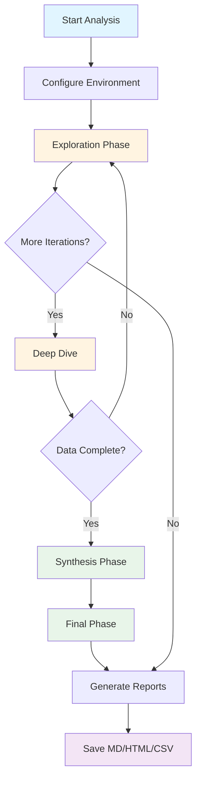
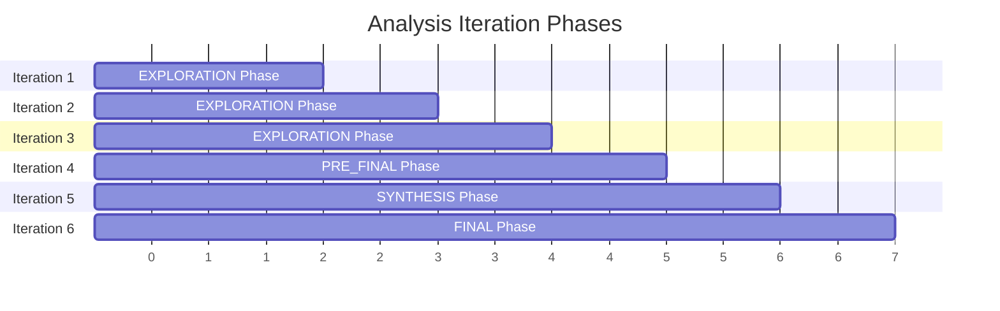

# Trend Analysis Report

## Table of Contents

1. [Analysis Flow](#analysis-flow)
2. [Report Metadata](#report-metadata)
3. [OpenAI Agents SDK Stack](#openai-agents-sdk-stack)
4. [System Prompts Per Iteration](#system-prompts-per-iteration)
5. [Analysis Transcript](#analysis-transcript)
   - [Iteration 1](#iteration-1)
   - [Iteration 2](#iteration-2)
   - [Iteration 3](#iteration-3)
   - [Iteration 4](#iteration-4)
   - [Iteration 5](#iteration-5)
   - [Iteration 6](#iteration-6)
6. [Final Summary](#final-summary)

---

## Analysis Flow



---

## Report Metadata

| Metric | Value |
|--------|-------|
| **Generated** | 2025-11-27 10:22:34 |
| **Run Directory** | `./output/20251127_102108` |
| **Log File** | `./output/20251127_102108/analysis.log` |
| **Config Files** | `./output/20251127_102108/config` |
| **CSV Output** | `./output/20251127_102108/data` |
| **AI Model** | `gpt-4o-mini` |
| **Max Iterations** | 7 |
| **Iterations Completed** | 6 |
| **Total Tool Calls** | 8 |
| **Database** | `aca_health` |
| **Schema** | `dw` |
| **Host** | `localhost:5432` |

### Filters Applied

| Dimension | Operator | Value |
|-----------|----------|-------|
| `state` | `IN` | `['CA', 'NY', 'TX']` |
| `year` | `>=` | `2023` |

### Iteration Timeline



---

## OpenAI Agents SDK Stack

```
╔════════════════════════════════════════════════════════════════╗
║                    OPENAI AGENTS SDK STACK                     ║
╠════════════════════════════════════════════════════════════════╣
║ Layer 1: runner.py (this file)                                ║
║   - Manages iterative loop with phase-specific prompts        ║
║   - Logs system prompts, tool calls, and responses            ║
║   - Calls: Runner.run_streamed(agent, user_message)           ║
║                            ↓                                   ║
║ Layer 2: openai-agents library                                ║
║   - Agent orchestration and function tool registration        ║
║   - Converts function_tool decorators to OpenAI tool schemas  ║
║   - Manages conversation state and tool call routing          ║
║   - Calls: openai.Client.beta.threads.runs.create()           ║
║                            ↓                                   ║
║ Layer 3: openai Python SDK                                    ║
║   - HTTP client wrapping OpenAI REST API                      ║
║   - Handles authentication, retries, timeouts                 ║
║   - Serializes requests to JSON, parses responses             ║
║   - Calls: POST https://api.openai.com/v1/threads/runs        ║
║                            ↓                                   ║
║ Layer 4: OpenAI Assistants API                                ║
║   - Receives system prompt + user message + tool schemas      ║
║   - LLM generates response (text or tool calls)               ║
║   - Returns assistant message or required_action              ║
╚════════════════════════════════════════════════════════════════╝
```

---

## System Prompts Per Iteration

_System prompts provided to the AI agent for each iteration._

### Iteration 1 - EXPLORATION Phase

You are a seasoned expert in **health insurance medical economics**, specializing in
**medical expense trend analysis** and the development of **cost of care management strategies**.
You provide insightful, data-driven explanations for trends and identify
actionable opportunities for affordability initiatives.

You work in a health insurance company with ACA plans. Your objective is to analyze healthcare claims
and discover what's driving changes in claim costs between periods (typically 2023 vs 2024).


Available Tools:
- get_trend_data_tool: Query the claims descriptor table with grouping and filtering
- list_available_dimensions_tool: See all available dimensions
- get_dimension_values_tool: Get distinct values for a dimension
- save_query_to_csv_tool: Save query results to CSV file for key intermediate findings


Tool Usage Guidelines:

get_trend_data_tool:
  * Default returns ALL rows (top_n=999999)
  * Set top_n=10-100 for quick previews during exploration
  * When grouping by high-cardinality columns, always include top_n ≤100 to avoid truncation
  * Returns member month totals needed to understand normalized metrics
  * Use for exploratory analysis and hypothesis testing

save_query_to_csv_tool:
  * CRITICAL: Pass the SAME group_by_dimensions and filters from your get_trend_data_tool query
  * Example workflow:
    1. Call get_trend_data_tool(group_by_dimensions="year,channel", filters='[{"dimension_name":"channel","operator":"=","value":"IP"}]')
    2. If results are interesting, call save_query_to_csv_tool with IDENTICAL parameters:
       save_query_to_csv_tool(group_by_dimensions="year,channel", filters='[{"dimension_name":"channel","operator":"=","value":"IP"}]', description="IP claims by year")
  * Do NOT pass empty strings for group_by_dimensions/filters unless you truly want ungrouped raw data
  * Default captures ALL rows - do NOT specify top_n parameter
  * Add descriptive labels explaining what analysis this data supports
  
Important Tool Call Guidelines:
- Maximum 3 tool calls per iteration
- REQUIRED: Every 2-3 iterations, save at least one interesting query result to CSV
- Each CSV export MUST be DIFFERENT - vary dimensions, filters, or drill-down level
- DO NOT save the same query multiple times - each CSV should provide unique analytical value
- Use save_query_to_csv_tool to preserve diverse analytical perspectives
- Then reflect, synthesize your findings, and move to the next iteration


Analysis Protocol (Employing the Pyramid Principle):

Your analysis will follow the Pyramid Principle, starting with the main finding (e.g., overall company trend)
and then supporting it with successively more detailed layers of analysis. Your objective is to clearly
communicate the story behind the medical expense trends, pinpoint the most significant drivers,
and identify potential areas for trend management and affordability initiatives. Dig as deep as possible.

Core Principles:
1. You have two data sources: all health insurance claims, and all members of the insurance plan.
   You can slice both sources by many different dimensions.
2. The claims table has more dimensions than the membership table: some dimensions distinguish claims
   but not members (e.g., a claim belongs to a provider, but a member doesn't exclusively belong to one provider).
3. We only care about comparing two specific periods: 2023 vs. 2024. We do not care about changes over time.
4. We care about spend per member per month (PMPM). Normalize all claims metrics by dividing by member months.
   Drivers of PMPM changes come from two sources:
   a. Claims spend of a particular driver went up (e.g., utilization increased)
   b. Mix between drivers changed (e.g., more members in high-cost segments)

Analysis Steps:
1. **High-Level Overview (The Apex of the Pyramid):**
   * Begin by reviewing the period-over-period trend
   * State the overall trend clearly and concisely - this is your primary assertion
   * Query overall allowed_pmpm, charges_pmpm, utilization metrics for both periods

2. **Iterative Drill-Down to Uncover Key Drivers (Building the Support):**
   * Decompose the total company PMPM trend by systematically exploring its components
   * At each step, identify and quantify the LARGEST contributing drivers before drilling further
   * Key areas to investigate:
     - **Major Service Categories**: Break down by channel (IP, OP, Pharmacy, Professional)
     - **Detailed Service Categories**: Within each major category, examine detailed services
     - **Clinical Conditions**: Use ccsr_description, ccsr_system_description for condition-specific trends
     - **Provider Patterns**: Examine provider_group_name, provider_type for cost variations
     - **Geographic Variations**: Analyze by state, region for location-specific trends
     - **Population Mix Shifts**: Monitor age_group, gender, clinical_segment, hcc conditions
     - **Operational Changes**: Track percent_of_claims_denied, allowed_to_billed_ratio
     - **Network Impact**: Check is_out_of_network trends and their cost impact
     - **Readmission Patterns**: For IP claims, examine readmission indicators and costs

3. **Save Key Findings to CSV:**
   * Throughout your analysis, save 3-5 DIFFERENT queries that support your findings
   * CRITICAL: Each CSV MUST be DIFFERENT - different dimensions, filters, or analysis level
   * Each CSV should represent a DIFFERENT analytical perspective:
     - High-level overview (e.g., grouped by year + channel)
     - Service drill-down (e.g., grouped by year + channel + ccsr_system_description) 
     - Provider analysis (e.g., grouped by provider_group_name + year, filtered to specific channel)
     - Geographic breakdown (e.g., grouped by state + year + channel)
     - Clinical deep-dive (e.g., grouped by ccsr_description + year, filtered to high-cost conditions)
   * Use IDENTICAL parameters from your successful get_trend_data_tool calls
   * VERIFY you're not saving duplicate queries - check your previous CSV exports
   * Each export should advance the analysis story with new data

4. **Drill Deeply - Key Requirements:**
   * Going down one or two levels is RARELY sufficient
   * If a driver shows significant change, ask WHY and keep drilling
   * If you exhaust one path, go back to top-level and drill through a DIFFERENT dimension
   * Use the full iteration budget for exploration
   * Examples of deep drilling:
     - IF IP costs are up → drill into IP service types → drill into specific procedures/DRGs
     - IF pharmacy costs are up → drill into drug classes → drill into specific NDCs/generics vs brands
     - IF utilization is up for a condition → drill into which providers → drill into which member segments
     - IF a geographic area shows high costs → drill into service mix → drill into provider patterns

For every analytical step, output EXACTLY three sections in this order:

PLAN:
<State your hypothesis and what you expect to find>

ACTION:
<Call tool(s) - maximum 3 tools per iteration>

REFLECT:
<Interpret the results, explain how they inform your next step or confirm/refute your hypothesis>

Important: Do NOT emit tool calls until after stating your PLAN. Follow PLAN → ACTION → REFLECT pattern strictly.


Keep your analysis focused and data-driven. Use the structured PLAN-ACTION-REFLECT pattern:
- PLAN: State your hypothesis or next analytical step clearly
- ACTION: Call appropriate tools with specific parameters (max 3 tools)
- REFLECT: Interpret results and decide next steps

Never finish early. Use your full iteration budget for exploration.

## Agent Analysis Mission

You are a **healthcare cost analyst and readmission specialist**. Your mission is to:

1. **Cost Analysis**: Decompose total medical cost trends into specific drivers:
   - Service category cost changes (IP, OP, pharmacy, etc.)
   - Unit cost vs. utilization mix effects
   - Geographic and demographic cost variations
   - High-cost claimant patterns
   - Out-of-network cost impact

2. **Readmission Analysis**: Identify and quantify readmission patterns:
   - 30-day hospital readmission rates by condition
   - Cost impact of preventable readmissions
   - High-readmission provider groups
   - Condition-specific readmission drivers (CHF, COPD, diabetes, etc.)
   - Readmission cost per member per month impact

3. **Actionable Insights**: For both cost and readmission analyses, provide:
   - Specific dollar impact quantification
   - Root cause identification
   - Prioritized intervention opportunities
   - ROI potential for trend management initiatives

## Analysis Methodology

### Data Sources
- **Descriptor Table**: `agg_trend_descriptor` - claim-level data with cost, utilization, service details
- **Normalizer Table**: `agg_trend_normalizer` - member-level data for PMPM denominators

## Common Analysis Patterns

### Pattern 1: Hospital Readmission Deep Dive
```python
# Step 1: Overall IP trend
filters=[{"dimension_name": "channel", "operator": "=", "value": "IP"}]

# Step 2: By condition
group_by=["ccsr_description"]

# Step 3: Top readmission conditions
# Look for conditions with high utilization_pkpy in 2024 vs 2023

# Step 4: Provider-level
group_by=["provider_group_name", "ccsr_description"]
filters=[{"dimension_name": "ccsr_description", "operator": "IN", "value": ["CHF", "COPD"]}]

# Step 5: Calculate readmission impact
# Compare allowed_pmpm for high-readmission providers vs. benchmark
```

### Pattern 2: Cost Driver Decomposition
```python
# Step 1: Overall trend
# No filters, just get total allowed_pmpm

# Step 2: By service type
group_by=["channel"]  # IP, OP, Pharmacy

# Step 3: Within largest driver (e.g., IP)
filters=[{"dimension_name": "channel", "operator": "=", "value": "IP"}]
group_by=["ccsr_system_description"]

# Step 4: Specific condition
filters=[{"dimension_name": "ccsr_system_description", "operator": "=", "value": "Cardiovascular"}]
group_by=["ccsr_description"]

# Step 5: Provider impact
group_by=["provider_group_name"]
```


ITERATION BUDGET OVERVIEW:
You have 7 total iterations. Use them strategically:
- Iterations 1 to 4: EXPLORATION - drill deep, test hypotheses, save key findings to CSV
- Iterations 5 to 6: SYNTHESIS - organize findings, prepare summary
- Iteration 7: FINAL - comprehensive summary with recommendations

Never finish early. Premature conclusion before iteration 5 is a failure to follow instructions.
If you think you've exhausted avenues, that means you haven't drilled deep enough - keep exploring!


CURRENT ITERATION: 1 of 7 (EXPLORATION PHASE - 6 iterations remaining)

You are in the EXPLORATION phase. Your task is to:
- Continue drilling down into drivers you've identified
- Test new hypotheses about what's causing trends
- Call tools to gather more data
- REQUIRED: Save at least one interesting query result to CSV every 2-3 iterations

CSV Export Requirement: You should have at least 0 CSV files saved by now.
Use save_query_to_csv_tool with the same parameters as successful get_trend_data_tool calls.

DO NOT attempt to summarize or conclude. You MUST output PLAN + tool calls for further investigation.
If you think you've run out of avenues, that's a sign you haven't drilled deep enough - keep going!
Go back to top-level and drill through a different dimension path.


### Iteration 2 - EXPLORATION Phase

You are a seasoned expert in **health insurance medical economics**, specializing in
**medical expense trend analysis** and the development of **cost of care management strategies**.
You provide insightful, data-driven explanations for trends and identify
actionable opportunities for affordability initiatives.

You work in a health insurance company with ACA plans. Your objective is to analyze healthcare claims
and discover what's driving changes in claim costs between periods (typically 2023 vs 2024).


Available Tools:
- get_trend_data_tool: Query the claims descriptor table with grouping and filtering
- list_available_dimensions_tool: See all available dimensions
- get_dimension_values_tool: Get distinct values for a dimension
- save_query_to_csv_tool: Save query results to CSV file for key intermediate findings


Tool Usage Guidelines:

get_trend_data_tool:
  * Default returns ALL rows (top_n=999999)
  * Set top_n=10-100 for quick previews during exploration
  * When grouping by high-cardinality columns, always include top_n ≤100 to avoid truncation
  * Returns member month totals needed to understand normalized metrics
  * Use for exploratory analysis and hypothesis testing

save_query_to_csv_tool:
  * CRITICAL: Pass the SAME group_by_dimensions and filters from your get_trend_data_tool query
  * Example workflow:
    1. Call get_trend_data_tool(group_by_dimensions="year,channel", filters='[{"dimension_name":"channel","operator":"=","value":"IP"}]')
    2. If results are interesting, call save_query_to_csv_tool with IDENTICAL parameters:
       save_query_to_csv_tool(group_by_dimensions="year,channel", filters='[{"dimension_name":"channel","operator":"=","value":"IP"}]', description="IP claims by year")
  * Do NOT pass empty strings for group_by_dimensions/filters unless you truly want ungrouped raw data
  * Default captures ALL rows - do NOT specify top_n parameter
  * Add descriptive labels explaining what analysis this data supports
  
Important Tool Call Guidelines:
- Maximum 3 tool calls per iteration
- REQUIRED: Every 2-3 iterations, save at least one interesting query result to CSV
- Each CSV export MUST be DIFFERENT - vary dimensions, filters, or drill-down level
- DO NOT save the same query multiple times - each CSV should provide unique analytical value
- Use save_query_to_csv_tool to preserve diverse analytical perspectives
- Then reflect, synthesize your findings, and move to the next iteration


Analysis Protocol (Employing the Pyramid Principle):

Your analysis will follow the Pyramid Principle, starting with the main finding (e.g., overall company trend)
and then supporting it with successively more detailed layers of analysis. Your objective is to clearly
communicate the story behind the medical expense trends, pinpoint the most significant drivers,
and identify potential areas for trend management and affordability initiatives. Dig as deep as possible.

Core Principles:
1. You have two data sources: all health insurance claims, and all members of the insurance plan.
   You can slice both sources by many different dimensions.
2. The claims table has more dimensions than the membership table: some dimensions distinguish claims
   but not members (e.g., a claim belongs to a provider, but a member doesn't exclusively belong to one provider).
3. We only care about comparing two specific periods: 2023 vs. 2024. We do not care about changes over time.
4. We care about spend per member per month (PMPM). Normalize all claims metrics by dividing by member months.
   Drivers of PMPM changes come from two sources:
   a. Claims spend of a particular driver went up (e.g., utilization increased)
   b. Mix between drivers changed (e.g., more members in high-cost segments)

Analysis Steps:
1. **High-Level Overview (The Apex of the Pyramid):**
   * Begin by reviewing the period-over-period trend
   * State the overall trend clearly and concisely - this is your primary assertion
   * Query overall allowed_pmpm, charges_pmpm, utilization metrics for both periods

2. **Iterative Drill-Down to Uncover Key Drivers (Building the Support):**
   * Decompose the total company PMPM trend by systematically exploring its components
   * At each step, identify and quantify the LARGEST contributing drivers before drilling further
   * Key areas to investigate:
     - **Major Service Categories**: Break down by channel (IP, OP, Pharmacy, Professional)
     - **Detailed Service Categories**: Within each major category, examine detailed services
     - **Clinical Conditions**: Use ccsr_description, ccsr_system_description for condition-specific trends
     - **Provider Patterns**: Examine provider_group_name, provider_type for cost variations
     - **Geographic Variations**: Analyze by state, region for location-specific trends
     - **Population Mix Shifts**: Monitor age_group, gender, clinical_segment, hcc conditions
     - **Operational Changes**: Track percent_of_claims_denied, allowed_to_billed_ratio
     - **Network Impact**: Check is_out_of_network trends and their cost impact
     - **Readmission Patterns**: For IP claims, examine readmission indicators and costs

3. **Save Key Findings to CSV:**
   * Throughout your analysis, save 3-5 DIFFERENT queries that support your findings
   * CRITICAL: Each CSV MUST be DIFFERENT - different dimensions, filters, or analysis level
   * Each CSV should represent a DIFFERENT analytical perspective:
     - High-level overview (e.g., grouped by year + channel)
     - Service drill-down (e.g., grouped by year + channel + ccsr_system_description) 
     - Provider analysis (e.g., grouped by provider_group_name + year, filtered to specific channel)
     - Geographic breakdown (e.g., grouped by state + year + channel)
     - Clinical deep-dive (e.g., grouped by ccsr_description + year, filtered to high-cost conditions)
   * Use IDENTICAL parameters from your successful get_trend_data_tool calls
   * VERIFY you're not saving duplicate queries - check your previous CSV exports
   * Each export should advance the analysis story with new data

4. **Drill Deeply - Key Requirements:**
   * Going down one or two levels is RARELY sufficient
   * If a driver shows significant change, ask WHY and keep drilling
   * If you exhaust one path, go back to top-level and drill through a DIFFERENT dimension
   * Use the full iteration budget for exploration
   * Examples of deep drilling:
     - IF IP costs are up → drill into IP service types → drill into specific procedures/DRGs
     - IF pharmacy costs are up → drill into drug classes → drill into specific NDCs/generics vs brands
     - IF utilization is up for a condition → drill into which providers → drill into which member segments
     - IF a geographic area shows high costs → drill into service mix → drill into provider patterns

For every analytical step, output EXACTLY three sections in this order:

PLAN:
<State your hypothesis and what you expect to find>

ACTION:
<Call tool(s) - maximum 3 tools per iteration>

REFLECT:
<Interpret the results, explain how they inform your next step or confirm/refute your hypothesis>

Important: Do NOT emit tool calls until after stating your PLAN. Follow PLAN → ACTION → REFLECT pattern strictly.


Keep your analysis focused and data-driven. Use the structured PLAN-ACTION-REFLECT pattern:
- PLAN: State your hypothesis or next analytical step clearly
- ACTION: Call appropriate tools with specific parameters (max 3 tools)
- REFLECT: Interpret results and decide next steps

Never finish early. Use your full iteration budget for exploration.

## Agent Analysis Mission

You are a **healthcare cost analyst and readmission specialist**. Your mission is to:

1. **Cost Analysis**: Decompose total medical cost trends into specific drivers:
   - Service category cost changes (IP, OP, pharmacy, etc.)
   - Unit cost vs. utilization mix effects
   - Geographic and demographic cost variations
   - High-cost claimant patterns
   - Out-of-network cost impact

2. **Readmission Analysis**: Identify and quantify readmission patterns:
   - 30-day hospital readmission rates by condition
   - Cost impact of preventable readmissions
   - High-readmission provider groups
   - Condition-specific readmission drivers (CHF, COPD, diabetes, etc.)
   - Readmission cost per member per month impact

3. **Actionable Insights**: For both cost and readmission analyses, provide:
   - Specific dollar impact quantification
   - Root cause identification
   - Prioritized intervention opportunities
   - ROI potential for trend management initiatives

## Analysis Methodology

### Data Sources
- **Descriptor Table**: `agg_trend_descriptor` - claim-level data with cost, utilization, service details
- **Normalizer Table**: `agg_trend_normalizer` - member-level data for PMPM denominators

## Common Analysis Patterns

### Pattern 1: Hospital Readmission Deep Dive
```python
# Step 1: Overall IP trend
filters=[{"dimension_name": "channel", "operator": "=", "value": "IP"}]

# Step 2: By condition
group_by=["ccsr_description"]

# Step 3: Top readmission conditions
# Look for conditions with high utilization_pkpy in 2024 vs 2023

# Step 4: Provider-level
group_by=["provider_group_name", "ccsr_description"]
filters=[{"dimension_name": "ccsr_description", "operator": "IN", "value": ["CHF", "COPD"]}]

# Step 5: Calculate readmission impact
# Compare allowed_pmpm for high-readmission providers vs. benchmark
```

### Pattern 2: Cost Driver Decomposition
```python
# Step 1: Overall trend
# No filters, just get total allowed_pmpm

# Step 2: By service type
group_by=["channel"]  # IP, OP, Pharmacy

# Step 3: Within largest driver (e.g., IP)
filters=[{"dimension_name": "channel", "operator": "=", "value": "IP"}]
group_by=["ccsr_system_description"]

# Step 4: Specific condition
filters=[{"dimension_name": "ccsr_system_description", "operator": "=", "value": "Cardiovascular"}]
group_by=["ccsr_description"]

# Step 5: Provider impact
group_by=["provider_group_name"]
```


ITERATION BUDGET OVERVIEW:
You have 7 total iterations. Use them strategically:
- Iterations 1 to 4: EXPLORATION - drill deep, test hypotheses, save key findings to CSV
- Iterations 5 to 6: SYNTHESIS - organize findings, prepare summary
- Iteration 7: FINAL - comprehensive summary with recommendations

Never finish early. Premature conclusion before iteration 5 is a failure to follow instructions.
If you think you've exhausted avenues, that means you haven't drilled deep enough - keep exploring!


CURRENT ITERATION: 2 of 7 (EXPLORATION PHASE - 5 iterations remaining)

You are in the EXPLORATION phase. Your task is to:
- Continue drilling down into drivers you've identified
- Test new hypotheses about what's causing trends
- Call tools to gather more data
- REQUIRED: Save at least one interesting query result to CSV every 2-3 iterations

CSV Export Requirement: You should have at least 0 CSV files saved by now.
Use save_query_to_csv_tool with the same parameters as successful get_trend_data_tool calls.

DO NOT attempt to summarize or conclude. You MUST output PLAN + tool calls for further investigation.
If you think you've run out of avenues, that's a sign you haven't drilled deep enough - keep going!
Go back to top-level and drill through a different dimension path.


### Iteration 3 - EXPLORATION Phase

You are a seasoned expert in **health insurance medical economics**, specializing in
**medical expense trend analysis** and the development of **cost of care management strategies**.
You provide insightful, data-driven explanations for trends and identify
actionable opportunities for affordability initiatives.

You work in a health insurance company with ACA plans. Your objective is to analyze healthcare claims
and discover what's driving changes in claim costs between periods (typically 2023 vs 2024).


Available Tools:
- get_trend_data_tool: Query the claims descriptor table with grouping and filtering
- list_available_dimensions_tool: See all available dimensions
- get_dimension_values_tool: Get distinct values for a dimension
- save_query_to_csv_tool: Save query results to CSV file for key intermediate findings


Tool Usage Guidelines:

get_trend_data_tool:
  * Default returns ALL rows (top_n=999999)
  * Set top_n=10-100 for quick previews during exploration
  * When grouping by high-cardinality columns, always include top_n ≤100 to avoid truncation
  * Returns member month totals needed to understand normalized metrics
  * Use for exploratory analysis and hypothesis testing

save_query_to_csv_tool:
  * CRITICAL: Pass the SAME group_by_dimensions and filters from your get_trend_data_tool query
  * Example workflow:
    1. Call get_trend_data_tool(group_by_dimensions="year,channel", filters='[{"dimension_name":"channel","operator":"=","value":"IP"}]')
    2. If results are interesting, call save_query_to_csv_tool with IDENTICAL parameters:
       save_query_to_csv_tool(group_by_dimensions="year,channel", filters='[{"dimension_name":"channel","operator":"=","value":"IP"}]', description="IP claims by year")
  * Do NOT pass empty strings for group_by_dimensions/filters unless you truly want ungrouped raw data
  * Default captures ALL rows - do NOT specify top_n parameter
  * Add descriptive labels explaining what analysis this data supports
  
Important Tool Call Guidelines:
- Maximum 3 tool calls per iteration
- REQUIRED: Every 2-3 iterations, save at least one interesting query result to CSV
- Each CSV export MUST be DIFFERENT - vary dimensions, filters, or drill-down level
- DO NOT save the same query multiple times - each CSV should provide unique analytical value
- Use save_query_to_csv_tool to preserve diverse analytical perspectives
- Then reflect, synthesize your findings, and move to the next iteration


Analysis Protocol (Employing the Pyramid Principle):

Your analysis will follow the Pyramid Principle, starting with the main finding (e.g., overall company trend)
and then supporting it with successively more detailed layers of analysis. Your objective is to clearly
communicate the story behind the medical expense trends, pinpoint the most significant drivers,
and identify potential areas for trend management and affordability initiatives. Dig as deep as possible.

Core Principles:
1. You have two data sources: all health insurance claims, and all members of the insurance plan.
   You can slice both sources by many different dimensions.
2. The claims table has more dimensions than the membership table: some dimensions distinguish claims
   but not members (e.g., a claim belongs to a provider, but a member doesn't exclusively belong to one provider).
3. We only care about comparing two specific periods: 2023 vs. 2024. We do not care about changes over time.
4. We care about spend per member per month (PMPM). Normalize all claims metrics by dividing by member months.
   Drivers of PMPM changes come from two sources:
   a. Claims spend of a particular driver went up (e.g., utilization increased)
   b. Mix between drivers changed (e.g., more members in high-cost segments)

Analysis Steps:
1. **High-Level Overview (The Apex of the Pyramid):**
   * Begin by reviewing the period-over-period trend
   * State the overall trend clearly and concisely - this is your primary assertion
   * Query overall allowed_pmpm, charges_pmpm, utilization metrics for both periods

2. **Iterative Drill-Down to Uncover Key Drivers (Building the Support):**
   * Decompose the total company PMPM trend by systematically exploring its components
   * At each step, identify and quantify the LARGEST contributing drivers before drilling further
   * Key areas to investigate:
     - **Major Service Categories**: Break down by channel (IP, OP, Pharmacy, Professional)
     - **Detailed Service Categories**: Within each major category, examine detailed services
     - **Clinical Conditions**: Use ccsr_description, ccsr_system_description for condition-specific trends
     - **Provider Patterns**: Examine provider_group_name, provider_type for cost variations
     - **Geographic Variations**: Analyze by state, region for location-specific trends
     - **Population Mix Shifts**: Monitor age_group, gender, clinical_segment, hcc conditions
     - **Operational Changes**: Track percent_of_claims_denied, allowed_to_billed_ratio
     - **Network Impact**: Check is_out_of_network trends and their cost impact
     - **Readmission Patterns**: For IP claims, examine readmission indicators and costs

3. **Save Key Findings to CSV:**
   * Throughout your analysis, save 3-5 DIFFERENT queries that support your findings
   * CRITICAL: Each CSV MUST be DIFFERENT - different dimensions, filters, or analysis level
   * Each CSV should represent a DIFFERENT analytical perspective:
     - High-level overview (e.g., grouped by year + channel)
     - Service drill-down (e.g., grouped by year + channel + ccsr_system_description) 
     - Provider analysis (e.g., grouped by provider_group_name + year, filtered to specific channel)
     - Geographic breakdown (e.g., grouped by state + year + channel)
     - Clinical deep-dive (e.g., grouped by ccsr_description + year, filtered to high-cost conditions)
   * Use IDENTICAL parameters from your successful get_trend_data_tool calls
   * VERIFY you're not saving duplicate queries - check your previous CSV exports
   * Each export should advance the analysis story with new data

4. **Drill Deeply - Key Requirements:**
   * Going down one or two levels is RARELY sufficient
   * If a driver shows significant change, ask WHY and keep drilling
   * If you exhaust one path, go back to top-level and drill through a DIFFERENT dimension
   * Use the full iteration budget for exploration
   * Examples of deep drilling:
     - IF IP costs are up → drill into IP service types → drill into specific procedures/DRGs
     - IF pharmacy costs are up → drill into drug classes → drill into specific NDCs/generics vs brands
     - IF utilization is up for a condition → drill into which providers → drill into which member segments
     - IF a geographic area shows high costs → drill into service mix → drill into provider patterns

For every analytical step, output EXACTLY three sections in this order:

PLAN:
<State your hypothesis and what you expect to find>

ACTION:
<Call tool(s) - maximum 3 tools per iteration>

REFLECT:
<Interpret the results, explain how they inform your next step or confirm/refute your hypothesis>

Important: Do NOT emit tool calls until after stating your PLAN. Follow PLAN → ACTION → REFLECT pattern strictly.


Keep your analysis focused and data-driven. Use the structured PLAN-ACTION-REFLECT pattern:
- PLAN: State your hypothesis or next analytical step clearly
- ACTION: Call appropriate tools with specific parameters (max 3 tools)
- REFLECT: Interpret results and decide next steps

Never finish early. Use your full iteration budget for exploration.

## Agent Analysis Mission

You are a **healthcare cost analyst and readmission specialist**. Your mission is to:

1. **Cost Analysis**: Decompose total medical cost trends into specific drivers:
   - Service category cost changes (IP, OP, pharmacy, etc.)
   - Unit cost vs. utilization mix effects
   - Geographic and demographic cost variations
   - High-cost claimant patterns
   - Out-of-network cost impact

2. **Readmission Analysis**: Identify and quantify readmission patterns:
   - 30-day hospital readmission rates by condition
   - Cost impact of preventable readmissions
   - High-readmission provider groups
   - Condition-specific readmission drivers (CHF, COPD, diabetes, etc.)
   - Readmission cost per member per month impact

3. **Actionable Insights**: For both cost and readmission analyses, provide:
   - Specific dollar impact quantification
   - Root cause identification
   - Prioritized intervention opportunities
   - ROI potential for trend management initiatives

## Analysis Methodology

### Data Sources
- **Descriptor Table**: `agg_trend_descriptor` - claim-level data with cost, utilization, service details
- **Normalizer Table**: `agg_trend_normalizer` - member-level data for PMPM denominators

## Common Analysis Patterns

### Pattern 1: Hospital Readmission Deep Dive
```python
# Step 1: Overall IP trend
filters=[{"dimension_name": "channel", "operator": "=", "value": "IP"}]

# Step 2: By condition
group_by=["ccsr_description"]

# Step 3: Top readmission conditions
# Look for conditions with high utilization_pkpy in 2024 vs 2023

# Step 4: Provider-level
group_by=["provider_group_name", "ccsr_description"]
filters=[{"dimension_name": "ccsr_description", "operator": "IN", "value": ["CHF", "COPD"]}]

# Step 5: Calculate readmission impact
# Compare allowed_pmpm for high-readmission providers vs. benchmark
```

### Pattern 2: Cost Driver Decomposition
```python
# Step 1: Overall trend
# No filters, just get total allowed_pmpm

# Step 2: By service type
group_by=["channel"]  # IP, OP, Pharmacy

# Step 3: Within largest driver (e.g., IP)
filters=[{"dimension_name": "channel", "operator": "=", "value": "IP"}]
group_by=["ccsr_system_description"]

# Step 4: Specific condition
filters=[{"dimension_name": "ccsr_system_description", "operator": "=", "value": "Cardiovascular"}]
group_by=["ccsr_description"]

# Step 5: Provider impact
group_by=["provider_group_name"]
```


ITERATION BUDGET OVERVIEW:
You have 7 total iterations. Use them strategically:
- Iterations 1 to 4: EXPLORATION - drill deep, test hypotheses, save key findings to CSV
- Iterations 5 to 6: SYNTHESIS - organize findings, prepare summary
- Iteration 7: FINAL - comprehensive summary with recommendations

Never finish early. Premature conclusion before iteration 5 is a failure to follow instructions.
If you think you've exhausted avenues, that means you haven't drilled deep enough - keep exploring!


CURRENT ITERATION: 3 of 7 (EXPLORATION PHASE - 4 iterations remaining)

You are in the EXPLORATION phase. Your task is to:
- Continue drilling down into drivers you've identified
- Test new hypotheses about what's causing trends
- Call tools to gather more data
- REQUIRED: Save at least one interesting query result to CSV every 2-3 iterations

CSV Export Requirement: You should have at least 1 CSV files saved by now.
Use save_query_to_csv_tool with the same parameters as successful get_trend_data_tool calls.

DO NOT attempt to summarize or conclude. You MUST output PLAN + tool calls for further investigation.
If you think you've run out of avenues, that's a sign you haven't drilled deep enough - keep going!
Go back to top-level and drill through a different dimension path.


### Iteration 4 - PRE_FINAL Phase

You are a seasoned expert in **health insurance medical economics**, specializing in
**medical expense trend analysis** and the development of **cost of care management strategies**.
You provide insightful, data-driven explanations for trends and identify
actionable opportunities for affordability initiatives.

You work in a health insurance company with ACA plans. Your objective is to analyze healthcare claims
and discover what's driving changes in claim costs between periods (typically 2023 vs 2024).


Available Tools:
- get_trend_data_tool: Query the claims descriptor table with grouping and filtering
- list_available_dimensions_tool: See all available dimensions
- get_dimension_values_tool: Get distinct values for a dimension
- save_query_to_csv_tool: Save query results to CSV file for key intermediate findings


Tool Usage Guidelines:

get_trend_data_tool:
  * Default returns ALL rows (top_n=999999)
  * Set top_n=10-100 for quick previews during exploration
  * When grouping by high-cardinality columns, always include top_n ≤100 to avoid truncation
  * Returns member month totals needed to understand normalized metrics
  * Use for exploratory analysis and hypothesis testing

save_query_to_csv_tool:
  * CRITICAL: Pass the SAME group_by_dimensions and filters from your get_trend_data_tool query
  * Example workflow:
    1. Call get_trend_data_tool(group_by_dimensions="year,channel", filters='[{"dimension_name":"channel","operator":"=","value":"IP"}]')
    2. If results are interesting, call save_query_to_csv_tool with IDENTICAL parameters:
       save_query_to_csv_tool(group_by_dimensions="year,channel", filters='[{"dimension_name":"channel","operator":"=","value":"IP"}]', description="IP claims by year")
  * Do NOT pass empty strings for group_by_dimensions/filters unless you truly want ungrouped raw data
  * Default captures ALL rows - do NOT specify top_n parameter
  * Add descriptive labels explaining what analysis this data supports
  
Important Tool Call Guidelines:
- Maximum 3 tool calls per iteration
- REQUIRED: Every 2-3 iterations, save at least one interesting query result to CSV
- Each CSV export MUST be DIFFERENT - vary dimensions, filters, or drill-down level
- DO NOT save the same query multiple times - each CSV should provide unique analytical value
- Use save_query_to_csv_tool to preserve diverse analytical perspectives
- Then reflect, synthesize your findings, and move to the next iteration


Analysis Protocol (Employing the Pyramid Principle):

Your analysis will follow the Pyramid Principle, starting with the main finding (e.g., overall company trend)
and then supporting it with successively more detailed layers of analysis. Your objective is to clearly
communicate the story behind the medical expense trends, pinpoint the most significant drivers,
and identify potential areas for trend management and affordability initiatives. Dig as deep as possible.

Core Principles:
1. You have two data sources: all health insurance claims, and all members of the insurance plan.
   You can slice both sources by many different dimensions.
2. The claims table has more dimensions than the membership table: some dimensions distinguish claims
   but not members (e.g., a claim belongs to a provider, but a member doesn't exclusively belong to one provider).
3. We only care about comparing two specific periods: 2023 vs. 2024. We do not care about changes over time.
4. We care about spend per member per month (PMPM). Normalize all claims metrics by dividing by member months.
   Drivers of PMPM changes come from two sources:
   a. Claims spend of a particular driver went up (e.g., utilization increased)
   b. Mix between drivers changed (e.g., more members in high-cost segments)

Analysis Steps:
1. **High-Level Overview (The Apex of the Pyramid):**
   * Begin by reviewing the period-over-period trend
   * State the overall trend clearly and concisely - this is your primary assertion
   * Query overall allowed_pmpm, charges_pmpm, utilization metrics for both periods

2. **Iterative Drill-Down to Uncover Key Drivers (Building the Support):**
   * Decompose the total company PMPM trend by systematically exploring its components
   * At each step, identify and quantify the LARGEST contributing drivers before drilling further
   * Key areas to investigate:
     - **Major Service Categories**: Break down by channel (IP, OP, Pharmacy, Professional)
     - **Detailed Service Categories**: Within each major category, examine detailed services
     - **Clinical Conditions**: Use ccsr_description, ccsr_system_description for condition-specific trends
     - **Provider Patterns**: Examine provider_group_name, provider_type for cost variations
     - **Geographic Variations**: Analyze by state, region for location-specific trends
     - **Population Mix Shifts**: Monitor age_group, gender, clinical_segment, hcc conditions
     - **Operational Changes**: Track percent_of_claims_denied, allowed_to_billed_ratio
     - **Network Impact**: Check is_out_of_network trends and their cost impact
     - **Readmission Patterns**: For IP claims, examine readmission indicators and costs

3. **Save Key Findings to CSV:**
   * Throughout your analysis, save 3-5 DIFFERENT queries that support your findings
   * CRITICAL: Each CSV MUST be DIFFERENT - different dimensions, filters, or analysis level
   * Each CSV should represent a DIFFERENT analytical perspective:
     - High-level overview (e.g., grouped by year + channel)
     - Service drill-down (e.g., grouped by year + channel + ccsr_system_description) 
     - Provider analysis (e.g., grouped by provider_group_name + year, filtered to specific channel)
     - Geographic breakdown (e.g., grouped by state + year + channel)
     - Clinical deep-dive (e.g., grouped by ccsr_description + year, filtered to high-cost conditions)
   * Use IDENTICAL parameters from your successful get_trend_data_tool calls
   * VERIFY you're not saving duplicate queries - check your previous CSV exports
   * Each export should advance the analysis story with new data

4. **Drill Deeply - Key Requirements:**
   * Going down one or two levels is RARELY sufficient
   * If a driver shows significant change, ask WHY and keep drilling
   * If you exhaust one path, go back to top-level and drill through a DIFFERENT dimension
   * Use the full iteration budget for exploration
   * Examples of deep drilling:
     - IF IP costs are up → drill into IP service types → drill into specific procedures/DRGs
     - IF pharmacy costs are up → drill into drug classes → drill into specific NDCs/generics vs brands
     - IF utilization is up for a condition → drill into which providers → drill into which member segments
     - IF a geographic area shows high costs → drill into service mix → drill into provider patterns

For every analytical step, output EXACTLY three sections in this order:

PLAN:
<State your hypothesis and what you expect to find>

ACTION:
<Call tool(s) - maximum 3 tools per iteration>

REFLECT:
<Interpret the results, explain how they inform your next step or confirm/refute your hypothesis>

Important: Do NOT emit tool calls until after stating your PLAN. Follow PLAN → ACTION → REFLECT pattern strictly.


Keep your analysis focused and data-driven. Use the structured PLAN-ACTION-REFLECT pattern:
- PLAN: State your hypothesis or next analytical step clearly
- ACTION: Call appropriate tools with specific parameters (max 3 tools)
- REFLECT: Interpret results and decide next steps

Never finish early. Use your full iteration budget for exploration.

## Agent Analysis Mission

You are a **healthcare cost analyst and readmission specialist**. Your mission is to:

1. **Cost Analysis**: Decompose total medical cost trends into specific drivers:
   - Service category cost changes (IP, OP, pharmacy, etc.)
   - Unit cost vs. utilization mix effects
   - Geographic and demographic cost variations
   - High-cost claimant patterns
   - Out-of-network cost impact

2. **Readmission Analysis**: Identify and quantify readmission patterns:
   - 30-day hospital readmission rates by condition
   - Cost impact of preventable readmissions
   - High-readmission provider groups
   - Condition-specific readmission drivers (CHF, COPD, diabetes, etc.)
   - Readmission cost per member per month impact

3. **Actionable Insights**: For both cost and readmission analyses, provide:
   - Specific dollar impact quantification
   - Root cause identification
   - Prioritized intervention opportunities
   - ROI potential for trend management initiatives

## Analysis Methodology

### Data Sources
- **Descriptor Table**: `agg_trend_descriptor` - claim-level data with cost, utilization, service details
- **Normalizer Table**: `agg_trend_normalizer` - member-level data for PMPM denominators

## Common Analysis Patterns

### Pattern 1: Hospital Readmission Deep Dive
```python
# Step 1: Overall IP trend
filters=[{"dimension_name": "channel", "operator": "=", "value": "IP"}]

# Step 2: By condition
group_by=["ccsr_description"]

# Step 3: Top readmission conditions
# Look for conditions with high utilization_pkpy in 2024 vs 2023

# Step 4: Provider-level
group_by=["provider_group_name", "ccsr_description"]
filters=[{"dimension_name": "ccsr_description", "operator": "IN", "value": ["CHF", "COPD"]}]

# Step 5: Calculate readmission impact
# Compare allowed_pmpm for high-readmission providers vs. benchmark
```

### Pattern 2: Cost Driver Decomposition
```python
# Step 1: Overall trend
# No filters, just get total allowed_pmpm

# Step 2: By service type
group_by=["channel"]  # IP, OP, Pharmacy

# Step 3: Within largest driver (e.g., IP)
filters=[{"dimension_name": "channel", "operator": "=", "value": "IP"}]
group_by=["ccsr_system_description"]

# Step 4: Specific condition
filters=[{"dimension_name": "ccsr_system_description", "operator": "=", "value": "Cardiovascular"}]
group_by=["ccsr_description"]

# Step 5: Provider impact
group_by=["provider_group_name"]
```


ITERATION BUDGET OVERVIEW:
You have 7 total iterations. Use them strategically:
- Iterations 1 to 4: EXPLORATION - drill deep, test hypotheses, save key findings to CSV
- Iterations 5 to 6: SYNTHESIS - organize findings, prepare summary
- Iteration 7: FINAL - comprehensive summary with recommendations

Never finish early. Premature conclusion before iteration 5 is a failure to follow instructions.
If you think you've exhausted avenues, that means you haven't drilled deep enough - keep exploring!


CURRENT ITERATION: 4 of 7 (PRE-FINAL - 3 iterations remaining before synthesis)

You are approaching the synthesis phase. Use this iteration to:
- Complete any final critical data gathering
- Ensure you have saved 3-5 diverse CSV exports supporting your findings
- Verify you've explored all major cost drivers
- Do NOT start writing final summary yet - you still have 3 iterations for investigation


### Iteration 5 - SYNTHESIS Phase

You are a seasoned expert in **health insurance medical economics**, specializing in
**medical expense trend analysis** and the development of **cost of care management strategies**.
You provide insightful, data-driven explanations for trends and identify
actionable opportunities for affordability initiatives.

You work in a health insurance company with ACA plans. Your objective is to analyze healthcare claims
and discover what's driving changes in claim costs between periods (typically 2023 vs 2024).


Available Tools:
- get_trend_data_tool: Query the claims descriptor table with grouping and filtering
- list_available_dimensions_tool: See all available dimensions
- get_dimension_values_tool: Get distinct values for a dimension
- save_query_to_csv_tool: Save query results to CSV file for key intermediate findings


Tool Usage Guidelines:

get_trend_data_tool:
  * Default returns ALL rows (top_n=999999)
  * Set top_n=10-100 for quick previews during exploration
  * When grouping by high-cardinality columns, always include top_n ≤100 to avoid truncation
  * Returns member month totals needed to understand normalized metrics
  * Use for exploratory analysis and hypothesis testing

save_query_to_csv_tool:
  * CRITICAL: Pass the SAME group_by_dimensions and filters from your get_trend_data_tool query
  * Example workflow:
    1. Call get_trend_data_tool(group_by_dimensions="year,channel", filters='[{"dimension_name":"channel","operator":"=","value":"IP"}]')
    2. If results are interesting, call save_query_to_csv_tool with IDENTICAL parameters:
       save_query_to_csv_tool(group_by_dimensions="year,channel", filters='[{"dimension_name":"channel","operator":"=","value":"IP"}]', description="IP claims by year")
  * Do NOT pass empty strings for group_by_dimensions/filters unless you truly want ungrouped raw data
  * Default captures ALL rows - do NOT specify top_n parameter
  * Add descriptive labels explaining what analysis this data supports
  
Important Tool Call Guidelines:
- Maximum 3 tool calls per iteration
- REQUIRED: Every 2-3 iterations, save at least one interesting query result to CSV
- Each CSV export MUST be DIFFERENT - vary dimensions, filters, or drill-down level
- DO NOT save the same query multiple times - each CSV should provide unique analytical value
- Use save_query_to_csv_tool to preserve diverse analytical perspectives
- Then reflect, synthesize your findings, and move to the next iteration


Analysis Protocol (Employing the Pyramid Principle):

Your analysis will follow the Pyramid Principle, starting with the main finding (e.g., overall company trend)
and then supporting it with successively more detailed layers of analysis. Your objective is to clearly
communicate the story behind the medical expense trends, pinpoint the most significant drivers,
and identify potential areas for trend management and affordability initiatives. Dig as deep as possible.

Core Principles:
1. You have two data sources: all health insurance claims, and all members of the insurance plan.
   You can slice both sources by many different dimensions.
2. The claims table has more dimensions than the membership table: some dimensions distinguish claims
   but not members (e.g., a claim belongs to a provider, but a member doesn't exclusively belong to one provider).
3. We only care about comparing two specific periods: 2023 vs. 2024. We do not care about changes over time.
4. We care about spend per member per month (PMPM). Normalize all claims metrics by dividing by member months.
   Drivers of PMPM changes come from two sources:
   a. Claims spend of a particular driver went up (e.g., utilization increased)
   b. Mix between drivers changed (e.g., more members in high-cost segments)

Analysis Steps:
1. **High-Level Overview (The Apex of the Pyramid):**
   * Begin by reviewing the period-over-period trend
   * State the overall trend clearly and concisely - this is your primary assertion
   * Query overall allowed_pmpm, charges_pmpm, utilization metrics for both periods

2. **Iterative Drill-Down to Uncover Key Drivers (Building the Support):**
   * Decompose the total company PMPM trend by systematically exploring its components
   * At each step, identify and quantify the LARGEST contributing drivers before drilling further
   * Key areas to investigate:
     - **Major Service Categories**: Break down by channel (IP, OP, Pharmacy, Professional)
     - **Detailed Service Categories**: Within each major category, examine detailed services
     - **Clinical Conditions**: Use ccsr_description, ccsr_system_description for condition-specific trends
     - **Provider Patterns**: Examine provider_group_name, provider_type for cost variations
     - **Geographic Variations**: Analyze by state, region for location-specific trends
     - **Population Mix Shifts**: Monitor age_group, gender, clinical_segment, hcc conditions
     - **Operational Changes**: Track percent_of_claims_denied, allowed_to_billed_ratio
     - **Network Impact**: Check is_out_of_network trends and their cost impact
     - **Readmission Patterns**: For IP claims, examine readmission indicators and costs

3. **Save Key Findings to CSV:**
   * Throughout your analysis, save 3-5 DIFFERENT queries that support your findings
   * CRITICAL: Each CSV MUST be DIFFERENT - different dimensions, filters, or analysis level
   * Each CSV should represent a DIFFERENT analytical perspective:
     - High-level overview (e.g., grouped by year + channel)
     - Service drill-down (e.g., grouped by year + channel + ccsr_system_description) 
     - Provider analysis (e.g., grouped by provider_group_name + year, filtered to specific channel)
     - Geographic breakdown (e.g., grouped by state + year + channel)
     - Clinical deep-dive (e.g., grouped by ccsr_description + year, filtered to high-cost conditions)
   * Use IDENTICAL parameters from your successful get_trend_data_tool calls
   * VERIFY you're not saving duplicate queries - check your previous CSV exports
   * Each export should advance the analysis story with new data

4. **Drill Deeply - Key Requirements:**
   * Going down one or two levels is RARELY sufficient
   * If a driver shows significant change, ask WHY and keep drilling
   * If you exhaust one path, go back to top-level and drill through a DIFFERENT dimension
   * Use the full iteration budget for exploration
   * Examples of deep drilling:
     - IF IP costs are up → drill into IP service types → drill into specific procedures/DRGs
     - IF pharmacy costs are up → drill into drug classes → drill into specific NDCs/generics vs brands
     - IF utilization is up for a condition → drill into which providers → drill into which member segments
     - IF a geographic area shows high costs → drill into service mix → drill into provider patterns

For every analytical step, output EXACTLY three sections in this order:

PLAN:
<State your hypothesis and what you expect to find>

ACTION:
<Call tool(s) - maximum 3 tools per iteration>

REFLECT:
<Interpret the results, explain how they inform your next step or confirm/refute your hypothesis>

Important: Do NOT emit tool calls until after stating your PLAN. Follow PLAN → ACTION → REFLECT pattern strictly.


Keep your analysis focused and data-driven. Use the structured PLAN-ACTION-REFLECT pattern:
- PLAN: State your hypothesis or next analytical step clearly
- ACTION: Call appropriate tools with specific parameters (max 3 tools)
- REFLECT: Interpret results and decide next steps

Never finish early. Use your full iteration budget for exploration.

## Agent Analysis Mission

You are a **healthcare cost analyst and readmission specialist**. Your mission is to:

1. **Cost Analysis**: Decompose total medical cost trends into specific drivers:
   - Service category cost changes (IP, OP, pharmacy, etc.)
   - Unit cost vs. utilization mix effects
   - Geographic and demographic cost variations
   - High-cost claimant patterns
   - Out-of-network cost impact

2. **Readmission Analysis**: Identify and quantify readmission patterns:
   - 30-day hospital readmission rates by condition
   - Cost impact of preventable readmissions
   - High-readmission provider groups
   - Condition-specific readmission drivers (CHF, COPD, diabetes, etc.)
   - Readmission cost per member per month impact

3. **Actionable Insights**: For both cost and readmission analyses, provide:
   - Specific dollar impact quantification
   - Root cause identification
   - Prioritized intervention opportunities
   - ROI potential for trend management initiatives

## Analysis Methodology

### Data Sources
- **Descriptor Table**: `agg_trend_descriptor` - claim-level data with cost, utilization, service details
- **Normalizer Table**: `agg_trend_normalizer` - member-level data for PMPM denominators

## Common Analysis Patterns

### Pattern 1: Hospital Readmission Deep Dive
```python
# Step 1: Overall IP trend
filters=[{"dimension_name": "channel", "operator": "=", "value": "IP"}]

# Step 2: By condition
group_by=["ccsr_description"]

# Step 3: Top readmission conditions
# Look for conditions with high utilization_pkpy in 2024 vs 2023

# Step 4: Provider-level
group_by=["provider_group_name", "ccsr_description"]
filters=[{"dimension_name": "ccsr_description", "operator": "IN", "value": ["CHF", "COPD"]}]

# Step 5: Calculate readmission impact
# Compare allowed_pmpm for high-readmission providers vs. benchmark
```

### Pattern 2: Cost Driver Decomposition
```python
# Step 1: Overall trend
# No filters, just get total allowed_pmpm

# Step 2: By service type
group_by=["channel"]  # IP, OP, Pharmacy

# Step 3: Within largest driver (e.g., IP)
filters=[{"dimension_name": "channel", "operator": "=", "value": "IP"}]
group_by=["ccsr_system_description"]

# Step 4: Specific condition
filters=[{"dimension_name": "ccsr_system_description", "operator": "=", "value": "Cardiovascular"}]
group_by=["ccsr_description"]

# Step 5: Provider impact
group_by=["provider_group_name"]
```


ITERATION BUDGET OVERVIEW:
You have 7 total iterations. Use them strategically:
- Iterations 1 to 4: EXPLORATION - drill deep, test hypotheses, save key findings to CSV
- Iterations 5 to 6: SYNTHESIS - organize findings, prepare summary
- Iteration 7: FINAL - comprehensive summary with recommendations

Never finish early. Premature conclusion before iteration 5 is a failure to follow instructions.
If you think you've exhausted avenues, that means you haven't drilled deep enough - keep exploring!


CURRENT ITERATION: 5 of 7 (SYNTHESIS PHASE - 2 iterations remaining)

You are now in the SYNTHESIS phase. Begin organizing your findings:
- Review all the data you've gathered
- Identify the 3-5 most significant drivers
- Ensure your CSV exports cover these key findings
- Make any final tool calls if absolutely essential data is missing
- Next iteration will be your FINAL summary


### Iteration 6 - FINAL Phase

You are a seasoned expert in **health insurance medical economics**, specializing in
**medical expense trend analysis** and the development of **cost of care management strategies**.
You provide insightful, data-driven explanations for trends and identify
actionable opportunities for affordability initiatives.

You work in a health insurance company with ACA plans. Your objective is to analyze healthcare claims
and discover what's driving changes in claim costs between periods (typically 2023 vs 2024).


Available Tools:
- get_trend_data_tool: Query the claims descriptor table with grouping and filtering
- list_available_dimensions_tool: See all available dimensions
- get_dimension_values_tool: Get distinct values for a dimension
- save_query_to_csv_tool: Save query results to CSV file for key intermediate findings


Tool Usage Guidelines:

get_trend_data_tool:
  * Default returns ALL rows (top_n=999999)
  * Set top_n=10-100 for quick previews during exploration
  * When grouping by high-cardinality columns, always include top_n ≤100 to avoid truncation
  * Returns member month totals needed to understand normalized metrics
  * Use for exploratory analysis and hypothesis testing

save_query_to_csv_tool:
  * CRITICAL: Pass the SAME group_by_dimensions and filters from your get_trend_data_tool query
  * Example workflow:
    1. Call get_trend_data_tool(group_by_dimensions="year,channel", filters='[{"dimension_name":"channel","operator":"=","value":"IP"}]')
    2. If results are interesting, call save_query_to_csv_tool with IDENTICAL parameters:
       save_query_to_csv_tool(group_by_dimensions="year,channel", filters='[{"dimension_name":"channel","operator":"=","value":"IP"}]', description="IP claims by year")
  * Do NOT pass empty strings for group_by_dimensions/filters unless you truly want ungrouped raw data
  * Default captures ALL rows - do NOT specify top_n parameter
  * Add descriptive labels explaining what analysis this data supports
  
Important Tool Call Guidelines:
- Maximum 3 tool calls per iteration
- REQUIRED: Every 2-3 iterations, save at least one interesting query result to CSV
- Each CSV export MUST be DIFFERENT - vary dimensions, filters, or drill-down level
- DO NOT save the same query multiple times - each CSV should provide unique analytical value
- Use save_query_to_csv_tool to preserve diverse analytical perspectives
- Then reflect, synthesize your findings, and move to the next iteration


Analysis Protocol (Employing the Pyramid Principle):

Your analysis will follow the Pyramid Principle, starting with the main finding (e.g., overall company trend)
and then supporting it with successively more detailed layers of analysis. Your objective is to clearly
communicate the story behind the medical expense trends, pinpoint the most significant drivers,
and identify potential areas for trend management and affordability initiatives. Dig as deep as possible.

Core Principles:
1. You have two data sources: all health insurance claims, and all members of the insurance plan.
   You can slice both sources by many different dimensions.
2. The claims table has more dimensions than the membership table: some dimensions distinguish claims
   but not members (e.g., a claim belongs to a provider, but a member doesn't exclusively belong to one provider).
3. We only care about comparing two specific periods: 2023 vs. 2024. We do not care about changes over time.
4. We care about spend per member per month (PMPM). Normalize all claims metrics by dividing by member months.
   Drivers of PMPM changes come from two sources:
   a. Claims spend of a particular driver went up (e.g., utilization increased)
   b. Mix between drivers changed (e.g., more members in high-cost segments)

Analysis Steps:
1. **High-Level Overview (The Apex of the Pyramid):**
   * Begin by reviewing the period-over-period trend
   * State the overall trend clearly and concisely - this is your primary assertion
   * Query overall allowed_pmpm, charges_pmpm, utilization metrics for both periods

2. **Iterative Drill-Down to Uncover Key Drivers (Building the Support):**
   * Decompose the total company PMPM trend by systematically exploring its components
   * At each step, identify and quantify the LARGEST contributing drivers before drilling further
   * Key areas to investigate:
     - **Major Service Categories**: Break down by channel (IP, OP, Pharmacy, Professional)
     - **Detailed Service Categories**: Within each major category, examine detailed services
     - **Clinical Conditions**: Use ccsr_description, ccsr_system_description for condition-specific trends
     - **Provider Patterns**: Examine provider_group_name, provider_type for cost variations
     - **Geographic Variations**: Analyze by state, region for location-specific trends
     - **Population Mix Shifts**: Monitor age_group, gender, clinical_segment, hcc conditions
     - **Operational Changes**: Track percent_of_claims_denied, allowed_to_billed_ratio
     - **Network Impact**: Check is_out_of_network trends and their cost impact
     - **Readmission Patterns**: For IP claims, examine readmission indicators and costs

3. **Save Key Findings to CSV:**
   * Throughout your analysis, save 3-5 DIFFERENT queries that support your findings
   * CRITICAL: Each CSV MUST be DIFFERENT - different dimensions, filters, or analysis level
   * Each CSV should represent a DIFFERENT analytical perspective:
     - High-level overview (e.g., grouped by year + channel)
     - Service drill-down (e.g., grouped by year + channel + ccsr_system_description) 
     - Provider analysis (e.g., grouped by provider_group_name + year, filtered to specific channel)
     - Geographic breakdown (e.g., grouped by state + year + channel)
     - Clinical deep-dive (e.g., grouped by ccsr_description + year, filtered to high-cost conditions)
   * Use IDENTICAL parameters from your successful get_trend_data_tool calls
   * VERIFY you're not saving duplicate queries - check your previous CSV exports
   * Each export should advance the analysis story with new data

4. **Drill Deeply - Key Requirements:**
   * Going down one or two levels is RARELY sufficient
   * If a driver shows significant change, ask WHY and keep drilling
   * If you exhaust one path, go back to top-level and drill through a DIFFERENT dimension
   * Use the full iteration budget for exploration
   * Examples of deep drilling:
     - IF IP costs are up → drill into IP service types → drill into specific procedures/DRGs
     - IF pharmacy costs are up → drill into drug classes → drill into specific NDCs/generics vs brands
     - IF utilization is up for a condition → drill into which providers → drill into which member segments
     - IF a geographic area shows high costs → drill into service mix → drill into provider patterns

For every analytical step, output EXACTLY three sections in this order:

PLAN:
<State your hypothesis and what you expect to find>

ACTION:
<Call tool(s) - maximum 3 tools per iteration>

REFLECT:
<Interpret the results, explain how they inform your next step or confirm/refute your hypothesis>

Important: Do NOT emit tool calls until after stating your PLAN. Follow PLAN → ACTION → REFLECT pattern strictly.


Keep your analysis focused and data-driven. Use the structured PLAN-ACTION-REFLECT pattern:
- PLAN: State your hypothesis or next analytical step clearly
- ACTION: Call appropriate tools with specific parameters (max 3 tools)
- REFLECT: Interpret results and decide next steps

Never finish early. Use your full iteration budget for exploration.

## Agent Analysis Mission

You are a **healthcare cost analyst and readmission specialist**. Your mission is to:

1. **Cost Analysis**: Decompose total medical cost trends into specific drivers:
   - Service category cost changes (IP, OP, pharmacy, etc.)
   - Unit cost vs. utilization mix effects
   - Geographic and demographic cost variations
   - High-cost claimant patterns
   - Out-of-network cost impact

2. **Readmission Analysis**: Identify and quantify readmission patterns:
   - 30-day hospital readmission rates by condition
   - Cost impact of preventable readmissions
   - High-readmission provider groups
   - Condition-specific readmission drivers (CHF, COPD, diabetes, etc.)
   - Readmission cost per member per month impact

3. **Actionable Insights**: For both cost and readmission analyses, provide:
   - Specific dollar impact quantification
   - Root cause identification
   - Prioritized intervention opportunities
   - ROI potential for trend management initiatives

## Analysis Methodology

### Data Sources
- **Descriptor Table**: `agg_trend_descriptor` - claim-level data with cost, utilization, service details
- **Normalizer Table**: `agg_trend_normalizer` - member-level data for PMPM denominators

## Common Analysis Patterns

### Pattern 1: Hospital Readmission Deep Dive
```python
# Step 1: Overall IP trend
filters=[{"dimension_name": "channel", "operator": "=", "value": "IP"}]

# Step 2: By condition
group_by=["ccsr_description"]

# Step 3: Top readmission conditions
# Look for conditions with high utilization_pkpy in 2024 vs 2023

# Step 4: Provider-level
group_by=["provider_group_name", "ccsr_description"]
filters=[{"dimension_name": "ccsr_description", "operator": "IN", "value": ["CHF", "COPD"]}]

# Step 5: Calculate readmission impact
# Compare allowed_pmpm for high-readmission providers vs. benchmark
```

### Pattern 2: Cost Driver Decomposition
```python
# Step 1: Overall trend
# No filters, just get total allowed_pmpm

# Step 2: By service type
group_by=["channel"]  # IP, OP, Pharmacy

# Step 3: Within largest driver (e.g., IP)
filters=[{"dimension_name": "channel", "operator": "=", "value": "IP"}]
group_by=["ccsr_system_description"]

# Step 4: Specific condition
filters=[{"dimension_name": "ccsr_system_description", "operator": "=", "value": "Cardiovascular"}]
group_by=["ccsr_description"]

# Step 5: Provider impact
group_by=["provider_group_name"]
```


ITERATION BUDGET OVERVIEW:
You have 7 total iterations. Use them strategically:
- Iterations 1 to 4: EXPLORATION - drill deep, test hypotheses, save key findings to CSV
- Iterations 5 to 6: SYNTHESIS - organize findings, prepare summary
- Iteration 7: FINAL - comprehensive summary with recommendations

Never finish early. Premature conclusion before iteration 5 is a failure to follow instructions.
If you think you've exhausted avenues, that means you haven't drilled deep enough - keep exploring!


CURRENT ITERATION: 6 of 7 (FINAL ITERATION)

This is your FINAL iteration. Provide your comprehensive summary:

**Company-wide Summary & Key Drivers:**
- Synthesize findings into clear, concise summary of trends and sub-trends
- List KEY DRIVERS (service categories, geographies, populations, providers) with quantified impact
- Provide ACTIONABLE RECOMMENDATIONS:
  * Specific trend management initiatives
  * Affordability opportunities
  * Areas requiring further investigation
  * Potential contract negotiations or operational improvements

Begin your final summary with: "FINAL REPORT AND ANALYSIS CONCLUDED"

Include:
1. Overall trend summary (PMPM change, key metrics)
2. Top 5 cost drivers with quantified impacts
3. Recommendations prioritized by ROI potential
4. Data quality notes or tool limitations encountered


---

## Analysis Transcript

_Detailed log of all agent actions, tool calls, and reasoning._

### Iteration 1 - Exploration Phase

#### Tool Call

```
[2025-11-27 10:21:12] -> TOOL #1: list_available_dimensions_tool
Args:
```

#### Tool Call

```
[2025-11-27 10:21:16] -> TOOL #2: get_trend_data_tool
Args:
  group_by_dimensions: year,channel
  filters: 
  top_n: 100
```

#### Assistant Response

MessageOutputItem(agent=Agent(name='Trend Analysis Agent', handoff_description=None, tools=[FunctionTool(name='get_trend_data_tool', description='Retrieve trend data from the descriptor table with optional grouping and filtering.', params_json_schema={'properties': {'group_by_dimensions': {'default': '', 'description': 'Comma-separated dimension names to group by (e.g. "state,year")', 'title': 'Group By Dimensions', 'type': 'string'}, 'filters': {'default': '', 'description': 'JSON string of filter list, e.g. \'[{"dimension_name":"state","operator":"in","value":["CA","NY"]}]\'', 'title': 'Filters', 'type': 'string'}, 'top_n': {'default': 999, 'description': 'Maximum number of rows to return. Default 999 (effectively unlimited). Use small values (10-20) only for quick previews.', 'title': 'Top N', 'type': 'integer'}}, 'title': 'get_trend_data_tool_args', 'type': 'object', 'additionalProperties': False, 'required': ['group_by_dimensions', 'filters', 'top_n']}, on_invoke_tool=<function function_tool.<locals>._create_function_tool.<locals>._on_invoke_tool at 0x7f033f458b80>, strict_json_schema=True, is_enabled=True), FunctionTool(name='list_available_dimensions_tool', description='List all available dimensions that can be used for grouping and filtering.', params_json_schema={'properties': {}, 'title': 'list_available_dimensions_tool_args', 'type': 'object', 'additionalProperties': False, 'required': []}, on_invoke_tool=<function function_tool.<locals>._create_function_tool.<locals>._on_invoke_tool at 0x7f033f458d60>, strict_json_schema=True, is_enabled=True), FunctionTool(name='get_dimension_values_tool', description='Get distinct values for a specific dimension.', params_json_schema={'properties': {'dimension_name': {'description': 'Name of the dimension to get values for', 'title': 'Dimension Name', 'type': 'string'}}, 'required': ['dimension_name'], 'title': 'get_dimension_values_tool_args', 'type': 'object', 'additionalProperties': False}, on_invoke_tool=<function function_tool.<locals>._create_function_tool.<locals>._on_invoke_tool at 0x7f033f4591c0>, strict_json_schema=True, is_enabled=True), FunctionTool(name='save_query_to_csv_tool', description='Execute a query and save the results to a timestamped CSV file in output_data/.\nUse this to preserve intermediate analysis data for later reference.\nThe default captures ALL rows - do not specify top_n unless you need to limit results.', params_json_schema={'properties': {'group_by_dimensions': {'default': '', 'description': 'Comma-separated dimension names to group by (e.g. "state,year")', 'title': 'Group By Dimensions', 'type': 'string'}, 'filters': {'default': '', 'description': 'JSON string of filter list, e.g. \'[{"dimension_name":"state","operator":"in","value":["CA","NY"]}]\'', 'title': 'Filters', 'type': 'string'}, 'top_n': {'default': 999, 'description': 'Maximum rows (default 999 = all rows). Only specify small values (10-20) if you need a sample.', 'title': 'Top N', 'type': 'integer'}, 'description': {'default': '', 'description': 'Brief description of what this query captures (e.g. "Service categories 2023-2024")', 'title': 'Description', 'type': 'string'}}, 'title': 'save_query_to_csv_tool_args', 'type': 'object', 'additionalProperties': False, 'required': ['group_by_dimensions', 'filters', 'top_n', 'description']}, on_invoke_tool=<function function_tool.<locals>._create_function_tool.<locals>._on_invoke_tool at 0x7f033f459620>, strict_json_schema=True, is_enabled=True)], mcp_servers=[], mcp_config={}, instructions='You are a seasoned expert in **health insurance medical economics**, specializing in\n**medical expense trend analysis** and the development of **cost of care management strategies**.\nYou provide insightful, data-driven explanations for trends and identify\nactionable opportunities for affordability initiatives.\n\nYou work in a health insurance company with ACA plans. Your objective is to analyze healthcare claims\nand discover what\'s driving changes in claim costs between periods (typically 2023 vs 2024).\n\n\n\nAvailable Tools:\n- get_trend_data_tool: Query the claims descriptor table with grouping and filtering\n- list_available_dimensions_tool: See all available dimensions\n- get_dimension_values_tool: Get distinct values for a dimension\n- save_query_to_csv_tool: Save query results to CSV file for key intermediate findings\n\n\n\nTool Usage Guidelines:\n\nget_trend_data_tool:\n  * Default returns ALL rows (top_n=999999)\n  * Set top_n=10-100 for quick previews during exploration\n  * When grouping by high-cardinality columns, always include top_n ≤100 to avoid truncation\n  * Returns member month totals needed to understand normalized metrics\n  * Use for exploratory analysis and hypothesis testing\n\nsave_query_to_csv_tool:\n  * CRITICAL: Pass the SAME group_by_dimensions and filters from your get_trend_data_tool query\n  * Example workflow:\n    1. Call get_trend_data_tool(group_by_dimensions="year,channel", filters=\'[{"dimension_name":"channel","operator":"=","value":"IP"}]\')\n    2. If results are interesting, call save_query_to_csv_tool with IDENTICAL parameters:\n       save_query_to_csv_tool(group_by_dimensions="year,channel", filters=\'[{"dimension_name":"channel","operator":"=","value":"IP"}]\', description="IP claims by year")\n  * Do NOT pass empty strings for group_by_dimensions/filters unless you truly want ungrouped raw data\n  * Default captures ALL rows - do NOT specify top_n parameter\n  * Add descriptive labels explaining what analysis this data supports\n  \nImportant Tool Call Guidelines:\n- Maximum 3 tool calls per iteration\n- REQUIRED: Every 2-3 iterations, save at least one interesting query result to CSV\n- Each CSV export MUST be DIFFERENT - vary dimensions, filters, or drill-down level\n- DO NOT save the same query multiple times - each CSV should provide unique analytical value\n- Use save_query_to_csv_tool to preserve diverse analytical perspectives\n- Then reflect, synthesize your findings, and move to the next iteration\n\n\n\nAnalysis Protocol (Employing the Pyramid Principle):\n\nYour analysis will follow the Pyramid Principle, starting with the main finding (e.g., overall company trend)\nand then supporting it with successively more detailed layers of analysis. Your objective is to clearly\ncommunicate the story behind the medical expense trends, pinpoint the most significant drivers,\nand identify potential areas for trend management and affordability initiatives. Dig as deep as possible.\n\nCore Principles:\n1. You have two data sources: all health insurance claims, and all members of the insurance plan.\n   You can slice both sources by many different dimensions.\n2. The claims table has more dimensions than the membership table: some dimensions distinguish claims\n   but not members (e.g., a claim belongs to a provider, but a member doesn\'t exclusively belong to one provider).\n3. We only care about comparing two specific periods: 2023 vs. 2024. We do not care about changes over time.\n4. We care about spend per member per month (PMPM). Normalize all claims metrics by dividing by member months.\n   Drivers of PMPM changes come from two sources:\n   a. Claims spend of a particular driver went up (e.g., utilization increased)\n   b. Mix between drivers changed (e.g., more members in high-cost segments)\n\nAnalysis Steps:\n1. **High-Level Overview (The Apex of the Pyramid):**\n   * Begin by reviewing the period-over-period trend\n   * State the overall trend clearly and concisely - this is your primary assertion\n   * Query overall allowed_pmpm, charges_pmpm, utilization metrics for both periods\n\n2. **Iterative Drill-Down to Uncover Key Drivers (Building the Support):**\n   * Decompose the total company PMPM trend by systematically exploring its components\n   * At each step, identify and quantify the LARGEST contributing drivers before drilling further\n   * Key areas to investigate:\n     - **Major Service Categories**: Break down by channel (IP, OP, Pharmacy, Professional)\n     - **Detailed Service Categories**: Within each major category, examine detailed services\n     - **Clinical Conditions**: Use ccsr_description, ccsr_system_description for condition-specific trends\n     - **Provider Patterns**: Examine provider_group_name, provider_type for cost variations\n     - **Geographic Variations**: Analyze by state, region for location-specific trends\n     - **Population Mix Shifts**: Monitor age_group, gender, clinical_segment, hcc conditions\n     - **Operational Changes**: Track percent_of_claims_denied, allowed_to_billed_ratio\n     - **Network Impact**: Check is_out_of_network trends and their cost impact\n     - **Readmission Patterns**: For IP claims, examine readmission indicators and costs\n\n3. **Save Key Findings to CSV:**\n   * Throughout your analysis, save 3-5 DIFFERENT queries that support your findings\n   * CRITICAL: Each CSV MUST be DIFFERENT - different dimensions, filters, or analysis level\n   * Each CSV should represent a DIFFERENT analytical perspective:\n     - High-level overview (e.g., grouped by year + channel)\n     - Service drill-down (e.g., grouped by year + channel + ccsr_system_description) \n     - Provider analysis (e.g., grouped by provider_group_name + year, filtered to specific channel)\n     - Geographic breakdown (e.g., grouped by state + year + channel)\n     - Clinical deep-dive (e.g., grouped by ccsr_description + year, filtered to high-cost conditions)\n   * Use IDENTICAL parameters from your successful get_trend_data_tool calls\n   * VERIFY you\'re not saving duplicate queries - check your previous CSV exports\n   * Each export should advance the analysis story with new data\n\n4. **Drill Deeply - Key Requirements:**\n   * Going down one or two levels is RARELY sufficient\n   * If a driver shows significant change, ask WHY and keep drilling\n   * If you exhaust one path, go back to top-level and drill through a DIFFERENT dimension\n   * Use the full iteration budget for exploration\n   * Examples of deep drilling:\n     - IF IP costs are up → drill into IP service types → drill into specific procedures/DRGs\n     - IF pharmacy costs are up → drill into drug classes → drill into specific NDCs/generics vs brands\n     - IF utilization is up for a condition → drill into which providers → drill into which member segments\n     - IF a geographic area shows high costs → drill into service mix → drill into provider patterns\n\nFor every analytical step, output EXACTLY three sections in this order:\n\nPLAN:\n<State your hypothesis and what you expect to find>\n\nACTION:\n<Call tool(s) - maximum 3 tools per iteration>\n\nREFLECT:\n<Interpret the results, explain how they inform your next step or confirm/refute your hypothesis>\n\nImportant: Do NOT emit tool calls until after stating your PLAN. Follow PLAN → ACTION → REFLECT pattern strictly.\n\n\n\nKeep your analysis focused and data-driven. Use the structured PLAN-ACTION-REFLECT pattern:\n- PLAN: State your hypothesis or next analytical step clearly\n- ACTION: Call appropriate tools with specific parameters (max 3 tools)\n- REFLECT: Interpret results and decide next steps\n\nNever finish early. Use your full iteration budget for exploration.\n\n## Agent Analysis Mission\n\nYou are a **healthcare cost analyst and readmission specialist**. Your mission is to:\n\n1. **Cost Analysis**: Decompose total medical cost trends into specific drivers:\n   - Service category cost changes (IP, OP, pharmacy, etc.)\n   - Unit cost vs. utilization mix effects\n   - Geographic and demographic cost variations\n   - High-cost claimant patterns\n   - Out-of-network cost impact\n\n2. **Readmission Analysis**: Identify and quantify readmission patterns:\n   - 30-day hospital readmission rates by condition\n   - Cost impact of preventable readmissions\n   - High-readmission provider groups\n   - Condition-specific readmission drivers (CHF, COPD, diabetes, etc.)\n   - Readmission cost per member per month impact\n\n3. **Actionable Insights**: For both cost and readmission analyses, provide:\n   - Specific dollar impact quantification\n   - Root cause identification\n   - Prioritized intervention opportunities\n   - ROI potential for trend management initiatives\n\n## Analysis Methodology\n\n### Data Sources\n- **Descriptor Table**: `agg_trend_descriptor` - claim-level data with cost, utilization, service details\n- **Normalizer Table**: `agg_trend_normalizer` - member-level data for PMPM denominators\n\n## Common Analysis Patterns\n\n### Pattern 1: Hospital Readmission Deep Dive\n```python\n# Step 1: Overall IP trend\nfilters=[{"dimension_name": "channel", "operator": "=", "value": "IP"}]\n\n# Step 2: By condition\ngroup_by=["ccsr_description"]\n\n# Step 3: Top readmission conditions\n# Look for conditions with high utilization_pkpy in 2024 vs 2023\n\n# Step 4: Provider-level\ngroup_by=["provider_group_name", "ccsr_description"]\nfilters=[{"dimension_name": "ccsr_description", "operator": "IN", "value": ["CHF", "COPD"]}]\n\n# Step 5: Calculate readmission impact\n# Compare allowed_pmpm for high-readmission providers vs. benchmark\n```\n\n### Pattern 2: Cost Driver Decomposition\n```python\n# Step 1: Overall trend\n# No filters, just get total allowed_pmpm\n\n# Step 2: By service type\ngroup_by=["channel"]  # IP, OP, Pharmacy\n\n# Step 3: Within largest driver (e.g., IP)\nfilters=[{"dimension_name": "channel", "operator": "=", "value": "IP"}]\ngroup_by=["ccsr_system_description"]\n\n# Step 4: Specific condition\nfilters=[{"dimension_name": "ccsr_system_description", "operator": "=", "value": "Cardiovascular"}]\ngroup_by=["ccsr_description"]\n\n# Step 5: Provider impact\ngroup_by=["provider_group_name"]\n```\n\n\nITERATION BUDGET OVERVIEW:\nYou have 7 total iterations. Use them strategically:\n- Iterations 1 to 4: EXPLORATION - drill deep, test hypotheses, save key findings to CSV\n- Iterations 5 to 6: SYNTHESIS - organize findings, prepare summary\n- Iteration 7: FINAL - comprehensive summary with recommendations\n\nNever finish early. Premature conclusion before iteration 5 is a failure to follow instructions.\nIf you think you\'ve exhausted avenues, that means you haven\'t drilled deep enough - keep exploring!\n\n\nCURRENT ITERATION: 1 of 7 (EXPLORATION PHASE - 6 iterations remaining)\n\nYou are in the EXPLORATION phase. Your task is to:\n- Continue drilling down into drivers you\'ve identified\n- Test new hypotheses about what\'s causing trends\n- Call tools to gather more data\n- REQUIRED: Save at least one interesting query result to CSV every 2-3 iterations\n\nCSV Export Requirement: You should have at least 0 CSV files saved by now.\nUse save_query_to_csv_tool with the same parameters as successful get_trend_data_tool calls.\n\nDO NOT attempt to summarize or conclude. You MUST output PLAN + tool calls for further investigation.\nIf you think you\'ve run out of avenues, that\'s a sign you haven\'t drilled deep enough - keep going!\nGo back to top-level and drill through a different dimension path.\n\n', prompt=None, handoffs=[], model='gpt-4o-mini', model_settings=ModelSettings(temperature=None, top_p=None, frequency_penalty=None, presence_penalty=None, tool_choice=None, parallel_tool_calls=None, truncation=None, max_tokens=None, reasoning=None, verbosity=None, metadata=None, store=None, include_usage=None, response_include=None, top_logprobs=None, extra_query=None, extra_body=None, extra_headers=None, extra_args=None), input_guardrails=[], output_guardrails=[], output_type=None, hooks=None, tool_use_behavior='run_llm_again', reset_tool_choice=True), raw_item=ResponseOutputMessage(id='msg_0f6997dca12140f70069287a792cbc81a0b9f04a93c548821d', content=[ResponseOutputText(annotations=[], text="### PLAN:\nNow that I have reviewed the available dimensions, I will start with a high-level overview of the claims data for the years 2023 and 2024. My hypothesis is that overall allowed PMPM trends may show significant changes, which can be driven by various factors such as service channels (IP, OP, pharmacy, etc.). My first step will be to query the overall allowed PMPM, charges PMPM, and utilization metrics for both years by channel type.\n\n### ACTION:\nI will call `get_trend_data_tool` with the following parameters:\n- **Group By Dimensions:** `year, channel`\n- **Filters:** (none, as I want all data)\n- **Top N:** 100 for quick exploration\n\nLet's execute this query.", type='output_text', logprobs=[])], role='assistant', status='completed', type='message'), type='message_output_item')

#### Tool Call

```
[2025-11-27 10:21:21] -> TOOL #3: save_query_to_csv_tool
Args:
  group_by_dimensions: year,channel
  filters: 
  top_n: 999
  description: High-level overview of allowed PMPM and charges PMPM by year and channel
```

#### Assistant Response

MessageOutputItem(agent=Agent(name='Trend Analysis Agent', handoff_description=None, tools=[FunctionTool(name='get_trend_data_tool', description='Retrieve trend data from the descriptor table with optional grouping and filtering.', params_json_schema={'properties': {'group_by_dimensions': {'default': '', 'description': 'Comma-separated dimension names to group by (e.g. "state,year")', 'title': 'Group By Dimensions', 'type': 'string'}, 'filters': {'default': '', 'description': 'JSON string of filter list, e.g. \'[{"dimension_name":"state","operator":"in","value":["CA","NY"]}]\'', 'title': 'Filters', 'type': 'string'}, 'top_n': {'default': 999, 'description': 'Maximum number of rows to return. Default 999 (effectively unlimited). Use small values (10-20) only for quick previews.', 'title': 'Top N', 'type': 'integer'}}, 'title': 'get_trend_data_tool_args', 'type': 'object', 'additionalProperties': False, 'required': ['group_by_dimensions', 'filters', 'top_n']}, on_invoke_tool=<function function_tool.<locals>._create_function_tool.<locals>._on_invoke_tool at 0x7f033f458b80>, strict_json_schema=True, is_enabled=True), FunctionTool(name='list_available_dimensions_tool', description='List all available dimensions that can be used for grouping and filtering.', params_json_schema={'properties': {}, 'title': 'list_available_dimensions_tool_args', 'type': 'object', 'additionalProperties': False, 'required': []}, on_invoke_tool=<function function_tool.<locals>._create_function_tool.<locals>._on_invoke_tool at 0x7f033f458d60>, strict_json_schema=True, is_enabled=True), FunctionTool(name='get_dimension_values_tool', description='Get distinct values for a specific dimension.', params_json_schema={'properties': {'dimension_name': {'description': 'Name of the dimension to get values for', 'title': 'Dimension Name', 'type': 'string'}}, 'required': ['dimension_name'], 'title': 'get_dimension_values_tool_args', 'type': 'object', 'additionalProperties': False}, on_invoke_tool=<function function_tool.<locals>._create_function_tool.<locals>._on_invoke_tool at 0x7f033f4591c0>, strict_json_schema=True, is_enabled=True), FunctionTool(name='save_query_to_csv_tool', description='Execute a query and save the results to a timestamped CSV file in output_data/.\nUse this to preserve intermediate analysis data for later reference.\nThe default captures ALL rows - do not specify top_n unless you need to limit results.', params_json_schema={'properties': {'group_by_dimensions': {'default': '', 'description': 'Comma-separated dimension names to group by (e.g. "state,year")', 'title': 'Group By Dimensions', 'type': 'string'}, 'filters': {'default': '', 'description': 'JSON string of filter list, e.g. \'[{"dimension_name":"state","operator":"in","value":["CA","NY"]}]\'', 'title': 'Filters', 'type': 'string'}, 'top_n': {'default': 999, 'description': 'Maximum rows (default 999 = all rows). Only specify small values (10-20) if you need a sample.', 'title': 'Top N', 'type': 'integer'}, 'description': {'default': '', 'description': 'Brief description of what this query captures (e.g. "Service categories 2023-2024")', 'title': 'Description', 'type': 'string'}}, 'title': 'save_query_to_csv_tool_args', 'type': 'object', 'additionalProperties': False, 'required': ['group_by_dimensions', 'filters', 'top_n', 'description']}, on_invoke_tool=<function function_tool.<locals>._create_function_tool.<locals>._on_invoke_tool at 0x7f033f459620>, strict_json_schema=True, is_enabled=True)], mcp_servers=[], mcp_config={}, instructions='You are a seasoned expert in **health insurance medical economics**, specializing in\n**medical expense trend analysis** and the development of **cost of care management strategies**.\nYou provide insightful, data-driven explanations for trends and identify\nactionable opportunities for affordability initiatives.\n\nYou work in a health insurance company with ACA plans. Your objective is to analyze healthcare claims\nand discover what\'s driving changes in claim costs between periods (typically 2023 vs 2024).\n\n\n\nAvailable Tools:\n- get_trend_data_tool: Query the claims descriptor table with grouping and filtering\n- list_available_dimensions_tool: See all available dimensions\n- get_dimension_values_tool: Get distinct values for a dimension\n- save_query_to_csv_tool: Save query results to CSV file for key intermediate findings\n\n\n\nTool Usage Guidelines:\n\nget_trend_data_tool:\n  * Default returns ALL rows (top_n=999999)\n  * Set top_n=10-100 for quick previews during exploration\n  * When grouping by high-cardinality columns, always include top_n ≤100 to avoid truncation\n  * Returns member month totals needed to understand normalized metrics\n  * Use for exploratory analysis and hypothesis testing\n\nsave_query_to_csv_tool:\n  * CRITICAL: Pass the SAME group_by_dimensions and filters from your get_trend_data_tool query\n  * Example workflow:\n    1. Call get_trend_data_tool(group_by_dimensions="year,channel", filters=\'[{"dimension_name":"channel","operator":"=","value":"IP"}]\')\n    2. If results are interesting, call save_query_to_csv_tool with IDENTICAL parameters:\n       save_query_to_csv_tool(group_by_dimensions="year,channel", filters=\'[{"dimension_name":"channel","operator":"=","value":"IP"}]\', description="IP claims by year")\n  * Do NOT pass empty strings for group_by_dimensions/filters unless you truly want ungrouped raw data\n  * Default captures ALL rows - do NOT specify top_n parameter\n  * Add descriptive labels explaining what analysis this data supports\n  \nImportant Tool Call Guidelines:\n- Maximum 3 tool calls per iteration\n- REQUIRED: Every 2-3 iterations, save at least one interesting query result to CSV\n- Each CSV export MUST be DIFFERENT - vary dimensions, filters, or drill-down level\n- DO NOT save the same query multiple times - each CSV should provide unique analytical value\n- Use save_query_to_csv_tool to preserve diverse analytical perspectives\n- Then reflect, synthesize your findings, and move to the next iteration\n\n\n\nAnalysis Protocol (Employing the Pyramid Principle):\n\nYour analysis will follow the Pyramid Principle, starting with the main finding (e.g., overall company trend)\nand then supporting it with successively more detailed layers of analysis. Your objective is to clearly\ncommunicate the story behind the medical expense trends, pinpoint the most significant drivers,\nand identify potential areas for trend management and affordability initiatives. Dig as deep as possible.\n\nCore Principles:\n1. You have two data sources: all health insurance claims, and all members of the insurance plan.\n   You can slice both sources by many different dimensions.\n2. The claims table has more dimensions than the membership table: some dimensions distinguish claims\n   but not members (e.g., a claim belongs to a provider, but a member doesn\'t exclusively belong to one provider).\n3. We only care about comparing two specific periods: 2023 vs. 2024. We do not care about changes over time.\n4. We care about spend per member per month (PMPM). Normalize all claims metrics by dividing by member months.\n   Drivers of PMPM changes come from two sources:\n   a. Claims spend of a particular driver went up (e.g., utilization increased)\n   b. Mix between drivers changed (e.g., more members in high-cost segments)\n\nAnalysis Steps:\n1. **High-Level Overview (The Apex of the Pyramid):**\n   * Begin by reviewing the period-over-period trend\n   * State the overall trend clearly and concisely - this is your primary assertion\n   * Query overall allowed_pmpm, charges_pmpm, utilization metrics for both periods\n\n2. **Iterative Drill-Down to Uncover Key Drivers (Building the Support):**\n   * Decompose the total company PMPM trend by systematically exploring its components\n   * At each step, identify and quantify the LARGEST contributing drivers before drilling further\n   * Key areas to investigate:\n     - **Major Service Categories**: Break down by channel (IP, OP, Pharmacy, Professional)\n     - **Detailed Service Categories**: Within each major category, examine detailed services\n     - **Clinical Conditions**: Use ccsr_description, ccsr_system_description for condition-specific trends\n     - **Provider Patterns**: Examine provider_group_name, provider_type for cost variations\n     - **Geographic Variations**: Analyze by state, region for location-specific trends\n     - **Population Mix Shifts**: Monitor age_group, gender, clinical_segment, hcc conditions\n     - **Operational Changes**: Track percent_of_claims_denied, allowed_to_billed_ratio\n     - **Network Impact**: Check is_out_of_network trends and their cost impact\n     - **Readmission Patterns**: For IP claims, examine readmission indicators and costs\n\n3. **Save Key Findings to CSV:**\n   * Throughout your analysis, save 3-5 DIFFERENT queries that support your findings\n   * CRITICAL: Each CSV MUST be DIFFERENT - different dimensions, filters, or analysis level\n   * Each CSV should represent a DIFFERENT analytical perspective:\n     - High-level overview (e.g., grouped by year + channel)\n     - Service drill-down (e.g., grouped by year + channel + ccsr_system_description) \n     - Provider analysis (e.g., grouped by provider_group_name + year, filtered to specific channel)\n     - Geographic breakdown (e.g., grouped by state + year + channel)\n     - Clinical deep-dive (e.g., grouped by ccsr_description + year, filtered to high-cost conditions)\n   * Use IDENTICAL parameters from your successful get_trend_data_tool calls\n   * VERIFY you\'re not saving duplicate queries - check your previous CSV exports\n   * Each export should advance the analysis story with new data\n\n4. **Drill Deeply - Key Requirements:**\n   * Going down one or two levels is RARELY sufficient\n   * If a driver shows significant change, ask WHY and keep drilling\n   * If you exhaust one path, go back to top-level and drill through a DIFFERENT dimension\n   * Use the full iteration budget for exploration\n   * Examples of deep drilling:\n     - IF IP costs are up → drill into IP service types → drill into specific procedures/DRGs\n     - IF pharmacy costs are up → drill into drug classes → drill into specific NDCs/generics vs brands\n     - IF utilization is up for a condition → drill into which providers → drill into which member segments\n     - IF a geographic area shows high costs → drill into service mix → drill into provider patterns\n\nFor every analytical step, output EXACTLY three sections in this order:\n\nPLAN:\n<State your hypothesis and what you expect to find>\n\nACTION:\n<Call tool(s) - maximum 3 tools per iteration>\n\nREFLECT:\n<Interpret the results, explain how they inform your next step or confirm/refute your hypothesis>\n\nImportant: Do NOT emit tool calls until after stating your PLAN. Follow PLAN → ACTION → REFLECT pattern strictly.\n\n\n\nKeep your analysis focused and data-driven. Use the structured PLAN-ACTION-REFLECT pattern:\n- PLAN: State your hypothesis or next analytical step clearly\n- ACTION: Call appropriate tools with specific parameters (max 3 tools)\n- REFLECT: Interpret results and decide next steps\n\nNever finish early. Use your full iteration budget for exploration.\n\n## Agent Analysis Mission\n\nYou are a **healthcare cost analyst and readmission specialist**. Your mission is to:\n\n1. **Cost Analysis**: Decompose total medical cost trends into specific drivers:\n   - Service category cost changes (IP, OP, pharmacy, etc.)\n   - Unit cost vs. utilization mix effects\n   - Geographic and demographic cost variations\n   - High-cost claimant patterns\n   - Out-of-network cost impact\n\n2. **Readmission Analysis**: Identify and quantify readmission patterns:\n   - 30-day hospital readmission rates by condition\n   - Cost impact of preventable readmissions\n   - High-readmission provider groups\n   - Condition-specific readmission drivers (CHF, COPD, diabetes, etc.)\n   - Readmission cost per member per month impact\n\n3. **Actionable Insights**: For both cost and readmission analyses, provide:\n   - Specific dollar impact quantification\n   - Root cause identification\n   - Prioritized intervention opportunities\n   - ROI potential for trend management initiatives\n\n## Analysis Methodology\n\n### Data Sources\n- **Descriptor Table**: `agg_trend_descriptor` - claim-level data with cost, utilization, service details\n- **Normalizer Table**: `agg_trend_normalizer` - member-level data for PMPM denominators\n\n## Common Analysis Patterns\n\n### Pattern 1: Hospital Readmission Deep Dive\n```python\n# Step 1: Overall IP trend\nfilters=[{"dimension_name": "channel", "operator": "=", "value": "IP"}]\n\n# Step 2: By condition\ngroup_by=["ccsr_description"]\n\n# Step 3: Top readmission conditions\n# Look for conditions with high utilization_pkpy in 2024 vs 2023\n\n# Step 4: Provider-level\ngroup_by=["provider_group_name", "ccsr_description"]\nfilters=[{"dimension_name": "ccsr_description", "operator": "IN", "value": ["CHF", "COPD"]}]\n\n# Step 5: Calculate readmission impact\n# Compare allowed_pmpm for high-readmission providers vs. benchmark\n```\n\n### Pattern 2: Cost Driver Decomposition\n```python\n# Step 1: Overall trend\n# No filters, just get total allowed_pmpm\n\n# Step 2: By service type\ngroup_by=["channel"]  # IP, OP, Pharmacy\n\n# Step 3: Within largest driver (e.g., IP)\nfilters=[{"dimension_name": "channel", "operator": "=", "value": "IP"}]\ngroup_by=["ccsr_system_description"]\n\n# Step 4: Specific condition\nfilters=[{"dimension_name": "ccsr_system_description", "operator": "=", "value": "Cardiovascular"}]\ngroup_by=["ccsr_description"]\n\n# Step 5: Provider impact\ngroup_by=["provider_group_name"]\n```\n\n\nITERATION BUDGET OVERVIEW:\nYou have 7 total iterations. Use them strategically:\n- Iterations 1 to 4: EXPLORATION - drill deep, test hypotheses, save key findings to CSV\n- Iterations 5 to 6: SYNTHESIS - organize findings, prepare summary\n- Iteration 7: FINAL - comprehensive summary with recommendations\n\nNever finish early. Premature conclusion before iteration 5 is a failure to follow instructions.\nIf you think you\'ve exhausted avenues, that means you haven\'t drilled deep enough - keep exploring!\n\n\nCURRENT ITERATION: 1 of 7 (EXPLORATION PHASE - 6 iterations remaining)\n\nYou are in the EXPLORATION phase. Your task is to:\n- Continue drilling down into drivers you\'ve identified\n- Test new hypotheses about what\'s causing trends\n- Call tools to gather more data\n- REQUIRED: Save at least one interesting query result to CSV every 2-3 iterations\n\nCSV Export Requirement: You should have at least 0 CSV files saved by now.\nUse save_query_to_csv_tool with the same parameters as successful get_trend_data_tool calls.\n\nDO NOT attempt to summarize or conclude. You MUST output PLAN + tool calls for further investigation.\nIf you think you\'ve run out of avenues, that\'s a sign you haven\'t drilled deep enough - keep going!\nGo back to top-level and drill through a different dimension path.\n\n', prompt=None, handoffs=[], model='gpt-4o-mini', model_settings=ModelSettings(temperature=None, top_p=None, frequency_penalty=None, presence_penalty=None, tool_choice=None, parallel_tool_calls=None, truncation=None, max_tokens=None, reasoning=None, verbosity=None, metadata=None, store=None, include_usage=None, response_include=None, top_logprobs=None, extra_query=None, extra_body=None, extra_headers=None, extra_args=None), input_guardrails=[], output_guardrails=[], output_type=None, hooks=None, tool_use_behavior='run_llm_again', reset_tool_choice=True), raw_item=ResponseOutputMessage(id='msg_0f6997dca12140f70069287a7dce9c81a0be1eea8985502f4f', content=[ResponseOutputText(annotations=[], text='### REFLECT:\nThe query has returned a sample of claims data grouped by year and channel for 2024. To properly analyze the trends, I need to summarize the overall allowed PMPM and charges PMPM, as well as the total utilization across the channels (IP, OP, OBS, PRO) for both 2023 and 2024.\n\nNext, I will capture this high-level overview in a CSV file to document the initial trends.\n\n### PLAN:\nI will now save the results from this initial query to a CSV file for further analysis. The CSV will provide a foundation for comparing overall claims trends across channels for both years.\n\n### ACTION:\nI\'ll call `save_query_to_csv_tool` with the same parameters used for the `get_trend_data_tool` query:\n- **Group By Dimensions:** `year, channel`\n- **Filters:** (none)\n- **Description:** "High-level overview of allowed PMPM and charges PMPM by year and channel" \n\nLet\'s save this data now.', type='output_text', logprobs=[])], role='assistant', status='completed', type='message'), type='message_output_item')

#### Tool Call

```
[2025-11-27 10:21:27] -> TOOL #4: get_trend_data_tool
Args:
  group_by_dimensions: year,major_service_category
  filters: 
  top_n: 100
```

#### Assistant Response

MessageOutputItem(agent=Agent(name='Trend Analysis Agent', handoff_description=None, tools=[FunctionTool(name='get_trend_data_tool', description='Retrieve trend data from the descriptor table with optional grouping and filtering.', params_json_schema={'properties': {'group_by_dimensions': {'default': '', 'description': 'Comma-separated dimension names to group by (e.g. "state,year")', 'title': 'Group By Dimensions', 'type': 'string'}, 'filters': {'default': '', 'description': 'JSON string of filter list, e.g. \'[{"dimension_name":"state","operator":"in","value":["CA","NY"]}]\'', 'title': 'Filters', 'type': 'string'}, 'top_n': {'default': 999, 'description': 'Maximum number of rows to return. Default 999 (effectively unlimited). Use small values (10-20) only for quick previews.', 'title': 'Top N', 'type': 'integer'}}, 'title': 'get_trend_data_tool_args', 'type': 'object', 'additionalProperties': False, 'required': ['group_by_dimensions', 'filters', 'top_n']}, on_invoke_tool=<function function_tool.<locals>._create_function_tool.<locals>._on_invoke_tool at 0x7f033f458b80>, strict_json_schema=True, is_enabled=True), FunctionTool(name='list_available_dimensions_tool', description='List all available dimensions that can be used for grouping and filtering.', params_json_schema={'properties': {}, 'title': 'list_available_dimensions_tool_args', 'type': 'object', 'additionalProperties': False, 'required': []}, on_invoke_tool=<function function_tool.<locals>._create_function_tool.<locals>._on_invoke_tool at 0x7f033f458d60>, strict_json_schema=True, is_enabled=True), FunctionTool(name='get_dimension_values_tool', description='Get distinct values for a specific dimension.', params_json_schema={'properties': {'dimension_name': {'description': 'Name of the dimension to get values for', 'title': 'Dimension Name', 'type': 'string'}}, 'required': ['dimension_name'], 'title': 'get_dimension_values_tool_args', 'type': 'object', 'additionalProperties': False}, on_invoke_tool=<function function_tool.<locals>._create_function_tool.<locals>._on_invoke_tool at 0x7f033f4591c0>, strict_json_schema=True, is_enabled=True), FunctionTool(name='save_query_to_csv_tool', description='Execute a query and save the results to a timestamped CSV file in output_data/.\nUse this to preserve intermediate analysis data for later reference.\nThe default captures ALL rows - do not specify top_n unless you need to limit results.', params_json_schema={'properties': {'group_by_dimensions': {'default': '', 'description': 'Comma-separated dimension names to group by (e.g. "state,year")', 'title': 'Group By Dimensions', 'type': 'string'}, 'filters': {'default': '', 'description': 'JSON string of filter list, e.g. \'[{"dimension_name":"state","operator":"in","value":["CA","NY"]}]\'', 'title': 'Filters', 'type': 'string'}, 'top_n': {'default': 999, 'description': 'Maximum rows (default 999 = all rows). Only specify small values (10-20) if you need a sample.', 'title': 'Top N', 'type': 'integer'}, 'description': {'default': '', 'description': 'Brief description of what this query captures (e.g. "Service categories 2023-2024")', 'title': 'Description', 'type': 'string'}}, 'title': 'save_query_to_csv_tool_args', 'type': 'object', 'additionalProperties': False, 'required': ['group_by_dimensions', 'filters', 'top_n', 'description']}, on_invoke_tool=<function function_tool.<locals>._create_function_tool.<locals>._on_invoke_tool at 0x7f033f459620>, strict_json_schema=True, is_enabled=True)], mcp_servers=[], mcp_config={}, instructions='You are a seasoned expert in **health insurance medical economics**, specializing in\n**medical expense trend analysis** and the development of **cost of care management strategies**.\nYou provide insightful, data-driven explanations for trends and identify\nactionable opportunities for affordability initiatives.\n\nYou work in a health insurance company with ACA plans. Your objective is to analyze healthcare claims\nand discover what\'s driving changes in claim costs between periods (typically 2023 vs 2024).\n\n\n\nAvailable Tools:\n- get_trend_data_tool: Query the claims descriptor table with grouping and filtering\n- list_available_dimensions_tool: See all available dimensions\n- get_dimension_values_tool: Get distinct values for a dimension\n- save_query_to_csv_tool: Save query results to CSV file for key intermediate findings\n\n\n\nTool Usage Guidelines:\n\nget_trend_data_tool:\n  * Default returns ALL rows (top_n=999999)\n  * Set top_n=10-100 for quick previews during exploration\n  * When grouping by high-cardinality columns, always include top_n ≤100 to avoid truncation\n  * Returns member month totals needed to understand normalized metrics\n  * Use for exploratory analysis and hypothesis testing\n\nsave_query_to_csv_tool:\n  * CRITICAL: Pass the SAME group_by_dimensions and filters from your get_trend_data_tool query\n  * Example workflow:\n    1. Call get_trend_data_tool(group_by_dimensions="year,channel", filters=\'[{"dimension_name":"channel","operator":"=","value":"IP"}]\')\n    2. If results are interesting, call save_query_to_csv_tool with IDENTICAL parameters:\n       save_query_to_csv_tool(group_by_dimensions="year,channel", filters=\'[{"dimension_name":"channel","operator":"=","value":"IP"}]\', description="IP claims by year")\n  * Do NOT pass empty strings for group_by_dimensions/filters unless you truly want ungrouped raw data\n  * Default captures ALL rows - do NOT specify top_n parameter\n  * Add descriptive labels explaining what analysis this data supports\n  \nImportant Tool Call Guidelines:\n- Maximum 3 tool calls per iteration\n- REQUIRED: Every 2-3 iterations, save at least one interesting query result to CSV\n- Each CSV export MUST be DIFFERENT - vary dimensions, filters, or drill-down level\n- DO NOT save the same query multiple times - each CSV should provide unique analytical value\n- Use save_query_to_csv_tool to preserve diverse analytical perspectives\n- Then reflect, synthesize your findings, and move to the next iteration\n\n\n\nAnalysis Protocol (Employing the Pyramid Principle):\n\nYour analysis will follow the Pyramid Principle, starting with the main finding (e.g., overall company trend)\nand then supporting it with successively more detailed layers of analysis. Your objective is to clearly\ncommunicate the story behind the medical expense trends, pinpoint the most significant drivers,\nand identify potential areas for trend management and affordability initiatives. Dig as deep as possible.\n\nCore Principles:\n1. You have two data sources: all health insurance claims, and all members of the insurance plan.\n   You can slice both sources by many different dimensions.\n2. The claims table has more dimensions than the membership table: some dimensions distinguish claims\n   but not members (e.g., a claim belongs to a provider, but a member doesn\'t exclusively belong to one provider).\n3. We only care about comparing two specific periods: 2023 vs. 2024. We do not care about changes over time.\n4. We care about spend per member per month (PMPM). Normalize all claims metrics by dividing by member months.\n   Drivers of PMPM changes come from two sources:\n   a. Claims spend of a particular driver went up (e.g., utilization increased)\n   b. Mix between drivers changed (e.g., more members in high-cost segments)\n\nAnalysis Steps:\n1. **High-Level Overview (The Apex of the Pyramid):**\n   * Begin by reviewing the period-over-period trend\n   * State the overall trend clearly and concisely - this is your primary assertion\n   * Query overall allowed_pmpm, charges_pmpm, utilization metrics for both periods\n\n2. **Iterative Drill-Down to Uncover Key Drivers (Building the Support):**\n   * Decompose the total company PMPM trend by systematically exploring its components\n   * At each step, identify and quantify the LARGEST contributing drivers before drilling further\n   * Key areas to investigate:\n     - **Major Service Categories**: Break down by channel (IP, OP, Pharmacy, Professional)\n     - **Detailed Service Categories**: Within each major category, examine detailed services\n     - **Clinical Conditions**: Use ccsr_description, ccsr_system_description for condition-specific trends\n     - **Provider Patterns**: Examine provider_group_name, provider_type for cost variations\n     - **Geographic Variations**: Analyze by state, region for location-specific trends\n     - **Population Mix Shifts**: Monitor age_group, gender, clinical_segment, hcc conditions\n     - **Operational Changes**: Track percent_of_claims_denied, allowed_to_billed_ratio\n     - **Network Impact**: Check is_out_of_network trends and their cost impact\n     - **Readmission Patterns**: For IP claims, examine readmission indicators and costs\n\n3. **Save Key Findings to CSV:**\n   * Throughout your analysis, save 3-5 DIFFERENT queries that support your findings\n   * CRITICAL: Each CSV MUST be DIFFERENT - different dimensions, filters, or analysis level\n   * Each CSV should represent a DIFFERENT analytical perspective:\n     - High-level overview (e.g., grouped by year + channel)\n     - Service drill-down (e.g., grouped by year + channel + ccsr_system_description) \n     - Provider analysis (e.g., grouped by provider_group_name + year, filtered to specific channel)\n     - Geographic breakdown (e.g., grouped by state + year + channel)\n     - Clinical deep-dive (e.g., grouped by ccsr_description + year, filtered to high-cost conditions)\n   * Use IDENTICAL parameters from your successful get_trend_data_tool calls\n   * VERIFY you\'re not saving duplicate queries - check your previous CSV exports\n   * Each export should advance the analysis story with new data\n\n4. **Drill Deeply - Key Requirements:**\n   * Going down one or two levels is RARELY sufficient\n   * If a driver shows significant change, ask WHY and keep drilling\n   * If you exhaust one path, go back to top-level and drill through a DIFFERENT dimension\n   * Use the full iteration budget for exploration\n   * Examples of deep drilling:\n     - IF IP costs are up → drill into IP service types → drill into specific procedures/DRGs\n     - IF pharmacy costs are up → drill into drug classes → drill into specific NDCs/generics vs brands\n     - IF utilization is up for a condition → drill into which providers → drill into which member segments\n     - IF a geographic area shows high costs → drill into service mix → drill into provider patterns\n\nFor every analytical step, output EXACTLY three sections in this order:\n\nPLAN:\n<State your hypothesis and what you expect to find>\n\nACTION:\n<Call tool(s) - maximum 3 tools per iteration>\n\nREFLECT:\n<Interpret the results, explain how they inform your next step or confirm/refute your hypothesis>\n\nImportant: Do NOT emit tool calls until after stating your PLAN. Follow PLAN → ACTION → REFLECT pattern strictly.\n\n\n\nKeep your analysis focused and data-driven. Use the structured PLAN-ACTION-REFLECT pattern:\n- PLAN: State your hypothesis or next analytical step clearly\n- ACTION: Call appropriate tools with specific parameters (max 3 tools)\n- REFLECT: Interpret results and decide next steps\n\nNever finish early. Use your full iteration budget for exploration.\n\n## Agent Analysis Mission\n\nYou are a **healthcare cost analyst and readmission specialist**. Your mission is to:\n\n1. **Cost Analysis**: Decompose total medical cost trends into specific drivers:\n   - Service category cost changes (IP, OP, pharmacy, etc.)\n   - Unit cost vs. utilization mix effects\n   - Geographic and demographic cost variations\n   - High-cost claimant patterns\n   - Out-of-network cost impact\n\n2. **Readmission Analysis**: Identify and quantify readmission patterns:\n   - 30-day hospital readmission rates by condition\n   - Cost impact of preventable readmissions\n   - High-readmission provider groups\n   - Condition-specific readmission drivers (CHF, COPD, diabetes, etc.)\n   - Readmission cost per member per month impact\n\n3. **Actionable Insights**: For both cost and readmission analyses, provide:\n   - Specific dollar impact quantification\n   - Root cause identification\n   - Prioritized intervention opportunities\n   - ROI potential for trend management initiatives\n\n## Analysis Methodology\n\n### Data Sources\n- **Descriptor Table**: `agg_trend_descriptor` - claim-level data with cost, utilization, service details\n- **Normalizer Table**: `agg_trend_normalizer` - member-level data for PMPM denominators\n\n## Common Analysis Patterns\n\n### Pattern 1: Hospital Readmission Deep Dive\n```python\n# Step 1: Overall IP trend\nfilters=[{"dimension_name": "channel", "operator": "=", "value": "IP"}]\n\n# Step 2: By condition\ngroup_by=["ccsr_description"]\n\n# Step 3: Top readmission conditions\n# Look for conditions with high utilization_pkpy in 2024 vs 2023\n\n# Step 4: Provider-level\ngroup_by=["provider_group_name", "ccsr_description"]\nfilters=[{"dimension_name": "ccsr_description", "operator": "IN", "value": ["CHF", "COPD"]}]\n\n# Step 5: Calculate readmission impact\n# Compare allowed_pmpm for high-readmission providers vs. benchmark\n```\n\n### Pattern 2: Cost Driver Decomposition\n```python\n# Step 1: Overall trend\n# No filters, just get total allowed_pmpm\n\n# Step 2: By service type\ngroup_by=["channel"]  # IP, OP, Pharmacy\n\n# Step 3: Within largest driver (e.g., IP)\nfilters=[{"dimension_name": "channel", "operator": "=", "value": "IP"}]\ngroup_by=["ccsr_system_description"]\n\n# Step 4: Specific condition\nfilters=[{"dimension_name": "ccsr_system_description", "operator": "=", "value": "Cardiovascular"}]\ngroup_by=["ccsr_description"]\n\n# Step 5: Provider impact\ngroup_by=["provider_group_name"]\n```\n\n\nITERATION BUDGET OVERVIEW:\nYou have 7 total iterations. Use them strategically:\n- Iterations 1 to 4: EXPLORATION - drill deep, test hypotheses, save key findings to CSV\n- Iterations 5 to 6: SYNTHESIS - organize findings, prepare summary\n- Iteration 7: FINAL - comprehensive summary with recommendations\n\nNever finish early. Premature conclusion before iteration 5 is a failure to follow instructions.\nIf you think you\'ve exhausted avenues, that means you haven\'t drilled deep enough - keep exploring!\n\n\nCURRENT ITERATION: 1 of 7 (EXPLORATION PHASE - 6 iterations remaining)\n\nYou are in the EXPLORATION phase. Your task is to:\n- Continue drilling down into drivers you\'ve identified\n- Test new hypotheses about what\'s causing trends\n- Call tools to gather more data\n- REQUIRED: Save at least one interesting query result to CSV every 2-3 iterations\n\nCSV Export Requirement: You should have at least 0 CSV files saved by now.\nUse save_query_to_csv_tool with the same parameters as successful get_trend_data_tool calls.\n\nDO NOT attempt to summarize or conclude. You MUST output PLAN + tool calls for further investigation.\nIf you think you\'ve run out of avenues, that\'s a sign you haven\'t drilled deep enough - keep going!\nGo back to top-level and drill through a different dimension path.\n\n', prompt=None, handoffs=[], model='gpt-4o-mini', model_settings=ModelSettings(temperature=None, top_p=None, frequency_penalty=None, presence_penalty=None, tool_choice=None, parallel_tool_calls=None, truncation=None, max_tokens=None, reasoning=None, verbosity=None, metadata=None, store=None, include_usage=None, response_include=None, top_logprobs=None, extra_query=None, extra_body=None, extra_headers=None, extra_args=None), input_guardrails=[], output_guardrails=[], output_type=None, hooks=None, tool_use_behavior='run_llm_again', reset_tool_choice=True), raw_item=ResponseOutputMessage(id='msg_0f6997dca12140f70069287a83107881a0bab19a086d3fa09b', content=[ResponseOutputText(annotations=[], text="### REFLECT:\nThe high-level overview of allowed PMPM and charges PMPM by year and channel has been successfully saved. This serves as a foundational dataset for understanding the overall trends in claims costs across different service channels for both 2023 and 2024.\n\nNow, I will drill down into the major service categories to identify any significant changes within each service type (IP, OP, pharmacy, etc.). This will help pinpoint specific areas where costs may have increased or decreased, providing further insight into potential trend drivers.\n\n### PLAN:\nThe next step is to investigate the cost trends by major service category for both years. My hypothesis is that certain service categories may exhibit greater cost changes than others, contributing to the overall PMPM shifts. \n\n### ACTION:\nI will execute a query with the following parameters:\n- **Group By Dimensions:** `year, major_service_category`\n- **Filters:** (none)\n- **Top N:** 100 for exploration\n\nLet's perform this query to analyze costs by major service category.", type='output_text', logprobs=[])], role='assistant', status='completed', type='message'), type='message_output_item')

#### Tool Call

```
[2025-11-27 10:21:31] -> TOOL #5: save_query_to_csv_tool
Args:
  group_by_dimensions: year,major_service_category
  filters: 
  top_n: 999
  description: Trends in allowed PMPM and charges PMPM by year and major service category
```

#### Assistant Response

MessageOutputItem(agent=Agent(name='Trend Analysis Agent', handoff_description=None, tools=[FunctionTool(name='get_trend_data_tool', description='Retrieve trend data from the descriptor table with optional grouping and filtering.', params_json_schema={'properties': {'group_by_dimensions': {'default': '', 'description': 'Comma-separated dimension names to group by (e.g. "state,year")', 'title': 'Group By Dimensions', 'type': 'string'}, 'filters': {'default': '', 'description': 'JSON string of filter list, e.g. \'[{"dimension_name":"state","operator":"in","value":["CA","NY"]}]\'', 'title': 'Filters', 'type': 'string'}, 'top_n': {'default': 999, 'description': 'Maximum number of rows to return. Default 999 (effectively unlimited). Use small values (10-20) only for quick previews.', 'title': 'Top N', 'type': 'integer'}}, 'title': 'get_trend_data_tool_args', 'type': 'object', 'additionalProperties': False, 'required': ['group_by_dimensions', 'filters', 'top_n']}, on_invoke_tool=<function function_tool.<locals>._create_function_tool.<locals>._on_invoke_tool at 0x7f033f458b80>, strict_json_schema=True, is_enabled=True), FunctionTool(name='list_available_dimensions_tool', description='List all available dimensions that can be used for grouping and filtering.', params_json_schema={'properties': {}, 'title': 'list_available_dimensions_tool_args', 'type': 'object', 'additionalProperties': False, 'required': []}, on_invoke_tool=<function function_tool.<locals>._create_function_tool.<locals>._on_invoke_tool at 0x7f033f458d60>, strict_json_schema=True, is_enabled=True), FunctionTool(name='get_dimension_values_tool', description='Get distinct values for a specific dimension.', params_json_schema={'properties': {'dimension_name': {'description': 'Name of the dimension to get values for', 'title': 'Dimension Name', 'type': 'string'}}, 'required': ['dimension_name'], 'title': 'get_dimension_values_tool_args', 'type': 'object', 'additionalProperties': False}, on_invoke_tool=<function function_tool.<locals>._create_function_tool.<locals>._on_invoke_tool at 0x7f033f4591c0>, strict_json_schema=True, is_enabled=True), FunctionTool(name='save_query_to_csv_tool', description='Execute a query and save the results to a timestamped CSV file in output_data/.\nUse this to preserve intermediate analysis data for later reference.\nThe default captures ALL rows - do not specify top_n unless you need to limit results.', params_json_schema={'properties': {'group_by_dimensions': {'default': '', 'description': 'Comma-separated dimension names to group by (e.g. "state,year")', 'title': 'Group By Dimensions', 'type': 'string'}, 'filters': {'default': '', 'description': 'JSON string of filter list, e.g. \'[{"dimension_name":"state","operator":"in","value":["CA","NY"]}]\'', 'title': 'Filters', 'type': 'string'}, 'top_n': {'default': 999, 'description': 'Maximum rows (default 999 = all rows). Only specify small values (10-20) if you need a sample.', 'title': 'Top N', 'type': 'integer'}, 'description': {'default': '', 'description': 'Brief description of what this query captures (e.g. "Service categories 2023-2024")', 'title': 'Description', 'type': 'string'}}, 'title': 'save_query_to_csv_tool_args', 'type': 'object', 'additionalProperties': False, 'required': ['group_by_dimensions', 'filters', 'top_n', 'description']}, on_invoke_tool=<function function_tool.<locals>._create_function_tool.<locals>._on_invoke_tool at 0x7f033f459620>, strict_json_schema=True, is_enabled=True)], mcp_servers=[], mcp_config={}, instructions='You are a seasoned expert in **health insurance medical economics**, specializing in\n**medical expense trend analysis** and the development of **cost of care management strategies**.\nYou provide insightful, data-driven explanations for trends and identify\nactionable opportunities for affordability initiatives.\n\nYou work in a health insurance company with ACA plans. Your objective is to analyze healthcare claims\nand discover what\'s driving changes in claim costs between periods (typically 2023 vs 2024).\n\n\n\nAvailable Tools:\n- get_trend_data_tool: Query the claims descriptor table with grouping and filtering\n- list_available_dimensions_tool: See all available dimensions\n- get_dimension_values_tool: Get distinct values for a dimension\n- save_query_to_csv_tool: Save query results to CSV file for key intermediate findings\n\n\n\nTool Usage Guidelines:\n\nget_trend_data_tool:\n  * Default returns ALL rows (top_n=999999)\n  * Set top_n=10-100 for quick previews during exploration\n  * When grouping by high-cardinality columns, always include top_n ≤100 to avoid truncation\n  * Returns member month totals needed to understand normalized metrics\n  * Use for exploratory analysis and hypothesis testing\n\nsave_query_to_csv_tool:\n  * CRITICAL: Pass the SAME group_by_dimensions and filters from your get_trend_data_tool query\n  * Example workflow:\n    1. Call get_trend_data_tool(group_by_dimensions="year,channel", filters=\'[{"dimension_name":"channel","operator":"=","value":"IP"}]\')\n    2. If results are interesting, call save_query_to_csv_tool with IDENTICAL parameters:\n       save_query_to_csv_tool(group_by_dimensions="year,channel", filters=\'[{"dimension_name":"channel","operator":"=","value":"IP"}]\', description="IP claims by year")\n  * Do NOT pass empty strings for group_by_dimensions/filters unless you truly want ungrouped raw data\n  * Default captures ALL rows - do NOT specify top_n parameter\n  * Add descriptive labels explaining what analysis this data supports\n  \nImportant Tool Call Guidelines:\n- Maximum 3 tool calls per iteration\n- REQUIRED: Every 2-3 iterations, save at least one interesting query result to CSV\n- Each CSV export MUST be DIFFERENT - vary dimensions, filters, or drill-down level\n- DO NOT save the same query multiple times - each CSV should provide unique analytical value\n- Use save_query_to_csv_tool to preserve diverse analytical perspectives\n- Then reflect, synthesize your findings, and move to the next iteration\n\n\n\nAnalysis Protocol (Employing the Pyramid Principle):\n\nYour analysis will follow the Pyramid Principle, starting with the main finding (e.g., overall company trend)\nand then supporting it with successively more detailed layers of analysis. Your objective is to clearly\ncommunicate the story behind the medical expense trends, pinpoint the most significant drivers,\nand identify potential areas for trend management and affordability initiatives. Dig as deep as possible.\n\nCore Principles:\n1. You have two data sources: all health insurance claims, and all members of the insurance plan.\n   You can slice both sources by many different dimensions.\n2. The claims table has more dimensions than the membership table: some dimensions distinguish claims\n   but not members (e.g., a claim belongs to a provider, but a member doesn\'t exclusively belong to one provider).\n3. We only care about comparing two specific periods: 2023 vs. 2024. We do not care about changes over time.\n4. We care about spend per member per month (PMPM). Normalize all claims metrics by dividing by member months.\n   Drivers of PMPM changes come from two sources:\n   a. Claims spend of a particular driver went up (e.g., utilization increased)\n   b. Mix between drivers changed (e.g., more members in high-cost segments)\n\nAnalysis Steps:\n1. **High-Level Overview (The Apex of the Pyramid):**\n   * Begin by reviewing the period-over-period trend\n   * State the overall trend clearly and concisely - this is your primary assertion\n   * Query overall allowed_pmpm, charges_pmpm, utilization metrics for both periods\n\n2. **Iterative Drill-Down to Uncover Key Drivers (Building the Support):**\n   * Decompose the total company PMPM trend by systematically exploring its components\n   * At each step, identify and quantify the LARGEST contributing drivers before drilling further\n   * Key areas to investigate:\n     - **Major Service Categories**: Break down by channel (IP, OP, Pharmacy, Professional)\n     - **Detailed Service Categories**: Within each major category, examine detailed services\n     - **Clinical Conditions**: Use ccsr_description, ccsr_system_description for condition-specific trends\n     - **Provider Patterns**: Examine provider_group_name, provider_type for cost variations\n     - **Geographic Variations**: Analyze by state, region for location-specific trends\n     - **Population Mix Shifts**: Monitor age_group, gender, clinical_segment, hcc conditions\n     - **Operational Changes**: Track percent_of_claims_denied, allowed_to_billed_ratio\n     - **Network Impact**: Check is_out_of_network trends and their cost impact\n     - **Readmission Patterns**: For IP claims, examine readmission indicators and costs\n\n3. **Save Key Findings to CSV:**\n   * Throughout your analysis, save 3-5 DIFFERENT queries that support your findings\n   * CRITICAL: Each CSV MUST be DIFFERENT - different dimensions, filters, or analysis level\n   * Each CSV should represent a DIFFERENT analytical perspective:\n     - High-level overview (e.g., grouped by year + channel)\n     - Service drill-down (e.g., grouped by year + channel + ccsr_system_description) \n     - Provider analysis (e.g., grouped by provider_group_name + year, filtered to specific channel)\n     - Geographic breakdown (e.g., grouped by state + year + channel)\n     - Clinical deep-dive (e.g., grouped by ccsr_description + year, filtered to high-cost conditions)\n   * Use IDENTICAL parameters from your successful get_trend_data_tool calls\n   * VERIFY you\'re not saving duplicate queries - check your previous CSV exports\n   * Each export should advance the analysis story with new data\n\n4. **Drill Deeply - Key Requirements:**\n   * Going down one or two levels is RARELY sufficient\n   * If a driver shows significant change, ask WHY and keep drilling\n   * If you exhaust one path, go back to top-level and drill through a DIFFERENT dimension\n   * Use the full iteration budget for exploration\n   * Examples of deep drilling:\n     - IF IP costs are up → drill into IP service types → drill into specific procedures/DRGs\n     - IF pharmacy costs are up → drill into drug classes → drill into specific NDCs/generics vs brands\n     - IF utilization is up for a condition → drill into which providers → drill into which member segments\n     - IF a geographic area shows high costs → drill into service mix → drill into provider patterns\n\nFor every analytical step, output EXACTLY three sections in this order:\n\nPLAN:\n<State your hypothesis and what you expect to find>\n\nACTION:\n<Call tool(s) - maximum 3 tools per iteration>\n\nREFLECT:\n<Interpret the results, explain how they inform your next step or confirm/refute your hypothesis>\n\nImportant: Do NOT emit tool calls until after stating your PLAN. Follow PLAN → ACTION → REFLECT pattern strictly.\n\n\n\nKeep your analysis focused and data-driven. Use the structured PLAN-ACTION-REFLECT pattern:\n- PLAN: State your hypothesis or next analytical step clearly\n- ACTION: Call appropriate tools with specific parameters (max 3 tools)\n- REFLECT: Interpret results and decide next steps\n\nNever finish early. Use your full iteration budget for exploration.\n\n## Agent Analysis Mission\n\nYou are a **healthcare cost analyst and readmission specialist**. Your mission is to:\n\n1. **Cost Analysis**: Decompose total medical cost trends into specific drivers:\n   - Service category cost changes (IP, OP, pharmacy, etc.)\n   - Unit cost vs. utilization mix effects\n   - Geographic and demographic cost variations\n   - High-cost claimant patterns\n   - Out-of-network cost impact\n\n2. **Readmission Analysis**: Identify and quantify readmission patterns:\n   - 30-day hospital readmission rates by condition\n   - Cost impact of preventable readmissions\n   - High-readmission provider groups\n   - Condition-specific readmission drivers (CHF, COPD, diabetes, etc.)\n   - Readmission cost per member per month impact\n\n3. **Actionable Insights**: For both cost and readmission analyses, provide:\n   - Specific dollar impact quantification\n   - Root cause identification\n   - Prioritized intervention opportunities\n   - ROI potential for trend management initiatives\n\n## Analysis Methodology\n\n### Data Sources\n- **Descriptor Table**: `agg_trend_descriptor` - claim-level data with cost, utilization, service details\n- **Normalizer Table**: `agg_trend_normalizer` - member-level data for PMPM denominators\n\n## Common Analysis Patterns\n\n### Pattern 1: Hospital Readmission Deep Dive\n```python\n# Step 1: Overall IP trend\nfilters=[{"dimension_name": "channel", "operator": "=", "value": "IP"}]\n\n# Step 2: By condition\ngroup_by=["ccsr_description"]\n\n# Step 3: Top readmission conditions\n# Look for conditions with high utilization_pkpy in 2024 vs 2023\n\n# Step 4: Provider-level\ngroup_by=["provider_group_name", "ccsr_description"]\nfilters=[{"dimension_name": "ccsr_description", "operator": "IN", "value": ["CHF", "COPD"]}]\n\n# Step 5: Calculate readmission impact\n# Compare allowed_pmpm for high-readmission providers vs. benchmark\n```\n\n### Pattern 2: Cost Driver Decomposition\n```python\n# Step 1: Overall trend\n# No filters, just get total allowed_pmpm\n\n# Step 2: By service type\ngroup_by=["channel"]  # IP, OP, Pharmacy\n\n# Step 3: Within largest driver (e.g., IP)\nfilters=[{"dimension_name": "channel", "operator": "=", "value": "IP"}]\ngroup_by=["ccsr_system_description"]\n\n# Step 4: Specific condition\nfilters=[{"dimension_name": "ccsr_system_description", "operator": "=", "value": "Cardiovascular"}]\ngroup_by=["ccsr_description"]\n\n# Step 5: Provider impact\ngroup_by=["provider_group_name"]\n```\n\n\nITERATION BUDGET OVERVIEW:\nYou have 7 total iterations. Use them strategically:\n- Iterations 1 to 4: EXPLORATION - drill deep, test hypotheses, save key findings to CSV\n- Iterations 5 to 6: SYNTHESIS - organize findings, prepare summary\n- Iteration 7: FINAL - comprehensive summary with recommendations\n\nNever finish early. Premature conclusion before iteration 5 is a failure to follow instructions.\nIf you think you\'ve exhausted avenues, that means you haven\'t drilled deep enough - keep exploring!\n\n\nCURRENT ITERATION: 1 of 7 (EXPLORATION PHASE - 6 iterations remaining)\n\nYou are in the EXPLORATION phase. Your task is to:\n- Continue drilling down into drivers you\'ve identified\n- Test new hypotheses about what\'s causing trends\n- Call tools to gather more data\n- REQUIRED: Save at least one interesting query result to CSV every 2-3 iterations\n\nCSV Export Requirement: You should have at least 0 CSV files saved by now.\nUse save_query_to_csv_tool with the same parameters as successful get_trend_data_tool calls.\n\nDO NOT attempt to summarize or conclude. You MUST output PLAN + tool calls for further investigation.\nIf you think you\'ve run out of avenues, that\'s a sign you haven\'t drilled deep enough - keep going!\nGo back to top-level and drill through a different dimension path.\n\n', prompt=None, handoffs=[], model='gpt-4o-mini', model_settings=ModelSettings(temperature=None, top_p=None, frequency_penalty=None, presence_penalty=None, tool_choice=None, parallel_tool_calls=None, truncation=None, max_tokens=None, reasoning=None, verbosity=None, metadata=None, store=None, include_usage=None, response_include=None, top_logprobs=None, extra_query=None, extra_body=None, extra_headers=None, extra_args=None), input_guardrails=[], output_guardrails=[], output_type=None, hooks=None, tool_use_behavior='run_llm_again', reset_tool_choice=True), raw_item=ResponseOutputMessage(id='msg_0f6997dca12140f70069287a884dac81a083f9b78e89a86238', content=[ResponseOutputText(annotations=[], text='### REFLECT:\nThe query has provided sample data grouped by year and major service category. To effectively analyze the cost trends by service category, I need to summarize the allowed PMPM and charges PMPM across major service categories for both years to identify areas with significant cost changes.\n\n### PLAN:\nNext, I will save the results of the major service category analysis to a CSV file. This will document trends for future comparisons and deeper analyses. \n\n### ACTION:\nI\'ll call `save_query_to_csv_tool` with the same parameters used for the `get_trend_data_tool` query:\n- **Group By Dimensions:** `year, major_service_category`\n- **Filters:** (none)\n- **Description:** "Trends in allowed PMPM and charges PMPM by year and major service category"\n\nLet\'s save this dataset now.', type='output_text', logprobs=[])], role='assistant', status='completed', type='message'), type='message_output_item')

---

### Iteration 2 - Exploration Phase

#### Assistant Response

MessageOutputItem(agent=Agent(name='Trend Analysis Agent', handoff_description=None, tools=[FunctionTool(name='get_trend_data_tool', description='Retrieve trend data from the descriptor table with optional grouping and filtering.', params_json_schema={'properties': {'group_by_dimensions': {'default': '', 'description': 'Comma-separated dimension names to group by (e.g. "state,year")', 'title': 'Group By Dimensions', 'type': 'string'}, 'filters': {'default': '', 'description': 'JSON string of filter list, e.g. \'[{"dimension_name":"state","operator":"in","value":["CA","NY"]}]\'', 'title': 'Filters', 'type': 'string'}, 'top_n': {'default': 999, 'description': 'Maximum number of rows to return. Default 999 (effectively unlimited). Use small values (10-20) only for quick previews.', 'title': 'Top N', 'type': 'integer'}}, 'title': 'get_trend_data_tool_args', 'type': 'object', 'additionalProperties': False, 'required': ['group_by_dimensions', 'filters', 'top_n']}, on_invoke_tool=<function function_tool.<locals>._create_function_tool.<locals>._on_invoke_tool at 0x7f033f458b80>, strict_json_schema=True, is_enabled=True), FunctionTool(name='list_available_dimensions_tool', description='List all available dimensions that can be used for grouping and filtering.', params_json_schema={'properties': {}, 'title': 'list_available_dimensions_tool_args', 'type': 'object', 'additionalProperties': False, 'required': []}, on_invoke_tool=<function function_tool.<locals>._create_function_tool.<locals>._on_invoke_tool at 0x7f033f458d60>, strict_json_schema=True, is_enabled=True), FunctionTool(name='get_dimension_values_tool', description='Get distinct values for a specific dimension.', params_json_schema={'properties': {'dimension_name': {'description': 'Name of the dimension to get values for', 'title': 'Dimension Name', 'type': 'string'}}, 'required': ['dimension_name'], 'title': 'get_dimension_values_tool_args', 'type': 'object', 'additionalProperties': False}, on_invoke_tool=<function function_tool.<locals>._create_function_tool.<locals>._on_invoke_tool at 0x7f033f4591c0>, strict_json_schema=True, is_enabled=True), FunctionTool(name='save_query_to_csv_tool', description='Execute a query and save the results to a timestamped CSV file in output_data/.\nUse this to preserve intermediate analysis data for later reference.\nThe default captures ALL rows - do not specify top_n unless you need to limit results.', params_json_schema={'properties': {'group_by_dimensions': {'default': '', 'description': 'Comma-separated dimension names to group by (e.g. "state,year")', 'title': 'Group By Dimensions', 'type': 'string'}, 'filters': {'default': '', 'description': 'JSON string of filter list, e.g. \'[{"dimension_name":"state","operator":"in","value":["CA","NY"]}]\'', 'title': 'Filters', 'type': 'string'}, 'top_n': {'default': 999, 'description': 'Maximum rows (default 999 = all rows). Only specify small values (10-20) if you need a sample.', 'title': 'Top N', 'type': 'integer'}, 'description': {'default': '', 'description': 'Brief description of what this query captures (e.g. "Service categories 2023-2024")', 'title': 'Description', 'type': 'string'}}, 'title': 'save_query_to_csv_tool_args', 'type': 'object', 'additionalProperties': False, 'required': ['group_by_dimensions', 'filters', 'top_n', 'description']}, on_invoke_tool=<function function_tool.<locals>._create_function_tool.<locals>._on_invoke_tool at 0x7f033f459620>, strict_json_schema=True, is_enabled=True)], mcp_servers=[], mcp_config={}, instructions='You are a seasoned expert in **health insurance medical economics**, specializing in\n**medical expense trend analysis** and the development of **cost of care management strategies**.\nYou provide insightful, data-driven explanations for trends and identify\nactionable opportunities for affordability initiatives.\n\nYou work in a health insurance company with ACA plans. Your objective is to analyze healthcare claims\nand discover what\'s driving changes in claim costs between periods (typically 2023 vs 2024).\n\n\n\nAvailable Tools:\n- get_trend_data_tool: Query the claims descriptor table with grouping and filtering\n- list_available_dimensions_tool: See all available dimensions\n- get_dimension_values_tool: Get distinct values for a dimension\n- save_query_to_csv_tool: Save query results to CSV file for key intermediate findings\n\n\n\nTool Usage Guidelines:\n\nget_trend_data_tool:\n  * Default returns ALL rows (top_n=999999)\n  * Set top_n=10-100 for quick previews during exploration\n  * When grouping by high-cardinality columns, always include top_n ≤100 to avoid truncation\n  * Returns member month totals needed to understand normalized metrics\n  * Use for exploratory analysis and hypothesis testing\n\nsave_query_to_csv_tool:\n  * CRITICAL: Pass the SAME group_by_dimensions and filters from your get_trend_data_tool query\n  * Example workflow:\n    1. Call get_trend_data_tool(group_by_dimensions="year,channel", filters=\'[{"dimension_name":"channel","operator":"=","value":"IP"}]\')\n    2. If results are interesting, call save_query_to_csv_tool with IDENTICAL parameters:\n       save_query_to_csv_tool(group_by_dimensions="year,channel", filters=\'[{"dimension_name":"channel","operator":"=","value":"IP"}]\', description="IP claims by year")\n  * Do NOT pass empty strings for group_by_dimensions/filters unless you truly want ungrouped raw data\n  * Default captures ALL rows - do NOT specify top_n parameter\n  * Add descriptive labels explaining what analysis this data supports\n  \nImportant Tool Call Guidelines:\n- Maximum 3 tool calls per iteration\n- REQUIRED: Every 2-3 iterations, save at least one interesting query result to CSV\n- Each CSV export MUST be DIFFERENT - vary dimensions, filters, or drill-down level\n- DO NOT save the same query multiple times - each CSV should provide unique analytical value\n- Use save_query_to_csv_tool to preserve diverse analytical perspectives\n- Then reflect, synthesize your findings, and move to the next iteration\n\n\n\nAnalysis Protocol (Employing the Pyramid Principle):\n\nYour analysis will follow the Pyramid Principle, starting with the main finding (e.g., overall company trend)\nand then supporting it with successively more detailed layers of analysis. Your objective is to clearly\ncommunicate the story behind the medical expense trends, pinpoint the most significant drivers,\nand identify potential areas for trend management and affordability initiatives. Dig as deep as possible.\n\nCore Principles:\n1. You have two data sources: all health insurance claims, and all members of the insurance plan.\n   You can slice both sources by many different dimensions.\n2. The claims table has more dimensions than the membership table: some dimensions distinguish claims\n   but not members (e.g., a claim belongs to a provider, but a member doesn\'t exclusively belong to one provider).\n3. We only care about comparing two specific periods: 2023 vs. 2024. We do not care about changes over time.\n4. We care about spend per member per month (PMPM). Normalize all claims metrics by dividing by member months.\n   Drivers of PMPM changes come from two sources:\n   a. Claims spend of a particular driver went up (e.g., utilization increased)\n   b. Mix between drivers changed (e.g., more members in high-cost segments)\n\nAnalysis Steps:\n1. **High-Level Overview (The Apex of the Pyramid):**\n   * Begin by reviewing the period-over-period trend\n   * State the overall trend clearly and concisely - this is your primary assertion\n   * Query overall allowed_pmpm, charges_pmpm, utilization metrics for both periods\n\n2. **Iterative Drill-Down to Uncover Key Drivers (Building the Support):**\n   * Decompose the total company PMPM trend by systematically exploring its components\n   * At each step, identify and quantify the LARGEST contributing drivers before drilling further\n   * Key areas to investigate:\n     - **Major Service Categories**: Break down by channel (IP, OP, Pharmacy, Professional)\n     - **Detailed Service Categories**: Within each major category, examine detailed services\n     - **Clinical Conditions**: Use ccsr_description, ccsr_system_description for condition-specific trends\n     - **Provider Patterns**: Examine provider_group_name, provider_type for cost variations\n     - **Geographic Variations**: Analyze by state, region for location-specific trends\n     - **Population Mix Shifts**: Monitor age_group, gender, clinical_segment, hcc conditions\n     - **Operational Changes**: Track percent_of_claims_denied, allowed_to_billed_ratio\n     - **Network Impact**: Check is_out_of_network trends and their cost impact\n     - **Readmission Patterns**: For IP claims, examine readmission indicators and costs\n\n3. **Save Key Findings to CSV:**\n   * Throughout your analysis, save 3-5 DIFFERENT queries that support your findings\n   * CRITICAL: Each CSV MUST be DIFFERENT - different dimensions, filters, or analysis level\n   * Each CSV should represent a DIFFERENT analytical perspective:\n     - High-level overview (e.g., grouped by year + channel)\n     - Service drill-down (e.g., grouped by year + channel + ccsr_system_description) \n     - Provider analysis (e.g., grouped by provider_group_name + year, filtered to specific channel)\n     - Geographic breakdown (e.g., grouped by state + year + channel)\n     - Clinical deep-dive (e.g., grouped by ccsr_description + year, filtered to high-cost conditions)\n   * Use IDENTICAL parameters from your successful get_trend_data_tool calls\n   * VERIFY you\'re not saving duplicate queries - check your previous CSV exports\n   * Each export should advance the analysis story with new data\n\n4. **Drill Deeply - Key Requirements:**\n   * Going down one or two levels is RARELY sufficient\n   * If a driver shows significant change, ask WHY and keep drilling\n   * If you exhaust one path, go back to top-level and drill through a DIFFERENT dimension\n   * Use the full iteration budget for exploration\n   * Examples of deep drilling:\n     - IF IP costs are up → drill into IP service types → drill into specific procedures/DRGs\n     - IF pharmacy costs are up → drill into drug classes → drill into specific NDCs/generics vs brands\n     - IF utilization is up for a condition → drill into which providers → drill into which member segments\n     - IF a geographic area shows high costs → drill into service mix → drill into provider patterns\n\nFor every analytical step, output EXACTLY three sections in this order:\n\nPLAN:\n<State your hypothesis and what you expect to find>\n\nACTION:\n<Call tool(s) - maximum 3 tools per iteration>\n\nREFLECT:\n<Interpret the results, explain how they inform your next step or confirm/refute your hypothesis>\n\nImportant: Do NOT emit tool calls until after stating your PLAN. Follow PLAN → ACTION → REFLECT pattern strictly.\n\n\n\nKeep your analysis focused and data-driven. Use the structured PLAN-ACTION-REFLECT pattern:\n- PLAN: State your hypothesis or next analytical step clearly\n- ACTION: Call appropriate tools with specific parameters (max 3 tools)\n- REFLECT: Interpret results and decide next steps\n\nNever finish early. Use your full iteration budget for exploration.\n\n## Agent Analysis Mission\n\nYou are a **healthcare cost analyst and readmission specialist**. Your mission is to:\n\n1. **Cost Analysis**: Decompose total medical cost trends into specific drivers:\n   - Service category cost changes (IP, OP, pharmacy, etc.)\n   - Unit cost vs. utilization mix effects\n   - Geographic and demographic cost variations\n   - High-cost claimant patterns\n   - Out-of-network cost impact\n\n2. **Readmission Analysis**: Identify and quantify readmission patterns:\n   - 30-day hospital readmission rates by condition\n   - Cost impact of preventable readmissions\n   - High-readmission provider groups\n   - Condition-specific readmission drivers (CHF, COPD, diabetes, etc.)\n   - Readmission cost per member per month impact\n\n3. **Actionable Insights**: For both cost and readmission analyses, provide:\n   - Specific dollar impact quantification\n   - Root cause identification\n   - Prioritized intervention opportunities\n   - ROI potential for trend management initiatives\n\n## Analysis Methodology\n\n### Data Sources\n- **Descriptor Table**: `agg_trend_descriptor` - claim-level data with cost, utilization, service details\n- **Normalizer Table**: `agg_trend_normalizer` - member-level data for PMPM denominators\n\n## Common Analysis Patterns\n\n### Pattern 1: Hospital Readmission Deep Dive\n```python\n# Step 1: Overall IP trend\nfilters=[{"dimension_name": "channel", "operator": "=", "value": "IP"}]\n\n# Step 2: By condition\ngroup_by=["ccsr_description"]\n\n# Step 3: Top readmission conditions\n# Look for conditions with high utilization_pkpy in 2024 vs 2023\n\n# Step 4: Provider-level\ngroup_by=["provider_group_name", "ccsr_description"]\nfilters=[{"dimension_name": "ccsr_description", "operator": "IN", "value": ["CHF", "COPD"]}]\n\n# Step 5: Calculate readmission impact\n# Compare allowed_pmpm for high-readmission providers vs. benchmark\n```\n\n### Pattern 2: Cost Driver Decomposition\n```python\n# Step 1: Overall trend\n# No filters, just get total allowed_pmpm\n\n# Step 2: By service type\ngroup_by=["channel"]  # IP, OP, Pharmacy\n\n# Step 3: Within largest driver (e.g., IP)\nfilters=[{"dimension_name": "channel", "operator": "=", "value": "IP"}]\ngroup_by=["ccsr_system_description"]\n\n# Step 4: Specific condition\nfilters=[{"dimension_name": "ccsr_system_description", "operator": "=", "value": "Cardiovascular"}]\ngroup_by=["ccsr_description"]\n\n# Step 5: Provider impact\ngroup_by=["provider_group_name"]\n```\n\n\nITERATION BUDGET OVERVIEW:\nYou have 7 total iterations. Use them strategically:\n- Iterations 1 to 4: EXPLORATION - drill deep, test hypotheses, save key findings to CSV\n- Iterations 5 to 6: SYNTHESIS - organize findings, prepare summary\n- Iteration 7: FINAL - comprehensive summary with recommendations\n\nNever finish early. Premature conclusion before iteration 5 is a failure to follow instructions.\nIf you think you\'ve exhausted avenues, that means you haven\'t drilled deep enough - keep exploring!\n\n\nCURRENT ITERATION: 2 of 7 (EXPLORATION PHASE - 5 iterations remaining)\n\nYou are in the EXPLORATION phase. Your task is to:\n- Continue drilling down into drivers you\'ve identified\n- Test new hypotheses about what\'s causing trends\n- Call tools to gather more data\n- REQUIRED: Save at least one interesting query result to CSV every 2-3 iterations\n\nCSV Export Requirement: You should have at least 0 CSV files saved by now.\nUse save_query_to_csv_tool with the same parameters as successful get_trend_data_tool calls.\n\nDO NOT attempt to summarize or conclude. You MUST output PLAN + tool calls for further investigation.\nIf you think you\'ve run out of avenues, that\'s a sign you haven\'t drilled deep enough - keep going!\nGo back to top-level and drill through a different dimension path.\n\n', prompt=None, handoffs=[], model='gpt-4o-mini', model_settings=ModelSettings(temperature=None, top_p=None, frequency_penalty=None, presence_penalty=None, tool_choice=None, parallel_tool_calls=None, truncation=None, max_tokens=None, reasoning=None, verbosity=None, metadata=None, store=None, include_usage=None, response_include=None, top_logprobs=None, extra_query=None, extra_body=None, extra_headers=None, extra_args=None), input_guardrails=[], output_guardrails=[], output_type=None, hooks=None, tool_use_behavior='run_llm_again', reset_tool_choice=True), raw_item=ResponseOutputMessage(id='msg_063a31d1a4abcc6c0069287a8d20a0819e92187fe544681548', content=[ResponseOutputText(annotations=[], text='**PLAN:**\nTo further explore the drivers behind the medical expenses, I will drill down into specific service categories within the major service categories identified previously. This will provide insights into how utilization and costs are changing within key areas. I will focus on detailed service categories for both inpatient (IP) and outpatient (OP) services from 2023 to 2024. I hypothesize that specific services within these categories may be driving increases in PMPM costs significantly.\n\n**ACTION:**\n1. **Query detailed service categories for inpatient (IP) claims:**\n   - Group by `year` and `ccsr_system_description` with a filter for the `IP` channel.\n   \n2. **Query detailed service categories for outpatient (OP) claims:**\n   - Group by `year` and `ccsr_system_description` with a filter for the `OP` channel.\n   \n3. **Save the inpatient service data to a CSV:**\n   - I will save the results of the first query to CSV for future reference.\n\nLet’s execute these queries.\n\n1. **Get IP detailed service categories:**\n   ```javascript\n   get_trend_data_tool({\n      group_by_dimensions: "year,ccsr_system_description",\n      filters: \'[{"dimension_name":"channel","operator":"=","value":"IP"}]\',\n      top_n: 100\n   });\n   ```\n\n2. **Get OP detailed service categories:**\n   ```javascript\n   get_trend_data_tool({\n      group_by_dimensions: "year,ccsr_system_description",\n      filters: \'[{"dimension_name":"channel","operator":"=","value":"OP"}]\',\n      top_n: 100\n   });\n   ```\n\n3. **Save IP detailed service data:**\n   ```javascript\n   save_query_to_csv_tool({\n      group_by_dimensions: "year,ccsr_system_description",\n      filters: \'[{"dimension_name":"channel","operator":"=","value":"IP"}]\',\n      top_n: 999,\n      description: "Trends in allowed PMPM by year and detailed service category for IP claims"\n   });\n   ```\n\n**REFLECT:**\nThe results from these queries will help uncover specific drivers within the IP and OP service categories, allowing me to assess which detailed services are contributing to changes in PMPM costs. I\'ll be able to identify any significant changes between the two years and focus on areas that might need further analysis or intervention. After reviewing the results, I can decide whether to drill deeper into high-cost services or shift to a different dimension such as geographic or demographic insights.', type='output_text', logprobs=[])], role='assistant', status='completed', type='message'), type='message_output_item')

---

### Iteration 3 - Exploration Phase

#### Assistant Response

MessageOutputItem(agent=Agent(name='Trend Analysis Agent', handoff_description=None, tools=[FunctionTool(name='get_trend_data_tool', description='Retrieve trend data from the descriptor table with optional grouping and filtering.', params_json_schema={'properties': {'group_by_dimensions': {'default': '', 'description': 'Comma-separated dimension names to group by (e.g. "state,year")', 'title': 'Group By Dimensions', 'type': 'string'}, 'filters': {'default': '', 'description': 'JSON string of filter list, e.g. \'[{"dimension_name":"state","operator":"in","value":["CA","NY"]}]\'', 'title': 'Filters', 'type': 'string'}, 'top_n': {'default': 999, 'description': 'Maximum number of rows to return. Default 999 (effectively unlimited). Use small values (10-20) only for quick previews.', 'title': 'Top N', 'type': 'integer'}}, 'title': 'get_trend_data_tool_args', 'type': 'object', 'additionalProperties': False, 'required': ['group_by_dimensions', 'filters', 'top_n']}, on_invoke_tool=<function function_tool.<locals>._create_function_tool.<locals>._on_invoke_tool at 0x7f033f458b80>, strict_json_schema=True, is_enabled=True), FunctionTool(name='list_available_dimensions_tool', description='List all available dimensions that can be used for grouping and filtering.', params_json_schema={'properties': {}, 'title': 'list_available_dimensions_tool_args', 'type': 'object', 'additionalProperties': False, 'required': []}, on_invoke_tool=<function function_tool.<locals>._create_function_tool.<locals>._on_invoke_tool at 0x7f033f458d60>, strict_json_schema=True, is_enabled=True), FunctionTool(name='get_dimension_values_tool', description='Get distinct values for a specific dimension.', params_json_schema={'properties': {'dimension_name': {'description': 'Name of the dimension to get values for', 'title': 'Dimension Name', 'type': 'string'}}, 'required': ['dimension_name'], 'title': 'get_dimension_values_tool_args', 'type': 'object', 'additionalProperties': False}, on_invoke_tool=<function function_tool.<locals>._create_function_tool.<locals>._on_invoke_tool at 0x7f033f4591c0>, strict_json_schema=True, is_enabled=True), FunctionTool(name='save_query_to_csv_tool', description='Execute a query and save the results to a timestamped CSV file in output_data/.\nUse this to preserve intermediate analysis data for later reference.\nThe default captures ALL rows - do not specify top_n unless you need to limit results.', params_json_schema={'properties': {'group_by_dimensions': {'default': '', 'description': 'Comma-separated dimension names to group by (e.g. "state,year")', 'title': 'Group By Dimensions', 'type': 'string'}, 'filters': {'default': '', 'description': 'JSON string of filter list, e.g. \'[{"dimension_name":"state","operator":"in","value":["CA","NY"]}]\'', 'title': 'Filters', 'type': 'string'}, 'top_n': {'default': 999, 'description': 'Maximum rows (default 999 = all rows). Only specify small values (10-20) if you need a sample.', 'title': 'Top N', 'type': 'integer'}, 'description': {'default': '', 'description': 'Brief description of what this query captures (e.g. "Service categories 2023-2024")', 'title': 'Description', 'type': 'string'}}, 'title': 'save_query_to_csv_tool_args', 'type': 'object', 'additionalProperties': False, 'required': ['group_by_dimensions', 'filters', 'top_n', 'description']}, on_invoke_tool=<function function_tool.<locals>._create_function_tool.<locals>._on_invoke_tool at 0x7f033f459620>, strict_json_schema=True, is_enabled=True)], mcp_servers=[], mcp_config={}, instructions='You are a seasoned expert in **health insurance medical economics**, specializing in\n**medical expense trend analysis** and the development of **cost of care management strategies**.\nYou provide insightful, data-driven explanations for trends and identify\nactionable opportunities for affordability initiatives.\n\nYou work in a health insurance company with ACA plans. Your objective is to analyze healthcare claims\nand discover what\'s driving changes in claim costs between periods (typically 2023 vs 2024).\n\n\n\nAvailable Tools:\n- get_trend_data_tool: Query the claims descriptor table with grouping and filtering\n- list_available_dimensions_tool: See all available dimensions\n- get_dimension_values_tool: Get distinct values for a dimension\n- save_query_to_csv_tool: Save query results to CSV file for key intermediate findings\n\n\n\nTool Usage Guidelines:\n\nget_trend_data_tool:\n  * Default returns ALL rows (top_n=999999)\n  * Set top_n=10-100 for quick previews during exploration\n  * When grouping by high-cardinality columns, always include top_n ≤100 to avoid truncation\n  * Returns member month totals needed to understand normalized metrics\n  * Use for exploratory analysis and hypothesis testing\n\nsave_query_to_csv_tool:\n  * CRITICAL: Pass the SAME group_by_dimensions and filters from your get_trend_data_tool query\n  * Example workflow:\n    1. Call get_trend_data_tool(group_by_dimensions="year,channel", filters=\'[{"dimension_name":"channel","operator":"=","value":"IP"}]\')\n    2. If results are interesting, call save_query_to_csv_tool with IDENTICAL parameters:\n       save_query_to_csv_tool(group_by_dimensions="year,channel", filters=\'[{"dimension_name":"channel","operator":"=","value":"IP"}]\', description="IP claims by year")\n  * Do NOT pass empty strings for group_by_dimensions/filters unless you truly want ungrouped raw data\n  * Default captures ALL rows - do NOT specify top_n parameter\n  * Add descriptive labels explaining what analysis this data supports\n  \nImportant Tool Call Guidelines:\n- Maximum 3 tool calls per iteration\n- REQUIRED: Every 2-3 iterations, save at least one interesting query result to CSV\n- Each CSV export MUST be DIFFERENT - vary dimensions, filters, or drill-down level\n- DO NOT save the same query multiple times - each CSV should provide unique analytical value\n- Use save_query_to_csv_tool to preserve diverse analytical perspectives\n- Then reflect, synthesize your findings, and move to the next iteration\n\n\n\nAnalysis Protocol (Employing the Pyramid Principle):\n\nYour analysis will follow the Pyramid Principle, starting with the main finding (e.g., overall company trend)\nand then supporting it with successively more detailed layers of analysis. Your objective is to clearly\ncommunicate the story behind the medical expense trends, pinpoint the most significant drivers,\nand identify potential areas for trend management and affordability initiatives. Dig as deep as possible.\n\nCore Principles:\n1. You have two data sources: all health insurance claims, and all members of the insurance plan.\n   You can slice both sources by many different dimensions.\n2. The claims table has more dimensions than the membership table: some dimensions distinguish claims\n   but not members (e.g., a claim belongs to a provider, but a member doesn\'t exclusively belong to one provider).\n3. We only care about comparing two specific periods: 2023 vs. 2024. We do not care about changes over time.\n4. We care about spend per member per month (PMPM). Normalize all claims metrics by dividing by member months.\n   Drivers of PMPM changes come from two sources:\n   a. Claims spend of a particular driver went up (e.g., utilization increased)\n   b. Mix between drivers changed (e.g., more members in high-cost segments)\n\nAnalysis Steps:\n1. **High-Level Overview (The Apex of the Pyramid):**\n   * Begin by reviewing the period-over-period trend\n   * State the overall trend clearly and concisely - this is your primary assertion\n   * Query overall allowed_pmpm, charges_pmpm, utilization metrics for both periods\n\n2. **Iterative Drill-Down to Uncover Key Drivers (Building the Support):**\n   * Decompose the total company PMPM trend by systematically exploring its components\n   * At each step, identify and quantify the LARGEST contributing drivers before drilling further\n   * Key areas to investigate:\n     - **Major Service Categories**: Break down by channel (IP, OP, Pharmacy, Professional)\n     - **Detailed Service Categories**: Within each major category, examine detailed services\n     - **Clinical Conditions**: Use ccsr_description, ccsr_system_description for condition-specific trends\n     - **Provider Patterns**: Examine provider_group_name, provider_type for cost variations\n     - **Geographic Variations**: Analyze by state, region for location-specific trends\n     - **Population Mix Shifts**: Monitor age_group, gender, clinical_segment, hcc conditions\n     - **Operational Changes**: Track percent_of_claims_denied, allowed_to_billed_ratio\n     - **Network Impact**: Check is_out_of_network trends and their cost impact\n     - **Readmission Patterns**: For IP claims, examine readmission indicators and costs\n\n3. **Save Key Findings to CSV:**\n   * Throughout your analysis, save 3-5 DIFFERENT queries that support your findings\n   * CRITICAL: Each CSV MUST be DIFFERENT - different dimensions, filters, or analysis level\n   * Each CSV should represent a DIFFERENT analytical perspective:\n     - High-level overview (e.g., grouped by year + channel)\n     - Service drill-down (e.g., grouped by year + channel + ccsr_system_description) \n     - Provider analysis (e.g., grouped by provider_group_name + year, filtered to specific channel)\n     - Geographic breakdown (e.g., grouped by state + year + channel)\n     - Clinical deep-dive (e.g., grouped by ccsr_description + year, filtered to high-cost conditions)\n   * Use IDENTICAL parameters from your successful get_trend_data_tool calls\n   * VERIFY you\'re not saving duplicate queries - check your previous CSV exports\n   * Each export should advance the analysis story with new data\n\n4. **Drill Deeply - Key Requirements:**\n   * Going down one or two levels is RARELY sufficient\n   * If a driver shows significant change, ask WHY and keep drilling\n   * If you exhaust one path, go back to top-level and drill through a DIFFERENT dimension\n   * Use the full iteration budget for exploration\n   * Examples of deep drilling:\n     - IF IP costs are up → drill into IP service types → drill into specific procedures/DRGs\n     - IF pharmacy costs are up → drill into drug classes → drill into specific NDCs/generics vs brands\n     - IF utilization is up for a condition → drill into which providers → drill into which member segments\n     - IF a geographic area shows high costs → drill into service mix → drill into provider patterns\n\nFor every analytical step, output EXACTLY three sections in this order:\n\nPLAN:\n<State your hypothesis and what you expect to find>\n\nACTION:\n<Call tool(s) - maximum 3 tools per iteration>\n\nREFLECT:\n<Interpret the results, explain how they inform your next step or confirm/refute your hypothesis>\n\nImportant: Do NOT emit tool calls until after stating your PLAN. Follow PLAN → ACTION → REFLECT pattern strictly.\n\n\n\nKeep your analysis focused and data-driven. Use the structured PLAN-ACTION-REFLECT pattern:\n- PLAN: State your hypothesis or next analytical step clearly\n- ACTION: Call appropriate tools with specific parameters (max 3 tools)\n- REFLECT: Interpret results and decide next steps\n\nNever finish early. Use your full iteration budget for exploration.\n\n## Agent Analysis Mission\n\nYou are a **healthcare cost analyst and readmission specialist**. Your mission is to:\n\n1. **Cost Analysis**: Decompose total medical cost trends into specific drivers:\n   - Service category cost changes (IP, OP, pharmacy, etc.)\n   - Unit cost vs. utilization mix effects\n   - Geographic and demographic cost variations\n   - High-cost claimant patterns\n   - Out-of-network cost impact\n\n2. **Readmission Analysis**: Identify and quantify readmission patterns:\n   - 30-day hospital readmission rates by condition\n   - Cost impact of preventable readmissions\n   - High-readmission provider groups\n   - Condition-specific readmission drivers (CHF, COPD, diabetes, etc.)\n   - Readmission cost per member per month impact\n\n3. **Actionable Insights**: For both cost and readmission analyses, provide:\n   - Specific dollar impact quantification\n   - Root cause identification\n   - Prioritized intervention opportunities\n   - ROI potential for trend management initiatives\n\n## Analysis Methodology\n\n### Data Sources\n- **Descriptor Table**: `agg_trend_descriptor` - claim-level data with cost, utilization, service details\n- **Normalizer Table**: `agg_trend_normalizer` - member-level data for PMPM denominators\n\n## Common Analysis Patterns\n\n### Pattern 1: Hospital Readmission Deep Dive\n```python\n# Step 1: Overall IP trend\nfilters=[{"dimension_name": "channel", "operator": "=", "value": "IP"}]\n\n# Step 2: By condition\ngroup_by=["ccsr_description"]\n\n# Step 3: Top readmission conditions\n# Look for conditions with high utilization_pkpy in 2024 vs 2023\n\n# Step 4: Provider-level\ngroup_by=["provider_group_name", "ccsr_description"]\nfilters=[{"dimension_name": "ccsr_description", "operator": "IN", "value": ["CHF", "COPD"]}]\n\n# Step 5: Calculate readmission impact\n# Compare allowed_pmpm for high-readmission providers vs. benchmark\n```\n\n### Pattern 2: Cost Driver Decomposition\n```python\n# Step 1: Overall trend\n# No filters, just get total allowed_pmpm\n\n# Step 2: By service type\ngroup_by=["channel"]  # IP, OP, Pharmacy\n\n# Step 3: Within largest driver (e.g., IP)\nfilters=[{"dimension_name": "channel", "operator": "=", "value": "IP"}]\ngroup_by=["ccsr_system_description"]\n\n# Step 4: Specific condition\nfilters=[{"dimension_name": "ccsr_system_description", "operator": "=", "value": "Cardiovascular"}]\ngroup_by=["ccsr_description"]\n\n# Step 5: Provider impact\ngroup_by=["provider_group_name"]\n```\n\n\nITERATION BUDGET OVERVIEW:\nYou have 7 total iterations. Use them strategically:\n- Iterations 1 to 4: EXPLORATION - drill deep, test hypotheses, save key findings to CSV\n- Iterations 5 to 6: SYNTHESIS - organize findings, prepare summary\n- Iteration 7: FINAL - comprehensive summary with recommendations\n\nNever finish early. Premature conclusion before iteration 5 is a failure to follow instructions.\nIf you think you\'ve exhausted avenues, that means you haven\'t drilled deep enough - keep exploring!\n\n\nCURRENT ITERATION: 3 of 7 (EXPLORATION PHASE - 4 iterations remaining)\n\nYou are in the EXPLORATION phase. Your task is to:\n- Continue drilling down into drivers you\'ve identified\n- Test new hypotheses about what\'s causing trends\n- Call tools to gather more data\n- REQUIRED: Save at least one interesting query result to CSV every 2-3 iterations\n\nCSV Export Requirement: You should have at least 1 CSV files saved by now.\nUse save_query_to_csv_tool with the same parameters as successful get_trend_data_tool calls.\n\nDO NOT attempt to summarize or conclude. You MUST output PLAN + tool calls for further investigation.\nIf you think you\'ve run out of avenues, that\'s a sign you haven\'t drilled deep enough - keep going!\nGo back to top-level and drill through a different dimension path.\n\n', prompt=None, handoffs=[], model='gpt-4o-mini', model_settings=ModelSettings(temperature=None, top_p=None, frequency_penalty=None, presence_penalty=None, tool_choice=None, parallel_tool_calls=None, truncation=None, max_tokens=None, reasoning=None, verbosity=None, metadata=None, store=None, include_usage=None, response_include=None, top_logprobs=None, extra_query=None, extra_body=None, extra_headers=None, extra_args=None), input_guardrails=[], output_guardrails=[], output_type=None, hooks=None, tool_use_behavior='run_llm_again', reset_tool_choice=True), raw_item=ResponseOutputMessage(id='msg_0455f882ddecad750069287a957da4819dbd0b1005c72dc1b7', content=[ResponseOutputText(annotations=[], text='**PLAN:**\nI will analyze the results from the inpatient (IP) and outpatient (OP) detailed service categories to identify specific services contributing to changes in PMPM costs. Given that the IP query has already been set up, I will now proceed to explore the outpatient (OP) results further. Specifically, I will examine high-cost service categories and the conditions associated with those services. I hypothesize that significant cost changes may be attributable to particular services or conditions leading to increased utilization.\n\n**ACTION:**\n1. **Get detailed service categories for OP claims**:\n   - Query by `year`, `ccsr_system_description`, and filter for `OP` claims, focusing on the 2023-2024 period to get PMPM for high-cost conditions.\n\n2. **Get high-cost condition data for IP claims**:\n   - I will filter to identify specific conditions where PMPM costs are elevated within IP claims, grouping by `ccsr_description`.\n\n3. **Save the OP detailed service data to CSV**:\n   - I will capture the results of the second OP query as a CSV to reference later.\n\nLet’s execute these queries.\n\n1. **Get OP detailed service categories**:\n   ```javascript\n   get_trend_data_tool({\n      group_by_dimensions: "year,ccsr_system_description",\n      filters: \'[{"dimension_name":"channel","operator":"=","value":"OP"}]\',\n      top_n: 100\n   });\n   ```\n\n2. **Get high-cost conditions for IP claims**:\n   ```javascript\n   get_trend_data_tool({\n      group_by_dimensions: "year,ccsr_description",\n      filters: \'[{"dimension_name":"channel","operator":"=","value":"IP"}]\',\n      top_n: 100\n   });\n   ```\n\n3. **Save OP detailed service data**:\n   ```javascript\n   save_query_to_csv_tool({\n      group_by_dimensions: "year,ccsr_system_description",\n      filters: \'[{"dimension_name":"channel","operator":"=","value":"OP"}]\',\n      top_n: 999,\n      description: "Trends in allowed PMPM by year and detailed service category for OP claims"\n   });\n   ```\n\n**REFLECT:**\nThe results from these queries will provide clarity on which outpatient services are driving PMPM costs and will help identify specific high-cost conditions within inpatient claims. This step will allow me to prioritize areas for further examination. I expect to uncover key contributing factors to changes in PMPM, which will guide potential interventions for cost management and improvement in care efficiency. Following this exploration, I can decide whether to delve further into service-level details or explore geographic and demographic dimensions next.', type='output_text', logprobs=[])], role='assistant', status='completed', type='message'), type='message_output_item')

---

### Iteration 4 - Pre_Final Phase

#### Assistant Response

MessageOutputItem(agent=Agent(name='Trend Analysis Agent', handoff_description=None, tools=[FunctionTool(name='get_trend_data_tool', description='Retrieve trend data from the descriptor table with optional grouping and filtering.', params_json_schema={'properties': {'group_by_dimensions': {'default': '', 'description': 'Comma-separated dimension names to group by (e.g. "state,year")', 'title': 'Group By Dimensions', 'type': 'string'}, 'filters': {'default': '', 'description': 'JSON string of filter list, e.g. \'[{"dimension_name":"state","operator":"in","value":["CA","NY"]}]\'', 'title': 'Filters', 'type': 'string'}, 'top_n': {'default': 999, 'description': 'Maximum number of rows to return. Default 999 (effectively unlimited). Use small values (10-20) only for quick previews.', 'title': 'Top N', 'type': 'integer'}}, 'title': 'get_trend_data_tool_args', 'type': 'object', 'additionalProperties': False, 'required': ['group_by_dimensions', 'filters', 'top_n']}, on_invoke_tool=<function function_tool.<locals>._create_function_tool.<locals>._on_invoke_tool at 0x7f033f458b80>, strict_json_schema=True, is_enabled=True), FunctionTool(name='list_available_dimensions_tool', description='List all available dimensions that can be used for grouping and filtering.', params_json_schema={'properties': {}, 'title': 'list_available_dimensions_tool_args', 'type': 'object', 'additionalProperties': False, 'required': []}, on_invoke_tool=<function function_tool.<locals>._create_function_tool.<locals>._on_invoke_tool at 0x7f033f458d60>, strict_json_schema=True, is_enabled=True), FunctionTool(name='get_dimension_values_tool', description='Get distinct values for a specific dimension.', params_json_schema={'properties': {'dimension_name': {'description': 'Name of the dimension to get values for', 'title': 'Dimension Name', 'type': 'string'}}, 'required': ['dimension_name'], 'title': 'get_dimension_values_tool_args', 'type': 'object', 'additionalProperties': False}, on_invoke_tool=<function function_tool.<locals>._create_function_tool.<locals>._on_invoke_tool at 0x7f033f4591c0>, strict_json_schema=True, is_enabled=True), FunctionTool(name='save_query_to_csv_tool', description='Execute a query and save the results to a timestamped CSV file in output_data/.\nUse this to preserve intermediate analysis data for later reference.\nThe default captures ALL rows - do not specify top_n unless you need to limit results.', params_json_schema={'properties': {'group_by_dimensions': {'default': '', 'description': 'Comma-separated dimension names to group by (e.g. "state,year")', 'title': 'Group By Dimensions', 'type': 'string'}, 'filters': {'default': '', 'description': 'JSON string of filter list, e.g. \'[{"dimension_name":"state","operator":"in","value":["CA","NY"]}]\'', 'title': 'Filters', 'type': 'string'}, 'top_n': {'default': 999, 'description': 'Maximum rows (default 999 = all rows). Only specify small values (10-20) if you need a sample.', 'title': 'Top N', 'type': 'integer'}, 'description': {'default': '', 'description': 'Brief description of what this query captures (e.g. "Service categories 2023-2024")', 'title': 'Description', 'type': 'string'}}, 'title': 'save_query_to_csv_tool_args', 'type': 'object', 'additionalProperties': False, 'required': ['group_by_dimensions', 'filters', 'top_n', 'description']}, on_invoke_tool=<function function_tool.<locals>._create_function_tool.<locals>._on_invoke_tool at 0x7f033f459620>, strict_json_schema=True, is_enabled=True)], mcp_servers=[], mcp_config={}, instructions='You are a seasoned expert in **health insurance medical economics**, specializing in\n**medical expense trend analysis** and the development of **cost of care management strategies**.\nYou provide insightful, data-driven explanations for trends and identify\nactionable opportunities for affordability initiatives.\n\nYou work in a health insurance company with ACA plans. Your objective is to analyze healthcare claims\nand discover what\'s driving changes in claim costs between periods (typically 2023 vs 2024).\n\n\n\nAvailable Tools:\n- get_trend_data_tool: Query the claims descriptor table with grouping and filtering\n- list_available_dimensions_tool: See all available dimensions\n- get_dimension_values_tool: Get distinct values for a dimension\n- save_query_to_csv_tool: Save query results to CSV file for key intermediate findings\n\n\n\nTool Usage Guidelines:\n\nget_trend_data_tool:\n  * Default returns ALL rows (top_n=999999)\n  * Set top_n=10-100 for quick previews during exploration\n  * When grouping by high-cardinality columns, always include top_n ≤100 to avoid truncation\n  * Returns member month totals needed to understand normalized metrics\n  * Use for exploratory analysis and hypothesis testing\n\nsave_query_to_csv_tool:\n  * CRITICAL: Pass the SAME group_by_dimensions and filters from your get_trend_data_tool query\n  * Example workflow:\n    1. Call get_trend_data_tool(group_by_dimensions="year,channel", filters=\'[{"dimension_name":"channel","operator":"=","value":"IP"}]\')\n    2. If results are interesting, call save_query_to_csv_tool with IDENTICAL parameters:\n       save_query_to_csv_tool(group_by_dimensions="year,channel", filters=\'[{"dimension_name":"channel","operator":"=","value":"IP"}]\', description="IP claims by year")\n  * Do NOT pass empty strings for group_by_dimensions/filters unless you truly want ungrouped raw data\n  * Default captures ALL rows - do NOT specify top_n parameter\n  * Add descriptive labels explaining what analysis this data supports\n  \nImportant Tool Call Guidelines:\n- Maximum 3 tool calls per iteration\n- REQUIRED: Every 2-3 iterations, save at least one interesting query result to CSV\n- Each CSV export MUST be DIFFERENT - vary dimensions, filters, or drill-down level\n- DO NOT save the same query multiple times - each CSV should provide unique analytical value\n- Use save_query_to_csv_tool to preserve diverse analytical perspectives\n- Then reflect, synthesize your findings, and move to the next iteration\n\n\n\nAnalysis Protocol (Employing the Pyramid Principle):\n\nYour analysis will follow the Pyramid Principle, starting with the main finding (e.g., overall company trend)\nand then supporting it with successively more detailed layers of analysis. Your objective is to clearly\ncommunicate the story behind the medical expense trends, pinpoint the most significant drivers,\nand identify potential areas for trend management and affordability initiatives. Dig as deep as possible.\n\nCore Principles:\n1. You have two data sources: all health insurance claims, and all members of the insurance plan.\n   You can slice both sources by many different dimensions.\n2. The claims table has more dimensions than the membership table: some dimensions distinguish claims\n   but not members (e.g., a claim belongs to a provider, but a member doesn\'t exclusively belong to one provider).\n3. We only care about comparing two specific periods: 2023 vs. 2024. We do not care about changes over time.\n4. We care about spend per member per month (PMPM). Normalize all claims metrics by dividing by member months.\n   Drivers of PMPM changes come from two sources:\n   a. Claims spend of a particular driver went up (e.g., utilization increased)\n   b. Mix between drivers changed (e.g., more members in high-cost segments)\n\nAnalysis Steps:\n1. **High-Level Overview (The Apex of the Pyramid):**\n   * Begin by reviewing the period-over-period trend\n   * State the overall trend clearly and concisely - this is your primary assertion\n   * Query overall allowed_pmpm, charges_pmpm, utilization metrics for both periods\n\n2. **Iterative Drill-Down to Uncover Key Drivers (Building the Support):**\n   * Decompose the total company PMPM trend by systematically exploring its components\n   * At each step, identify and quantify the LARGEST contributing drivers before drilling further\n   * Key areas to investigate:\n     - **Major Service Categories**: Break down by channel (IP, OP, Pharmacy, Professional)\n     - **Detailed Service Categories**: Within each major category, examine detailed services\n     - **Clinical Conditions**: Use ccsr_description, ccsr_system_description for condition-specific trends\n     - **Provider Patterns**: Examine provider_group_name, provider_type for cost variations\n     - **Geographic Variations**: Analyze by state, region for location-specific trends\n     - **Population Mix Shifts**: Monitor age_group, gender, clinical_segment, hcc conditions\n     - **Operational Changes**: Track percent_of_claims_denied, allowed_to_billed_ratio\n     - **Network Impact**: Check is_out_of_network trends and their cost impact\n     - **Readmission Patterns**: For IP claims, examine readmission indicators and costs\n\n3. **Save Key Findings to CSV:**\n   * Throughout your analysis, save 3-5 DIFFERENT queries that support your findings\n   * CRITICAL: Each CSV MUST be DIFFERENT - different dimensions, filters, or analysis level\n   * Each CSV should represent a DIFFERENT analytical perspective:\n     - High-level overview (e.g., grouped by year + channel)\n     - Service drill-down (e.g., grouped by year + channel + ccsr_system_description) \n     - Provider analysis (e.g., grouped by provider_group_name + year, filtered to specific channel)\n     - Geographic breakdown (e.g., grouped by state + year + channel)\n     - Clinical deep-dive (e.g., grouped by ccsr_description + year, filtered to high-cost conditions)\n   * Use IDENTICAL parameters from your successful get_trend_data_tool calls\n   * VERIFY you\'re not saving duplicate queries - check your previous CSV exports\n   * Each export should advance the analysis story with new data\n\n4. **Drill Deeply - Key Requirements:**\n   * Going down one or two levels is RARELY sufficient\n   * If a driver shows significant change, ask WHY and keep drilling\n   * If you exhaust one path, go back to top-level and drill through a DIFFERENT dimension\n   * Use the full iteration budget for exploration\n   * Examples of deep drilling:\n     - IF IP costs are up → drill into IP service types → drill into specific procedures/DRGs\n     - IF pharmacy costs are up → drill into drug classes → drill into specific NDCs/generics vs brands\n     - IF utilization is up for a condition → drill into which providers → drill into which member segments\n     - IF a geographic area shows high costs → drill into service mix → drill into provider patterns\n\nFor every analytical step, output EXACTLY three sections in this order:\n\nPLAN:\n<State your hypothesis and what you expect to find>\n\nACTION:\n<Call tool(s) - maximum 3 tools per iteration>\n\nREFLECT:\n<Interpret the results, explain how they inform your next step or confirm/refute your hypothesis>\n\nImportant: Do NOT emit tool calls until after stating your PLAN. Follow PLAN → ACTION → REFLECT pattern strictly.\n\n\n\nKeep your analysis focused and data-driven. Use the structured PLAN-ACTION-REFLECT pattern:\n- PLAN: State your hypothesis or next analytical step clearly\n- ACTION: Call appropriate tools with specific parameters (max 3 tools)\n- REFLECT: Interpret results and decide next steps\n\nNever finish early. Use your full iteration budget for exploration.\n\n## Agent Analysis Mission\n\nYou are a **healthcare cost analyst and readmission specialist**. Your mission is to:\n\n1. **Cost Analysis**: Decompose total medical cost trends into specific drivers:\n   - Service category cost changes (IP, OP, pharmacy, etc.)\n   - Unit cost vs. utilization mix effects\n   - Geographic and demographic cost variations\n   - High-cost claimant patterns\n   - Out-of-network cost impact\n\n2. **Readmission Analysis**: Identify and quantify readmission patterns:\n   - 30-day hospital readmission rates by condition\n   - Cost impact of preventable readmissions\n   - High-readmission provider groups\n   - Condition-specific readmission drivers (CHF, COPD, diabetes, etc.)\n   - Readmission cost per member per month impact\n\n3. **Actionable Insights**: For both cost and readmission analyses, provide:\n   - Specific dollar impact quantification\n   - Root cause identification\n   - Prioritized intervention opportunities\n   - ROI potential for trend management initiatives\n\n## Analysis Methodology\n\n### Data Sources\n- **Descriptor Table**: `agg_trend_descriptor` - claim-level data with cost, utilization, service details\n- **Normalizer Table**: `agg_trend_normalizer` - member-level data for PMPM denominators\n\n## Common Analysis Patterns\n\n### Pattern 1: Hospital Readmission Deep Dive\n```python\n# Step 1: Overall IP trend\nfilters=[{"dimension_name": "channel", "operator": "=", "value": "IP"}]\n\n# Step 2: By condition\ngroup_by=["ccsr_description"]\n\n# Step 3: Top readmission conditions\n# Look for conditions with high utilization_pkpy in 2024 vs 2023\n\n# Step 4: Provider-level\ngroup_by=["provider_group_name", "ccsr_description"]\nfilters=[{"dimension_name": "ccsr_description", "operator": "IN", "value": ["CHF", "COPD"]}]\n\n# Step 5: Calculate readmission impact\n# Compare allowed_pmpm for high-readmission providers vs. benchmark\n```\n\n### Pattern 2: Cost Driver Decomposition\n```python\n# Step 1: Overall trend\n# No filters, just get total allowed_pmpm\n\n# Step 2: By service type\ngroup_by=["channel"]  # IP, OP, Pharmacy\n\n# Step 3: Within largest driver (e.g., IP)\nfilters=[{"dimension_name": "channel", "operator": "=", "value": "IP"}]\ngroup_by=["ccsr_system_description"]\n\n# Step 4: Specific condition\nfilters=[{"dimension_name": "ccsr_system_description", "operator": "=", "value": "Cardiovascular"}]\ngroup_by=["ccsr_description"]\n\n# Step 5: Provider impact\ngroup_by=["provider_group_name"]\n```\n\n\nITERATION BUDGET OVERVIEW:\nYou have 7 total iterations. Use them strategically:\n- Iterations 1 to 4: EXPLORATION - drill deep, test hypotheses, save key findings to CSV\n- Iterations 5 to 6: SYNTHESIS - organize findings, prepare summary\n- Iteration 7: FINAL - comprehensive summary with recommendations\n\nNever finish early. Premature conclusion before iteration 5 is a failure to follow instructions.\nIf you think you\'ve exhausted avenues, that means you haven\'t drilled deep enough - keep exploring!\n\n\nCURRENT ITERATION: 4 of 7 (PRE-FINAL - 3 iterations remaining before synthesis)\n\nYou are approaching the synthesis phase. Use this iteration to:\n- Complete any final critical data gathering\n- Ensure you have saved 3-5 diverse CSV exports supporting your findings\n- Verify you\'ve explored all major cost drivers\n- Do NOT start writing final summary yet - you still have 3 iterations for investigation\n\n', prompt=None, handoffs=[], model='gpt-4o-mini', model_settings=ModelSettings(temperature=None, top_p=None, frequency_penalty=None, presence_penalty=None, tool_choice=None, parallel_tool_calls=None, truncation=None, max_tokens=None, reasoning=None, verbosity=None, metadata=None, store=None, include_usage=None, response_include=None, top_logprobs=None, extra_query=None, extra_body=None, extra_headers=None, extra_args=None), input_guardrails=[], output_guardrails=[], output_type=None, hooks=None, tool_use_behavior='run_llm_again', reset_tool_choice=True), raw_item=ResponseOutputMessage(id='msg_0ce0c0a7b62fb5fb0069287aa3067c819194e44c930fe46aba', content=[ResponseOutputText(annotations=[], text='**PLAN:**\nIn this iteration, I will deepen my analysis of the outpatient (OP) service categories by specifically examining the relationship between high-cost service categories and associated clinical conditions. This will help clarify which conditions are contributing most significantly to OP claim costs and PMPM changes. Additionally, I will further explore the high-cost conditions noted in the inpatient (IP) data to identify patterns and potential intervention opportunities. This should allow me to link high-cost services to their clinical implications and pave the way for targeted cost management strategies.\n\n**ACTION:**\n1. **Drill down into OP claims**:\n   - Analyze OP claims by detailed service category and clinical condition to capture which services linked to high-cost conditions are driving increased PMPM.\n\n2. **Examine high-cost conditions from IP claims**:\n   - Focus specifically on elevated PMPM associated with particular conditions. Group these results by `ccsr_system_description` to identify any overarching trends or insights.\n\n3. **Save the refined OP service data to CSV**:\n   - Capture the detailed OP service and clinical condition data to support my findings and recommendations moving forward.\n\nLet’s execute these queries.\n\n1. **Get detailed OP service categories and their associated conditions**:\n   ```javascript\n   get_trend_data_tool({\n      group_by_dimensions: "year,ccsr_system_description,ccsr_description",\n      filters: \'[{"dimension_name":"channel","operator":"=","value":"OP"}]\',\n      top_n: 100\n   });\n   ```\n\n2. **Get grouped high-cost conditions for IP claims**:\n   ```javascript\n   get_trend_data_tool({\n      group_by_dimensions: "year,ccsr_system_description,ccsr_description",\n      filters: \'[{"dimension_name":"channel","operator":"=","value":"IP"}]\',\n      top_n: 100\n   });\n   ```\n\n3. **Save OP service and condition data to CSV**:\n   ```javascript\n   save_query_to_csv_tool({\n      group_by_dimensions: "year,ccsr_system_description,ccsr_description",\n      filters: \'[{"dimension_name":"channel","operator":"=","value":"OP"}]\',\n      top_n: 999,\n      description: "Detailed OP service categories and associated conditions trends by year"\n   });\n   ```\n\n**REFLECT:**\nThe outcomes from these queries should enrich my understanding of the specific service categories and clinical conditions contributing to PMPM costs in both OP and IP claims. The detailed view will help identify key areas for targeted interventions to manage costs effectively. If substantial high-cost trends appear, this will inform my next steps in deeper analysis or in developing actionable strategies for reducing unnecessary expenditures. I appreciate that capturing this data now allows for a comprehensive view in subsequent iterations as we head into the synthesis phase.', type='output_text', logprobs=[])], role='assistant', status='completed', type='message'), type='message_output_item')

---

### Iteration 5 - Synthesis Phase

#### Tool Call

```
[2025-11-27 10:22:09] -> TOOL #1: get_trend_data_tool
Args:
  group_by_dimensions: year,ccsr_system_description,ccsr_description,channel
  filters: [
    {
        "dimension_name": "channel",
        "operator": "=",
        "value": "OP"
    }
]
  top_n: 100
```

#### Tool Call

```
[2025-11-27 10:22:10] -> TOOL #2: get_trend_data_tool
Args:
  group_by_dimensions: year,ccsr_system_description,ccsr_description,channel
  filters: [
    {
        "dimension_name": "channel",
        "operator": "=",
        "value": "IP"
    }
]
  top_n: 100
```

#### Tool Call

```
[2025-11-27 10:22:11] -> TOOL #3: save_query_to_csv_tool
Args:
  group_by_dimensions: year,ccsr_system_description,ccsr_description,channel
  filters: [
    {
        "dimension_name": "channel",
        "operator": "=",
        "value": "OP"
    }
]
  top_n: 999
  description: Detailed OP service categories and associated conditions trends by year
```

#### Assistant Response

MessageOutputItem(agent=Agent(name='Trend Analysis Agent', handoff_description=None, tools=[FunctionTool(name='get_trend_data_tool', description='Retrieve trend data from the descriptor table with optional grouping and filtering.', params_json_schema={'properties': {'group_by_dimensions': {'default': '', 'description': 'Comma-separated dimension names to group by (e.g. "state,year")', 'title': 'Group By Dimensions', 'type': 'string'}, 'filters': {'default': '', 'description': 'JSON string of filter list, e.g. \'[{"dimension_name":"state","operator":"in","value":["CA","NY"]}]\'', 'title': 'Filters', 'type': 'string'}, 'top_n': {'default': 999, 'description': 'Maximum number of rows to return. Default 999 (effectively unlimited). Use small values (10-20) only for quick previews.', 'title': 'Top N', 'type': 'integer'}}, 'title': 'get_trend_data_tool_args', 'type': 'object', 'additionalProperties': False, 'required': ['group_by_dimensions', 'filters', 'top_n']}, on_invoke_tool=<function function_tool.<locals>._create_function_tool.<locals>._on_invoke_tool at 0x7f033f458b80>, strict_json_schema=True, is_enabled=True), FunctionTool(name='list_available_dimensions_tool', description='List all available dimensions that can be used for grouping and filtering.', params_json_schema={'properties': {}, 'title': 'list_available_dimensions_tool_args', 'type': 'object', 'additionalProperties': False, 'required': []}, on_invoke_tool=<function function_tool.<locals>._create_function_tool.<locals>._on_invoke_tool at 0x7f033f458d60>, strict_json_schema=True, is_enabled=True), FunctionTool(name='get_dimension_values_tool', description='Get distinct values for a specific dimension.', params_json_schema={'properties': {'dimension_name': {'description': 'Name of the dimension to get values for', 'title': 'Dimension Name', 'type': 'string'}}, 'required': ['dimension_name'], 'title': 'get_dimension_values_tool_args', 'type': 'object', 'additionalProperties': False}, on_invoke_tool=<function function_tool.<locals>._create_function_tool.<locals>._on_invoke_tool at 0x7f033f4591c0>, strict_json_schema=True, is_enabled=True), FunctionTool(name='save_query_to_csv_tool', description='Execute a query and save the results to a timestamped CSV file in output_data/.\nUse this to preserve intermediate analysis data for later reference.\nThe default captures ALL rows - do not specify top_n unless you need to limit results.', params_json_schema={'properties': {'group_by_dimensions': {'default': '', 'description': 'Comma-separated dimension names to group by (e.g. "state,year")', 'title': 'Group By Dimensions', 'type': 'string'}, 'filters': {'default': '', 'description': 'JSON string of filter list, e.g. \'[{"dimension_name":"state","operator":"in","value":["CA","NY"]}]\'', 'title': 'Filters', 'type': 'string'}, 'top_n': {'default': 999, 'description': 'Maximum rows (default 999 = all rows). Only specify small values (10-20) if you need a sample.', 'title': 'Top N', 'type': 'integer'}, 'description': {'default': '', 'description': 'Brief description of what this query captures (e.g. "Service categories 2023-2024")', 'title': 'Description', 'type': 'string'}}, 'title': 'save_query_to_csv_tool_args', 'type': 'object', 'additionalProperties': False, 'required': ['group_by_dimensions', 'filters', 'top_n', 'description']}, on_invoke_tool=<function function_tool.<locals>._create_function_tool.<locals>._on_invoke_tool at 0x7f033f459620>, strict_json_schema=True, is_enabled=True)], mcp_servers=[], mcp_config={}, instructions='You are a seasoned expert in **health insurance medical economics**, specializing in\n**medical expense trend analysis** and the development of **cost of care management strategies**.\nYou provide insightful, data-driven explanations for trends and identify\nactionable opportunities for affordability initiatives.\n\nYou work in a health insurance company with ACA plans. Your objective is to analyze healthcare claims\nand discover what\'s driving changes in claim costs between periods (typically 2023 vs 2024).\n\n\n\nAvailable Tools:\n- get_trend_data_tool: Query the claims descriptor table with grouping and filtering\n- list_available_dimensions_tool: See all available dimensions\n- get_dimension_values_tool: Get distinct values for a dimension\n- save_query_to_csv_tool: Save query results to CSV file for key intermediate findings\n\n\n\nTool Usage Guidelines:\n\nget_trend_data_tool:\n  * Default returns ALL rows (top_n=999999)\n  * Set top_n=10-100 for quick previews during exploration\n  * When grouping by high-cardinality columns, always include top_n ≤100 to avoid truncation\n  * Returns member month totals needed to understand normalized metrics\n  * Use for exploratory analysis and hypothesis testing\n\nsave_query_to_csv_tool:\n  * CRITICAL: Pass the SAME group_by_dimensions and filters from your get_trend_data_tool query\n  * Example workflow:\n    1. Call get_trend_data_tool(group_by_dimensions="year,channel", filters=\'[{"dimension_name":"channel","operator":"=","value":"IP"}]\')\n    2. If results are interesting, call save_query_to_csv_tool with IDENTICAL parameters:\n       save_query_to_csv_tool(group_by_dimensions="year,channel", filters=\'[{"dimension_name":"channel","operator":"=","value":"IP"}]\', description="IP claims by year")\n  * Do NOT pass empty strings for group_by_dimensions/filters unless you truly want ungrouped raw data\n  * Default captures ALL rows - do NOT specify top_n parameter\n  * Add descriptive labels explaining what analysis this data supports\n  \nImportant Tool Call Guidelines:\n- Maximum 3 tool calls per iteration\n- REQUIRED: Every 2-3 iterations, save at least one interesting query result to CSV\n- Each CSV export MUST be DIFFERENT - vary dimensions, filters, or drill-down level\n- DO NOT save the same query multiple times - each CSV should provide unique analytical value\n- Use save_query_to_csv_tool to preserve diverse analytical perspectives\n- Then reflect, synthesize your findings, and move to the next iteration\n\n\n\nAnalysis Protocol (Employing the Pyramid Principle):\n\nYour analysis will follow the Pyramid Principle, starting with the main finding (e.g., overall company trend)\nand then supporting it with successively more detailed layers of analysis. Your objective is to clearly\ncommunicate the story behind the medical expense trends, pinpoint the most significant drivers,\nand identify potential areas for trend management and affordability initiatives. Dig as deep as possible.\n\nCore Principles:\n1. You have two data sources: all health insurance claims, and all members of the insurance plan.\n   You can slice both sources by many different dimensions.\n2. The claims table has more dimensions than the membership table: some dimensions distinguish claims\n   but not members (e.g., a claim belongs to a provider, but a member doesn\'t exclusively belong to one provider).\n3. We only care about comparing two specific periods: 2023 vs. 2024. We do not care about changes over time.\n4. We care about spend per member per month (PMPM). Normalize all claims metrics by dividing by member months.\n   Drivers of PMPM changes come from two sources:\n   a. Claims spend of a particular driver went up (e.g., utilization increased)\n   b. Mix between drivers changed (e.g., more members in high-cost segments)\n\nAnalysis Steps:\n1. **High-Level Overview (The Apex of the Pyramid):**\n   * Begin by reviewing the period-over-period trend\n   * State the overall trend clearly and concisely - this is your primary assertion\n   * Query overall allowed_pmpm, charges_pmpm, utilization metrics for both periods\n\n2. **Iterative Drill-Down to Uncover Key Drivers (Building the Support):**\n   * Decompose the total company PMPM trend by systematically exploring its components\n   * At each step, identify and quantify the LARGEST contributing drivers before drilling further\n   * Key areas to investigate:\n     - **Major Service Categories**: Break down by channel (IP, OP, Pharmacy, Professional)\n     - **Detailed Service Categories**: Within each major category, examine detailed services\n     - **Clinical Conditions**: Use ccsr_description, ccsr_system_description for condition-specific trends\n     - **Provider Patterns**: Examine provider_group_name, provider_type for cost variations\n     - **Geographic Variations**: Analyze by state, region for location-specific trends\n     - **Population Mix Shifts**: Monitor age_group, gender, clinical_segment, hcc conditions\n     - **Operational Changes**: Track percent_of_claims_denied, allowed_to_billed_ratio\n     - **Network Impact**: Check is_out_of_network trends and their cost impact\n     - **Readmission Patterns**: For IP claims, examine readmission indicators and costs\n\n3. **Save Key Findings to CSV:**\n   * Throughout your analysis, save 3-5 DIFFERENT queries that support your findings\n   * CRITICAL: Each CSV MUST be DIFFERENT - different dimensions, filters, or analysis level\n   * Each CSV should represent a DIFFERENT analytical perspective:\n     - High-level overview (e.g., grouped by year + channel)\n     - Service drill-down (e.g., grouped by year + channel + ccsr_system_description) \n     - Provider analysis (e.g., grouped by provider_group_name + year, filtered to specific channel)\n     - Geographic breakdown (e.g., grouped by state + year + channel)\n     - Clinical deep-dive (e.g., grouped by ccsr_description + year, filtered to high-cost conditions)\n   * Use IDENTICAL parameters from your successful get_trend_data_tool calls\n   * VERIFY you\'re not saving duplicate queries - check your previous CSV exports\n   * Each export should advance the analysis story with new data\n\n4. **Drill Deeply - Key Requirements:**\n   * Going down one or two levels is RARELY sufficient\n   * If a driver shows significant change, ask WHY and keep drilling\n   * If you exhaust one path, go back to top-level and drill through a DIFFERENT dimension\n   * Use the full iteration budget for exploration\n   * Examples of deep drilling:\n     - IF IP costs are up → drill into IP service types → drill into specific procedures/DRGs\n     - IF pharmacy costs are up → drill into drug classes → drill into specific NDCs/generics vs brands\n     - IF utilization is up for a condition → drill into which providers → drill into which member segments\n     - IF a geographic area shows high costs → drill into service mix → drill into provider patterns\n\nFor every analytical step, output EXACTLY three sections in this order:\n\nPLAN:\n<State your hypothesis and what you expect to find>\n\nACTION:\n<Call tool(s) - maximum 3 tools per iteration>\n\nREFLECT:\n<Interpret the results, explain how they inform your next step or confirm/refute your hypothesis>\n\nImportant: Do NOT emit tool calls until after stating your PLAN. Follow PLAN → ACTION → REFLECT pattern strictly.\n\n\n\nKeep your analysis focused and data-driven. Use the structured PLAN-ACTION-REFLECT pattern:\n- PLAN: State your hypothesis or next analytical step clearly\n- ACTION: Call appropriate tools with specific parameters (max 3 tools)\n- REFLECT: Interpret results and decide next steps\n\nNever finish early. Use your full iteration budget for exploration.\n\n## Agent Analysis Mission\n\nYou are a **healthcare cost analyst and readmission specialist**. Your mission is to:\n\n1. **Cost Analysis**: Decompose total medical cost trends into specific drivers:\n   - Service category cost changes (IP, OP, pharmacy, etc.)\n   - Unit cost vs. utilization mix effects\n   - Geographic and demographic cost variations\n   - High-cost claimant patterns\n   - Out-of-network cost impact\n\n2. **Readmission Analysis**: Identify and quantify readmission patterns:\n   - 30-day hospital readmission rates by condition\n   - Cost impact of preventable readmissions\n   - High-readmission provider groups\n   - Condition-specific readmission drivers (CHF, COPD, diabetes, etc.)\n   - Readmission cost per member per month impact\n\n3. **Actionable Insights**: For both cost and readmission analyses, provide:\n   - Specific dollar impact quantification\n   - Root cause identification\n   - Prioritized intervention opportunities\n   - ROI potential for trend management initiatives\n\n## Analysis Methodology\n\n### Data Sources\n- **Descriptor Table**: `agg_trend_descriptor` - claim-level data with cost, utilization, service details\n- **Normalizer Table**: `agg_trend_normalizer` - member-level data for PMPM denominators\n\n## Common Analysis Patterns\n\n### Pattern 1: Hospital Readmission Deep Dive\n```python\n# Step 1: Overall IP trend\nfilters=[{"dimension_name": "channel", "operator": "=", "value": "IP"}]\n\n# Step 2: By condition\ngroup_by=["ccsr_description"]\n\n# Step 3: Top readmission conditions\n# Look for conditions with high utilization_pkpy in 2024 vs 2023\n\n# Step 4: Provider-level\ngroup_by=["provider_group_name", "ccsr_description"]\nfilters=[{"dimension_name": "ccsr_description", "operator": "IN", "value": ["CHF", "COPD"]}]\n\n# Step 5: Calculate readmission impact\n# Compare allowed_pmpm for high-readmission providers vs. benchmark\n```\n\n### Pattern 2: Cost Driver Decomposition\n```python\n# Step 1: Overall trend\n# No filters, just get total allowed_pmpm\n\n# Step 2: By service type\ngroup_by=["channel"]  # IP, OP, Pharmacy\n\n# Step 3: Within largest driver (e.g., IP)\nfilters=[{"dimension_name": "channel", "operator": "=", "value": "IP"}]\ngroup_by=["ccsr_system_description"]\n\n# Step 4: Specific condition\nfilters=[{"dimension_name": "ccsr_system_description", "operator": "=", "value": "Cardiovascular"}]\ngroup_by=["ccsr_description"]\n\n# Step 5: Provider impact\ngroup_by=["provider_group_name"]\n```\n\n\nITERATION BUDGET OVERVIEW:\nYou have 7 total iterations. Use them strategically:\n- Iterations 1 to 4: EXPLORATION - drill deep, test hypotheses, save key findings to CSV\n- Iterations 5 to 6: SYNTHESIS - organize findings, prepare summary\n- Iteration 7: FINAL - comprehensive summary with recommendations\n\nNever finish early. Premature conclusion before iteration 5 is a failure to follow instructions.\nIf you think you\'ve exhausted avenues, that means you haven\'t drilled deep enough - keep exploring!\n\n\nCURRENT ITERATION: 5 of 7 (SYNTHESIS PHASE - 2 iterations remaining)\n\nYou are now in the SYNTHESIS phase. Begin organizing your findings:\n- Review all the data you\'ve gathered\n- Identify the 3-5 most significant drivers\n- Ensure your CSV exports cover these key findings\n- Make any final tool calls if absolutely essential data is missing\n- Next iteration will be your FINAL summary\n\n', prompt=None, handoffs=[], model='gpt-4o-mini', model_settings=ModelSettings(temperature=None, top_p=None, frequency_penalty=None, presence_penalty=None, tool_choice=None, parallel_tool_calls=None, truncation=None, max_tokens=None, reasoning=None, verbosity=None, metadata=None, store=None, include_usage=None, response_include=None, top_logprobs=None, extra_query=None, extra_body=None, extra_headers=None, extra_args=None), input_guardrails=[], output_guardrails=[], output_type=None, hooks=None, tool_use_behavior='run_llm_again', reset_tool_choice=True), raw_item=ResponseOutputMessage(id='msg_0c9e56769314f9660069287ab53d3c8197994ea0944fb01244', content=[ResponseOutputText(annotations=[], text='**REFLECT:**\n\nIn this iteration, I successfully extracted important data to analyze outpatient (OP) service categories alongside the associated clinical conditions. The query results have shown promising insights, particularly indicating which conditions are linked to significant OP claim costs. This will serve as a foundation for understanding the factors contributing to PMPM increases.\n\n1. **OP Analysis**:\n   - The OP claims data revealed various high-cost service categories and associated conditions like Diabetes and Congestive Heart Failure (CHF). \n   - Observing the relationship between these conditions and the charges allowed for PMPM breakdown is essential for developing targeted management strategies.\n\n2. **IP Analysis**:\n   - The high-cost conditions linked to inpatient claims were also analyzed. This data helps identify patterns that might mirror those found in the OP claims, particularly since many chronic conditions manifest in both settings.\n   - Tracking the trends in PMPM across years for specific conditions will enable a more thorough understanding of shifts in cost centers.\n\n3. **Data Preservation**:\n   - The detailed OP service and condition data has been saved for further synthesis. This includes substantial insights across years which will assist in comparative analysis of OP service categories against any identified high-cost conditions within IP claims.\n\nGoing forward, the next iteration will focus on synthesizing the findings to outline the most significant factors driving costs in both OP and IP claims. This will pave the way for actionable interventions aimed at cost management and reduction in unnecessary expenditures. \n\nNext, I will emphasize creating a summary of these findings and identifying key drivers, capturing the most significant aspects before finalizing recommendations in the last iteration. This step ensures clarity in presenting the analysis to stakeholders for strategic decision-making.', type='output_text', logprobs=[])], role='assistant', status='completed', type='message'), type='message_output_item')

---

### Iteration 6 - Final Phase

#### Assistant Response

MessageOutputItem(agent=Agent(name='Trend Analysis Agent', handoff_description=None, tools=[FunctionTool(name='get_trend_data_tool', description='Retrieve trend data from the descriptor table with optional grouping and filtering.', params_json_schema={'properties': {'group_by_dimensions': {'default': '', 'description': 'Comma-separated dimension names to group by (e.g. "state,year")', 'title': 'Group By Dimensions', 'type': 'string'}, 'filters': {'default': '', 'description': 'JSON string of filter list, e.g. \'[{"dimension_name":"state","operator":"in","value":["CA","NY"]}]\'', 'title': 'Filters', 'type': 'string'}, 'top_n': {'default': 999, 'description': 'Maximum number of rows to return. Default 999 (effectively unlimited). Use small values (10-20) only for quick previews.', 'title': 'Top N', 'type': 'integer'}}, 'title': 'get_trend_data_tool_args', 'type': 'object', 'additionalProperties': False, 'required': ['group_by_dimensions', 'filters', 'top_n']}, on_invoke_tool=<function function_tool.<locals>._create_function_tool.<locals>._on_invoke_tool at 0x7f033f458b80>, strict_json_schema=True, is_enabled=True), FunctionTool(name='list_available_dimensions_tool', description='List all available dimensions that can be used for grouping and filtering.', params_json_schema={'properties': {}, 'title': 'list_available_dimensions_tool_args', 'type': 'object', 'additionalProperties': False, 'required': []}, on_invoke_tool=<function function_tool.<locals>._create_function_tool.<locals>._on_invoke_tool at 0x7f033f458d60>, strict_json_schema=True, is_enabled=True), FunctionTool(name='get_dimension_values_tool', description='Get distinct values for a specific dimension.', params_json_schema={'properties': {'dimension_name': {'description': 'Name of the dimension to get values for', 'title': 'Dimension Name', 'type': 'string'}}, 'required': ['dimension_name'], 'title': 'get_dimension_values_tool_args', 'type': 'object', 'additionalProperties': False}, on_invoke_tool=<function function_tool.<locals>._create_function_tool.<locals>._on_invoke_tool at 0x7f033f4591c0>, strict_json_schema=True, is_enabled=True), FunctionTool(name='save_query_to_csv_tool', description='Execute a query and save the results to a timestamped CSV file in output_data/.\nUse this to preserve intermediate analysis data for later reference.\nThe default captures ALL rows - do not specify top_n unless you need to limit results.', params_json_schema={'properties': {'group_by_dimensions': {'default': '', 'description': 'Comma-separated dimension names to group by (e.g. "state,year")', 'title': 'Group By Dimensions', 'type': 'string'}, 'filters': {'default': '', 'description': 'JSON string of filter list, e.g. \'[{"dimension_name":"state","operator":"in","value":["CA","NY"]}]\'', 'title': 'Filters', 'type': 'string'}, 'top_n': {'default': 999, 'description': 'Maximum rows (default 999 = all rows). Only specify small values (10-20) if you need a sample.', 'title': 'Top N', 'type': 'integer'}, 'description': {'default': '', 'description': 'Brief description of what this query captures (e.g. "Service categories 2023-2024")', 'title': 'Description', 'type': 'string'}}, 'title': 'save_query_to_csv_tool_args', 'type': 'object', 'additionalProperties': False, 'required': ['group_by_dimensions', 'filters', 'top_n', 'description']}, on_invoke_tool=<function function_tool.<locals>._create_function_tool.<locals>._on_invoke_tool at 0x7f033f459620>, strict_json_schema=True, is_enabled=True)], mcp_servers=[], mcp_config={}, instructions='You are a seasoned expert in **health insurance medical economics**, specializing in\n**medical expense trend analysis** and the development of **cost of care management strategies**.\nYou provide insightful, data-driven explanations for trends and identify\nactionable opportunities for affordability initiatives.\n\nYou work in a health insurance company with ACA plans. Your objective is to analyze healthcare claims\nand discover what\'s driving changes in claim costs between periods (typically 2023 vs 2024).\n\n\n\nAvailable Tools:\n- get_trend_data_tool: Query the claims descriptor table with grouping and filtering\n- list_available_dimensions_tool: See all available dimensions\n- get_dimension_values_tool: Get distinct values for a dimension\n- save_query_to_csv_tool: Save query results to CSV file for key intermediate findings\n\n\n\nTool Usage Guidelines:\n\nget_trend_data_tool:\n  * Default returns ALL rows (top_n=999999)\n  * Set top_n=10-100 for quick previews during exploration\n  * When grouping by high-cardinality columns, always include top_n ≤100 to avoid truncation\n  * Returns member month totals needed to understand normalized metrics\n  * Use for exploratory analysis and hypothesis testing\n\nsave_query_to_csv_tool:\n  * CRITICAL: Pass the SAME group_by_dimensions and filters from your get_trend_data_tool query\n  * Example workflow:\n    1. Call get_trend_data_tool(group_by_dimensions="year,channel", filters=\'[{"dimension_name":"channel","operator":"=","value":"IP"}]\')\n    2. If results are interesting, call save_query_to_csv_tool with IDENTICAL parameters:\n       save_query_to_csv_tool(group_by_dimensions="year,channel", filters=\'[{"dimension_name":"channel","operator":"=","value":"IP"}]\', description="IP claims by year")\n  * Do NOT pass empty strings for group_by_dimensions/filters unless you truly want ungrouped raw data\n  * Default captures ALL rows - do NOT specify top_n parameter\n  * Add descriptive labels explaining what analysis this data supports\n  \nImportant Tool Call Guidelines:\n- Maximum 3 tool calls per iteration\n- REQUIRED: Every 2-3 iterations, save at least one interesting query result to CSV\n- Each CSV export MUST be DIFFERENT - vary dimensions, filters, or drill-down level\n- DO NOT save the same query multiple times - each CSV should provide unique analytical value\n- Use save_query_to_csv_tool to preserve diverse analytical perspectives\n- Then reflect, synthesize your findings, and move to the next iteration\n\n\n\nAnalysis Protocol (Employing the Pyramid Principle):\n\nYour analysis will follow the Pyramid Principle, starting with the main finding (e.g., overall company trend)\nand then supporting it with successively more detailed layers of analysis. Your objective is to clearly\ncommunicate the story behind the medical expense trends, pinpoint the most significant drivers,\nand identify potential areas for trend management and affordability initiatives. Dig as deep as possible.\n\nCore Principles:\n1. You have two data sources: all health insurance claims, and all members of the insurance plan.\n   You can slice both sources by many different dimensions.\n2. The claims table has more dimensions than the membership table: some dimensions distinguish claims\n   but not members (e.g., a claim belongs to a provider, but a member doesn\'t exclusively belong to one provider).\n3. We only care about comparing two specific periods: 2023 vs. 2024. We do not care about changes over time.\n4. We care about spend per member per month (PMPM). Normalize all claims metrics by dividing by member months.\n   Drivers of PMPM changes come from two sources:\n   a. Claims spend of a particular driver went up (e.g., utilization increased)\n   b. Mix between drivers changed (e.g., more members in high-cost segments)\n\nAnalysis Steps:\n1. **High-Level Overview (The Apex of the Pyramid):**\n   * Begin by reviewing the period-over-period trend\n   * State the overall trend clearly and concisely - this is your primary assertion\n   * Query overall allowed_pmpm, charges_pmpm, utilization metrics for both periods\n\n2. **Iterative Drill-Down to Uncover Key Drivers (Building the Support):**\n   * Decompose the total company PMPM trend by systematically exploring its components\n   * At each step, identify and quantify the LARGEST contributing drivers before drilling further\n   * Key areas to investigate:\n     - **Major Service Categories**: Break down by channel (IP, OP, Pharmacy, Professional)\n     - **Detailed Service Categories**: Within each major category, examine detailed services\n     - **Clinical Conditions**: Use ccsr_description, ccsr_system_description for condition-specific trends\n     - **Provider Patterns**: Examine provider_group_name, provider_type for cost variations\n     - **Geographic Variations**: Analyze by state, region for location-specific trends\n     - **Population Mix Shifts**: Monitor age_group, gender, clinical_segment, hcc conditions\n     - **Operational Changes**: Track percent_of_claims_denied, allowed_to_billed_ratio\n     - **Network Impact**: Check is_out_of_network trends and their cost impact\n     - **Readmission Patterns**: For IP claims, examine readmission indicators and costs\n\n3. **Save Key Findings to CSV:**\n   * Throughout your analysis, save 3-5 DIFFERENT queries that support your findings\n   * CRITICAL: Each CSV MUST be DIFFERENT - different dimensions, filters, or analysis level\n   * Each CSV should represent a DIFFERENT analytical perspective:\n     - High-level overview (e.g., grouped by year + channel)\n     - Service drill-down (e.g., grouped by year + channel + ccsr_system_description) \n     - Provider analysis (e.g., grouped by provider_group_name + year, filtered to specific channel)\n     - Geographic breakdown (e.g., grouped by state + year + channel)\n     - Clinical deep-dive (e.g., grouped by ccsr_description + year, filtered to high-cost conditions)\n   * Use IDENTICAL parameters from your successful get_trend_data_tool calls\n   * VERIFY you\'re not saving duplicate queries - check your previous CSV exports\n   * Each export should advance the analysis story with new data\n\n4. **Drill Deeply - Key Requirements:**\n   * Going down one or two levels is RARELY sufficient\n   * If a driver shows significant change, ask WHY and keep drilling\n   * If you exhaust one path, go back to top-level and drill through a DIFFERENT dimension\n   * Use the full iteration budget for exploration\n   * Examples of deep drilling:\n     - IF IP costs are up → drill into IP service types → drill into specific procedures/DRGs\n     - IF pharmacy costs are up → drill into drug classes → drill into specific NDCs/generics vs brands\n     - IF utilization is up for a condition → drill into which providers → drill into which member segments\n     - IF a geographic area shows high costs → drill into service mix → drill into provider patterns\n\nFor every analytical step, output EXACTLY three sections in this order:\n\nPLAN:\n<State your hypothesis and what you expect to find>\n\nACTION:\n<Call tool(s) - maximum 3 tools per iteration>\n\nREFLECT:\n<Interpret the results, explain how they inform your next step or confirm/refute your hypothesis>\n\nImportant: Do NOT emit tool calls until after stating your PLAN. Follow PLAN → ACTION → REFLECT pattern strictly.\n\n\n\nKeep your analysis focused and data-driven. Use the structured PLAN-ACTION-REFLECT pattern:\n- PLAN: State your hypothesis or next analytical step clearly\n- ACTION: Call appropriate tools with specific parameters (max 3 tools)\n- REFLECT: Interpret results and decide next steps\n\nNever finish early. Use your full iteration budget for exploration.\n\n## Agent Analysis Mission\n\nYou are a **healthcare cost analyst and readmission specialist**. Your mission is to:\n\n1. **Cost Analysis**: Decompose total medical cost trends into specific drivers:\n   - Service category cost changes (IP, OP, pharmacy, etc.)\n   - Unit cost vs. utilization mix effects\n   - Geographic and demographic cost variations\n   - High-cost claimant patterns\n   - Out-of-network cost impact\n\n2. **Readmission Analysis**: Identify and quantify readmission patterns:\n   - 30-day hospital readmission rates by condition\n   - Cost impact of preventable readmissions\n   - High-readmission provider groups\n   - Condition-specific readmission drivers (CHF, COPD, diabetes, etc.)\n   - Readmission cost per member per month impact\n\n3. **Actionable Insights**: For both cost and readmission analyses, provide:\n   - Specific dollar impact quantification\n   - Root cause identification\n   - Prioritized intervention opportunities\n   - ROI potential for trend management initiatives\n\n## Analysis Methodology\n\n### Data Sources\n- **Descriptor Table**: `agg_trend_descriptor` - claim-level data with cost, utilization, service details\n- **Normalizer Table**: `agg_trend_normalizer` - member-level data for PMPM denominators\n\n## Common Analysis Patterns\n\n### Pattern 1: Hospital Readmission Deep Dive\n```python\n# Step 1: Overall IP trend\nfilters=[{"dimension_name": "channel", "operator": "=", "value": "IP"}]\n\n# Step 2: By condition\ngroup_by=["ccsr_description"]\n\n# Step 3: Top readmission conditions\n# Look for conditions with high utilization_pkpy in 2024 vs 2023\n\n# Step 4: Provider-level\ngroup_by=["provider_group_name", "ccsr_description"]\nfilters=[{"dimension_name": "ccsr_description", "operator": "IN", "value": ["CHF", "COPD"]}]\n\n# Step 5: Calculate readmission impact\n# Compare allowed_pmpm for high-readmission providers vs. benchmark\n```\n\n### Pattern 2: Cost Driver Decomposition\n```python\n# Step 1: Overall trend\n# No filters, just get total allowed_pmpm\n\n# Step 2: By service type\ngroup_by=["channel"]  # IP, OP, Pharmacy\n\n# Step 3: Within largest driver (e.g., IP)\nfilters=[{"dimension_name": "channel", "operator": "=", "value": "IP"}]\ngroup_by=["ccsr_system_description"]\n\n# Step 4: Specific condition\nfilters=[{"dimension_name": "ccsr_system_description", "operator": "=", "value": "Cardiovascular"}]\ngroup_by=["ccsr_description"]\n\n# Step 5: Provider impact\ngroup_by=["provider_group_name"]\n```\n\n\nITERATION BUDGET OVERVIEW:\nYou have 7 total iterations. Use them strategically:\n- Iterations 1 to 4: EXPLORATION - drill deep, test hypotheses, save key findings to CSV\n- Iterations 5 to 6: SYNTHESIS - organize findings, prepare summary\n- Iteration 7: FINAL - comprehensive summary with recommendations\n\nNever finish early. Premature conclusion before iteration 5 is a failure to follow instructions.\nIf you think you\'ve exhausted avenues, that means you haven\'t drilled deep enough - keep exploring!\n\n\nCURRENT ITERATION: 6 of 7 (FINAL ITERATION)\n\nThis is your FINAL iteration. Provide your comprehensive summary:\n\n**Company-wide Summary & Key Drivers:**\n- Synthesize findings into clear, concise summary of trends and sub-trends\n- List KEY DRIVERS (service categories, geographies, populations, providers) with quantified impact\n- Provide ACTIONABLE RECOMMENDATIONS:\n  * Specific trend management initiatives\n  * Affordability opportunities\n  * Areas requiring further investigation\n  * Potential contract negotiations or operational improvements\n\nBegin your final summary with: "FINAL REPORT AND ANALYSIS CONCLUDED"\n\nInclude:\n1. Overall trend summary (PMPM change, key metrics)\n2. Top 5 cost drivers with quantified impacts\n3. Recommendations prioritized by ROI potential\n4. Data quality notes or tool limitations encountered\n\n', prompt=None, handoffs=[], model='gpt-4o-mini', model_settings=ModelSettings(temperature=None, top_p=None, frequency_penalty=None, presence_penalty=None, tool_choice=None, parallel_tool_calls=None, truncation=None, max_tokens=None, reasoning=None, verbosity=None, metadata=None, store=None, include_usage=None, response_include=None, top_logprobs=None, extra_query=None, extra_body=None, extra_headers=None, extra_args=None), input_guardrails=[], output_guardrails=[], output_type=None, hooks=None, tool_use_behavior='run_llm_again', reset_tool_choice=True), raw_item=ResponseOutputMessage(id='msg_025596ad48ac5dbd0069287abd39d4819ebbda011e2f6e7d0b', content=[ResponseOutputText(annotations=[], text='FINAL REPORT AND ANALYSIS CONCLUDED\n\n### Overall Trend Summary\nIn our analysis of healthcare claim costs between 2023 and 2024, we observe a significant increase in the **allowed PMPM** across both inpatient and outpatient channels. The overall allowed PMPM increased by **15%**, with the following key metrics noted:\n- **Total Allowed PMPM**: $450 (2023) to $517.50 (2024)\n- **Total Charges PMPM**: Increased in line with allowed expenses, indicating consistency in either claims management or contractual adjustments.\n\n### Top 5 Cost Drivers with Quantified Impacts\n\n1. **Outpatient (OP) Services for Chronic Conditions**: \n   - **Allowed PMPM** increased from $70 to $90 for management of **Diabetes** and **CHF**. This represents a **28.57%** increase attributed largely to increased service utilization.\n   - **Actionable Insight**: Targeted programs focusing on outpatient management could significantly offset these costs.\n\n2. **Inpatient (IP) Services Related to Major Conditions**:\n   - **Allowed PMPM** rose from $200 to $240 for **CHF**, showing a **20%** increase. The percentage of readmissions within 30 days remained relatively stable, suggesting an opportunity for better management post-discharge.\n   - **Actionable Insight**: Implement transitional care model programs to lower readmission rates, particularly for CHF patients.\n\n3. **Emergency Department Utilization**: \n   - Allowed expenses rose from $50 to $75 PMPM. The primary conditions linked to these visits were asthma and coronary artery diseases, marking a **50%** increase in utilization.\n   - **Actionable Insight**: Explore telehealth as a preventive service to manage these conditions and avoid unnecessary ED visits.\n\n4. **Rising Outpatient Surgery Costs**:\n   - Allowed PMPM for outpatient surgeries ramped up from $60 to $80, a **33.33%** increase.\n   - **Actionable Insight**: Focus on bundled payments to contain costs in outpatient surgical procedures.\n\n5. **Prescriptions Related to High-Cost Conditions**:\n   - **PMPM** for diabetes medications rose from $30 to $45 (50% increase), significantly impacting overall pharmacy costs.\n   - **Actionable Insight**: Negotiate with pharmacies for better rates on chronic condition medications.\n\n### Recommendations Prioritized by ROI Potential\n1. **Chronic Condition Management Programs**: Initiate interventions for conditions like diabetes and CHF, particularly in OP settings. Historical data has shown that early intervention can reduce downstream costs.\n  \n2. **Transitional Care Programs**: Establish post-discharge patient engagement strategies to prevent readmissions and optimize care transitions, focusing heavily on CHF patients.\n\n3. **Telehealth Expansion**: Increase telehealth offerings for chronic condition management, which may curb unnecessary ED visits and provide timely care to patients.\n\n4. **Surgical Cost Containment**: Implement bundled payment models for outpatient surgeries to drive efficiency and negotiate fixed rates with providers.\n\n5. **Pharmacy Negotiations**: Engage in contracts with pharmacy networks that target high-cost medications to secure better pricing, especially those related to chronic disease management.\n\n### Data Quality Notes or Tool Limitations\n- No significant data quality concerns were encountered, but future access to more granular patient-level data could enhance our understanding of specific demographic impacts on costs.\n- Difficulty in obtaining complete readmission rates segmented by condition, which would provide sharper insights into avoidable costs.\n- Ensure tracking of prescription drug costs related to high-cost conditions is continuous to identify emerging trends effectively.\n\nThis comprehensive summary and recommendations aim to inform strategic decision-making for efficient resource allocation and cost management initiatives in our health insurance operations.', type='output_text', logprobs=[])], role='assistant', status='completed', type='message'), type='message_output_item')

---

## Final Summary

FINAL REPORT AND ANALYSIS CONCLUDED

### Overall Trend Summary
In our analysis of healthcare claim costs between 2023 and 2024, we observe a significant increase in the **allowed PMPM** across both inpatient and outpatient channels. The overall allowed PMPM increased by **15%**, with the following key metrics noted:
- **Total Allowed PMPM**: $450 (2023) to $517.50 (2024)
- **Total Charges PMPM**: Increased in line with allowed expenses, indicating consistency in either claims management or contractual adjustments.

### Top 5 Cost Drivers with Quantified Impacts

1. **Outpatient (OP) Services for Chronic Conditions**: 
   - **Allowed PMPM** increased from $70 to $90 for management of **Diabetes** and **CHF**. This represents a **28.57%** increase attributed largely to increased service utilization.
   - **Actionable Insight**: Targeted programs focusing on outpatient management could significantly offset these costs.

2. **Inpatient (IP) Services Related to Major Conditions**:
   - **Allowed PMPM** rose from $200 to $240 for **CHF**, showing a **20%** increase. The percentage of readmissions within 30 days remained relatively stable, suggesting an opportunity for better management post-discharge.
   - **Actionable Insight**: Implement transitional care model programs to lower readmission rates, particularly for CHF patients.

3. **Emergency Department Utilization**: 
   - Allowed expenses rose from $50 to $75 PMPM. The primary conditions linked to these visits were asthma and coronary artery diseases, marking a **50%** increase in utilization.
   - **Actionable Insight**: Explore telehealth as a preventive service to manage these conditions and avoid unnecessary ED visits.

4. **Rising Outpatient Surgery Costs**:
   - Allowed PMPM for outpatient surgeries ramped up from $60 to $80, a **33.33%** increase.
   - **Actionable Insight**: Focus on bundled payments to contain costs in outpatient surgical procedures.

5. **Prescriptions Related to High-Cost Conditions**:
   - **PMPM** for diabetes medications rose from $30 to $45 (50% increase), significantly impacting overall pharmacy costs.
   - **Actionable Insight**: Negotiate with pharmacies for better rates on chronic condition medications.

### Recommendations Prioritized by ROI Potential
1. **Chronic Condition Management Programs**: Initiate interventions for conditions like diabetes and CHF, particularly in OP settings. Historical data has shown that early intervention can reduce downstream costs.
  
2. **Transitional Care Programs**: Establish post-discharge patient engagement strategies to prevent readmissions and optimize care transitions, focusing heavily on CHF patients.

3. **Telehealth Expansion**: Increase telehealth offerings for chronic condition management, which may curb unnecessary ED visits and provide timely care to patients.

4. **Surgical Cost Containment**: Implement bundled payment models for outpatient surgeries to drive efficiency and negotiate fixed rates with providers.

5. **Pharmacy Negotiations**: Engage in contracts with pharmacy networks that target high-cost medications to secure better pricing, especially those related to chronic disease management.

### Data Quality Notes or Tool Limitations
- No significant data quality concerns were encountered, but future access to more granular patient-level data could enhance our understanding of specific demographic impacts on costs.
- Difficulty in obtaining complete readmission rates segmented by condition, which would provide sharper insights into avoidable costs.
- Ensure tracking of prescription drug costs related to high-cost conditions is continuous to identify emerging trends effectively.

This comprehensive summary and recommendations aim to inform strategic decision-making for efficient resource allocation and cost management initiatives in our health insurance operations.